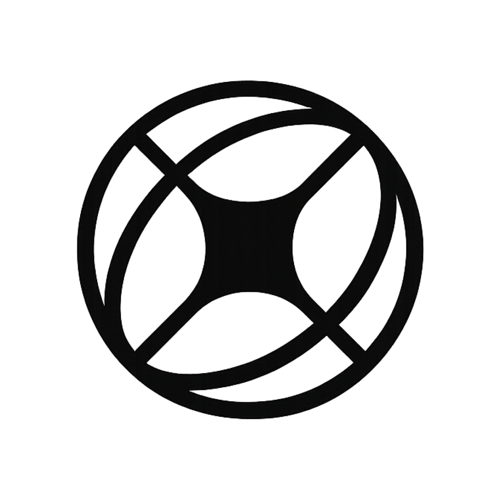

<div align="center">



# Atlas

**AI-powered Engineering Intelligence Platform**

Atlas connects to your cloud (AWS, read-only) and code (GitHub / Bitbucket), builds a continuously-updated **knowledge graph** of your infrastructure, code, deployments, dependencies, and exposure — and lets engineers understand it through an interactive map, cited AI answers, security intelligence, and compliance.

_The knowledge graph is the product. The AI is the interface._

[](https://github.com/anmolbhardwaj17/atlas/actions/workflows/ci.yml)
&nbsp;
&nbsp;
&nbsp;

</div>

---

## Why Atlas

Most tools show you one slice — the cloud, the repos, the vulnerabilities, the dashboards — and leave you to connect them in your head. Atlas holds **code + cloud + deploys + dependencies + exposure in one graph**, so it can answer the questions that live _between_ those domains:

- _Which repository (and which PR) deploys to the service that just broke?_
- _Which of my 500 CVEs is actually reachable from the internet?_
- _Am I meeting the technical controls of PCI / NIST / ISO — and where's the gap?_

Every edge is **provenanced**, every AI claim is **cited**, and "I don't know" is a designed state — never a fabrication.

## What it does

| | |
|---|---|
| 🗺️ **Infrastructure map** | Your cloud and code wired together as one left-to-right architecture flow (React Flow + dagre). Observed vs. inferred edges are visually distinct; internet-exposed resources are flagged. |
| 💬 **Ask Atlas** | A cited AI interface grounded in the graph — agentic retrieval over read-only tools, confidence-tiered answers, honest absence, streamed over SSE / WebSocket. |
| 💡 **Insights** | Grounded findings + best-practice advisory (why it matters / how to fix), each cited to a real node or edge. |
| 🔐 **Security & vulnerability intelligence** | Dependency vulns via OSV.dev, blast-radius, dependency sprawl — and the **"exposed AND vulnerable" toxic combination**: a known CVE on an internet-reachable service. |
| ⚖️ **Compliance** | A continuous technical-controls monitor mapping evidence onto the infrastructure-observable subset of **PCI-DSS, CIS, NIST 800-53, ISO 27001, HIPAA, GDPR** — honest by construction (an explicit _not-assessable_ state, never a silent pass). |
| 🧠 **Knowledge graph + inference** | Deterministic, versioned inference rules derive edges (repo→runtime, service→datastore, exposure) with a precision-first bias — a missing edge beats a wrong one. |

## How it works

```
  Connectors (read-only)          Ingest + Inference                 Product surfaces
 ┌───────────────────────┐      ┌────────────────────────┐        ┌──────────────────────┐
 │  AWS   ·  GitHub       │      │  crawl → normalize      │        │  Map · Explore        │
 │  Bitbucket · Jenkins   │ ───▶ │  → knowledge graph      │  ───▶  │  Ask Atlas (cited)    │
 │  (IAM role / App)      │      │  → inference rules      │        │  Insights · Security  │
 └───────────────────────┘      │  → OSV vuln enrichment  │        │  Compliance           │
                                 └────────────────────────┘        └──────────────────────┘
        every fact provenanced · org-scoped (RLS) · read-only by construction
```

## Tech stack

**TypeScript** everywhere · **NestJS** (API + worker, Fastify) · **Next.js** + **shadcn/ui** · **Supabase Postgres** (graph-shaped, standard Postgres — no data-layer lock-in) · **Supabase Auth** (Google) · **Redis / BullMQ** (queue) · **OpenSearch** (hybrid search) · **ECS Fargate** · **Claude** (LLM, behind a provider abstraction). Tenant isolation is enforced at three layers (app scope + composite FKs + row-level security).

## Monorepo layout

```
apps/
  api/          NestJS API + sync worker (graph reads, AI, compliance, connections)
  web/          Next.js app (map, explore, ask, insights, security, compliance)
packages/
  connector-sdk                             frozen ingestion contract
  connector-aws / github / bitbucket / jenkins   provider connectors (read-only)
  ingest                                    sync runner + OSV vulnerability enrichment
  inference                                 pure, versioned inference rules (R1–R16)
  ai                                        LLM providers, agentic retrieval, compliance catalog
  db                                        migrations + RLS + org-scoped query helpers
docs/           19 authoritative design docs (00–18) + plans
```

## Getting started

Requirements: **Node 22+**, **pnpm** (via corepack), a Postgres database.

```bash
corepack enable
corepack pnpm install

# configure the source-root .env (DATABASE_URL, DATABASE_URL_MIGRATE, auth, secrets)
set -a && . ./.env && set +a
corepack pnpm --filter @atlas/db run migrate

corepack pnpm dev        # API on :4290, web on :4291
```

`corepack pnpm run check` runs the full local gate (format + lint + typecheck + tests) — the mirror of CI.

## Design & docs

Atlas is documented before it's built — the design docs are authoritative, and code never drifts from them.

| To… | Open |
|---|---|
| Understand the project & how we work | [`CLAUDE.md`](CLAUDE.md) |
| Navigate the full design | [`docs/README.md`](docs/README.md) |
| See current status & what's next | [`docs/PROJECT-BOARD.md`](docs/PROJECT-BOARD.md) |
| Read the knowledge-graph model | [`docs/05-knowledge-graph.md`](docs/05-knowledge-graph.md) |
| Read the security & compliance plans | [`docs/plans/`](docs/plans/) |

## Principles

- **P1 — the graph is the product; the AI is the interface.** Effort goes to graph correctness, not chatbot polish.
- **P2 — read-only by construction.** No code path can mutate a customer's cloud or repo.
- **P3 — prefer a missing edge to a wrong one.** High precision over recall.
- **P4 — provenance & citations on everything.** No un-sourced edges; every AI claim cites a real node or edge.
- **Trust is visible.** Observed vs. inferred vs. stale are distinct, designed states.

---

<div align="center"><sub>Built as an engineering-intelligence platform, not a dashboard.</sub></div>
