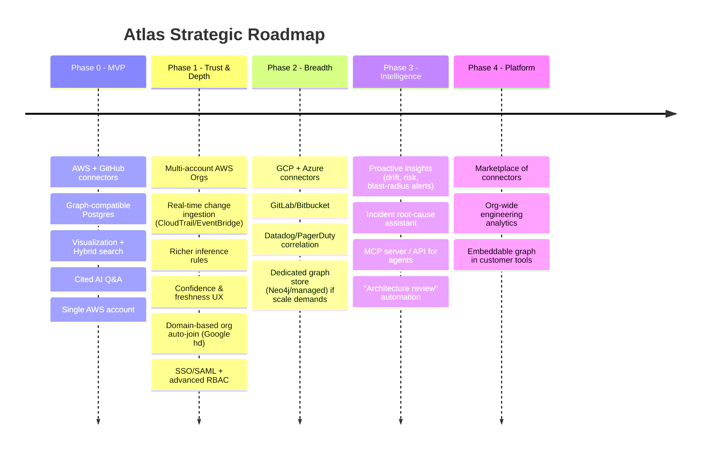

# 00 — Project Overview

> **Document status:** Authoritative · **Version:** 1.0 · **Last updated:** 2026-06-30
> **Owner:** Founding Principal Architect · **Audience:** All engineers, AI coding agents, founders, early hires
> **Document type:** Vision & Foundational Context

---

## Purpose

This document is the **root of the Atlas documentation tree**. It establishes the shared mental model that every other document (`01`–`18`) inherits and refines. Its job is to answer four questions unambiguously:

1. **What** are we building, and what is it explicitly *not*?
2. **Why** does it need to exist (the business problem)?
3. **Who** is it for, and how will we know it is working?
4. **What principles** constrain every downstream technical decision?

When a later document makes a tradeoff (e.g. "we chose PostgreSQL with a graph-compatible schema rather than Neo4j for the MVP" in `04-database-schema.md` and `05-knowledge-graph.md`), the *justification* must trace back to a goal, non-goal, or core principle defined here. If a downstream decision cannot be traced to this document, either the decision is wrong or this document is incomplete. Both are bugs.

## Scope

**In scope for this document:**
- Product vision and the business problem it solves
- Goals and explicit non-goals
- MVP definition and a phased future roadmap
- Success metrics (product, technical, business)
- Target user personas
- Core engineering and product principles

**Out of scope for this document (and where it lives instead):**
- Detailed functional requirements → `01-product-requirements.md`
- System and infrastructure architecture → `02-system-architecture.md`
- Data and graph modeling → `03-domain-model.md`, `04-database-schema.md`, `05-knowledge-graph.md`
- Crawler internals → `06-aws-crawler.md`, `07-github-crawler.md`
- Commercial strategy detail → `18-business-model.md`

---

## 1. Vision

**Atlas is the system of record for how a company's engineering reality actually works.**

Every company above a handful of engineers loses coherent understanding of its own systems. The knowledge of "what connects to what, what deploys where, and what breaks if I touch this" lives in the heads of a shrinking number of senior engineers, in stale Confluence diagrams, and in tribal memory. This knowledge decays continuously and is never authoritative.

Atlas connects directly to the sources of truth — the cloud account and the code — and **continuously reconstructs a live knowledge graph** of the organization's infrastructure, services, repositories, deployments, and the relationships between them. It then makes that graph explorable through visualization, search, and a natural-language interface.

> **The knowledge graph is the product. The AI is the interface.**
> This single sentence is the most important constraint in the entire system. Re-read it before any architectural decision. We are not building "a chatbot for your infrastructure." We are building an always-correct model of engineering reality, and conversation is merely one way to query it. If the graph is wrong, a better LLM cannot save us. If the graph is right, even a modest LLM is valuable. Every engineering hour should be weighted accordingly.

### One-sentence positioning
> *Atlas is a continuously-updated knowledge graph of your engineering ecosystem that lets any engineer understand infrastructure, dependencies, and change — by exploring it visually or simply asking.*

---

## 2. The Business Problem

### 2.1 The core problem
Engineering organizations operate complex, fast-changing systems but have **no authoritative, queryable model of those systems.** The truth is fragmented across:

- **The cloud provider** (AWS console, CloudFormation, Terraform state) — what *exists*.
- **Source control** (GitHub repos, CI/CD workflows, CODEOWNERS) — what is *built and who owns it*.
- **Human memory** — how it *actually fits together*.

These three sources are never reconciled. The result is a set of recurring, expensive failures.

### 2.2 Concrete symptoms (the pain we remove)

| Symptom | Who feels it | Cost today |
|---|---|---|
| "What breaks if I delete this Lambda / change this security group?" | Engineers making changes | Hours of manual tracing, or an outage |
| "Which repo deploys to this ECS service?" | On-call, SREs | Tribal knowledge, grep across orgs |
| "Why did production latency increase yesterday?" | On-call during incidents | Slow MTTR, blameful guessing |
| "Explain our architecture to a new hire." | Eng managers, staff engineers | Weeks of ramp-up, outdated diagrams |
| "What changed in production this week?" | Leadership, security, on-call | No single answer exists |
| "Which PR most likely caused this incident?" | Incident commander | Manual correlation under pressure |

Each of these is a **graph traversal question** dressed up as a human question. None of them can be answered today without a human who already holds the model in their head. Atlas externalizes that model.

### 2.3 Why now
- **Infrastructure-as-data is finally accessible.** Cloud control planes (AWS APIs), Git platform APIs (GitHub), and webhook ecosystems make continuous, read-only reconstruction feasible without agents on customer hosts.
- **LLMs made natural-language graph querying viable.** Translating "what depends on this RDS instance" into a graph traversal and narrating the answer is now tractable — but only on top of a correct graph (see vision constraint above).
- **Cost of complexity is rising.** Microservices, multi-account AWS, and rapid deploys have outpaced the documentation practices designed for monoliths.

---

## 3. Goals

Goals are ordered by priority. Lower-numbered goals win conflicts.

**G1 — Build a correct, continuously-updated knowledge graph.**
The graph must reflect the customer's real AWS + GitHub state, converge to truth after each sync, and never silently present stale or fabricated relationships as fact. Correctness and freshness beat coverage.

**G2 — Make the graph trustworthy and explainable.**
Every relationship and every AI answer must be **traceable to a source** (a specific AWS resource ARN, a GitHub file/PR, an inference rule). Users must be able to see *why* Atlas believes something. Trust is the product's moat; an unexplained answer is worse than no answer.

**G3 — Make the graph effortless to explore.**
A user should answer the example questions (Lambda blast radius, repo→service mapping, "what changed this week") in seconds via visualization, search, or natural language — without learning a query language.

**G4 — Be safe to connect.**
We touch customers' production cloud accounts. Read-only by construction, least-privilege IAM, encrypted secrets, full audit logging. A single security failure is existential for the company. Security is a goal, not a feature (`13-security.md`).

**G5 — Be architecturally ready for scale without prematurely paying for it.**
Design data models, crawlers, and services so that growing from 1 to thousands of organizations is an operational scaling exercise, not a rewrite. But the MVP ships on a pragmatic stack (PostgreSQL, not a distributed graph DB) — see `04`/`05` for the deliberate "graph-compatible relational" decision.

**G6 — Establish multi-source extensibility from day one.**
AWS and GitHub are the first two connectors, not the only two. The crawler, domain model, and graph must treat "source providers" as a pluggable abstraction so GCP, Azure, GitLab, Datadog, PagerDuty, etc. can be added without structural change (`06`, `07`).

---

## 4. Non-Goals

Explicitly **not** building these (now, and in some cases ever). Each non-goal exists to protect focus and is referenced by downstream docs to reject scope creep.

**NG1 — Atlas is not an observability/APM/metrics platform.**
We do not ingest high-volume metrics, traces, or logs to compete with Datadog/New Relic. We *correlate* with change and structure. ("Why did latency increase" is answered by correlating *changes* to the graph with an externally-observed symptom, not by us storing time-series at APM scale.) Time-series ingestion at scale is NG.

**NG2 — Atlas is not an IaC / provisioning / mutation tool.**
We never create, modify, or delete customer infrastructure. Read-only is a security guarantee, not a current limitation (`13-security.md`). No Terraform execution, no "apply" button.

**NG3 — Atlas is not a generic chatbot.**
The AI only answers questions grounded in the graph and connected sources. It will refuse or hedge rather than hallucinate general knowledge (`10-ai-engine.md`, hallucination prevention).

**NG4 — Atlas is not an agent-on-host tool.**
No daemons or sidecars installed in customer environments for the MVP. We use cloud control-plane APIs and Git platform APIs only. (Revisit only if a clear capability gap demands it.)

**NG5 — The MVP is not multi-cloud, not GitLab/Bitbucket, not on-prem.**
AWS + GitHub SaaS only. Other providers are roadmap, not MVP (`15-development-roadmap.md`).

**NG6 — Atlas is not a code-quality / SAST / vulnerability scanner.**
We map structure and dependencies; we are not Snyk/SonarQube. Dependency *graph* edges (repo→package) are in scope; vulnerability scoring is not.

---

## 5. MVP Definition

The MVP is the **smallest system that proves the core loop**: *connect → crawl → graph → explore/ask, with citations.*

### 5.1 MVP capabilities (the "must exist" set)

1. **Onboarding & connections**
   - Create an organization; invite teammates (basic RBAC: Owner/Admin/Member — see `12-authentication.md`).
   - Connect **one AWS account** via a customer-created **ReadOnly IAM Role** assumed by Atlas (external ID, STS AssumeRole — `06`, `13`).
   - Connect **GitHub** via OAuth; select repositories/org to index (`07`, `12`).

2. **AWS crawling (read-only)** — supported services for MVP defined in `06-aws-crawler.md`, targeting the high-value core:
   - Compute: EC2, Lambda, ECS (clusters/services/tasks), ECR
   - Networking: VPC, Subnets, Security Groups, ELB/ALB/NLB, Route53
   - Data: RDS, DynamoDB, S3, ElastiCache
   - Identity/edges: IAM roles/policies (for relationship inference only)
   - Full sync + incremental sync; pagination, retry, rate-limit handling; relationship inference.

3. **GitHub crawling** (`07`)
   - Repository discovery; default-branch parsing.
   - Parse CI/CD workflows (GitHub Actions) and CODEOWNERS.
   - Deployment inference (repo → AWS service) from workflow/IaC signals.
   - PR ingestion via webhooks for "what changed" timelines.
   - Dependency manifest parsing (e.g. `package.json`, `requirements.txt`, lockfiles) for repo→dependency edges.

4. **Knowledge graph** (`03`, `04`, `05`)
   - Nodes for every crawled resource + repos/PRs/services; typed edges (`DEPENDS_ON`, `DEPLOYS_TO`, `CONNECTS_TO`, `OWNED_BY`, `ROUTES_TO`, etc.).
   - Inference rules that derive edges not directly present in any single API.
   - Every node/edge carries provenance (source, last-seen, confidence).

5. **Exploration surface** (`09-frontend-spec.md`)
   - Interactive graph visualization (filter, focus, expand neighbors).
   - Resource detail pages with relationships and provenance.
   - Hybrid search (keyword + semantic) over resources (`11-search-engine.md`).
   - "What changed this week" timeline.

6. **AI interface** (`10-ai-engine.md`)
   - Natural-language Q&A grounded in the graph, with **inline citations** and **confidence indication**.
   - Streaming responses; conversation memory within a session.
   - Provider-abstracted LLM layer (default to current top Claude model; pluggable).
   - Must answer the canonical questions: Lambda blast radius, repo→service, RDS dependents, "explain our architecture," "what changed this week."

7. **Platform foundations**
   - AuthN/AuthZ, organizations, invitations, sessions (`12`).
   - Audit logging of all connection and crawl activity (`13`).
   - Background worker/queue architecture for crawls (`02`, `06`).

### 5.2 Explicitly out of MVP (deferred, see roadmap)
- Multi-account / AWS Organizations support (single account first).
- Non-AWS clouds, non-GitHub SCMs.
- Real-time streaming infra changes (CloudTrail/EventBridge live ingestion) — MVP uses scheduled + webhook sync.
- Neo4j / dedicated graph database (MVP uses graph-compatible PostgreSQL — `04`, `05`).
- Advanced RBAC (custom roles, per-resource permissions), SSO/SAML.
- Incident-correlation automation beyond change timelines.
- MCP server exposure of the graph (designed-for, not shipped — `10`).

### 5.3 MVP success bar (definition of "the MVP works")
A new customer can, within **30 minutes** of signup, connect AWS + GitHub, see a populated graph of their core infrastructure, and get a **correctly-cited** answer to "What breaks if this Lambda is deleted?" and "Which repo deploys to this ECS service?" — where "correctly-cited" means a senior engineer at that company agrees with both the answer and its sources.

---

## 6. Future Roadmap (phased vision)

Detailed sprint planning lives in `15-development-roadmap.md`. This is the strategic arc.

**Roadmap principles:**
- **Depth before breadth.** Make AWS+GitHub *excellent and trusted* (Phase 1) before adding clouds (Phase 2). A shallow graph across five providers is worth less than a deep, trusted graph across two.
- **Earn the right to graph-DB migration.** We ship on PostgreSQL and only migrate to a dedicated graph engine when query patterns and scale prove the need — the schema is designed so this is a migration, not a rewrite (`04`, `05`).
- **The interface generalizes last.** MCP / public API exposure (Phase 3) comes only after the internal graph and AI are proven, so we expose something worth integrating with.

---

## 7. Success Metrics

Metrics are grouped by what they protect. Targets are directional for the MVP/early stage and refined in `01` and `18`.

### 7.1 Product / value metrics (does it create value?)
- **Time-to-first-insight (TTFI):** median time from signup to first correctly-cited answer. Target: **< 30 min**.
- **Answer trust rate:** % of AI answers a domain expert rates as correct *and* well-cited. Target: **> 90%** for the canonical question set; this is the single most important quality metric (protects G1/G2).
- **Weekly active exploration:** % of activated orgs whose engineers query/explore the graph weekly. Target (early): **> 50%**.
- **Blast-radius adoption:** % of orgs using "what breaks if…" / dependency queries — the signal that we replaced tribal knowledge.

### 7.2 Graph quality metrics (is the product *correct*?)
- **Graph freshness:** median age of the most-stale node after a sync cycle. Target: incremental sync convergence **< 15 min**; full sync **< 1 hr** for a typical account.
- **Inference precision/recall:** sampled audit of inferred edges (e.g. `DEPLOYS_TO`) against ground truth. Target precision **> 95%** (we prefer a missing edge over a wrong edge — see Principle P3).
- **Provenance coverage:** % of nodes/edges with a resolvable source. Target: **100%** (an edge without provenance is a bug).

### 7.3 Reliability / engineering metrics
- **Crawl success rate** per provider; **sync error budget**.
- **AI hallucination rate:** % of answers asserting ungrounded facts. Target: **< 1%**, trending to ~0 (`10`).
- **p95 graph query latency** for interactive exploration. Target: **< 1.5 s** for neighbor expansion at MVP graph sizes.

### 7.4 Business metrics (detailed in `18`)
- Activated orgs, connection completion rate, logo retention, expansion (seats/connectors), TTFI→paid conversion.

---

## 8. Target Users

Atlas serves an engineering organization, but specific personas drive specific value. Full user stories in `01-product-requirements.md`.

### Persona A — "The On-Call Engineer / SRE" (primary, MVP)
- **Context:** Paged at 2am, needs to understand blast radius and recent change *fast*.
- **Jobs:** "What depends on this RDS?", "What changed in prod this week?", "Which PR likely caused this?"
- **Value:** Lower MTTR, less reliance on waking up senior engineers.
- **Why primary:** Their questions are pure graph traversals and they feel pain most acutely and repeatedly.

### Persona B — "The Staff/Platform Engineer & Eng Manager" (primary, MVP)
- **Context:** Owns architectural coherence and onboarding.
- **Jobs:** "Explain our architecture to a new engineer", "What's the blast radius of deprecating this service?", dependency audits.
- **Value:** Living architecture docs that are never stale; faster, safer change.

### Persona C — "The New Hire / Ramping Engineer" (secondary, MVP)
- **Context:** Week one, no mental model of the system.
- **Jobs:** Explore the graph, ask "how does checkout work?", learn ownership (CODEOWNERS).
- **Value:** Self-serve ramp-up, fewer interrupts to senior engineers.

### Persona D — "The Buyer: VP Eng / CTO / Head of Platform" (economic buyer)
- **Context:** Approves the purchase and the AWS/GitHub connection.
- **Jobs:** Reduce key-person risk, faster incidents, safer changes, security comfort.
- **Value & concerns:** ROI in MTTR/onboarding; deeply concerned with security (read-only, least-privilege — `13`). Buying decision gated on G4.

### Persona E — "Security / Compliance reviewer" (gatekeeper, not user)
- **Context:** Must approve connecting Atlas to production cloud + source.
- **Jobs:** Verify read-only, least-privilege, encryption, audit logging, data handling.
- **Why listed:** They don't use Atlas daily, but they can *veto* adoption. `13-security.md` is written substantially for them.

---

## 9. Core Principles

These principles are binding constraints. Every downstream document cites them by ID (`P1`…`P10`) when justifying a decision.

**P1 — The graph is the product; AI is an interface.**
Optimize correctness and richness of the graph over conversational polish. When time is scarce, fix the graph.

**P2 — Read-only by construction.**
We never mutate customer infrastructure. This is enforced at the IAM/permission layer, not by convention (`13`). Any feature requiring write access is rejected by default.

**P3 — Prefer a missing edge to a wrong edge.**
High precision over high recall for inferred relationships. A confident wrong answer destroys trust (G2); an "I'm not certain" is acceptable. This drives confidence scoring in `05` and `10`.

**P4 — Everything is traceable (provenance-first).**
Every node, edge, and AI assertion carries a source you can click through to. No un-sourced facts. This shapes the schema (`04`), graph (`05`), and citation engine (`10`).

**P5 — Sources are pluggable.**
AWS and GitHub are implementations of a generic "connector/provider" abstraction. No core code may hardcode a single provider's assumptions (`02`, `06`, `07`).

**P6 — Design for thousands of orgs; pay for one.**
Multi-tenancy, isolation, and horizontal scalability are designed in from day one; expensive infrastructure (dedicated graph DB, multi-region) is deferred until justified (`02`, `04`, `17`).

**P7 — Idempotent, resumable, incremental.**
Crawlers and syncs must be safely re-runnable, resumable after failure, and converge to the same graph state regardless of partial failures (`06`, `07`).

**P8 — Secure and least-privilege everywhere.**
Least-privilege IAM, encrypted secrets, tenant isolation, full audit logging. Security failures are existential (G4, `13`).

**P9 — Explainable over clever.**
Prefer transparent inference rules and retrievable context over opaque ML. A user (and an engineer debugging Atlas) must be able to understand *why* the system concluded something.

**P10 — Boring, proven technology for the core; innovation only where it's the product.**
Use mature, well-understood tooling (PostgreSQL, NestJS, Next.js, standard queues) for the platform. Spend our innovation budget on the graph and inference — the actual differentiator — not on infrastructure novelty.

---

## 10. Glossary (canonical terms)

These terms are used consistently across all documents. Defined here once.

| Term | Definition |
|---|---|
| **Organization (Org)** | A customer tenant. The top-level unit of isolation and billing. |
| **Connection** | A configured link to an external source for one org (e.g. an AWS account via IAM role, a GitHub org via OAuth). |
| **Connector / Provider** | The pluggable implementation that knows how to crawl a source (AWS connector, GitHub connector) — see P5. |
| **Resource** | A single discovered entity from a source (an EC2 instance, a Lambda, a repo, an RDS instance). Becomes a graph **node**. |
| **Edge / Relationship** | A typed connection between two resources (`DEPLOYS_TO`, `DEPENDS_ON`, …). May be *observed* (direct from an API) or *inferred* (derived by a rule). |
| **Crawl / Sync** | A run of a connector that discovers resources and reconciles the graph. *Full sync* = complete re-scan; *incremental sync* = changes since last run. |
| **Provenance** | The recorded source + timestamp + confidence for a node or edge (P4). |
| **Inference rule** | A deterministic, explainable rule that derives edges not present in any single API response (`05`). |
| **Knowledge graph** | The unified, typed, provenance-bearing model of all resources and relationships for an org. *The product.* |
| **Blast radius** | The set of resources transitively affected by a change to a given node ("what breaks if…"). |
| **Citation** | A reference from an AI answer (or UI claim) back to the specific node/edge/source that supports it (P4). |

---

## 11. Assumptions

- **A1.** Customers can and will create a ReadOnly IAM Role for us (standard practice for tools like Datadog, Wiz). Validated by competitor precedent.
- **A2.** Customers' core infrastructure is discoverable via AWS control-plane APIs (i.e. not entirely hidden behind unmanaged/manual processes).
- **A3.** GitHub (SaaS) is the SCM for the MVP target segment.
- **A4.** A graph-compatible relational model (PostgreSQL) is sufficient for MVP-scale graphs and interactive queries; dedicated graph DB is a later optimization (revisited in `05`).
- **A5.** LLM quality at current frontier (Claude Opus/Sonnet class) is sufficient for grounded Q&A *given* a correct graph and good retrieval (P1).
- **A6.** Target customers are mid-size engineering orgs (≈20–500 engineers) feeling complexity pain but not yet at hyperscale — the segment where the problem is acute and the AWS surface is tractable.

## 12. Risks

| ID | Risk | Impact | Mitigation / where addressed |
|---|---|---|---|
| R1 | **Graph is wrong/stale** → users lose trust permanently | Existential (G1/G2) | High-precision inference (P3), provenance (P4), freshness metrics (§7.2), confidence UX (`10`) |
| R2 | **Security incident** on a customer's prod cloud | Existential (G4) | Read-only by construction (P2), least-privilege IAM, encryption, audit (`13`) |
| R3 | **AI hallucination** presented as fact | Severe trust loss | Grounding + citation engine, refusal behavior, hallucination metric (`10`, §7.3) |
| R4 | **PostgreSQL graph queries don't scale** as graphs/orgs grow | High (perf) | Graph-compatible schema designed for migration (P6, `04`/`05`); load testing (`14`) |
| R5 | **Crawler breakage** from AWS/GitHub API changes/limits | Medium-High | Idempotent/resumable design (P7), rate-limit handling, provider abstraction (P5, `06`/`07`) |
| R6 | **Scope creep into observability/IaC** | Medium (focus) | Hard non-goals NG1/NG2 referenced by all docs |
| R7 | **Onboarding friction** (IAM role + OAuth) kills activation | High (growth) | Guided onboarding UX, TTFI metric, validation feedback (`09`, `12`) |
| R8 | **Multi-tenant data leakage** across orgs | Existential | Tenant isolation designed into schema and queries (P6/P8, `04`, `12`, `13`) |

## 13. Alternatives Considered (at the vision level)

- **"AI chatbot over docs/Confluence" instead of a live graph.** Rejected: inherits the staleness problem we exist to solve; violates P1 (no real model underneath).
- **Agent-on-host data collection** (like classic APM agents). Rejected for MVP (NG4): higher security friction, slower adoption; control-plane APIs are sufficient for structural mapping.
- **Start with observability/metrics correlation** (compete with Datadog). Rejected (NG1): commoditized, capital-intensive, and not our differentiator. We correlate *change and structure*, not metrics volume.
- **Build directly on Neo4j/graph DB from day one.** Deferred (A4, P10, P6): adds operational complexity and cost before product-market fit; relational model is sufficient and the schema is migration-ready (`04`/`05`).
- **Terraform/IaC-state-only modeling.** Rejected as the *primary* source: many orgs have drift and partial IaC coverage; the cloud control plane is the ground truth (NG2 keeps us read-only). IaC is a *signal*, not the source of truth.

## 14. Edge Cases (vision-level, expanded downstream)

- Orgs with **partial/no IaC** (pure ClickOps) — Atlas must still build a useful graph from live APIs (handled in `06`).
- **Multi-account AWS** users in MVP (single-account only) — must degrade gracefully and clearly communicate the limitation (`01`, `06`).
- **Huge monorepos** or thousands of repos — discovery must paginate and prioritize (`07`).
- **Resources Atlas can't classify** — must be representable as generic nodes with provenance rather than dropped (P4, `03`).
- **Permission gaps** (customer IAM role missing a permission) — must be detected, surfaced, and not silently produce an incomplete-but-confident graph (`06`, `13`).

## 15. Open Questions

- **OQ1.** Final MVP boundary of supported AWS services — locked in `06-aws-crawler.md` (§5.1 is the working set).
- **OQ2.** Confidence-scoring model: simple rule-tiers vs. weighted scoring — decided in `05`.
- **OQ3.** Pricing axis (per-seat vs. per-resource vs. per-connector) — explored in `18`.
- **OQ4.** When exactly to trigger the Neo4j migration (which metric thresholds) — criteria defined in `05`/`17`.
- **OQ5.** Whether "what changed this week" needs CloudTrail in MVP or webhook+diff suffices — resolved in `06`/`07`.

## 16. References to Related Documents

- `01-product-requirements.md` — turns these goals into functional/non-functional requirements and acceptance criteria.
- `02-system-architecture.md` — realizes principles P5/P6/P10 in concrete architecture.
- `03`–`05` — domain model, schema, and graph (realize P1/P3/P4, A4).
- `06`–`07` — AWS/GitHub crawlers (realize P5/P7, MVP §5.1).
- `10-ai-engine.md` — citation/confidence/hallucination-prevention (realize P3/P4/P9, G2).
- `13-security.md` — the security guarantees underpinning G4/P2/P8.
- `15-development-roadmap.md` — sequences §5–§6 into sprints.
- `18-business-model.md` — operationalizes §7.4 and §8 personas.

---

### Change log
| Version | Date | Author | Change |
|---|---|---|---|
| 1.0 | 2026-06-30 | Founding Principal Architect | Initial authoritative version |
