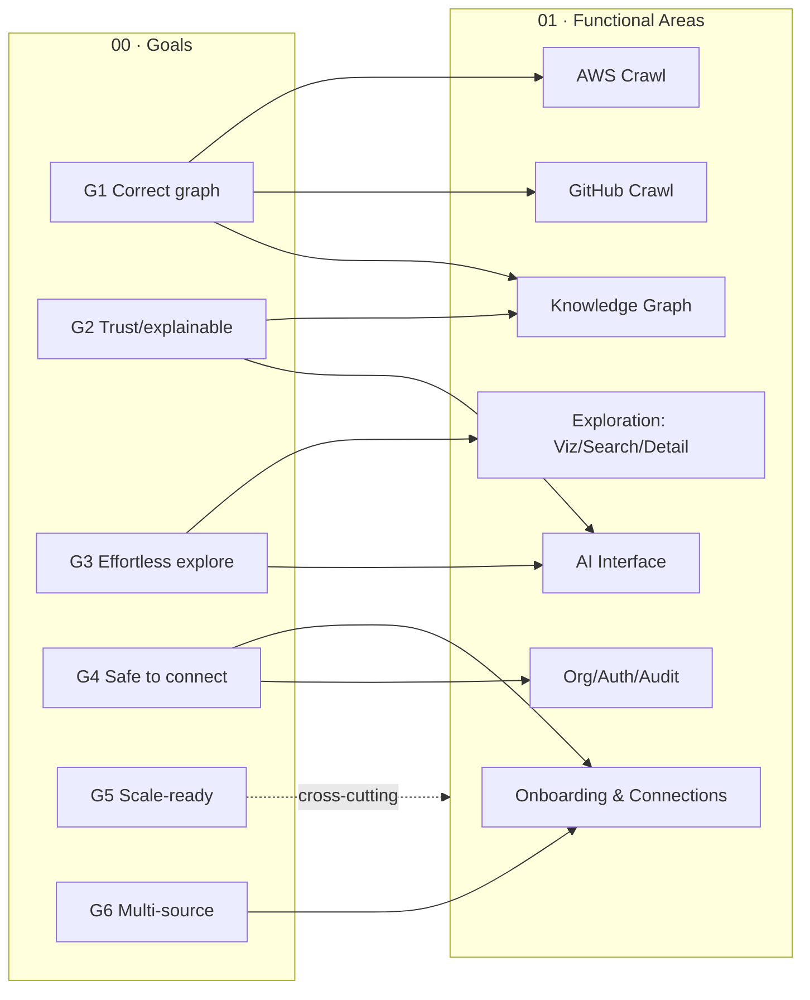
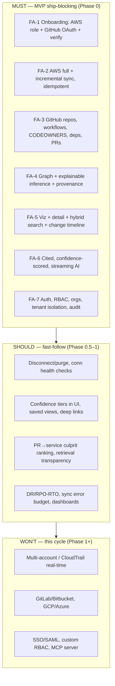

# 01 — Product Requirements Document (PRD)

> **Document status:** Authoritative · **Version:** 1.0 · **Last updated:** 2026-06-30
> **Owner:** Founding Principal Architect (acting PM) · **Audience:** Engineers, AI coding agents, design, QA
> **Document type:** Product Requirements
> **Depends on:** `00-project-overview.md` (vision, goals G1–G6, non-goals NG1–NG6, principles P1–P10, personas A–E, MVP §5)
> **Consumed by:** `02` (architecture), `08` (API), `09` (frontend), `14` (testing/acceptance), `15` (roadmap)

---

## Purpose

This document translates the vision and goals from `00-project-overview.md` into **precise, testable requirements**. It is the contract between "what we decided to build" (`00`) and "how we build it" (`02`–`17`). Every requirement here is:

- **Traceable** — tagged to a goal (G1–G6), principle (P1–P10), or persona (A–E) from `00`.
- **Testable** — paired with acceptance criteria that `14-testing-strategy.md` can verify.
- **Prioritized** — via MoSCoW (`Must` / `Should` / `Could` / `Won't-this-cycle`).
- **Uniquely identified** — `FR-x` (functional), `NFR-x` (non-functional), `US-x` (user story) — so downstream docs and tickets reference a stable ID.

If a requirement here cannot be traced to `00`, it is scope creep and must be challenged. If a goal in `00` has no requirement here, this PRD is incomplete.

## Scope

**In scope:** Functional requirements, non-functional requirements, user stories with acceptance criteria, prioritization, and explicit out-of-scope items for the MVP and near term (Phase 0–1 from `00` §6).

**Out of scope (and where it lives):**
- *How* requirements are implemented → `02`–`17`.
- API contract detail → `08-api-specification.md`.
- UI/UX detail and wireframes → `09-frontend-spec.md`.
- Commercial/pricing requirements → `18-business-model.md`.

## Assumptions

Inherits all of `00` §11 (A1–A6). Additional PRD-level assumptions:
- **A7.** A single human (Persona D, the buyer) has authority to create the AWS IAM role and authorize the GitHub OAuth connection, or can delegate to an admin (Persona B).
- **A8.** The first user of an org is its Owner; orgs are created by self-serve signup (no sales-assisted provisioning required for MVP).
- **A9.** All requirements assume a single AWS account and GitHub SaaS per `00` NG5 unless explicitly marked Phase 1+.

## How to read priorities (MoSCoW)

| Priority | Meaning | Cut line |
|---|---|---|
| **Must (M)** | MVP fails without it. Maps to `00` §5.1 MVP capabilities. | Ship-blocking. |
| **Should (S)** | High value, expected soon after MVP (Phase 0.5–1). Cut only under schedule pressure. | Fast-follow. |
| **Could (C)** | Desirable, opportunistic. | Nice-to-have. |
| **Won't (W)** | Explicitly excluded this cycle (Phase 1+ or never). Mirrors `00` non-goals. | Out of scope. |

---

## 1. Product Requirements Map (traceability overview)



The functional requirements are organized into **seven functional areas (FA)**, mirroring the MVP capabilities in `00` §5.1:

| FA | Area | Primary goal(s) | Primary persona(s) |
|---|---|---|---|
| FA-1 | Onboarding & Connections | G4, G6 | D, B |
| FA-2 | AWS Crawling | G1, G5 | (system) |
| FA-3 | GitHub Crawling | G1, G5 | (system) |
| FA-4 | Knowledge Graph & Inference | G1, G2 | (system) |
| FA-5 | Exploration (Visualization, Search, Detail, Timeline) | G3 | A, B, C |
| FA-6 | AI Interface | G2, G3 | A, B, C |
| FA-7 | Organization, Auth & Audit | G4 | D, B |

---

## 2. Functional Requirements

> Each FR has: ID · priority · goal/principle trace · statement · rationale · key acceptance criteria. Detailed Gherkin-style acceptance criteria for the headline flows are in §4 (user stories). `14-testing-strategy.md` derives test cases from both.

### FA-1 — Onboarding & Connections

| ID | Pri | Trace | Requirement |
|---|---|---|---|
| **FR-1.1** | M | G4,P2,P8 | A user can create an **Organization** during signup; the creator becomes **Owner**. |
| **FR-1.2** | M | G4,G6,P5 | A user with `Admin`+ role can initiate an **AWS connection** by being shown a generated **External ID** and the exact least-privilege ReadOnly policy/role-trust JSON to create in their AWS account (`13` §IAM). |
| **FR-1.3** | M | G4,P2 | Atlas verifies an AWS connection by performing `sts:AssumeRole` with the external ID and a **read-only probe** (e.g. list regions / a benign describe). Connection state ∈ {`pending`, `verifying`, `connected`, `error`} with a human-readable reason on `error`. |
| **FR-1.4** | M | G4,G6,P5 | A user with `Admin`+ role can connect **GitHub via OAuth** (GitHub App preferred — see `07`/`12`) and select which org/repositories to index. |
| **FR-1.5** | M | G1 | After a connection reaches `connected`, an **initial full sync** is automatically enqueued (FA-2/FA-3) and its progress is observable in the UI. |
| **FR-1.6** | M | G2,R7 | Onboarding surfaces **per-step status and actionable errors** (e.g. "IAM role missing `ec2:DescribeInstances` — graph will omit EC2"). Partial permission must never silently degrade into a confident-but-incomplete graph (`00` edge cases, `06`). |
| **FR-1.7** | S | G4 | A user can **disconnect** a source; on disconnect, crawling stops, and the org chooses to **retain** (read-only, marked stale) or **purge** that source's nodes. |
| **FR-1.8** | S | G4,P8 | Connection credentials/secrets (external ID, OAuth tokens) are stored encrypted at rest and never returned in full via API (`13`). |
| **FR-1.9** | C | G6 | Re-validate connection health on a schedule and alert Admins when a connection degrades (e.g. revoked token, deleted role). |

**Acceptance (headline):** Given a valid IAM role + external ID, when the Admin clicks "Verify," then within 30s the connection shows `connected` and a full sync is enqueued; given a role missing a required permission, the connection shows `connected (degraded)` with a list of missing permissions and the affected resource types.

### FA-2 — AWS Crawling
> Internals in `06-aws-crawler.md`. Requirements here define *what the product guarantees*, not *how the crawler is built*.

| ID | Pri | Trace | Requirement |
|---|---|---|---|
| **FR-2.1** | M | G1 | Atlas performs a **full sync** discovering all supported AWS resource types (`00` §5.1 / `06`) across all enabled regions for the connected account. |
| **FR-2.2** | M | G1,P7 | Atlas performs **incremental syncs** on a schedule, reconciling created/changed/deleted resources and converging the graph to current truth. |
| **FR-2.3** | M | G1,P7 | Crawls are **idempotent and resumable**: a crawl interrupted mid-run re-runs without duplicating nodes or corrupting state. |
| **FR-2.4** | M | G5,R5 | Crawler honors AWS API **pagination, throttling/rate limits, and retries with backoff**; a throttled region degrades that region's freshness, not the whole sync. |
| **FR-2.5** | M | G1,G2,P4 | Every discovered resource is stored with **provenance**: source account, region, ARN, raw-attributes snapshot reference, `first_seen`, `last_seen`, `last_sync_id`. |
| **FR-2.6** | M | G1,P3 | Crawler emits **relationship signals** (e.g. SG↔ENI, Lambda→VPC, ECS service→task def→ECR image) consumed by FA-4 inference. |
| **FR-2.7** | M | G2 | A resource not seen in a successful full/region sync is marked **`stale`/`deleted`** (soft-deleted with timestamp), never hard-removed silently, preserving history for "what changed." |
| **FR-2.8** | S | G5 | Crawler exposes per-run **metrics** (resources discovered, errors, duration, throttle count) for the freshness/reliability metrics in `00` §7.2–7.3. |
| **FR-2.9** | W | — | Real-time CloudTrail/EventBridge ingestion (Phase 1, `00` §5.2). |
| **FR-2.10** | W | — | Multi-account / AWS Organizations (Phase 1, `00` NG5). |

### FA-3 — GitHub Crawling
> Internals in `07-github-crawler.md`.

| ID | Pri | Trace | Requirement |
|---|---|---|---|
| **FR-3.1** | M | G1 | Discover repositories the connection is authorized for; index default branch metadata. |
| **FR-3.2** | M | G1,G6 | Parse **CI/CD workflows** (GitHub Actions) to extract deployment signals (target service, region, account hints). |
| **FR-3.3** | M | G2 | Parse **CODEOWNERS** to attribute ownership of repos/paths (`OWNED_BY` edges, Persona C value). |
| **FR-3.4** | M | G1,G2,P3 | **Infer deployment edges** (`repo → AWS resource`, e.g. repo `DEPLOYS_TO` ECS service) from workflow + IaC + naming signals, with confidence scoring (`05`). |
| **FR-3.5** | M | G1 | Parse **dependency manifests/lockfiles** (`package.json`, `requirements.txt`, `go.mod`, etc.) to create `repo → dependency` edges. |
| **FR-3.6** | M | G1,G3 | Ingest **pull requests** (via webhooks + backfill) to power the "what changed in production this week" timeline (FA-5). |
| **FR-3.7** | M | G1,P7 | GitHub sync is incremental (webhook-driven) with periodic reconciliation; webhook delivery gaps are healed by reconciliation (idempotent). |
| **FR-3.8** | S | G2 | Associate PRs/commits with the services/resources they likely affect (PR → service edge) to support "which PR caused this incident." |
| **FR-3.9** | W | — | GitLab/Bitbucket connectors (Phase 2, `00` NG5). |

### FA-4 — Knowledge Graph & Inference
> Internals in `03-domain-model.md`, `04-database-schema.md`, `05-knowledge-graph.md`.

| ID | Pri | Trace | Requirement |
|---|---|---|---|
| **FR-4.1** | M | G1,P1 | Maintain a unified, typed, multi-source **knowledge graph** of nodes (resources/repos/PRs/services) and edges (typed relationships) per org. |
| **FR-4.2** | M | G2,P4 | Every node and edge carries **provenance and confidence**; an edge without resolvable provenance is invalid (must not exist). |
| **FR-4.3** | M | G1,G2,P3 | Inference rules are **deterministic and explainable**; each inferred edge records *which rule* produced it and the *evidence* used. |
| **FR-4.4** | M | G3 | Support **blast-radius traversal**: given a node, compute the transitive set of dependents ("what breaks if…") within a bounded depth. |
| **FR-4.5** | M | G3 | Support **dependency traversal** (inbound/outbound) and **neighbor expansion** for visualization. |
| **FR-4.6** | M | G2 | Reconciliation is **convergent and non-destructive**: re-running inference yields the same edges; removed evidence retires the edge (with history) rather than orphaning it. |
| **FR-4.7** | S | G2,P3 | Confidence tiers (e.g. `observed` vs `inferred-high` vs `inferred-low`) are first-class and surfaced to the UI and AI (drives P3 behavior). |
| **FR-4.8** | S | G5 | Graph queries used by exploration/AI meet the latency target (`NFR-2`) at MVP scale via appropriate indexing (`04`). |
| **FR-4.9** | W | — | Migrating storage to a dedicated graph DB (Neo4j) — Phase 2, gated on `00` OQ4 / `05`. |

### FA-5 — Exploration (Visualization, Search, Detail, Timeline)
> Internals in `09-frontend-spec.md`, `11-search-engine.md`.

| ID | Pri | Trace | Requirement |
|---|---|---|---|
| **FR-5.1** | M | G3,A,B | **Interactive graph visualization**: render nodes/edges, focus a node, expand neighbors, filter by type/region/source, and highlight blast radius. |
| **FR-5.2** | M | G3,G2 | **Resource detail page**: attributes, typed relationships (in/out), provenance ("source: ARN, last seen …"), and confidence for inferred edges. |
| **FR-5.3** | M | G3 | **Hybrid search** (keyword + semantic) across resources/repos/services with type/region/source filters and ranked results (`11`). |
| **FR-5.4** | M | G3,A | **"What changed this week" timeline**: chronological view of resource changes + PRs/deploys, filterable by service/repo. |
| **FR-5.5** | M | G3 | All exploration views show explicit **loading, empty, partial (degraded sync), and error states** (`09`) — never a blank screen that implies "no infrastructure." |
| **FR-5.6** | S | G3 | Deep-linkable views (URL encodes selected node/filter) for sharing in incidents. |
| **FR-5.7** | S | G3,A | **Saved views** / pinned services for recurring on-call workflows. |
| **FR-5.8** | C | G3 | Export a graph view (image/JSON) for docs/incident write-ups. |

### FA-6 — AI Interface
> Internals in `10-ai-engine.md`.

| ID | Pri | Trace | Requirement |
|---|---|---|---|
| **FR-6.1** | M | G2,G3,P1 | Natural-language Q&A **grounded in the graph + connected sources**; the AI must answer the canonical question set (`00` §1) when the supporting data exists. |
| **FR-6.2** | M | G2,P4 | Every answer includes **inline citations** linking to the specific node(s)/edge(s)/source(s) that support each claim. |
| **FR-6.3** | M | G2,P3,P9 | Answers carry a **confidence indication**; when the graph lacks sufficient grounding, the AI **says so / refuses** rather than fabricating (hallucination prevention, `10`). |
| **FR-6.4** | M | G3 | **Streaming** responses (token/though-step streaming) for responsiveness. |
| **FR-6.5** | M | G3 | **Conversation memory** within a session (follow-up questions resolve against prior turns). |
| **FR-6.6** | M | G6,P5,P10 | LLM access is behind a **provider abstraction**; default model is the current top Claude model, swappable without changing callers (`10`). |
| **FR-6.7** | S | G2 | The AI can **show its retrieval** ("I looked at these 12 nodes") for auditability/trust. |
| **FR-6.8** | C | G3 | Suggested/starter questions seeded from the org's graph (e.g. "Explain the checkout service"). |
| **FR-6.9** | W | — | MCP server exposure of the graph to external agents (Phase 3, `00` §6, `10`). |
| **FR-6.10** | W | — | Cross-session long-term memory / personalization (Phase 1+). |

### FA-7 — Organization, Auth & Audit
> Internals in `12-authentication.md`, `13-security.md`.

| ID | Pri | Trace | Requirement |
|---|---|---|---|
| **FR-7.1** | M | G4,P8 | **Google OAuth/OIDC login** (sole MVP method, `12` DD-1); secure revocable sessions (short access JWT + rotating refresh, `12`). GitHub is connector auth (`07`), not login. Email/password deferred. |
| **FR-7.1a** | W | G4 | **Domain-based org auto-join** — a verified Google Workspace user (`hd` claim) auto-joins (as Member) the org that claimed their domain; unverified/personal accounts are invite-only; per-org policy `auto`/`request`/`off` (`12` §7). **Phase-1** — designed now, the `hd` domain is captured from MVP, behavior built later (`12` A50). |
| **FR-7.2** | M | G4 | **Basic RBAC**: roles `Owner`, `Admin`, `Member` with documented permission matrix (`12`). Only `Admin`+ can manage connections. |
| **FR-7.3** | M | G4 | **Organization membership & invitations** (invite by email, accept, assign role, revoke). |
| **FR-7.4** | M | G4,P6,R8 | **Strict tenant isolation**: every data access is org-scoped; cross-org access is impossible by construction (`04`, `12`, `13`). |
| **FR-7.5** | M | G4,P8 | **Audit log** of security-relevant events: connection create/verify/disconnect, sync runs, member/role changes, AI queries that touch sensitive data (`13`). |
| **FR-7.6** | S | G4 | Admins can view sync history and connection health per source. |
| **FR-7.7** | W | — | SSO/SAML, SCIM, custom roles, per-resource permissions (Phase 1+, `00` §5.2). |

---

## 3. Non-Functional Requirements

> NFRs are global constraints. Each is measurable and maps to `00` success metrics (§7) and risks. Verified per `14-testing-strategy.md` (incl. load/perf testing).

### 3.1 Performance & Scalability

| ID | Pri | Trace | Requirement & target |
|---|---|---|---|
| **NFR-1** | M | G3,§7.3 | **Interactive graph query / neighbor expansion p95 < 1.5 s** at MVP graph sizes (≤ ~50k nodes/org). |
| **NFR-2** | M | G3 | **Search p95 < 800 ms**; **AI first-token < 3 s**, full canonical answer < 15 s (streamed). |
| **NFR-3** | M | G1,§7.2 | **Incremental sync convergence < 15 min**; **full sync < 60 min** for a typical account (`00` §7.2). |
| **NFR-4** | S | G5,P6 | Architecture supports **horizontal scaling** of API and workers; no single-node bottleneck blocks adding orgs (`02`, `17`). |
| **NFR-5** | S | G5 | System designed to handle **thousands of orgs** logically (tenant-partitioned data, queue isolation) without redesign (P6). |

### 3.2 Reliability & Availability

| ID | Pri | Trace | Requirement & target |
|---|---|---|---|
| **NFR-6** | M | G1,P7 | Crawls are **idempotent, resumable, at-least-once**; partial failures degrade freshness of the affected scope only. |
| **NFR-7** | M | — | **API availability target 99.5%** (MVP), with health checks and graceful degradation when a worker/queue is down (exploration of existing graph still works). |
| **NFR-8** | S | G1 | **Sync error budget** defined and tracked; repeated failures alert Admins (FR-1.9) and ops (`17`). |
| **NFR-9** | S | — | **Disaster recovery**: documented RPO/RTO; DB PITR backups (`17`). Target RPO ≤ 1h, RTO ≤ 4h (MVP). |

### 3.3 Security & Privacy (full detail `13`)

| ID | Pri | Trace | Requirement |
|---|---|---|---|
| **NFR-10** | M | G4,P2 | **Read-only by construction** against customer clouds — no code path can mutate customer infra; enforced at IAM + verified in CI (`13`,`14`). |
| **NFR-11** | M | G4,P8 | **Least-privilege IAM**; **encryption in transit (TLS 1.2+) and at rest**; secrets in a managed secret store, never in logs/DB plaintext. |
| **NFR-12** | M | G4,R8 | **Tenant isolation** enforced at the data layer; verified by automated cross-tenant access tests (`14`). |
| **NFR-13** | M | G4 | **Full audit logging** (FR-7.5), tamper-evident, queryable by Admins. |
| **NFR-14** | S | G4 | **OWASP Top 10 alignment**; dependency scanning in CI; secret-scanning on the repo (`13`,`16`). |
| **NFR-15** | S | G4 | **PII/data minimization**: store only what the graph needs; raw-attribute snapshots retained per a documented retention policy (`13`). |

### 3.4 Observability & Operability

| ID | Pri | Trace | Requirement |
|---|---|---|---|
| **NFR-16** | M | §7.3 | **Structured logging, metrics, tracing** across API and workers; correlation IDs span request→sync→inference (`16`,`17`). |
| **NFR-17** | M | G1,§7.2 | **Graph-quality telemetry**: freshness, inference precision sampling hooks, provenance coverage (`00` §7.2) emitted as first-class metrics. |
| **NFR-18** | S | — | Per-org and per-connector dashboards for crawl health (`17`). |

### 3.5 Maintainability & Extensibility

| ID | Pri | Trace | Requirement |
|---|---|---|---|
| **NFR-19** | M | G6,P5 | **Connector abstraction**: adding a new provider requires implementing a defined interface, not modifying core graph/inference (`02`,`06`,`07`). |
| **NFR-20** | M | P4 | **Graph-compatible schema**: relational model maps cleanly to nodes/edges and to a future graph DB (migration, not rewrite — `04`,`05`). |
| **NFR-21** | S | P10,§`16` | Code adheres to `16-coding-standards.md` (TypeScript strict, NestJS/Next.js conventions, ≥ defined coverage). |

### 3.6 Usability & Accessibility

| ID | Pri | Trace | Requirement |
|---|---|---|---|
| **NFR-22** | M | G3,R7 | **TTFI < 30 min** from signup to first cited answer (`00` §7.1) — onboarding must be self-serve and guided. |
| **NFR-23** | M | G3 | **WCAG 2.1 AA** for core flows; keyboard-navigable; graph viz has an accessible/list fallback (`09`). |
| **NFR-24** | S | G3 | Responsive down to tablet; graceful behavior on large graphs (clustering/virtualization, `09`). |

### 3.7 Compliance (posture for MVP, detail `13`/`18`)

| ID | Pri | Trace | Requirement |
|---|---|---|---|
| **NFR-25** | S | G4,D,E | **SOC 2-readiness posture** (audit logging, access control, encryption, change management) even before formal certification — required to clear Persona E (security gatekeeper). |
| **NFR-26** | C | — | Data residency configurability — Phase 1+. |

---

## 4. User Stories & Acceptance Criteria

> Stories are grouped by persona (`00` §8). Format: `US-x · As a <persona>, I want <capability>, so that <value>.` Acceptance criteria use Given/When/Then (Gherkin), which `14` compiles into E2E tests. Only headline stories shown in full; the FR table above is the exhaustive requirement list.

### Persona D — Buyer / Admin (onboarding)

**US-1 (M) — Connect AWS safely.** *As a VP Eng/Admin, I want to connect our AWS account read-only with a clear least-privilege role, so that I can adopt Atlas without security risk.* — Trace: FR-1.2/1.3/1.6, G4, P2.
```gherkin
Scenario: Successful read-only AWS connection
  Given I am an Admin on an organization
  And I open "Connect AWS"
  Then I am shown a unique External ID and an exact ReadOnly IAM policy + trust JSON
  When I create that role in AWS and submit its Role ARN
  Then Atlas performs sts:AssumeRole using the External ID and a read-only probe
  And within 30 seconds the connection status becomes "connected"
  And an initial full sync is enqueued and visible as "in progress"

Scenario: Connection with missing permissions degrades transparently
  Given the IAM role I created omits ec2:DescribeInstances
  When Atlas verifies the connection
  Then the status becomes "connected (degraded)"
  And I see "EC2 instances will not be indexed — missing permission: ec2:DescribeInstances"
  And no EC2 nodes are presented as if complete

Scenario: Invalid/again role
  Given I submit a Role ARN that cannot be assumed
  Then the status becomes "error" with reason "AssumeRole failed: <human-readable cause>"
  And no sync is enqueued
```

**US-2 (M) — Connect GitHub.** *As an Admin, I want to connect GitHub via OAuth and choose repos, so that Atlas indexes the right code.* — Trace: FR-1.4, FR-3.1, G6.
```gherkin
Scenario: Connect GitHub and select scope
  Given I am an Admin
  When I authorize the Atlas GitHub App for our org
  And I select repositories (all, or a subset)
  Then the connection becomes "connected"
  And an initial repository sync is enqueued for the selected repos only
```

**US-3 (M) — Invite the team.** *As an Owner, I want to invite engineers with roles, so that my team can use Atlas.* — Trace: FR-7.2/7.3.
```gherkin
Scenario: Invite a member
  Given I am Owner or Admin
  When I invite "eng@acme.com" as "Member"
  Then they receive an invitation and, on acceptance, join the org as Member
  And a Member cannot create or modify connections
```

### Persona A — On-Call / SRE

**US-4 (M) — Blast radius.** *As on-call, I want to know what breaks if a Lambda/RDS/SG changes, so that I can act safely under pressure.* — Trace: FR-4.4, FR-5.1, FR-6.1/6.2, G3, the canonical question.
```gherkin
Scenario: What breaks if this Lambda is deleted
  Given the graph for my org is populated
  When I ask "What breaks if the 'checkout-processor' Lambda is deleted?"
  Then I receive a list of transitively-dependent resources (e.g. API Gateway routes, downstream services, alarms)
  And each item is cited to a specific node/edge with its source (ARN / inference rule)
  And inferred (lower-confidence) impacts are visibly distinguished from observed ones
  And I can open the same set as a highlighted blast-radius in the graph view
```

**US-5 (M) — What changed this week.** *As on-call, I want a timeline of production changes, so that I can correlate symptoms with change.* — Trace: FR-5.4, FR-3.6, G3.
```gherkin
Scenario: Weekly change timeline
  When I open "What changed this week" filtered to the "payments" service
  Then I see resource changes (created/modified/deleted) and merged PRs/deploys in chronological order
  And each entry links to its source (AWS resource diff / GitHub PR)
```

**US-6 (S) — Likely culprit PR.** *As on-call, I want Atlas to suggest which PR most likely caused an incident, so that I narrow the search.* — Trace: FR-3.8, FR-6.1/6.3, P3.
```gherkin
Scenario: Suggest culprit PR with honesty
  When I ask "Which PR most likely caused the payments latency at 14:00 today?"
  Then Atlas returns ranked candidate PRs that deploy to / affect the payments service around that time, each cited
  And if confidence is low, Atlas states it is uncertain and shows the candidates rather than asserting a single cause
```

### Persona B — Staff / Platform Engineer & Eng Manager

**US-7 (M) — Explain the architecture.** *As a staff engineer, I want Atlas to explain our architecture, so that onboarding and reviews use a never-stale source.* — Trace: FR-6.1, FR-5.1/5.2, G3.
```gherkin
Scenario: Architecture explanation grounded in the graph
  When I ask "Explain our architecture to a new engineer"
  Then Atlas produces a structured narrative of services, data stores, and key dependencies
  And every named component links to its node in the graph
  And the explanation reflects the current synced state, not a static document
```

**US-8 (M) — Repo↔service mapping.** *As a platform engineer, I want to know which repo deploys to a service (and vice-versa), so that I can route changes correctly.* — Trace: FR-3.4, FR-4.5, FR-6.2.
```gherkin
Scenario: Which repositories deploy to this ECS service
  When I ask "Which repositories deploy to the 'orders-api' ECS service?"
  Then Atlas lists repos with DEPLOYS_TO edges to that service, each citing the workflow/IaC evidence and confidence
```

**US-9 (S) — Dependency audit.** *As a platform engineer, I want to see what depends on a database before deprecating it.* — Trace: FR-4.4/4.5.
```gherkin
Scenario: Which services depend on this RDS database
  When I ask "Which services depend on the 'prod-orders' RDS database?"
  Then Atlas returns dependent services/Lambdas/tasks with cited edges (SG, connection-string, env-var, or inference evidence)
```

### Persona C — New Hire / Ramping Engineer

**US-10 (S) — Self-serve ramp-up.** *As a new hire, I want to explore and ask how things work, so that I ramp without interrupting seniors.* — Trace: FR-5.1, FR-6.1, FR-3.3.
```gherkin
Scenario: Discover ownership and behavior
  When I select the "checkout" service and ask "How does checkout work and who owns it?"
  Then Atlas explains the service's dependencies and shows CODEOWNERS-derived ownership, all cited
```

### Cross-cutting / negative & trust stories

**US-11 (M) — Honest absence.** *As any user, I want Atlas to admit when it doesn't know, so that I can trust it.* — Trace: FR-6.3, P3, P9, R3.
```gherkin
Scenario: Insufficient grounding
  Given the graph has no data about a topic (e.g. an unconnected provider)
  When I ask about it
  Then Atlas states it lacks the data and (if relevant) which connection would provide it
  And it does NOT fabricate an answer
```

**US-12 (M) — Tenant isolation.** *As a security reviewer, I require that no user can ever see another org's data.* — Trace: FR-7.4, NFR-12, R8.
```gherkin
Scenario: Cross-tenant access is impossible
  Given user U belongs only to org X
  When any API request from U references a resource belonging to org Y (directly or via crafted IDs)
  Then the request is denied/not-found with no data leakage
  And the attempt is recorded in the audit log
```

**US-13 (M) — Degraded sync visibility.** *As an Admin, I want to see when the graph is incomplete, so that I don't over-trust it.* — Trace: FR-1.6, FR-2.7, FR-5.5.
```gherkin
Scenario: Partial graph is labeled
  Given a region failed to sync due to throttling
  When I view the graph
  Then affected scopes are labeled "freshness: stale since <time>" or "incomplete"
  And the AI factors this into its confidence and may caveat answers about that scope
```

---

## 5. Priority Summary (MVP cut line)



**The MVP is "done" when** every **Must** FR/NFR passes its acceptance criteria (§4, `14`) and the `00` §5.3 success bar is met (30-min TTFI to a senior-engineer-validated, cited answer for the Lambda-blast-radius and repo→service questions).

---

## 6. Out of Scope (this cycle)

Mirrors `00` non-goals; restated as explicit product exclusions so tickets can be rejected against an ID:

- **OOS-1** Mutating/provisioning customer infrastructure (NG2, P2) — *never*.
- **OOS-2** Metrics/trace/log ingestion at APM scale (NG1) — we correlate change/structure only.
- **OOS-3** Multi-cloud (GCP/Azure) and non-GitHub SCM (NG5) — Phase 2.
- **OOS-4** Multi-account AWS / AWS Organizations (NG5) — Phase 1.
- **OOS-5** Real-time infra-change streaming (CloudTrail/EventBridge) — Phase 1; MVP uses scheduled + webhook sync.
- **OOS-6** SSO/SAML, SCIM, custom roles, per-resource ACLs — Phase 1+.
- **OOS-7** Dedicated graph DB (Neo4j) — Phase 2, gated on `00` OQ4.
- **OOS-8** MCP server / public agent API (NG3-adjacent) — Phase 3.
- **OOS-9** Vulnerability/SAST scanning (NG6) — *never* (dependency *edges* yes, scoring no).
- **OOS-10** On-host agents (NG4) — not for MVP.

---

## 7. Design Decisions (PRD-level) & Why

- **DD-1 — MoSCoW, not story points, for the PRD.** Priorities must communicate *cut lines* to engineers and AI agents, not estimate effort. Effort/sequencing lives in `15`. *Why:* the PRD is a contract about scope, not a schedule.
- **DD-2 — Requirements guarantee outcomes, not implementations.** FA-2/FA-3 state *what the product guarantees* ("incremental sync converges in <15 min") and defer *how* to `06`/`07`. *Why:* preserves implementation freedom and keeps the PRD stable as internals evolve (P10).
- **DD-3 — "Honest absence" and "degraded visibility" are Must requirements** (US-11, US-13). *Why:* per P3/G2, a confident wrong/over-complete answer is worse than an admission of incompleteness; trust is the moat. This is unusual to make ship-blocking, and deliberate.
- **DD-4 — Tenant isolation has its own acceptance test (US-12), not just an NFR.** *Why:* R8/G4 — multi-tenant leakage is existential; it must be continuously verified, not assumed.
- **DD-5 — Onboarding error transparency (FR-1.6) is Must.** *Why:* R7 (onboarding friction kills activation) and G2 (no silent incomplete graphs). A degraded-but-clear connection beats a broken-but-silent one.

## 8. Edge Cases (requirement-level)

- **EC-1** Customer with **no IaC / pure ClickOps** — graph must still populate from live AWS APIs (FR-2.1); deployment inference (FR-3.4) will have lower coverage and must say so (P3).
- **EC-2** **Empty org / zero resources** post-connect — exploration shows a meaningful empty state (FR-5.5), not an error.
- **EC-3** **Webhook gap** (GitHub down, missed delivery) — reconciliation heals it (FR-3.7); timeline must not permanently miss events.
- **EC-4** **Region throttled / partial sync** — degrade that region's freshness only (FR-2.4, US-13), label it (FR-5.5), and have AI caveat (FR-6.3).
- **EC-5** **Resource Atlas can't classify** — represented as a generic node with provenance (FR-4.2), not dropped (`00` edge cases).
- **EC-6** **Revoked credentials** (deleted IAM role / revoked OAuth) mid-operation — connection flips to `error`, Admin alerted (FR-1.9), existing graph remains explorable but marked stale.
- **EC-7** **Very large graph** (near upper MVP bound) — viz virtualizes/clusters (NFR-24); queries still meet NFR-1 via indexing (FR-4.8).
- **EC-8** **Ambiguous deploy target** (workflow deploys to multiple/uncertain services) — emit multiple lower-confidence edges, never one wrong high-confidence edge (P3).
- **EC-9** **Conflicting evidence** (two sources disagree on a relationship) — record both with provenance; surface the conflict rather than silently picking one (`05`).

## 9. Risks (PRD-specific; complements `00` §12)

| ID | Risk | Mitigation |
|---|---|---|
| PR-R1 | Acceptance criteria for AI quality (US-4/7/8) are subjective | Define a **canonical question test set** with human-rated rubric in `14`; tie to "answer trust rate" metric (`00` §7.1). |
| PR-R2 | "Degraded/honest" requirements (US-11/13) get descoped under pressure | Marked **Must** + DD-3; protected by `00` G2/P3. |
| PR-R3 | Onboarding (US-1) friction underestimated | Dedicated UX in `09`; TTFI as an NFR (NFR-22). |
| PR-R4 | NFR perf targets (NFR-1/3) unverifiable until data exists | Synthetic graph fixtures + load tests in `14`; targets revisited with real data. |
| PR-R5 | Requirement sprawl across providers later breaks the abstraction | NFR-19 (connector interface) enforced in `02`/`06`/`07` reviews. |

## 10. Alternatives Considered

- **Per-feature flags vs. MoSCoW.** Chose MoSCoW for the PRD; feature flags are an implementation concern (`16`/`17`). *Why:* PRD communicates intent and cut lines, not runtime toggles.
- **Detailed UI acceptance here vs. in `09`.** Kept UI specifics out; PRD asserts states must exist (FR-5.5) and defers visuals to `09`. *Why:* avoid duplicating/forking the source of truth (single-source-of-truth principle for docs).
- **Story-point estimation in PRD.** Rejected (DD-1). *Why:* estimation belongs to planning (`15`), and coupling it to requirements makes the PRD churn with every re-estimate.
- **Making multi-account AWS a Must (enterprise-first).** Rejected for MVP (A9, OOS-4). *Why:* `00` A6 target segment + faster TTFI with single-account; revisit if the buyer segment shifts (the `00` §End open question).

## 11. Open Questions

- **OQ-PRD-1** Exact membership of the "canonical question test set" used as the AI acceptance bar (PR-R1) — finalized with `10`/`14`.
- **OQ-PRD-2** Whether "Likely culprit PR" (US-6) is **Should** or promoted to **Must** for MVP — depends on incident-correlation value vs. effort (`15`).
- **OQ-PRD-3** Minimum viable confidence-tier vocabulary surfaced to users (FR-4.7/FR-6.3) — aligned with `05`/`10` (`00` OQ2).
- **OQ-PRD-4** MVP availability target (NFR-7 99.5%) vs. cost — confirmed in `17`.
- **OQ-PRD-5** Whether disconnect default is *retain-stale* or *purge* (FR-1.7) — data-handling/legal input, aligned with `13`.

## 12. References to Related Documents

- **Upstream:** `00-project-overview.md` (all traces G/NG/P/A/R/persona).
- **Downstream realization:** `02` (architecture for NFR-4/5/19), `04`/`05` (FA-4, NFR-20), `06`/`07` (FA-2/FA-3), `08` (FR→endpoints), `09` (FA-5, NFR-22/23/24), `10` (FA-6), `11` (FR-5.3), `12` (FA-7), `13` (NFR-10–15, NFR-25).
- **Verification:** `14-testing-strategy.md` compiles §4 acceptance criteria and §3 NFR targets into tests.
- **Sequencing:** `15-development-roadmap.md` orders the Must→Should→Won't sets into sprints with Definition of Done.

---

### Change log
| Version | Date | Author | Change |
|---|---|---|---|
| 1.0 | 2026-06-30 | Founding Principal Architect | Initial authoritative PRD derived from `00` v1.0 |
