# 02 — System Architecture

> **Document status:** Authoritative · **Version:** 1.0 · **Last updated:** 2026-06-30
> **Owner:** Founding Principal Architect · **Audience:** Engineers, AI coding agents, SRE, security
> **Document type:** System & Infrastructure Architecture
> **Depends on:** `00-project-overview.md` (goals G1–G6, principles P1–P10, NG), `01-product-requirements.md` (FA-1–7, FR/NFR)
> **Consumed by:** `03`–`17` (every realization doc inherits the components, boundaries, and tech choices defined here)

---

> **⚠️ DECISION UPDATE (2026-06-30): Supabase for managed Postgres + Auth + Storage.** The Data Plane's PostgreSQL is **Supabase** (standard Postgres — the graph-shaped schema and DD-8 reasoning are unchanged), the login IdP is **Supabase Auth (Google)** (`12`), and raw snapshots use **Supabase Storage** (in place of S3 for MVP). Everything else in this doc — the modular monolith, worker plane, connectors, OpenSearch, Redis/BullMQ, AI engine, the five planes — is **unchanged**. Tenant isolation keeps the app-set `atlas.current_org` GUC + RLS model (§3.3/§9.1), not Supabase `auth.uid()`.

## Purpose

This document defines the **end-to-end technical architecture** of Atlas: the services, their responsibilities and boundaries, how data flows from a customer's AWS/GitHub into the knowledge graph and back out through exploration and AI, the technology choices and *why* each was made, and the deployment/infrastructure topology.

It is the **single source of truth for "what talks to what."** Every later document refines a box drawn here:
- `03`/`04`/`05` detail the **Graph Core** and its storage.
- `06`/`07` detail the **Connector/Worker** subsystem.
- `08`/`12` detail the **API Gateway/BFF** and auth.
- `09` details the **Web App**.
- `10`/`11` detail the **AI** and **Search** services.
- `13`/`17` detail security and deployment of this topology.

## Scope

**In scope:** Logical component architecture; backend/frontend/worker/integration/infrastructure architecture; data flow; sequence diagrams; deployment topology; technology selection with tradeoffs; cross-cutting concerns (multi-tenancy, async processing, observability, config).

**Out of scope (pointer):** Concrete table DDL (`04`), graph query semantics (`05`), connector internals (`06`/`07`), endpoint contracts (`08`), UI components (`09`), prompt/retrieval design (`10`), CI/CD pipeline detail and IaC (`17`), threat model (`13`).

## Assumptions

Inherits `00` §11 (A1–A6) and `01` §A7–A9. Architecture-specific:
- **A10.** MVP runs in a **single cloud region** on a managed container platform; multi-region is Phase 1+ (`00` P6, NFR-9).
- **A11.** MVP scale: ≤ low-thousands of orgs *modeled*, but provisioned for the early dozens (P6 "design for thousands, pay for one").
- **A12.** Atlas's *own* infrastructure runs on AWS (operational familiarity with the same APIs we crawl). This is an internal choice and does not couple the product to AWS-only customers conceptually.

---

## 1. Architectural Overview & Driving Forces

### 1.1 The forces that shape this architecture
Every structural decision below serves one of these, drawn from `00`/`01`:

| Force | Source | Architectural consequence |
|---|---|---|
| **Graph correctness & freshness** | G1, NFR-3, P7 | Async, idempotent, resumable worker pipeline separate from the request path. |
| **Trust / provenance / explainability** | G2, P4, P9 | Provenance stored as first-class data; AI is a *retrieval-grounded* read path over the graph, never a primary writer. |
| **Read-only safety** | G4, P2, NFR-10 | Connector subsystem isolated, credentials brokered through a single secrets boundary; no mutation code paths exist. |
| **Multi-source extensibility** | G6, P5, NFR-19 | A **Connector SDK** abstraction; core graph/inference never imports a provider SDK directly. |
| **Multi-tenant scale** | G5, P6, NFR-4/5/12 | Org-scoped data partitioning, per-tenant queue fairness, stateless horizontally-scalable services. |
| **Boring tech for core** | P10 | NestJS + Next.js + PostgreSQL + Redis/queue + OpenSearch — proven, hireable, well-understood. |

### 1.2 Architectural style
Atlas is a **modular monolith for the API/BFF, with a separate horizontally-scalable worker tier and clear internal module boundaries** — *not* a fleet of microservices for the MVP.

> **DD-1 — Modular monolith over microservices for MVP.**
> **Why:** At MVP scale, microservices add operational cost (network hops, distributed tracing complexity, deployment choreography) without the team-scaling benefit that justifies them. We instead enforce **strict module boundaries inside one deployable** (NestJS modules with explicit interfaces) so that any module — Connectors, Graph, AI, Search — can be **extracted into its own service later without a rewrite** (P6, P10). The worker tier *is* already a separate process because its scaling profile (CPU/IO-bound, bursty) genuinely differs from the request path. **Alternative considered:** full microservices from day one — rejected (premature, slows a small team). **Alternative:** single process incl. workers — rejected (crawls would starve the request path; NFR-1/NFR-7).

### 1.3 The five planes
Atlas decomposes into five logical planes. This framing recurs throughout the doc.

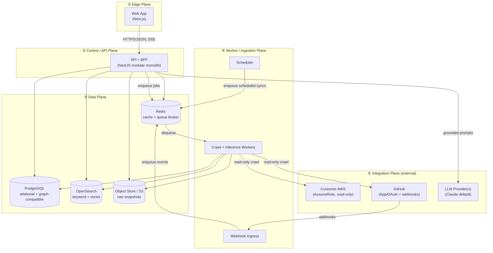

**Plane responsibilities (one line each):**
1. **Edge** — render UI, stream AI, hold session; no business logic of record.
2. **Control/API** — auth, RBAC, tenant scoping, orchestration, read APIs, AI/search request handling, job enqueue.
3. **Data** — the source of truth: PostgreSQL (graph + relational), OpenSearch (search/embeddings), Redis (cache + broker), object store (raw attribute snapshots / provenance evidence).
4. **Worker** — all crawling, inference, embedding, and reconciliation; the only writers of graph *content*.
5. **Integration** — external systems we read from / call out to.

---

## 2. Logical Component Architecture

### 2.1 Module map (inside the API/BFF monolith + worker)
Both the API process and the worker process are built from the **same codebase** and share these modules; each module exposes an internal interface and never reaches into another module's storage directly (enforced in `16`).

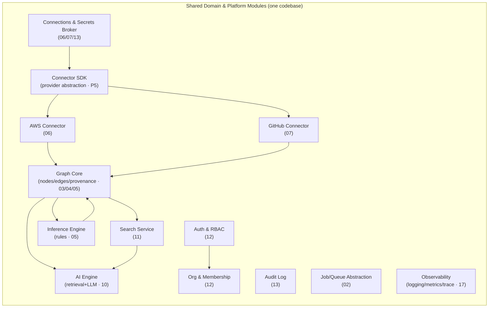

> **DD-2 — One codebase, two runtimes (API + Worker).** The API and Worker deploy as **separate processes from the same build**, sharing domain modules. **Why:** avoids code duplication and keeps the domain model single-sourced, while letting the two tiers scale and fail independently (NFR-4). A module like `GRAPH` is invoked synchronously by the API (reads) and by Workers (writes) but the *write* surface is only exercised in the worker runtime.

### 2.2 Module responsibilities & boundaries

| Module | Responsibility | Writes to | Reads from | Never does | Detailed in |
|---|---|---|---|---|---|
| **Auth & RBAC** | Authn, JWT/session, role checks, tenant scoping middleware | sessions | users, memberships | touch graph data | `12` |
| **Org & Membership** | Orgs, invitations, roles | orgs, memberships, invites | — | cross-org reads | `12` |
| **Connections & Secrets Broker** | Connection lifecycle (FR-1.x), brokered credential access | connections (meta), secret store | secret store | expose raw secrets to other modules | `06`,`07`,`13` |
| **Connector SDK** | Provider-agnostic interfaces: `discover()`, `incremental()`, `relationshipSignals()`, `health()` (P5/NFR-19) | — | — | hardcode a provider | `06`,`07` |
| **AWS Connector** | Implements SDK for AWS read-only crawl | (via Graph) | AWS APIs (assumed role) | mutate AWS (P2) | `06` |
| **GitHub Connector** | Implements SDK for GitHub repos/PR/workflow/deps | (via Graph) | GitHub API/webhooks | mutate repos | `07` |
| **Graph Core** | CRUD on nodes/edges with provenance; reconciliation; traversal/blast-radius queries | nodes, edges, provenance | nodes, edges | infer (delegates to Inference) | `03`,`04`,`05` |
| **Inference Engine** | Deterministic rules → inferred edges + confidence + evidence (P3/P9) | edges (inferred) | nodes, edges, signals | call LLMs | `05` |
| **Search Service** | Indexing + hybrid (keyword+vector) query | OpenSearch indices | graph, OpenSearch | own source-of-truth (it's a projection) | `11` |
| **AI Engine** | Context build, retrieval over graph/search, LLM call, citation/confidence (P1/P4) | conversation memory | graph, search | write graph content | `10` |
| **Audit Log** | Append-only security/event log (NFR-13) | audit store | audit store | mutate/delete entries | `13` |
| **Job/Queue** | Enqueue/dequeue, scheduling, idempotency keys, retries (P7) | queue (Redis) | queue | hold business logic | `06`,`17` |
| **Observability** | Structured logs, metrics, traces, correlation IDs | telemetry sinks | — | leak secrets/PII to logs | `17` |

**Boundary rule (binding, enforced in `16`):** Search and AI are **read projections** over the Graph Core. They may *cache/index* graph data but the Graph Core (PostgreSQL) is the only source of truth (P1). If Search/OpenSearch is wiped, it can be fully rebuilt from the graph.

---

## 3. Backend Architecture (Control/API Plane)

### 3.1 Framework & layering
**NestJS (TypeScript)**, layered as Controller → Service → Repository, with DTOs at the boundary and domain entities internally (`08`, `16`).

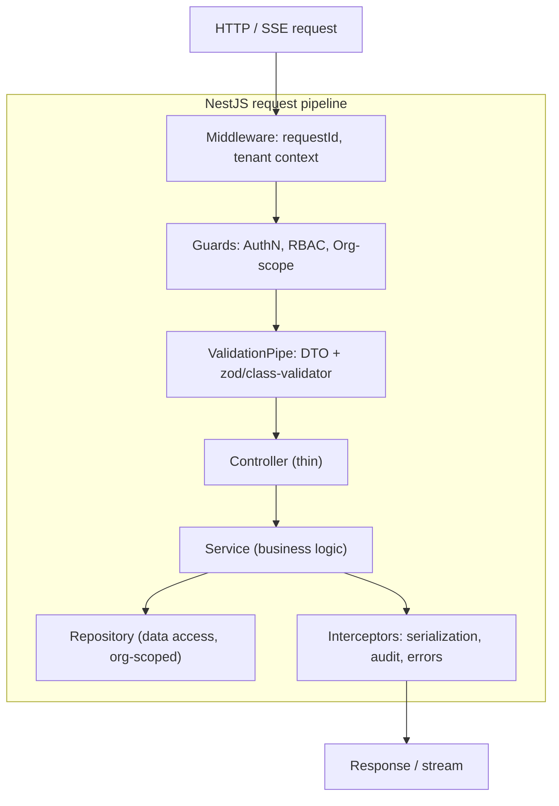

> **DD-3 — NestJS for the backend.** **Why:** opinionated modular structure (matches our module-boundary requirement NFR-19/§2.1), first-class DI (testability `14`), TypeScript end-to-end with the frontend (shared DTO types), and mature ecosystem for guards/interceptors that cleanly express **tenant scoping and RBAC** (FR-7.2/7.4) as cross-cutting concerns. **Alternatives:** Express/Fastify bare (too unstructured for a multi-engineer/agent codebase — boundaries would erode); Go/Java (loses TS type-sharing with frontend, smaller overlap with our hiring pool; P10 favors the boring-but-cohesive TS stack). Fastify is used as Nest's HTTP adapter for throughput.

### 3.2 BFF (Backend-for-Frontend) responsibility
The API doubles as a **BFF**: it shapes graph/AI/search data into view-ready DTOs (`08`/`09`) so the Next.js app never talks to PostgreSQL/OpenSearch/LLM directly. **Why:** centralizes auth, tenant scoping, and provenance assembly; keeps secrets and provider credentials server-side; lets us evolve storage without touching the client.

### 3.3 Tenant scoping (cross-cutting, critical)
Every authenticated request carries an **org context** resolved by a guard from the JWT/session (`12`). The Repository layer **requires an org id on every query** — there is no repository method that can read graph data without it. This is enforced structurally (the base repository's query builder injects `org_id`) and verified by the cross-tenant test (US-12, NFR-12). See `04` for the row-level `org_id` partitioning and `13` for defense-in-depth (DB roles / optional RLS).

> **DD-4 — App-layer tenant scoping with DB-layer defense-in-depth.** **Why:** app-layer scoping (mandatory `org_id`) is simple, testable, and fast; PostgreSQL **Row-Level Security** is layered underneath as a backstop so a missing `WHERE org_id=` in any future code path still cannot leak data (R8). Belt and suspenders for an existential risk.

### 3.4 Read vs. write paths
- **Reads** (exploration, search, AI) are synchronous and latency-bound (NFR-1/2).
- **Writes to graph content** happen *only* via the Worker plane (§5). The API's only "writes" are org/auth/connection metadata and enqueuing jobs.

This separation (a light CQRS flavor — not full CQRS/event-sourcing) keeps the request path fast and the ingestion path independently scalable.

---

## 4. Frontend Architecture (Edge Plane)

> Full detail in `09-frontend-spec.md`; this section fixes the *architectural* choices the rest of the system depends on.

**Next.js (App Router, React, TypeScript)** deployed as a server+client hybrid.

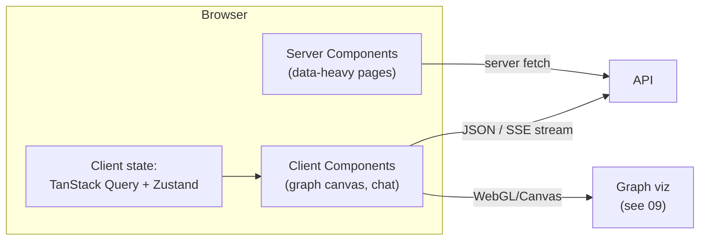

> **DD-5 — Next.js (App Router).** **Why:** SSR/streaming for fast first paint on data-heavy pages (NFR-22 TTFI), React Server Components to keep secrets and heavy queries on the server, shared TypeScript types with the NestJS DTOs, and a single well-known framework for a small team (P10). **State:** **TanStack Query** for server-state (caching/invalidation of graph/search reads) + **Zustand** for local UI state (graph canvas selection, filters) — *not* Redux. **Why:** server state dominates; TanStack Query removes most global-state needs, and Zustand handles the residual UI state with minimal boilerplate. **Streaming:** AI responses arrive via **Server-Sent Events (SSE)** (one-way, simpler than WebSockets, proxy-friendly) — FR-6.4. **Graph rendering** choice (Canvas/WebGL lib) is deferred to `09` but the architecture assumes client-side rendering of server-supplied node/edge subgraphs (never the whole graph at once — NFR-24).

---

## 5. Worker / Ingestion Plane

This plane realizes G1/P7/NFR-3/NFR-6 — the heart of "the graph is the product."

### 5.1 Topology
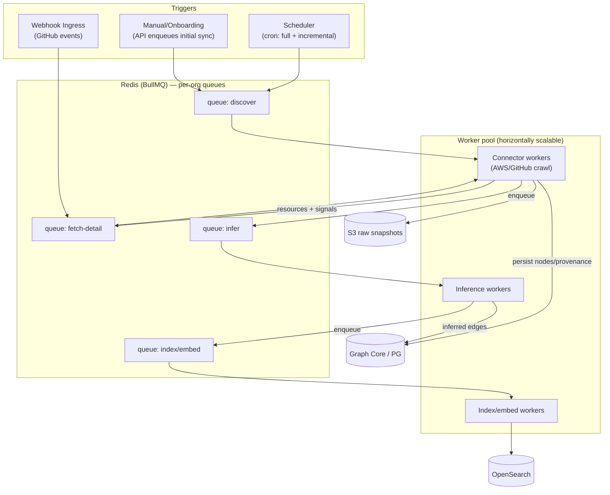

### 5.2 The crawl pipeline (staged, idempotent)
A sync is a **DAG of stages**, each a queue, so stages scale independently and a failure in one stage doesn't lose upstream work:

1. **Discover** — enumerate resource identifiers (paginated, per region/repo).
2. **Fetch-detail** — pull full attributes for each identifier; write nodes + provenance + raw snapshot to S3.
3. **Infer** — apply inference rules over the updated node set → edges with confidence/evidence (`05`).
4. **Index/embed** — project nodes/edges into OpenSearch (keyword + vector) for search/AI (`11`).
5. **Reconcile** — mark not-seen resources stale/deleted; close out the `sync_run` (FR-2.7).

> **DD-6 — BullMQ on Redis as the job system (MVP).** **Why:** mature, TypeScript-native, supports delayed/repeatable jobs, rate-limiting, retries with backoff, and **named queues per stage** — directly serving FR-2.3/2.4 (idempotent, resumable, rate-limited). It reuses the Redis we already run for caching (operational simplicity, P10). **Alternatives:** SQS+Lambda (vendor-coupled, harder local dev, splits codebase), Kafka/Temporal (powerful but heavyweight for MVP — Temporal is a strong Phase-1 candidate when sync orchestration grows; we keep the stage-DAG shape so a Temporal migration is mechanical). **Scaling caveat documented:** at thousands of orgs, Redis-queue fairness needs per-org queues + concurrency caps (already modeled) and likely a move to Temporal/Kafka — gated, not premature (P6).

### 5.3 Idempotency, resumability, fairness (P7)
- **Idempotency:** every job has a deterministic **idempotency key** (`org_id : connector : resource_urn : sync_id`); persisting a node is an **upsert keyed by stable URN** (`04`), so re-running a job converges (FR-2.3).
- **Resumability:** stages are checkpointed; an interrupted sync resumes from the last completed stage/cursor, not from zero (FR-2.3).
- **At-least-once + dedupe:** workers assume duplicate delivery and dedupe via the idempotency key (NFR-6).
- **Per-org fairness:** queues are partitioned by org with concurrency caps so one large org cannot starve others (P6/NFR-5).
- **Rate-limit isolation:** connector workers respect provider rate limits per connection; throttling degrades that connection's freshness only (FR-2.4, US-13).

### 5.4 Scheduling
The **Scheduler** enqueues incremental syncs on a per-connection cadence (default: incremental every N minutes targeting NFR-3 <15 min convergence; full sync nightly + on demand). Cadence is per-connector and configurable (`06`/`07`). Schedules are stored in PostgreSQL (not only in Redis) so they survive a broker flush.

---

## 6. Integration Plane

### 6.1 AWS integration (read-only)
- Customer creates a **ReadOnly IAM Role** trusting Atlas's AWS principal, gated by a unique **External ID** (confused-deputy protection — `13`).
- Atlas performs **`sts:AssumeRole`** to obtain short-lived credentials per crawl; never stores long-lived customer keys (FR-1.2/1.3, NFR-11).
- All calls are `Describe*`/`List*`/`Get*` only; the permission set is least-privilege (`06`/`13`). Mutation APIs are *not in the policy* — read-only is enforced at IAM, not by our code (P2/NFR-10).

### 6.2 GitHub integration
- **GitHub App** (preferred over raw OAuth) for fine-grained, revocable, least-privilege repo access and higher rate limits (`07`/`12`).
- **Webhooks** (push, PR, workflow_run) flow into the **Webhook Ingress** (§5), verified by signature (`13`), enqueued, and reconciled (FR-3.7).

### 6.3 LLM provider integration
- A **provider abstraction** (`LLMProvider` interface) wraps the model API; default is the current top Claude model, swappable per-env (FR-6.6, P5/P10).
- The AI Engine sends **grounded** prompts (graph-retrieved context + citations) and streams completions back via SSE (`10`).

> **DD-7 — Provider abstractions at every external boundary.** AWS, GitHub, and the LLM are all behind interfaces (`Connector SDK`, `LLMProvider`). **Why:** P5/NFR-19 (add GCP/GitLab/another model without core changes) and testability — every external boundary is mockable for `14`'s integration tests.

---

## 7. Data Architecture (Data Plane)

> Schema detail in `04`; graph semantics in `05`; search indices in `11`. Here: *which store holds what, and why*.

| Store | Holds | Why this store | Source of truth? |
|---|---|---|---|
| **PostgreSQL** | Orgs/users/auth, connections, **graph nodes & edges + provenance**, sync runs, audit log | ACID, relational integrity for tenancy/auth, and a **graph-compatible node/edge schema** that scales to MVP graphs and migrates to a graph DB later (A4, NFR-20) | **Yes** — system of record |
| **OpenSearch** | Keyword + **vector embeddings** of resources/text; search indices | Hybrid (BM25 + kNN) search in one engine (`11`); rebuildable from PG | No (projection) |
| **Redis** | Cache (hot graph reads, sessions), **BullMQ queues** | Low-latency cache + battle-tested job broker | No (ephemeral) |
| **Object store (S3)** | Raw attribute snapshots, provenance evidence blobs, large payloads | Cheap, durable, keeps PG lean; provenance "click-through to raw" (P4) | Yes for raw evidence |

> **DD-8 — PostgreSQL as the graph store for MVP (the most-questioned decision).** Restating from `00`/`01` with the architectural rationale: a node/edge table model with proper indexing (`04`) answers Atlas's traversals (blast radius, dependents, neighbors — bounded depth) at MVP scale within NFR-1, **while keeping one ACID store for tenancy, provenance, and history**. A dedicated graph DB (Neo4j) adds an operational system, a second consistency boundary, and migration of our tenancy/provenance model — cost we don't pay until query depth/scale demands it (`00` OQ4). The schema is deliberately **graph-shaped** so the migration is data-movement, not redesign (NFR-20). **Alternative — Neo4j now:** rejected for MVP (P6/P10). **Alternative — Postgres + `ltree`/recursive CTE only, no edge table:** rejected; an explicit typed edge table with provenance is required for inference/citations (`05`).

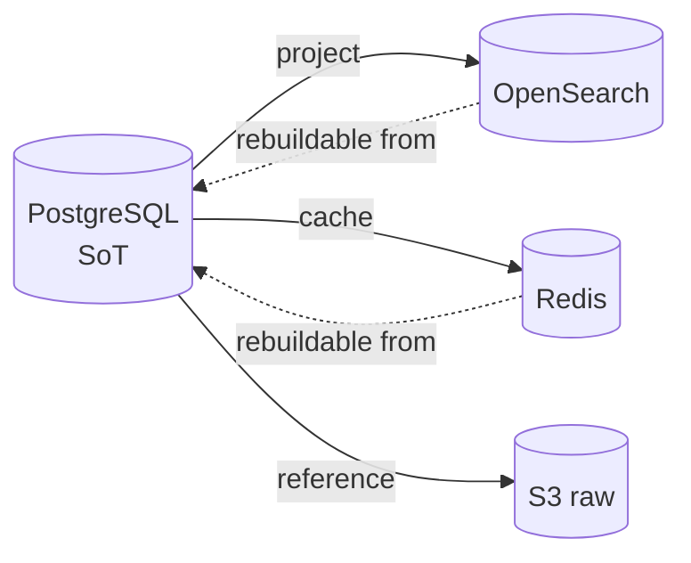

---

## 8. End-to-End Data Flows (sequence diagrams)

### 8.1 Onboarding → AWS connect → initial sync (FR-1.x, FR-2.1)
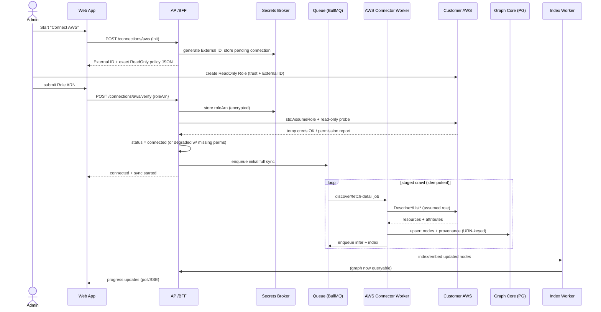

### 8.2 GitHub webhook → incremental update (FR-3.6/3.7)
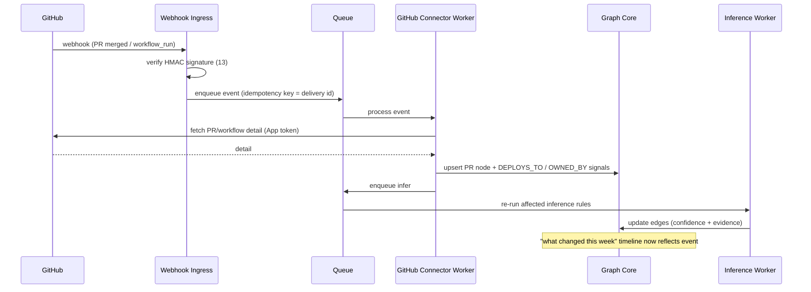

### 8.3 AI question → grounded, cited answer (FR-6.1/6.2/6.3)
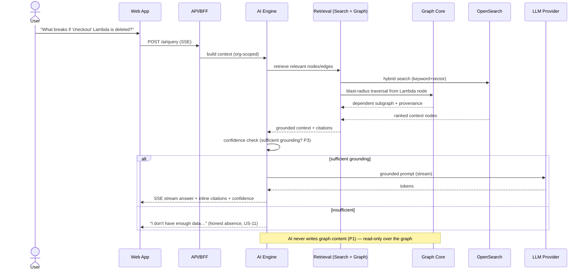

### 8.4 Failure recovery during a crawl (P7, NFR-6)
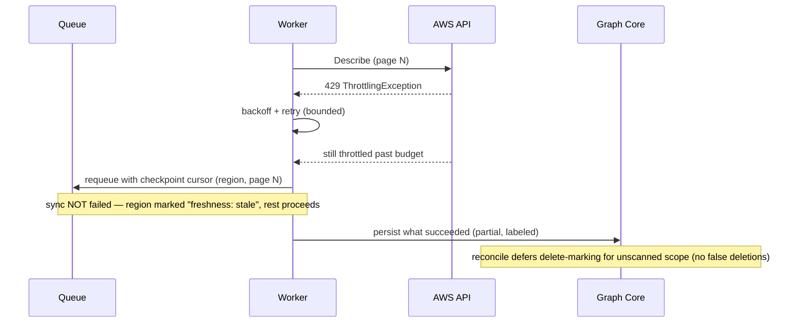

---

## 9. Cross-Cutting Concerns

### 9.1 Multi-tenancy (P6, NFR-12, R8)
- **Isolation model:** single database, **shared schema, `org_id` on every tenant-owned row** (pool model), with app-layer mandatory scoping + PostgreSQL RLS backstop (DD-4). **Why shared-schema over schema-per-tenant or db-per-tenant:** scales to thousands of orgs without per-tenant migration/connection overhead; isolation enforced in code+RLS (`04`/`13`). Large/enterprise tenants can be promoted to a dedicated DB later without app changes (the repository abstracts the datasource).
- **Queue isolation:** per-org queues + concurrency caps (§5.3).
- **Verification:** continuous cross-tenant test (US-12).

### 9.2 Asynchronous processing model
- Anything slow, external, or bursty (crawls, inference, embedding) is **async via queues**; the request path stays synchronous and fast. Onboarding shows async progress (FR-1.5).

### 9.3 Configuration & secrets
- 12-factor config via environment (`17`); **secrets in a managed secret manager**, accessed only through the Secrets Broker module; never in logs (NFR-11, TELEM rule).

### 9.4 Observability (NFR-16/17, `17`)
- **Correlation ID** generated at the edge and propagated through API → queue job → worker → inference, so a single user action or sync is traceable end-to-end.
- **Three pillars:** structured JSON logs, metrics (RED for API; crawl/freshness/inference-precision/provenance-coverage for the graph — NFR-17), distributed tracing.

### 9.5 Error handling & resilience
- Uniform error envelope at the API (`08`); typed domain errors internally (`16`).
- Workers: bounded retries + backoff, dead-letter queue for poison jobs, partial-success semantics (§8.4).
- Graceful degradation: if Workers/OpenSearch are down, **exploration of the existing graph and provenance still works** from PostgreSQL (NFR-7); only freshness/search/AI degrade — and degrade *visibly* (US-13).

### 9.6 Versioning & compatibility
- API is versioned (`/v1`, `08`); internal module interfaces are semver-disciplined (`16`); the graph schema has a migration strategy (`04`).

---

## 10. Deployment Architecture

> Operational detail (CI/CD, IaC, env vars, scaling policies) in `17`. Here: the target topology.

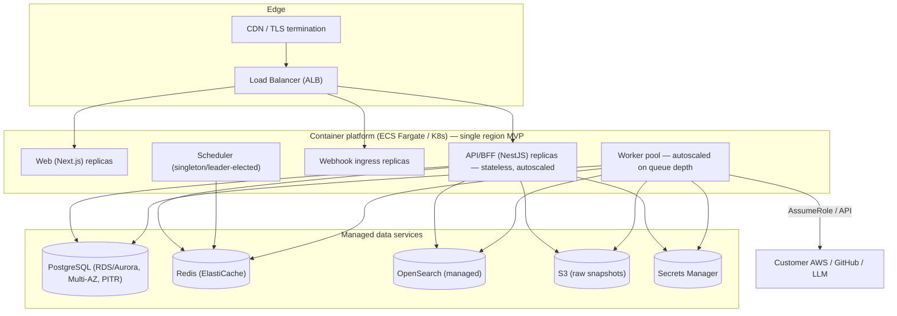

**Key deployment decisions:**
- **Stateless API/Web/Worker** containers, **autoscaled** (API on CPU/RPS, Workers on **queue depth**) — NFR-4.
- **Scheduler is a singleton** (leader-elected) to avoid duplicate scheduled enqueues; jobs are idempotent so a brief double-fire is harmless (P7).
- **Managed data services** (RDS Multi-AZ w/ PITR for RPO≤1h, ElastiCache, managed OpenSearch) — minimize ops for a small team (P10); DR in `17`.
- **Single region MVP** (A10); the topology is region-portable for Phase-1 multi-region (P6).
- **Network:** all data services in private subnets; only LB/CDN public; egress to customer AWS via NAT with a stable principal (`13`).

> **DD-9 — ECS Fargate (or managed K8s) over self-managed.** **Why:** removes node/cluster ops for a small team (P10); autoscaling on queue depth fits the bursty worker profile. K8s is an acceptable substitute if the team's expertise favors it; the architecture (stateless containers + managed data) is platform-agnostic. **Decision deferred to `17`**, constrained to "managed container platform."

---

## 11. Technology Choices Summary & Tradeoffs

| Concern | Choice | Primary alternative(s) | Why chosen (trace) |
|---|---|---|---|
| Backend framework | **NestJS (TS)** | Express/Fastify bare, Go, Java | Module boundaries, DI, TS type-sharing, guards for RBAC/tenancy (DD-3, NFR-19, P10) |
| HTTP adapter | **Fastify (under Nest)** | Express | Throughput (NFR-2) |
| Frontend | **Next.js App Router (TS)** | Remix, SPA+Vite | SSR/streaming for TTFI, RSC keeps secrets server-side, TS sharing (DD-5, NFR-22) |
| Client state | **TanStack Query + Zustand** | Redux Toolkit | Server-state dominates; minimal boilerplate (DD-5) |
| AI streaming | **SSE** | WebSockets | One-way, proxy-friendly, simpler (DD-5, FR-6.4) |
| System of record | **PostgreSQL** | Neo4j now, MySQL | ACID + graph-compatible + migration-ready (DD-8, A4, NFR-20) |
| Search | **OpenSearch (BM25+kNN)** | pgvector-only, Elasticsearch, Pinecone | Hybrid in one engine, self-hostable, rebuildable (DD-8, `11`) |
| Cache + broker | **Redis + BullMQ** | SQS/Lambda, Kafka, Temporal | TS-native jobs, retries/rate-limit, reuse cache; Temporal is the Phase-1 path (DD-6, P7) |
| Object store | **S3** | DB blobs | Cheap durable raw provenance (DD-8, P4) |
| Compute | **Managed containers (Fargate/K8s)** | Bare EC2, serverless-only | Stateless autoscale, low ops (DD-9, NFR-4, P10) |
| LLM | **Provider abstraction, Claude default** | Single-vendor hardcode | Swappable, testable (DD-7, FR-6.6) |
| Secrets | **Managed Secrets Manager** | DB-stored secrets | Encryption, rotation, audit (NFR-11, `13`) |
| Lang (everything) | **TypeScript** | polyglot | One language API↔worker↔web, shared types, hireability (P10) |

**Overarching tradeoff philosophy (P10):** we spend our complexity budget on the **graph, inference, and provenance** (the product) and deliberately choose *boring, proven, single-language* infrastructure everywhere else. Each choice above is also a **deferral**: PostgreSQL→graph DB, BullMQ→Temporal, single-region→multi-region, modular-monolith→services are all *pre-planned migrations*, not rewrites (P6).

---

## 12. Design Decisions Recap (with why)

| ID | Decision | Why (trace) |
|---|---|---|
| DD-1 | Modular monolith (API) + separate worker tier | Operational simplicity now, extractable later (P6/P10, NFR-4) |
| DD-2 | One codebase, two runtimes (API/Worker) | Single-sourced domain, independent scaling (NFR-4) |
| DD-3 | NestJS backend | Boundaries, DI, RBAC/tenancy as guards (NFR-19, P10) |
| DD-4 | App-layer tenancy + RLS backstop | Existential leakage risk (R8, NFR-12) |
| DD-5 | Next.js + TanStack/Zustand + SSE | TTFI, server-held secrets, simple streaming (NFR-22, FR-6.4) |
| DD-6 | BullMQ/Redis jobs (Temporal later) | Idempotent/resumable/rate-limited, reuse Redis (P7) |
| DD-7 | Abstractions at every external boundary | Multi-source + testability (P5, NFR-19) |
| DD-8 | PostgreSQL as graph SoT (graph-shaped schema) | Migration-ready, one ACID store (A4, NFR-20, P6) |
| DD-9 | Managed containers, single region MVP | Low ops, region-portable (P10, A10) |

## 13. Risks (architecture-specific; complements `00` §12)

| ID | Risk | Mitigation |
|---|---|---|
| AR-1 | PG graph traversals slow as graphs grow | Indexing + materialized adjacency/closure where needed (`04`/`05`); load tests (`14`); migration trigger criteria (OQ4) |
| AR-2 | Redis-queue fairness/throughput at many orgs | Per-org queues + caps now; Temporal/Kafka migration path kept (DD-6, P6) |
| AR-3 | OpenSearch drift vs. PG (stale projection) | Rebuildable-from-PG invariant; reconcile/index stage idempotent; consistency checks (`11`) |
| AR-4 | Modular-monolith boundaries erode over time | Lint/arch rules enforcing module interfaces (`16`); periodic boundary review |
| AR-5 | Scheduler double-fire | Leader election + idempotent jobs (P7) |
| AR-6 | Worker poison jobs block a queue | DLQ + bounded retries + alerting (§9.5) |
| AR-7 | Secret exposure via logs/traces | Broker-only access + log scrubbing + tests (`13`) |
| AR-8 | LLM provider outage/latency | Provider abstraction w/ fallback model; AI degrades visibly, exploration unaffected (NFR-7) |

## 14. Edge Cases (architecture-level)

- **Webhook before initial sync completes** — event queued; reconcile applies it idempotently once nodes exist (no ordering assumption; §5.3).
- **Two syncs overlap** for one connection — connection-level lock / single in-flight sync per connector; later trigger coalesces (P7).
- **Partial-region failure** — labeled stale, not deleted (§8.4, US-13).
- **Graph read during active write** — readers see last-consistent state (PG MVCC); reconciliation is transactional per resource (`04`).
- **OpenSearch unavailable** — search/AI degrade; graph exploration via PG still works (NFR-7).
- **Customer revokes IAM role mid-sync** — AssumeRole fails, connection→error, in-flight jobs fail gracefully and don't false-delete (EC-6/§8.4).
- **Very large single response (huge S3 bucket list, monorepo)** — paginated discover + S3-offloaded raw payloads keep PG/worker memory bounded.

## 15. Future Considerations

- **Extract modules to services** (Connectors, AI, Search) when team/scale justifies (DD-1) — interfaces already exist.
- **Temporal** for sync orchestration as workflows grow (DD-6).
- **Dedicated graph DB** (Neo4j/managed) gated on AR-1/OQ4 — schema is migration-ready (`05`).
- **Real-time ingestion** (CloudTrail/EventBridge) plugs into Webhook Ingress pattern (Phase 1).
- **Multi-region / data residency** (NFR-26) — region-portable topology designed for it.
- **MCP server** exposing the graph to external agents reuses the AI Engine's retrieval layer (Phase 3, `10`).

## 16. Open Questions

- **OQ-ARCH-1** Fargate vs. managed K8s — decided in `17` (constrained to managed containers, DD-9).
- **OQ-ARCH-2** pgvector vs. OpenSearch-only for embeddings — resolved in `11` (current lean: OpenSearch for hybrid; pgvector revisited if we want one fewer system).
- **OQ-ARCH-3** Exact graph-DB migration trigger metrics (shared with `00` OQ4) — in `05`/`17`.
- **OQ-ARCH-4** Whether the Scheduler should be Temporal from MVP (vs. BullMQ repeatable jobs) — `15` cost/benefit.
- **OQ-ARCH-5** Poll vs. SSE for onboarding/sync progress (AI already SSE) — `08`/`09`.

## 17. References

- **Upstream:** `00` (G/P/NG/A/R), `01` (FA/FR/NFR/US).
- **Downstream:** `03` (domain model over Graph Core), `04` (PG schema realizing DD-8/§7), `05` (graph/inference realizing INFER/§5.2), `06`/`07` (Connector workers/§5–6), `08` (API/BFF/§3), `09` (Web/§4), `10` (AI/§8.3), `11` (Search/§7), `12` (Auth/tenancy/§3.3/§9.1), `13` (security of §6/§9.3/§10), `14` (testing of NFRs/US-12), `16` (module-boundary enforcement), `17` (deploy/CI/scaling of §10).

---

### Change log
| Version | Date | Author | Change |
|---|---|---|---|
| 1.0 | 2026-06-30 | Founding Principal Architect | Initial authoritative architecture from `00`/`01` v1.0 |
