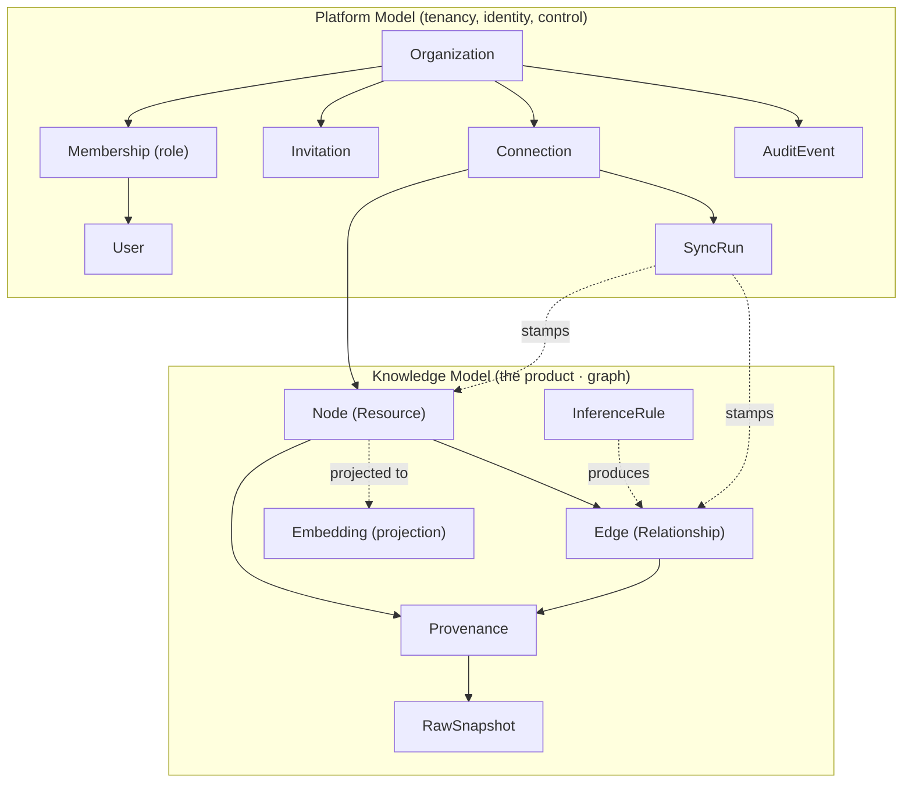
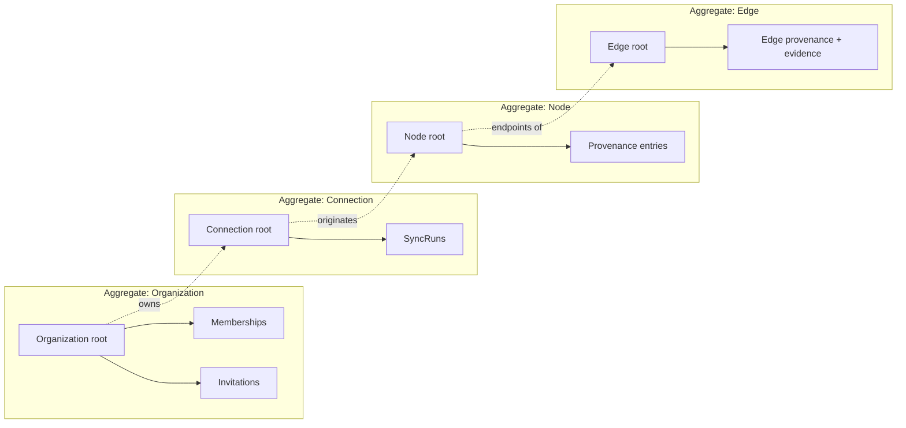
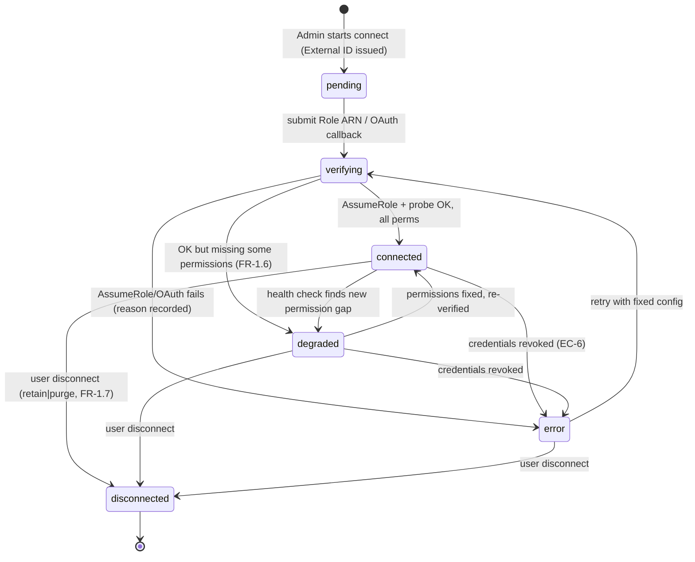
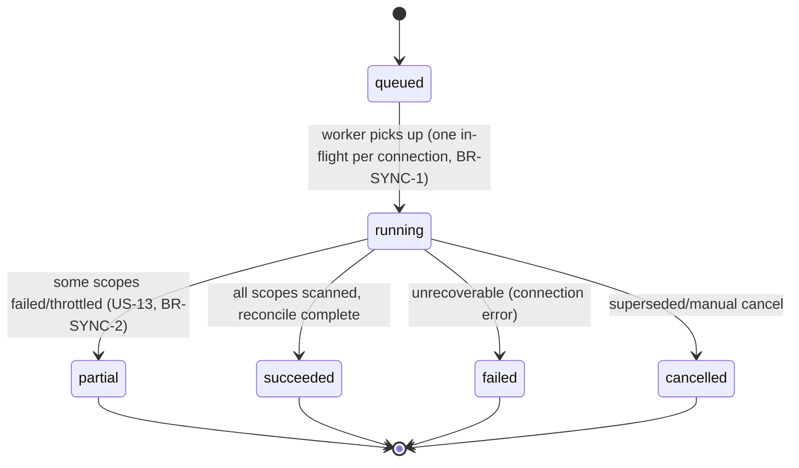
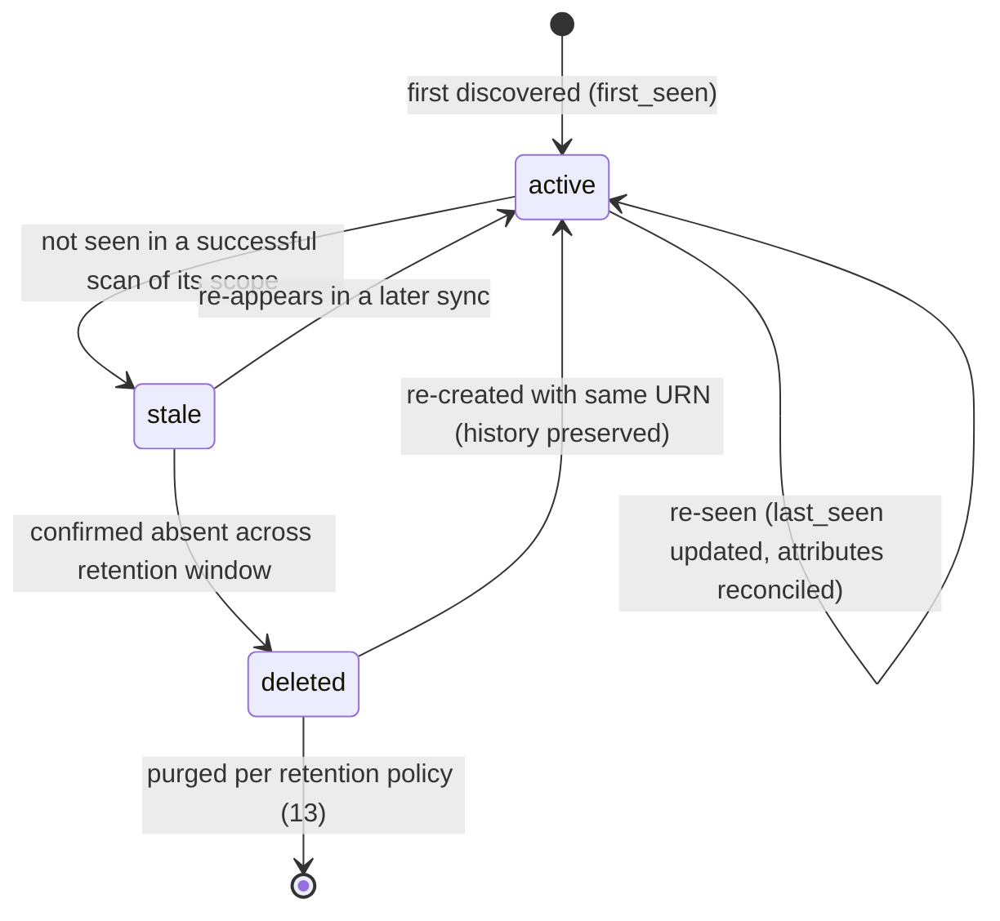
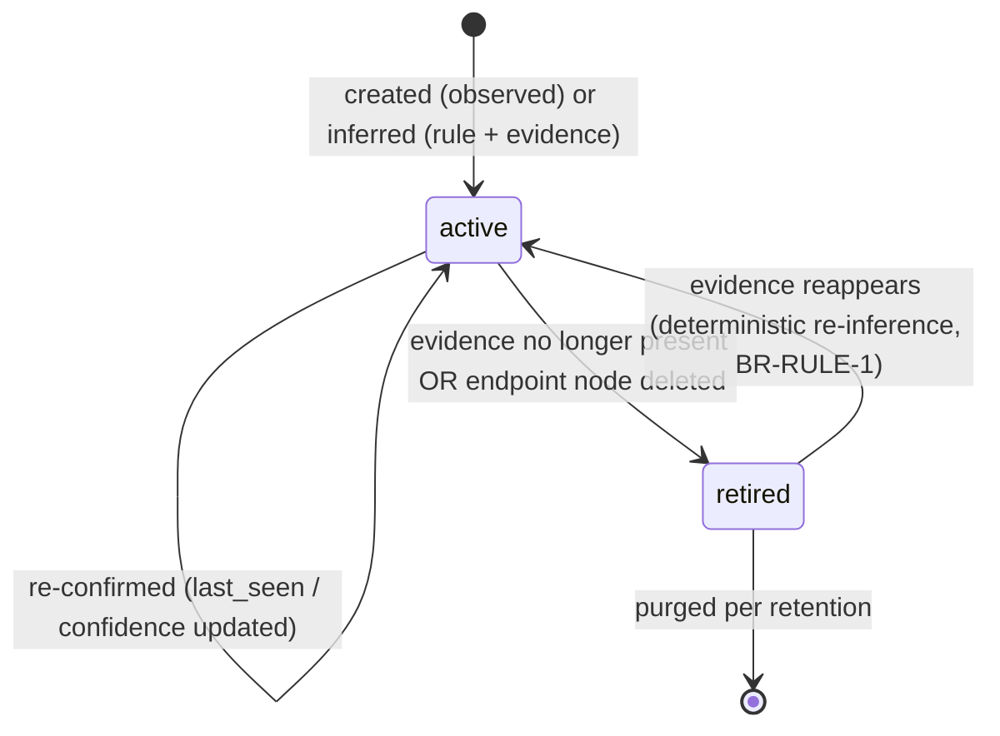
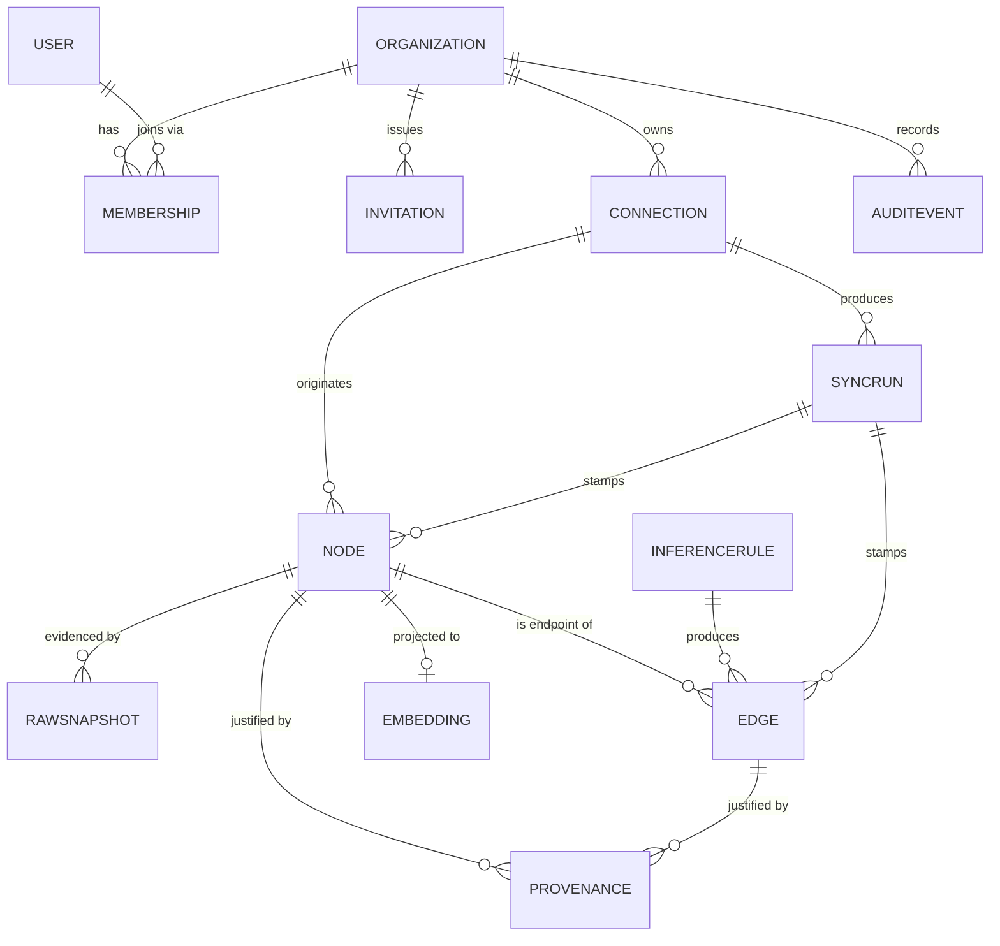

# 03 — Domain Model

> **Document status:** Authoritative · **Version:** 1.0 · **Last updated:** 2026-06-30
> **Owner:** Founding Principal Architect · **Audience:** Engineers, AI coding agents, QA
> **Document type:** Domain / Conceptual Model
> **Depends on:** `00` (glossary §10, principles P1–P10), `01` (FR/NFR), `02` (Graph Core, modules, planes)
> **Consumed by:** `04` (physical schema), `05` (graph & inference), `06`/`07` (connectors populate these objects), `08` (DTOs), `10`/`11` (read projections)

---

## Purpose

This document defines the **conceptual domain model** of Atlas: every domain object (entity), its attributes-of-meaning, ownership, lifecycle, business rules, validation rules, and the relationships between objects. It is the **bridge between requirements (`01`) and physical storage (`04`/`05`)**.

It deliberately sits *above* the database: `04-database-schema.md` is the physical realization (tables, columns, indexes, FKs) of the entities defined here, and `05-knowledge-graph.md` is the realization of the **Node/Edge** subset as a traversable graph. Where this document says "an Edge has provenance," `04` says "the `edges` table has a `provenance_id` FK" and `05` says "an edge is traversed thus."

> **The central modeling insight (from `00` P1):** Atlas has **two coupled models** living in one system:
> 1. A **platform model** — Orgs, Users, Connections, Sync Runs, Audit — conventional SaaS entities with strong relational integrity.
> 2. A **knowledge model** — Resources (Nodes), Relationships (Edges), Provenance, Inference — a generic, source-agnostic graph (P5).
> The platform model *owns and scopes* the knowledge model (every Node belongs to an Org via a Connection). Keeping these two cleanly separated is what lets the knowledge model stay provider-agnostic while the platform model stays a normal multi-tenant SaaS.

## Scope

**In scope:** Entities, value objects, aggregates, ownership hierarchy, relationships (conceptual), lifecycle/state machines, business rules (invariants), validation rules, identity/keying strategy.

**Out of scope (pointers):** Column types/indexes/DDL → `04`; edge *semantics*, inference rules, traversal algorithms → `05`; the AWS/GitHub-specific attribute mappings → `06`/`07`; API representations (DTOs) → `08`.

## Assumptions

Inherits `00` §11, `01` §A7–A9, `02` §A10–A12. Domain-specific:
- **A13.** Every knowledge object is reachable to exactly one Org (no shared/global resources across tenants) — required by tenant isolation (R8, NFR-12).
- **A14.** A Resource's identity is stable across syncs via a deterministic **URN** (uniform resource name) the connector can always recompute (enables idempotent upsert — `02` §5.3).
- **A15.** History matters: objects are **soft-deleted / time-versioned**, never hard-deleted on disappearance, to power "what changed" (FR-5.4) and provenance (P4).

---

## 1. Domain Landscape (the big picture)

**Two models, one ownership spine:** `Organization` is the tenant root; everything hangs off it. `Connection` is the hinge — it belongs to an Org (platform) and is the *origin* of Nodes/Edges (knowledge). This single spine is what makes tenant isolation expressible as "everything is reachable from exactly one Org" (A13).

---

## 2. Aggregates & Ownership Hierarchy

We model the domain as **aggregates** (consistency boundaries — a la DDD). An aggregate is loaded/validated/transacted as a unit; cross-aggregate references are by ID only.

| Aggregate | Root entity | Contains | Why this boundary |
|---|---|---|---|
| **Organization** | `Organization` | `Membership`, `Invitation` | Identity/tenancy changes are transactional together; small, frequently authz-checked |
| **Connection** | `Connection` | `SyncRun` | A connection and its sync history form one operational unit; lifecycle (connect/sync/disconnect) is governed here |
| **Node** | `Node` (Resource) | `Provenance` entries for that node | A resource and *why we believe it exists* must be consistent together (P4) |
| **Edge** | `Edge` (Relationship) | edge `Provenance`/evidence | An edge and its justification are one unit (a justified edge or no edge — P3/P4) |
| **AuditEvent** | `AuditEvent` | — (append-only leaf) | Immutable; never part of another aggregate's transaction |

> **DD-1 — Node and Edge are *separate* aggregates.** **Why:** at scale a single node can participate in thousands of edges; making edges part of the Node aggregate would create huge, contended aggregates. Keeping Edge independent (referencing two Node IDs) lets inference rewrite edges without locking nodes, and matches the graph storage in `05`. **Consistency between them** is *eventual within a sync* and reconciled (an edge whose endpoint node was deleted is retired during reconciliation — §6.4), which is acceptable per P7.

---

## 3. Platform Model Entities

> Attribute lists here are **conceptual** (the meaning-bearing fields). Physical columns, types, defaults, and indexes are in `04`. Identity strategy is in §7.

### 3.1 Organization
The tenant. Root of all ownership (A13).

| Attribute | Meaning | Notes |
|---|---|---|
| `id` | Stable internal identity | UUID (`04`) |
| `name` | Display name | required |
| `slug` | URL-safe unique handle | unique global; immutable after create |
| `plan` | Billing/plan tier | `18`; default `free`/`trial` |
| `status` | `active` / `suspended` / `deleting` | suspended blocks crawls but retains data |
| `created_at` / `updated_at` | Lifecycle timestamps | |

**Business rules:** an Org always has ≥1 `Owner` (BR-ORG-1); deleting an Org cascades (soft) to all owned aggregates with a grace/purge window (`13` data handling).

### 3.2 User
A human identity. **Global**, not org-scoped — one human, many orgs.

| Attribute | Meaning | Notes |
|---|---|---|
| `id` | Identity | UUID |
| `email` | Login identifier | unique global, validated |
| `auth_identities` | Linked **login** methods — MVP: Google OAuth (`sub`); captures `hd`/email-domain | `12` (login ≠ connector auth) |
| `name`, `avatar_url` | Profile | optional |
| `status` | `active`/`disabled` | |

**Business rule:** a User exists independent of any Org; org access is *only* via `Membership` (BR-USER-1). This cleanly separates identity from authorization (`12`).

### 3.3 Membership
The association of a `User` to an `Organization` **with a role** — the unit of authorization.

| Attribute | Meaning |
|---|---|
| `id`, `org_id`, `user_id` | the association |
| `role` | `Owner` \| `Admin` \| `Member` (MVP RBAC, `12`) |
| `status` | `active` / `invited` / `revoked` / `requested` (Phase-1 domain-join, `12` §7.5) |
| `created_at` | join time |

**Role semantics (summarized; authoritative matrix in `12`):**

| Capability | Owner | Admin | Member |
|---|---|---|---|
| Manage billing, delete org | ✓ | – | – |
| Manage connections (create/verify/disconnect) | ✓ | ✓ | – |
| Invite/remove members, set roles | ✓ | ✓ (not Owners) | – |
| Explore graph, search, ask AI | ✓ | ✓ | ✓ |
| View audit log | ✓ | ✓ | – |

**Business rules:** exactly one role per (user, org) (BR-MEM-1); cannot remove/demote the last Owner (BR-MEM-2); Admins cannot modify Owners (BR-MEM-3).

### 3.4 Invitation
A pending grant of membership to an email not yet (or not yet joined as) a member.

| Attribute | Meaning |
|---|---|
| `id`, `org_id`, `email`, `role` | who/what is being invited |
| `token` | single-use, expiring secret (`12`/`13`) |
| `status` | `pending` / `accepted` / `expired` / `revoked` |
| `invited_by`, `created_at`, `expires_at` | provenance/expiry |

**Rules:** token single-use + time-boxed (BR-INV-1); accepting creates/links a `User` and a `Membership` atomically (BR-INV-2); only `Admin`+ can invite (FR-7.3).

### 3.5 Connection
The configured link to one external source for one Org. **The hinge between platform and knowledge models.** (FR-1.x; AWS specifics `06`, GitHub `07`, secrets `13`.)

| Attribute | Meaning | Notes |
|---|---|---|
| `id`, `org_id` | identity + tenancy | |
| `provider` | `aws` \| `github` (extensible — P5) | drives which Connector runs |
| `display_name` | user label | e.g. "Prod AWS" |
| `status` | see lifecycle §5.1 | `pending`→`verifying`→`connected`/`degraded`/`error`/`disconnected` |
| `config` | provider-specific non-secret config | e.g. AWS role ARN, external ID ref, regions; GitHub installation id, selected repos |
| `secret_ref` | pointer into Secrets Broker (never the secret) | `13`, NFR-11 |
| `health` | last health-check result + missing-permission report | FR-1.6/1.9 |
| `scope` | what to crawl (regions, repos) | FR-1.4 |
| `created_at`, `last_synced_at` | lifecycle | |

**Rules:** `secret_ref` only — raw secrets never live on the Connection (BR-CONN-1, P8); a Connection in `connected`/`degraded` is the **only** thing authorized to originate Nodes (BR-CONN-2); disconnect transitions per FR-1.7 with retain-vs-purge choice (BR-CONN-3).

### 3.6 SyncRun
One execution of a crawl for a Connection. The unit of freshness, observability, and history.

| Attribute | Meaning |
|---|---|
| `id`, `org_id`, `connection_id` | identity + ownership |
| `type` | `full` \| `incremental` \| `webhook` (FR-2.1/2.2/3.7) |
| `status` | `queued`→`running`→`succeeded`/`partial`/`failed`/`cancelled` |
| `trigger` | `scheduled` \| `manual` \| `onboarding` \| `webhook` |
| `cursor`/`checkpoint` | resumability state (`02` §5.3) |
| `stats` | resources discovered/changed/deleted, errors, throttles, duration (FR-2.8) |
| `scope_result` | per-region/per-repo freshness + failures (US-13) |
| `started_at`, `finished_at` | timing |

**Rules:** one in-flight SyncRun per Connection (coalesce others — BR-SYNC-1, `02` §14); a `partial` run marks only successfully-scanned scopes fresh and never delete-marks unscanned scopes (BR-SYNC-2, FR-2.7/US-13); every Node/Edge write is stamped with the `sync_run_id` that touched it (BR-SYNC-3, enables "what changed").

### 3.7b Phase-1 platform entities — Domain-based membership (`12` §7)
> **Designed now, built Phase-1** (`12` A50). Listed here so the model is complete; data (the Google `hd` domain) is captured from MVP, behavior ships Phase-1.

- **OrgDomain** — a domain (`acme.com`) claimed by an Org, **trust-anchored on the Google Workspace `hd` claim** (no DNS needed, `12` DD-4). Attributes: `domain`, `verified` (true when proven via `hd`), `is_primary` (the canonical auto-join org when several share a domain), `join_policy` (`auto`/`request`/`off`). Free domains never claimable (`12` A51). → `04` `org_domains`.
- **JoinRequest** — a verified same-domain user's request to join an Org when policy=`request` or the Org isn't the domain's primary. Lifecycle `pending`→`approved`/`denied`/`expired`; approval transitions the user's `requested` Membership → `active`. → `04` `join_requests`.

**Rules:** a domain is claimable only by a user whose `hd` proves membership (BR-DOM-1, `12` DD-4/AU-7); auto-join grants **Member only** (BR-DOM-2, P8); all joins/requests/approvals are audited (BR-DOM-3). Login identity (Google) is **separate** from connector identity (AWS role / GitHub App) — a Membership grants no cloud access and vice-versa (`12` AU-1).

### 3.7 AuditEvent
Append-only record of security-relevant actions (FR-7.5, NFR-13, `13`).

| Attribute | Meaning |
|---|---|
| `id`, `org_id` | identity + tenancy |
| `actor` | user id / system / connector |
| `action` | enum (e.g. `connection.verify`, `member.role_changed`, `ai.query`, `sync.start`) |
| `target` | affected entity ref |
| `metadata` | structured context (no secrets/PII beyond necessity — NFR-15) |
| `occurred_at`, `request_id` | timing + correlation (`02` §9.4) |

**Rules:** immutable and append-only (BR-AUD-1); never part of another transaction's rollback (it records attempts too, e.g. denied cross-tenant access — US-12); retention per `13`.

---

## 4. Knowledge Model Entities (the product)

> This is the generic, **provider-agnostic** graph model (P5). AWS/GitHub map *into* it; nothing here names a provider. The Node/Edge/Provenance triad is realized physically in `04` and traversed in `05`.

### 4.1 Node (Resource) — the core knowledge entity
A single discovered entity from any source: an EC2 instance, a Lambda, an S3 bucket, a repo, a PR, a logical Service. Becomes a graph node (`05`).

| Attribute | Meaning | Notes |
|---|---|---|
| `id` | internal identity | UUID |
| `org_id` | tenancy (A13) | mandatory on every read (`02` §3.3) |
| `connection_id` | originating Connection (ownership) | BR-CONN-2 |
| `urn` | **deterministic stable identity** across syncs | §7; e.g. `aws:us-east-1:123456789012:lambda:checkout-processor` |
| `kind` | node type from a controlled vocabulary | e.g. `aws.lambda.function`, `github.repository`, `atlas.service` (§4.6) |
| `name` | human label | display |
| `attributes` | normalized, meaning-bearing properties (provider-mapped) | typed-ish JSON; raw lives in `RawSnapshot` |
| `tags` | source tags/labels (e.g. AWS tags) | used for inference & search |
| `status` | `active` \| `stale` \| `deleted` (soft) | lifecycle §6 |
| `confidence` | for *derived* nodes (e.g. logical Service) | P3; observed nodes = `observed` |
| `first_seen`, `last_seen` | history (A15) | drives "what changed" |
| `last_sync_run_id` | freshness stamp | BR-SYNC-3 |

**Rules:** a Node always has a resolvable `connection_id` + `urn` (BR-NODE-1); `urn` is unique per Org (BR-NODE-2, enables upsert idempotency A14); a Node never silently vanishes — disappearance ⇒ `stale`/`deleted` with timestamp (BR-NODE-3, FR-2.7/A15); unclassifiable resources get a **generic `kind`** rather than being dropped (BR-NODE-4, `00` edge cases / EC-5).

### 4.2 Edge (Relationship)
A typed, directed relationship between two Nodes. The thing that makes Atlas a *graph* and answers blast-radius/dependency questions. Semantics and full type catalog in `05`.

| Attribute | Meaning | Notes |
|---|---|---|
| `id`, `org_id` | identity + tenancy | |
| `from_node_id`, `to_node_id` | directed endpoints | both must be Nodes in same Org (BR-EDGE-1) |
| `type` | controlled relationship vocabulary | e.g. `DEPENDS_ON`, `DEPLOYS_TO`, `CONNECTS_TO`, `OWNED_BY`, `ROUTES_TO`, `CONTAINS` (`05`) |
| `origin` | `observed` \| `inferred` | observed = direct from a source API; inferred = produced by a rule |
| `confidence` | tier/score (P3) | `observed` (highest), `inferred-high`, `inferred-low` (`05`) |
| `evidence` | what justifies it (signal refs, rule id) | P4; required for `inferred` |
| `inference_rule_id` | which rule produced it (if inferred) | FR-4.3 |
| `status` | `active` \| `retired` (soft) | §6.4 |
| `first_seen`, `last_seen`, `last_sync_run_id` | history/freshness | |

**Rules:** every Edge has resolvable provenance — *no un-sourced edges* (BR-EDGE-2, P4, FR-4.2); an `inferred` Edge must reference its rule + evidence (BR-EDGE-3, FR-4.3/P9); on conflicting evidence, **both edges may coexist with provenance** rather than one silently winning (BR-EDGE-4, EC-9); prefer no edge over a wrong edge (BR-EDGE-5, P3) — low-confidence edges are emitted but clearly tiered, never as `observed`.

### 4.3 Provenance (value object)
The recorded *why/where/when* for a Node or Edge — the spine of trust (P4). Conceptually a value object attached to its parent aggregate.

| Attribute | Meaning |
|---|---|
| `source` | provider + identifier (ARN, repo path, PR url, API call) |
| `sync_run_id` | which run recorded it |
| `observed_at` | when |
| `confidence` | tier/score |
| `evidence_ref` | pointer to `RawSnapshot` and/or signal that supports it |
| `rule_id` | inference rule (for inferred relationships) |

**Rule:** provenance must be *resolvable* — a user/AI can click through to the underlying source (BR-PROV-1, FR-5.2/FR-6.2). Provenance with no resolvable source is a bug (P4).

### 4.4 RawSnapshot
The verbatim raw payload from the source (e.g. the full AWS `describe` JSON, the workflow file contents) stored in object storage (`02` §7), referenced by Provenance.

| Attribute | Meaning |
|---|---|
| `id`, `org_id` | identity + tenancy |
| `node_or_edge_ref` | what it evidences |
| `storage_ref` | S3 key (`02` §7) |
| `hash` | content hash (dedupe + change detection) |
| `captured_at`, `sync_run_id` | when/which run |

**Rules:** immutable once written (BR-SNAP-1); change detection compares `hash` to avoid rewriting unchanged payloads (efficiency + accurate "what changed"); retention per `13`/NFR-15.

### 4.5 InferenceRule (reference entity)
A registered, versioned, deterministic rule that derives Edges (and occasionally derived Nodes like logical Services) from Nodes + signals. Defined in `05`; modeled here so Edges can reference it.

| Attribute | Meaning |
|---|---|
| `id`, `version` | identity (rules are versioned for reproducibility) |
| `name`, `description` | human-readable, explainable (P9) |
| `produces` | edge type(s) it can create |
| `confidence_tier` | default tier of edges it emits |
| `inputs` | node kinds / signals it consumes |

**Rules:** rules are **deterministic and pure** w.r.t. their inputs (BR-RULE-1, P9 — re-running yields identical edges, supporting convergent reconciliation FR-4.6); every inferred Edge names a rule + version (BR-RULE-2).

### 4.6 Controlled vocabularies (Node `kind` & Edge `type`)
> **DD-2 — Node `kind` and Edge `type` are controlled, namespaced vocabularies, not free text.** **Why:** the graph, inference, search, and AI all depend on stable type names; free-text kinds would make traversal and citation unreliable (P9). `kind` is namespaced (`aws.*`, `github.*`, `atlas.*` for derived) so providers can't collide and new providers extend without touching core (P5). The authoritative catalog lives in `05` (edges) and `06`/`07` (provider kinds); this doc fixes the *rule that they are controlled*.

### 4.7 Embedding (projection, not source of truth)
A vector representation of a Node's text/attributes for semantic search/AI retrieval (`11`). Listed here for completeness; it is a **rebuildable projection** (`02` §7, "rebuildable from PostgreSQL"), not an aggregate.

| Attribute | Meaning |
|---|---|
| `node_id`, `org_id` | what it represents |
| `vector` | embedding (stored in OpenSearch — `11`) |
| `model`, `generated_at` | provenance of the embedding |

**Rule:** embeddings are derived and disposable; truth is always the Node (BR-EMB-1, P1).

---

## 5. Lifecycles & State Machines

### 5.1 Connection lifecycle (FR-1.x)

**Invariants:** only `connected`/`degraded` connections schedule syncs (BR-CONN-2); `error` keeps existing graph explorable but marked stale (EC-6); `disconnected` stops crawling and applies the retain/purge choice (BR-CONN-3).

### 5.2 SyncRun lifecycle (FR-2.x, P7)

### 5.3 Node lifecycle (FR-2.7, A15)

**Why soft states:** "what changed this week" (FR-5.4) and provenance (P4) require history; hard deletion would erase the very change-record users ask about. `stale` (might be a transient sync gap) is distinct from `deleted` (confirmed gone) to avoid false-deletion on partial syncs (BR-SYNC-2).

### 5.4 Edge lifecycle (reconciliation, FR-4.6)

**Convergence rule:** because inference rules are deterministic (BR-RULE-1), re-running them yields the same active edge set for the same inputs — reconciliation *retires* edges whose evidence vanished and *re-creates* identical edges when it returns (FR-4.6). No orphaned or duplicated edges.

---

## 6. Business Rules Catalogue (invariants)

Cross-referenced by ID from `04` (constraints), `06`/`07` (connectors must uphold), and `14` (tests assert).

| ID | Invariant | Enforced where |
|---|---|---|
| BR-ORG-1 | An Org always has ≥1 active Owner | `12`, DB + service check |
| BR-USER-1 | Org access only via Membership (no implicit access) | `12` |
| BR-MEM-1 | One role per (user, org) | unique constraint (`04`) |
| BR-MEM-2 | Cannot remove/demote the last Owner | service rule |
| BR-MEM-3 | Admin cannot modify an Owner | RBAC guard (`12`) |
| BR-INV-1 | Invitation token single-use + expiring | `12`/`13` |
| BR-INV-2 | Accepting invite atomically creates User+Membership | transaction |
| BR-CONN-1 | Connection stores `secret_ref` only, never raw secret | Secrets Broker (`13`) |
| BR-CONN-2 | Only `connected`/`degraded` Connections originate Nodes & schedule syncs | service + state machine |
| BR-CONN-3 | Disconnect applies explicit retain/purge choice | FR-1.7 |
| BR-SYNC-1 | One in-flight SyncRun per Connection (coalesce) | queue lock (`02`) |
| BR-SYNC-2 | `partial` run never delete-marks unscanned scope | reconciler |
| BR-SYNC-3 | Every Node/Edge write stamped with `sync_run_id` | Graph Core |
| BR-NODE-1 | Node has resolvable `connection_id` + `urn` | `04` FK + not-null |
| BR-NODE-2 | `urn` unique per Org (upsert key) | unique index (`04`) |
| BR-NODE-3 | Disappearance ⇒ soft `stale`/`deleted`, never silent removal | reconciler |
| BR-NODE-4 | Unclassifiable resource ⇒ generic `kind`, not dropped | connectors |
| BR-EDGE-1 | Both endpoints are Nodes in the same Org | FK + check |
| BR-EDGE-2 | No un-sourced edges (provenance required) | `04` not-null FK |
| BR-EDGE-3 | Inferred edge references rule + evidence | inference engine |
| BR-EDGE-4 | Conflicting evidence ⇒ coexisting provenance, not silent override | inference engine |
| BR-EDGE-5 | Prefer no edge over a wrong edge (low conf clearly tiered) | inference engine (P3) |
| BR-PROV-1 | Provenance must be resolvable to a source | citation engine (`10`) |
| BR-SNAP-1 | RawSnapshot immutable once written | object store |
| BR-RULE-1 | Inference rules deterministic & pure | `05` |
| BR-RULE-2 | Inferred edge names rule id + version | `05` |
| BR-EMB-1 | Embeddings are disposable projections; Node is truth | `11` |
| BR-AUD-1 | AuditEvents immutable, append-only | `13` |
| BR-TENANT-1 | Every knowledge object reachable from exactly one Org (A13) | repository scoping + RLS (`02`/`13`) |

---

## 7. Identity & Keying Strategy

> **DD-3 — Dual identity: internal `UUID` + external deterministic `URN`.** Every entity has an opaque internal `id` (UUID) used for FKs/joins, **and** every Node additionally has a `urn` — a deterministic, human-meaningful, source-derived identifier.

**Why two identifiers:**
- **UUID** — stable, opaque, safe to expose in APIs without leaking structure; good FK target; no coordination needed across workers.
- **URN** — *recomputable from the source every sync* (A14), enabling **idempotent upsert** (re-crawling the same Lambda finds the same Node) and **human-readable provenance/citations** (P4). The URN encodes provider + scope + type + natural key, e.g.:
  - `aws:<region>:<account>:lambda:function:<name>`
  - `aws:<region>:<account>:rds:db:<identifier>`
  - `github:<owner>/<repo>` · `github:<owner>/<repo>:pr:<number>`
  - `atlas:service:<org-scoped-derived-key>` (for inferred logical Services)

**Rules:** URNs are unique per Org (BR-NODE-2); the URN scheme is owned by each Connector (`06`/`07`) but follows a common grammar (defined in `05`) so cross-provider edges are expressible; URNs are stable across attribute changes (renaming a tag doesn't change identity, but a different natural key is a different resource).

**Edges keying:** an Edge's natural identity is `(org_id, from_node, to_node, type, inference_rule_id?)` — this lets reconciliation upsert/retire edges deterministically (FR-4.6) and prevents duplicate edges of the same type between the same nodes from the same rule (BR-RULE-1).

---

## 8. Validation Rules

> Where these are enforced: API DTO validation (`08`), service-layer invariants, DB constraints (`04`). Listed by entity; this is the canonical list `08`/`04`/`14` implement.

| Entity | Field | Validation |
|---|---|---|
| Organization | `slug` | `^[a-z0-9-]{3,40}$`, globally unique, immutable post-create |
| Organization | `name` | 1–100 chars, trimmed |
| User | `email` | RFC-valid, normalized lowercase, unique |
| Membership | `role` | ∈ {Owner, Admin, Member} |
| Invitation | `email` | valid; `expires_at` future; token cryptographically random (`13`) |
| Connection | `provider` | ∈ registered providers (P5) |
| Connection | `config` | schema-validated per provider (`06`/`07`); AWS `roleArn` matches ARN grammar; regions ∈ valid AWS regions; GitHub repo list non-empty if scope=subset |
| Connection | `secret_ref` | resolvable in Secrets Broker; never the literal secret (BR-CONN-1) |
| SyncRun | `type` | ∈ {full, incremental, webhook}; `status` valid transition only (§5.2) |
| Node | `urn` | matches provider URN grammar (§7); unique per org |
| Node | `kind` | ∈ controlled vocabulary (§4.6) |
| Node | `status` | valid transition only (§5.3) |
| Edge | `type` | ∈ controlled edge vocabulary (`05`) |
| Edge | `from_node_id`,`to_node_id` | exist, same org, not equal unless self-edge allowed for type |
| Edge | `origin` | ∈ {observed, inferred}; if `inferred` ⇒ `inference_rule_id` + `evidence` required (BR-EDGE-3) |
| Edge | `confidence` | within tier vocabulary; `observed` reserved for direct-API edges |
| Provenance | `source` | non-empty, resolvable (BR-PROV-1) |
| AuditEvent | `action` | ∈ audit action enum (`13`) |

---

## 9. Relationship Summary (conceptual ER)

*(Cardinalities are conceptual; physical FKs and through-tables in `04`.)*

---

## 10. Design Decisions Recap

| ID | Decision | Why |
|---|---|---|
| DD-1 | Node and Edge are separate aggregates | Avoid huge contended aggregates; let inference rewrite edges without locking nodes (`05`) |
| DD-2 | Controlled, namespaced `kind`/`type` vocabularies | Reliable traversal/citation; provider extensibility (P5/P9) |
| DD-3 | Dual identity (UUID + deterministic URN) | Idempotent upsert + human-readable provenance (A14, P4) |
| (impl) | Two coupled models (platform + knowledge) on one Org spine | Provider-agnostic graph + normal SaaS tenancy (P1/P5/R8) |
| (impl) | Soft-delete / time-versioned everything | "What changed" + provenance (FR-5.4, P4, A15) |

## 11. Risks

| ID | Risk | Mitigation |
|---|---|---|
| DR-1 | URN scheme insufficient for some resource (no stable natural key) | URN grammar allows composite/synthetic keys; fall back to source ARN/id; documented per provider (`06`/`07`) |
| DR-2 | Edge explosion (high-degree nodes) hurts traversal | Separate Edge aggregate + indexing/closure tables (`04`/`05`); confidence-tiering prunes low-value edges |
| DR-3 | Stale vs. deleted ambiguity causes false churn in "what changed" | Two-phase soft lifecycle (stale→deleted) + retention window (§5.3) |
| DR-4 | Controlled vocabulary becomes a bottleneck as providers grow | Namespacing + versioned catalog; adding a kind is additive, not breaking (P5) |
| DR-5 | Derived nodes (logical Services) conflated with observed resources | `confidence`/`origin` distinguishes derived; URN namespace `atlas:` separates them |
| DR-6 | Two-model coupling leaks (knowledge code reaching into platform) | Module boundaries (`02` §2.2); knowledge model never imports auth/org logic, only `org_id` |

## 12. Edge Cases

- **Same resource seen by two Connections** (unlikely in single-account MVP, real in Phase-1 multi-account) — URN includes account/scope, so they're distinct Nodes; a future merge rule can relate them (`05`).
- **A Node's `kind` changes** at the source (rare) — treated as a new identity if natural key changed; otherwise attributes update, kind is corrected with provenance.
- **Edge between an `active` and a `stale` node** — allowed; the edge carries the staleness via its endpoint, surfaced to AI for caveating (US-13).
- **Inference produces a derived Service Node, then evidence vanishes** — derived node retires like an edge (deterministic re-derivation, BR-RULE-1).
- **Org deletion with in-flight syncs** — Org→`deleting` halts scheduling; in-flight runs cancelled; purge after grace window (`13`).
- **Conflicting provenance for one Node attribute** (two sources disagree) — keep both in provenance/raw snapshots; normalized `attributes` records the chosen value + a conflict flag (EC-9 analog at node level).

## 13. Open Questions

- **OQ-DOM-1** Should logical `atlas.service` derived Nodes be first-class in MVP or Phase 1? (Affects FR-3.4 repo→service edges — leaning first-class but minimal in MVP; confirmed in `05`.)
- **OQ-DOM-2** Confidence as discrete tiers vs. numeric score (shared `00` OQ2, `01` OQ-PRD-3) — decided in `05`; model supports both (field present).
- **OQ-DOM-3** Attribute normalization depth — how much provider attribute we normalize vs. leave in `RawSnapshot` (`06`/`07` per-provider).
- **OQ-DOM-4** Retention windows for `stale`→`deleted` and RawSnapshots — set in `13`.
- **OQ-DOM-5** Whether `Embedding` metadata lives in PG (for management) while vectors live in OpenSearch — `11`.

## 14. References

- **Upstream:** `00` (glossary §10, P1/P3/P4/P5/P9, edge cases), `01` (FR-1.x/2.x/3.x/4.x/7.x, US-11/13, EC-x), `02` (Graph Core, modules §2.2, planes, idempotency §5.3, multi-tenancy §9.1).
- **Downstream:** `04` (physical tables/constraints for every entity & BR here), `05` (Node/Edge/Provenance graph realization, edge vocabulary, inference rules, URN grammar), `06`/`07` (connectors map sources → these entities, own URN schemes & provider kinds), `08` (DTOs from entities, validation §8), `10`/`11` (read projections: AI citations from Provenance, Embeddings).

---

### Change log
| Version | Date | Author | Change |
|---|---|---|---|
| 1.0 | 2026-06-30 | Founding Principal Architect | Initial authoritative domain model from `00`/`01`/`02` v1.0 |
