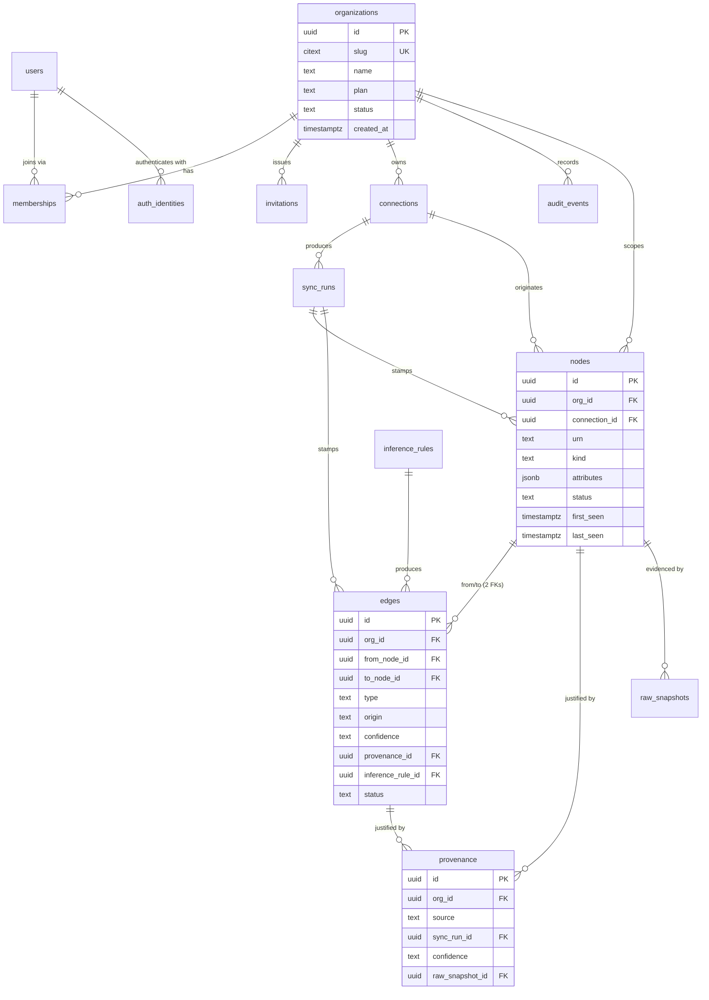
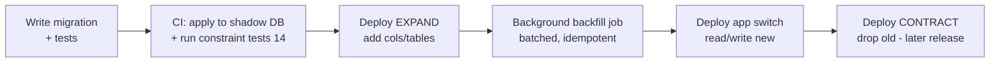

# 04 — Database Schema

> **Document status:** Authoritative · **Version:** 1.0 · **Last updated:** 2026-06-30
> **Owner:** Founding Principal Architect · **Audience:** Backend engineers, AI coding agents, DBA/SRE
> **Document type:** Physical Data Schema (PostgreSQL)
> **Depends on:** `00` (P1/P4/P6/P10, A4), `01` (NFR-1/3/12/20), `02` (DD-4 tenancy, DD-8 PG-as-graph, §7 data plane), `03` (every entity, business rule BR-x, identity §7, validation §8)
> **Consumed by:** `05` (graph traversal over these tables), `06`/`07` (writes), `08` (DTOs), `11` (projection), `13` (RLS/encryption), `17` (backups/migrations)

---

## Purpose

This document is the **physical realization of the domain model (`03`) in PostgreSQL**. It specifies every table, column, type, constraint, index, and foreign key; the migration strategy; normalization decisions; the multi-tenancy enforcement at the data layer; and — critically — *how the relational schema is deliberately graph-shaped so that a future migration to a dedicated graph database (`05` OQ4) is data movement, not a redesign* (NFR-20, `02` DD-8).

Every table here maps to a `03` entity; every `CHECK`/`UNIQUE`/`FK` enforces a `03` business rule (BR-x) or validation rule. The DDL is **canonical**: `06`/`07` write to exactly these structures, `08` derives DTOs from them, and `14` asserts the constraints.

## Scope

**In scope:** Complete DDL (DDL shown in PostgreSQL dialect), keys/indexes/constraints, tenancy enforcement (RLS), JSONB strategy, partitioning posture, migration strategy & tooling, normalization rationale, graph-DB migration mapping, ER diagrams, retention/soft-delete mechanics.

**Out of scope (pointers):** Graph *semantics*/traversal algorithms and inference rule logic → `05`; OpenSearch index mappings → `11`; secret *storage* internals → `13`; backup/restore ops and PITR runbook → `17`; provider-specific attribute mapping → `06`/`07`.

> **⚠️ DECISION UPDATE (2026-06-30): Postgres is hosted on Supabase; data access is plain `pg` (no ORM/query-builder).** This is **standard Postgres** — every table/constraint/index/RLS policy here is unchanged and portable. Notes from wiring it up (`@atlas/db`):
> - **(1) Two roles, by necessity.** Supabase's `postgres` role has **`BYPASSRLS`**, so the app must NOT connect as it (RLS would be skipped). The **app/workers connect as a dedicated non-bypass role `atlas_app`** and set `atlas.current_org` (RLS §10); **migrations connect as `postgres`** (owner, for DDL). `atlas_app` is created NOLOGIN by migration 0002; each environment grants it LOGIN + a password out-of-band (never a secret in code). We keep this GUC model, **not** Supabase's `auth.uid()` pattern. *(No `SET ROLE` — Supabase forbids granting role membership to `postgres`; the app simply connects as `atlas_app`.)*
> - **(2)** `users` mirrors Supabase `auth.users` (`users.id` = the Supabase auth uid), populated on signup — identity model (`03`) preserved while Supabase Auth owns the credential flow (`12`).
> - **(3)** Migrations run via our **own forward-only SQL runner** (`packages/db/src/migrate.ts`, simple-protocol `pg`) recorded in `schema_migrations` (§9). Connect via the Supabase **session pooler** (IPv4; the direct host is IPv6-only). Verified end-to-end against the live Supabase DB (RLS isolation 3/3).

## Assumptions

Inherits `00`/`01`/`02`/`03`. Schema-specific:
- **A16.** PostgreSQL **15+** (for `MERGE`, improved logical replication, `gen_random_uuid()` via `pgcrypto`/built-in). Aurora PostgreSQL-compatible acceptable (`02` §10).
- **A17.** Single logical database, **shared schema, `org_id` pool model** (`02` DD-4/§9.1); large tenants promotable later without app change.
- **A18.** MVP graph scale ≤ ~50k nodes/org, low-thousands of orgs (NFR-1, A11) — within a single well-indexed PostgreSQL instance with read replicas for scaling reads.

---

## 1. Schema Design Principles

These govern every table below; each traces to an upstream principle.

| # | Principle | Rationale (trace) |
|---|---|---|
| SP-1 | **`org_id` on every tenant-owned row**, FK to `organizations`, part of every index prefix | Tenant isolation in code + RLS (`02` DD-4, R8, BR-TENANT-1) |
| SP-2 | **UUID primary keys** (`gen_random_uuid()`), opaque, app-generable | `03` DD-3; safe to expose, no worker coordination |
| SP-3 | **Deterministic `urn` as a natural unique key** per org for nodes | Idempotent upsert (`03` A14/BR-NODE-2) |
| SP-4 | **Soft-delete + time-versioning** (`status`, `first_seen`, `last_seen`, `deleted_at`), never hard-delete on disappearance | "What changed" + provenance (`03` §5.3/A15, P4) |
| SP-5 | **Graph-shaped core**: explicit `nodes` + `edges` tables with typed, directed, provenance-bearing edges | Migration-ready graph (`02` DD-8, NFR-20) |
| SP-6 | **Normalize identity/relations; JSONB for source-shaped attributes** | Integrity where it matters, flexibility for provider variety (§4) |
| SP-7 | **Provenance is mandatory & FK-enforced** for edges; no un-sourced edges | P4, BR-EDGE-2/BR-PROV-1 |
| SP-8 | **Append-only** for `audit_events` and `raw_snapshots` (immutability) | BR-AUD-1/BR-SNAP-1 |
| SP-9 | **Every index is org-prefixed**; query plans always start from a tenant | NFR-1 latency + isolation |
| SP-10 | **`created_at`/`updated_at` (UTC, `timestamptz`)** everywhere; triggers maintain `updated_at` | auditability, consistency |

---

## 2. Schema Overview (physical ER)



**Table inventory (15 tables):**

| Domain (`03`) | Table | Notes |
|---|---|---|
| Organization | `organizations` | tenant root |
| User | `users`, `auth_identities` | global identity + auth methods (`12`) |
| Membership | `memberships` | user↔org+role |
| Invitation | `invitations` | pending grants |
| Connection | `connections` | source links (hinge) |
| SyncRun | `sync_runs` | crawl executions |
| Node | `nodes` | resources (graph nodes) |
| Edge | `edges` | relationships (graph edges) |
| Provenance | `provenance` | why/where/when (P4) |
| RawSnapshot | `raw_snapshots` | S3 pointers + hash |
| InferenceRule | `inference_rules` | rule registry |
| AuditEvent | `audit_events` | append-only log |
| (perf) | `node_closure` *(optional, §7.3)* | precomputed reachability for blast-radius |
| (ops) | `schema_migrations` | migration ledger (tooling, §9) |
| Phase-1 (`12` §7) | `org_domains` | domain claimed by org, `hd`-verified (auto-join) |
| Phase-1 (`12` §7) | `join_requests` | request-to-join workflow |

> **Phase-1 auth tables** (`org_domains`, `join_requests`) realize domain-based membership (`12` §7); designed now, built Phase-1. The `email_domain` column on `auth_identities` captures the Google `hd` from MVP so the data exists when the behavior ships.

> Embeddings live in OpenSearch (`11`), not PostgreSQL (`03` §4.7, BR-EMB-1); an optional `node_embeddings_meta` table is noted in §8 if we want PG-side management.

---

## 3. Conventions & Shared Building Blocks

```sql
-- Extensions (enabled once per database)
CREATE EXTENSION IF NOT EXISTS pgcrypto;   -- gen_random_uuid()
CREATE EXTENSION IF NOT EXISTS citext;      -- case-insensitive email/slug
CREATE EXTENSION IF NOT EXISTS btree_gin;   -- composite GIN where useful
-- pg_trgm enabled in 11-search-engine.md if we add trigram fallback search

-- updated_at trigger (applied to mutable tables)
CREATE OR REPLACE FUNCTION set_updated_at() RETURNS trigger AS $$
BEGIN NEW.updated_at = now(); RETURN NEW; END;
$$ LANGUAGE plpgsql;
```

**Conventions (also in `16`):**
- Table names: plural snake_case. Column names: snake_case. Enums implemented as `text` + `CHECK` (see DD-1).
- Timestamps: `timestamptz` in UTC. Money/plan: deferred to `18`.
- All tenant tables carry `org_id uuid NOT NULL`.
- Soft-delete: `status` column + nullable `deleted_at`; queries filter `status` (see SP-4).

> **DD-1 — `text` + `CHECK` constraints over native `ENUM` types.** **Why:** PostgreSQL native enums are painful to evolve (adding/reordering values requires `ALTER TYPE`, can't remove values, locks). `kind`/`type`/`status` vocabularies grow as providers are added (`03` §4.6, P5). `text` + a `CHECK (col IN (...))` (or a reference table for large vocabularies) evolves with a normal migration. **Alternative — native enum:** rejected for evolvability. **Alternative — no constraint:** rejected; we require controlled vocabularies (`03` DD-2). Large/growing vocabularies (`node.kind`) use a **reference table** (`node_kinds`) FK instead of inline CHECK; small fixed ones (`status`, `origin`) use inline CHECK.

---

## 4. Normalization & JSONB Strategy

> **DD-2 — Hybrid: 3NF for identity/relationships, JSONB for source-shaped attributes.** Atlas ingests wildly heterogeneous resources (a Lambda, an RDS, a repo) that cannot share a fixed column set, yet must enforce strict integrity on tenancy, identity, and relationships.

| Data | Modeling | Why |
|---|---|---|
| Org/user/membership/connection/edges/provenance | **Normalized (3NF)** columns + FKs | Integrity, joins, constraints, RLS (SP-1/SP-7) |
| Node `attributes` (provider-specific properties) | **JSONB** (normalized, meaning-bearing subset) | Heterogeneous shape; queried/filtered but not relationally constrained |
| Raw, verbatim source payload | **Not in PG** — S3 via `raw_snapshots` pointer | Keep PG lean (`02` §7); large/immutable (SP-8) |
| `config` on connections, `stats`/`scope_result` on sync_runs, `evidence`/`metadata` | **JSONB** | Provider-specific, schema-validated at app layer (`03` §8) |

**JSONB rules:**
- JSONB holds **normalized** attributes (provider→canonical mapping done by the connector, `06`/`07`), *not* raw API output (that's `raw_snapshots`).
- Frequently-filtered fields are either promoted to real columns (e.g. `region`, `tags`) or indexed via **GIN** (§6).
- We never put tenancy, identity, FKs, or anything a constraint must guard inside JSONB.

> **DD-3 — Promote hot attributes to columns; keep the long tail in JSONB.** Fields used in filtering/joins/inference (`region`, `account_id`, `tags`, `name`) are real, indexed columns on `nodes`; everything else stays in `attributes` JSONB. **Why:** balances query performance/indexability (NFR-1) against the impossibility of a universal columnar schema for all resource types (P10 pragmatism).

---

## 5. Table Definitions (DDL)

> DDL is canonical and ordered by dependency. Comments map columns to `03` attributes and BR-x rules. Indexes are collected in §6 for readability but are conceptually part of each table.

### 5.1 Platform: organizations, users, auth, memberships, invitations

```sql
-- ORGANIZATIONS — tenant root (03 §3.1)
CREATE TABLE organizations (
    id          uuid PRIMARY KEY DEFAULT gen_random_uuid(),
    slug        citext NOT NULL UNIQUE,                 -- 03 validation: ^[a-z0-9-]{3,40}$, immutable
    name        text   NOT NULL CHECK (char_length(name) BETWEEN 1 AND 100),
    plan        text   NOT NULL DEFAULT 'trial',        -- 18
    status      text   NOT NULL DEFAULT 'active'
                  CHECK (status IN ('active','suspended','deleting')),
    created_at  timestamptz NOT NULL DEFAULT now(),
    updated_at  timestamptz NOT NULL DEFAULT now(),
    deleted_at  timestamptz,
    CONSTRAINT slug_format CHECK (slug ~ '^[a-z0-9-]{3,40}$')
);
CREATE TRIGGER trg_org_updated BEFORE UPDATE ON organizations
    FOR EACH ROW EXECUTE FUNCTION set_updated_at();

-- USERS — global identity (03 §3.2), NOT org-scoped (BR-USER-1)
CREATE TABLE users (
    id          uuid PRIMARY KEY DEFAULT gen_random_uuid(),
    email       citext NOT NULL UNIQUE,                 -- normalized lowercase
    name        text,
    avatar_url  text,
    status      text NOT NULL DEFAULT 'active'
                  CHECK (status IN ('active','disabled')),
    created_at  timestamptz NOT NULL DEFAULT now(),
    updated_at  timestamptz NOT NULL DEFAULT now()
);
CREATE TRIGGER trg_users_updated BEFORE UPDATE ON users
    FOR EACH ROW EXECUTE FUNCTION set_updated_at();

-- AUTH_IDENTITIES — linked LOGIN methods (12); one user → many methods.
-- MVP: Google OAuth is the sole login method (12 DD-1). 'password' reserved for a
-- future secondary method (12 §13); GitHub is CONNECTOR auth (07), NOT a login identity.
CREATE TABLE auth_identities (
    id            uuid PRIMARY KEY DEFAULT gen_random_uuid(),
    user_id       uuid NOT NULL REFERENCES users(id) ON DELETE CASCADE,
    provider      text NOT NULL CHECK (provider IN ('google','password')),  -- 'google' = MVP
    provider_subject text,                              -- Google `sub` (stable id); NULL for password
    email_domain  text,                                 -- captured from Google `hd` (or email domain) — 12 §7 (Phase-1 use)
    password_hash text,                                 -- argon2id (13); NULL for OAuth; future use
    created_at    timestamptz NOT NULL DEFAULT now(),
    UNIQUE (provider, provider_subject),                -- one google identity per `sub`
    CHECK ( (provider='password' AND password_hash    IS NOT NULL)
         OR (provider='google'   AND provider_subject IS NOT NULL) )
);

-- MEMBERSHIPS — user↔org with role (03 §3.3); unit of authorization
CREATE TABLE memberships (
    id          uuid PRIMARY KEY DEFAULT gen_random_uuid(),
    org_id      uuid NOT NULL REFERENCES organizations(id) ON DELETE CASCADE,
    user_id     uuid NOT NULL REFERENCES users(id) ON DELETE CASCADE,
    role        text NOT NULL CHECK (role IN ('Owner','Admin','Member')),
    status      text NOT NULL DEFAULT 'active'
                  CHECK (status IN ('active','invited','revoked')),
    created_at  timestamptz NOT NULL DEFAULT now(),
    updated_at  timestamptz NOT NULL DEFAULT now(),
    UNIQUE (org_id, user_id)                            -- BR-MEM-1: one role per (user,org)
);
CREATE TRIGGER trg_mem_updated BEFORE UPDATE ON memberships
    FOR EACH ROW EXECUTE FUNCTION set_updated_at();
-- BR-ORG-1 (>=1 Owner) and BR-MEM-2 (no last-Owner removal) enforced in service layer
-- (deferrable cross-row invariants; see 12). A partial unique index guarantees Owner existence
-- cannot be cheaply expressed in DDL, so it is a tested service rule (14).

-- INVITATIONS — pending membership grants (03 §3.4)
CREATE TABLE invitations (
    id          uuid PRIMARY KEY DEFAULT gen_random_uuid(),
    org_id      uuid NOT NULL REFERENCES organizations(id) ON DELETE CASCADE,
    email       citext NOT NULL,
    role        text NOT NULL CHECK (role IN ('Admin','Member')),  -- cannot invite as Owner
    token_hash  text NOT NULL,                          -- store HASH only (13, BR-INV-1)
    status      text NOT NULL DEFAULT 'pending'
                  CHECK (status IN ('pending','accepted','expired','revoked')),
    invited_by  uuid REFERENCES users(id),
    created_at  timestamptz NOT NULL DEFAULT now(),
    expires_at  timestamptz NOT NULL,
    CHECK (expires_at > created_at)
);
-- Only one live invite per (org,email)
CREATE UNIQUE INDEX uq_invite_live ON invitations(org_id, email)
    WHERE status = 'pending';

-- ── PHASE-1 (12 §7): domain-based membership / auto-join ───────────────────────
-- Designed now, BUILT Phase-1 (12 A50/DD-4). Schema may ship early (cheap) so the
-- Google `hd` domain is captured from MVP; the auto-join/discovery BEHAVIOR is Phase-1.

-- ORG_DOMAINS — a domain claimed by an org, trust anchored on Google `hd` (12 DD-4)
CREATE TABLE org_domains (
    id          uuid PRIMARY KEY DEFAULT gen_random_uuid(),
    org_id      uuid NOT NULL REFERENCES organizations(id) ON DELETE CASCADE,
    domain      citext NOT NULL,                         -- e.g. 'acme.com' (never a free domain, 12 A51)
    verified    boolean NOT NULL DEFAULT false,          -- true when proven via a Google `hd` claim
    verified_via text CHECK (verified_via IN ('google_hd')),  -- extensible (future: 'dns_txt')
    is_primary  boolean NOT NULL DEFAULT false,          -- the auto-join target if multiple orgs share a domain
    join_policy text NOT NULL DEFAULT 'auto'             -- 12 §7.3 (chosen model: auto-join verified)
                  CHECK (join_policy IN ('auto','request','off')),
    created_at  timestamptz NOT NULL DEFAULT now(),
    UNIQUE (domain, org_id)
);
-- One primary org per domain (the canonical auto-join destination)
CREATE UNIQUE INDEX uq_domain_primary ON org_domains(domain) WHERE is_primary;

-- JOIN_REQUESTS — request-to-join when policy='request' or a non-primary same-domain org (12 §7.4)
CREATE TABLE join_requests (
    id          uuid PRIMARY KEY DEFAULT gen_random_uuid(),
    org_id      uuid NOT NULL REFERENCES organizations(id) ON DELETE CASCADE,
    user_id     uuid NOT NULL REFERENCES users(id) ON DELETE CASCADE,
    domain      citext NOT NULL,                         -- the verified `hd` domain that made them eligible
    status      text NOT NULL DEFAULT 'pending'
                  CHECK (status IN ('pending','approved','denied','expired')),
    decided_by  uuid REFERENCES users(id),               -- Admin+ who approved/denied
    created_at  timestamptz NOT NULL DEFAULT now(),
    decided_at  timestamptz,
    UNIQUE (org_id, user_id)                              -- one live request per (org,user)
);
-- memberships.status already includes 'requested' (03 §7.5 / 12 §7.5); an approved
-- join_request transitions the requested membership → 'active'.
```

### 5.2 Platform: connections & sync_runs

```sql
-- CONNECTIONS — source links; hinge between platform & knowledge models (03 §3.5)
CREATE TABLE connections (
    id            uuid PRIMARY KEY DEFAULT gen_random_uuid(),
    org_id        uuid NOT NULL REFERENCES organizations(id) ON DELETE CASCADE,
    provider      text NOT NULL CHECK (provider IN ('aws','github')),  -- extensible (P5/DD-1)
    display_name  text NOT NULL,
    status        text NOT NULL DEFAULT 'pending'
                    CHECK (status IN ('pending','verifying','connected',
                                      'degraded','error','disconnected')),  -- 03 §5.1
    config        jsonb NOT NULL DEFAULT '{}'::jsonb,   -- non-secret: roleArn, regions, repos, installation_id
    secret_ref    text,                                  -- pointer into Secrets Broker; NEVER the secret (BR-CONN-1)
    health        jsonb NOT NULL DEFAULT '{}'::jsonb,    -- missing-permission report, last check (FR-1.6/1.9)
    last_error    text,
    last_synced_at timestamptz,
    created_at    timestamptz NOT NULL DEFAULT now(),
    updated_at    timestamptz NOT NULL DEFAULT now(),
    deleted_at    timestamptz
);
CREATE TRIGGER trg_conn_updated BEFORE UPDATE ON connections
    FOR EACH ROW EXECUTE FUNCTION set_updated_at();

-- SYNC_RUNS — crawl executions; unit of freshness/history (03 §3.6)
CREATE TABLE sync_runs (
    id            uuid PRIMARY KEY DEFAULT gen_random_uuid(),
    org_id        uuid NOT NULL REFERENCES organizations(id) ON DELETE CASCADE,
    connection_id uuid NOT NULL REFERENCES connections(id) ON DELETE CASCADE,
    type          text NOT NULL CHECK (type IN ('full','incremental','webhook')),
    status        text NOT NULL DEFAULT 'queued'
                    CHECK (status IN ('queued','running','succeeded','partial','failed','cancelled')),
    trigger       text NOT NULL CHECK (trigger IN ('scheduled','manual','onboarding','webhook')),
    checkpoint    jsonb NOT NULL DEFAULT '{}'::jsonb,    -- resumability cursor (02 §5.3, P7)
    stats         jsonb NOT NULL DEFAULT '{}'::jsonb,    -- discovered/changed/deleted/errors/throttles (FR-2.8)
    scope_result  jsonb NOT NULL DEFAULT '{}'::jsonb,    -- per-region/per-repo freshness+failures (US-13)
    started_at    timestamptz,
    finished_at   timestamptz,
    created_at    timestamptz NOT NULL DEFAULT now()
);
-- BR-SYNC-1: at most one in-flight run per connection
CREATE UNIQUE INDEX uq_sync_inflight ON sync_runs(connection_id)
    WHERE status IN ('queued','running');
```

### 5.3 Knowledge: node_kinds, inference_rules, nodes

```sql
-- NODE_KINDS — controlled, namespaced vocabulary as a reference table (03 §4.6, DD-1)
CREATE TABLE node_kinds (
    kind        text PRIMARY KEY,                        -- e.g. 'aws.lambda.function','github.repository','atlas.service'
    provider    text NOT NULL,                           -- 'aws'|'github'|'atlas'
    category    text NOT NULL,                           -- 'compute'|'data'|'network'|'scm'|'derived'...
    description text NOT NULL,
    CHECK (kind ~ '^[a-z][a-z0-9_.]+$')
);

-- INFERENCE_RULES — versioned rule registry (03 §4.5); edges reference these
CREATE TABLE inference_rules (
    id             uuid PRIMARY KEY DEFAULT gen_random_uuid(),
    key            text NOT NULL,                         -- stable rule key, e.g. 'sg_ingress_connects'
    version        int  NOT NULL DEFAULT 1,
    name           text NOT NULL,
    description    text NOT NULL,                         -- explainable (P9)
    produces_type  text NOT NULL,                         -- edge type it emits
    confidence_tier text NOT NULL
                     CHECK (confidence_tier IN ('inferred-high','inferred-low')),
    enabled        boolean NOT NULL DEFAULT true,
    created_at     timestamptz NOT NULL DEFAULT now(),
    UNIQUE (key, version)                                 -- BR-RULE-2 reproducibility
);

-- NODES — resources / graph nodes (03 §4.1). The heart of the graph.
CREATE TABLE nodes (
    id            uuid PRIMARY KEY DEFAULT gen_random_uuid(),
    org_id        uuid NOT NULL REFERENCES organizations(id) ON DELETE CASCADE,         -- SP-1
    connection_id uuid NOT NULL REFERENCES connections(id) ON DELETE CASCADE,           -- BR-NODE-1
    urn           text NOT NULL,                          -- deterministic identity (03 §7, SP-3)
    kind          text NOT NULL REFERENCES node_kinds(kind),                            -- 03 DD-2
    name          text,
    -- promoted hot columns (DD-3) for filtering/inference/search:
    provider      text NOT NULL,                          -- denormalized from connection for index locality
    region        text,                                   -- AWS region; NULL for global/github
    account_ref   text,                                   -- AWS account id / github owner
    tags          jsonb NOT NULL DEFAULT '{}'::jsonb,     -- source tags/labels
    attributes    jsonb NOT NULL DEFAULT '{}'::jsonb,     -- normalized provider attributes (DD-2)
    status        text NOT NULL DEFAULT 'active'
                    CHECK (status IN ('active','stale','deleted')),                     -- 03 §5.3
    confidence    text NOT NULL DEFAULT 'observed'
                    CHECK (confidence IN ('observed','inferred-high','inferred-low')),  -- derived nodes (P3)
    first_seen    timestamptz NOT NULL DEFAULT now(),
    last_seen     timestamptz NOT NULL DEFAULT now(),
    last_sync_run_id uuid REFERENCES sync_runs(id),       -- BR-SYNC-3
    deleted_at    timestamptz,
    created_at    timestamptz NOT NULL DEFAULT now(),
    updated_at    timestamptz NOT NULL DEFAULT now(),
    CONSTRAINT uq_node_urn UNIQUE (org_id, urn)           -- BR-NODE-2 (upsert key, A14)
);
CREATE TRIGGER trg_nodes_updated BEFORE UPDATE ON nodes
    FOR EACH ROW EXECUTE FUNCTION set_updated_at();
```

### 5.4 Knowledge: provenance, raw_snapshots, edges

```sql
-- RAW_SNAPSHOTS — S3 pointers to verbatim payloads (03 §4.4); append-only (SP-8/BR-SNAP-1)
CREATE TABLE raw_snapshots (
    id           uuid PRIMARY KEY DEFAULT gen_random_uuid(),
    org_id       uuid NOT NULL REFERENCES organizations(id) ON DELETE CASCADE,
    node_id      uuid REFERENCES nodes(id) ON DELETE SET NULL,  -- what it evidences (nullable: edge-only evidence)
    storage_ref  text NOT NULL,                           -- S3 key (02 §7)
    content_hash text NOT NULL,                           -- dedupe + change detection
    sync_run_id  uuid REFERENCES sync_runs(id),
    captured_at  timestamptz NOT NULL DEFAULT now()
    -- no updated_at: immutable
);

-- PROVENANCE — why/where/when for nodes & edges (03 §4.3); the trust spine (P4)
CREATE TABLE provenance (
    id              uuid PRIMARY KEY DEFAULT gen_random_uuid(),
    org_id          uuid NOT NULL REFERENCES organizations(id) ON DELETE CASCADE,
    source          text NOT NULL,                        -- resolvable: ARN, repo path, PR url, API call (BR-PROV-1)
    sync_run_id     uuid REFERENCES sync_runs(id),
    observed_at     timestamptz NOT NULL DEFAULT now(),
    confidence      text NOT NULL DEFAULT 'observed'
                      CHECK (confidence IN ('observed','inferred-high','inferred-low')),
    inference_rule_id uuid REFERENCES inference_rules(id),-- set when inferred (BR-EDGE-3)
    evidence        jsonb NOT NULL DEFAULT '{}'::jsonb,   -- signal refs that justify it
    raw_snapshot_id uuid REFERENCES raw_snapshots(id)     -- click-through to raw (P4)
);

-- EDGES — typed, directed, provenance-bearing relationships (03 §4.2); makes it a graph
CREATE TABLE edges (
    id              uuid PRIMARY KEY DEFAULT gen_random_uuid(),
    org_id          uuid NOT NULL REFERENCES organizations(id) ON DELETE CASCADE,       -- SP-1
    from_node_id    uuid NOT NULL REFERENCES nodes(id) ON DELETE CASCADE,
    to_node_id      uuid NOT NULL REFERENCES nodes(id) ON DELETE CASCADE,
    type            text NOT NULL,                         -- controlled edge vocabulary (05)
    origin          text NOT NULL CHECK (origin IN ('observed','inferred')),
    confidence      text NOT NULL
                      CHECK (confidence IN ('observed','inferred-high','inferred-low')),
    provenance_id   uuid NOT NULL REFERENCES provenance(id),  -- SP-7: NO un-sourced edges (BR-EDGE-2)
    inference_rule_id uuid REFERENCES inference_rules(id),    -- BR-EDGE-3
    status          text NOT NULL DEFAULT 'active'
                      CHECK (status IN ('active','retired')),
    first_seen      timestamptz NOT NULL DEFAULT now(),
    last_seen       timestamptz NOT NULL DEFAULT now(),
    last_sync_run_id uuid REFERENCES sync_runs(id),
    retired_at      timestamptz,
    created_at      timestamptz NOT NULL DEFAULT now(),
    updated_at      timestamptz NOT NULL DEFAULT now(),
    -- BR-EDGE-1: no self-loop unless intentional; same-org enforced via app + (org_id,node) indexes
    CONSTRAINT no_self_edge CHECK (from_node_id <> to_node_id),
    -- consistency: inferred edges MUST name a rule (BR-EDGE-3)
    CONSTRAINT inferred_needs_rule CHECK (
        origin <> 'inferred' OR inference_rule_id IS NOT NULL),
    CONSTRAINT observed_is_observed_conf CHECK (
        origin <> 'observed' OR confidence = 'observed'),
    -- edge identity for dedupe/reconcile (03 §7): one edge of a type between two nodes per rule.
    -- NULLS NOT DISTINCT (PG15+) so OBSERVED edges (inference_rule_id NULL) also dedupe by
    -- (org, from, to, type) — without it, NULL rule_ids would be treated as distinct and
    -- observed edges could duplicate across syncs (added F2.3).
    CONSTRAINT uq_edge UNIQUE NULLS NOT DISTINCT (org_id, from_node_id, to_node_id, type, inference_rule_id)
);
CREATE TRIGGER trg_edges_updated BEFORE UPDATE ON edges
    FOR EACH ROW EXECUTE FUNCTION set_updated_at();
```

> **Same-org endpoint enforcement (BR-EDGE-1):** PostgreSQL FKs cannot reference a composite that guarantees `from_node.org_id = edges.org_id = to_node.org_id` without composite FKs. We enforce this with **composite foreign keys** by adding `UNIQUE (id, org_id)` on `nodes` and pointing edges at `(from_node_id, org_id)` / `(to_node_id, org_id)`:

```sql
ALTER TABLE nodes ADD CONSTRAINT uq_node_id_org UNIQUE (id, org_id);
ALTER TABLE edges
  ADD CONSTRAINT fk_edge_from FOREIGN KEY (from_node_id, org_id)
      REFERENCES nodes(id, org_id) ON DELETE CASCADE,
  ADD CONSTRAINT fk_edge_to   FOREIGN KEY (to_node_id, org_id)
      REFERENCES nodes(id, org_id) ON DELETE CASCADE;
-- This makes cross-tenant edges structurally impossible (BR-EDGE-1/BR-TENANT-1, R8).
```

### 5.5 Platform: audit_events (append-only)

```sql
-- AUDIT_EVENTS — immutable security log (03 §3.7, NFR-13); append-only (BR-AUD-1)
CREATE TABLE audit_events (
    id          uuid PRIMARY KEY DEFAULT gen_random_uuid(),
    org_id      uuid NOT NULL REFERENCES organizations(id) ON DELETE CASCADE,
    actor_type  text NOT NULL CHECK (actor_type IN ('user','system','connector')),
    actor_id    uuid,                                     -- user id when actor_type='user'
    action      text NOT NULL,                            -- enum maintained in 13
    target_type text,
    target_id   text,                                     -- text: may reference external urn
    metadata    jsonb NOT NULL DEFAULT '{}'::jsonb,       -- no secrets/PII beyond need (NFR-15)
    request_id  text,                                     -- correlation (02 §9.4)
    occurred_at timestamptz NOT NULL DEFAULT now()
);
-- Append-only enforced via DB role grants (no UPDATE/DELETE) + trigger guard (13).
REVOKE UPDATE, DELETE ON audit_events FROM atlas_app;     -- see 13 for role model
```

---

## 6. Indexing Strategy

> Every index is **org-prefixed** (SP-9). Targets NFR-1 (graph p95 < 1.5s) and the dominant query shapes from `01`/`05`.

```sql
-- Tenancy / lookup
CREATE INDEX ix_memberships_user        ON memberships(user_id);
CREATE INDEX ix_connections_org         ON connections(org_id) WHERE deleted_at IS NULL;
CREATE INDEX ix_sync_runs_conn_created  ON sync_runs(connection_id, created_at DESC);

-- NODES: the hot path
CREATE INDEX ix_nodes_org_kind          ON nodes(org_id, kind) WHERE status <> 'deleted';
CREATE INDEX ix_nodes_org_status_seen   ON nodes(org_id, status, last_seen DESC);   -- "what changed"
CREATE INDEX ix_nodes_org_region        ON nodes(org_id, region);
CREATE INDEX ix_nodes_org_conn          ON nodes(org_id, connection_id);
-- JSONB filtering on tags/attributes (DD-3 long tail):
CREATE INDEX ix_nodes_tags_gin          ON nodes USING gin (tags jsonb_path_ops);
CREATE INDEX ix_nodes_attrs_gin         ON nodes USING gin (attributes jsonb_path_ops);
-- name search fallback (trigram; see 11):
CREATE INDEX ix_nodes_name_trgm         ON nodes USING gin (name gin_trgm_ops);

-- EDGES: traversal in both directions (blast radius + dependents) — the graph workload
CREATE INDEX ix_edges_from   ON edges(org_id, from_node_id, type) WHERE status = 'active';
CREATE INDEX ix_edges_to     ON edges(org_id, to_node_id,   type) WHERE status = 'active';
CREATE INDEX ix_edges_type   ON edges(org_id, type)              WHERE status = 'active';
CREATE INDEX ix_edges_rule   ON edges(inference_rule_id);

-- PROVENANCE / SNAPSHOTS
CREATE INDEX ix_prov_org           ON provenance(org_id);
CREATE INDEX ix_snapshots_node     ON raw_snapshots(org_id, node_id);
CREATE INDEX ix_snapshots_hash     ON raw_snapshots(org_id, content_hash);  -- dedupe

-- AUDIT
CREATE INDEX ix_audit_org_time     ON audit_events(org_id, occurred_at DESC);
CREATE INDEX ix_audit_org_action   ON audit_events(org_id, action, occurred_at DESC);
```

**Why these specifically:**
- **Bidirectional edge indexes** (`ix_edges_from` / `ix_edges_to`) are *the* enabler of fast graph traversal in both directions — outbound (dependencies) and inbound (dependents/blast-radius) — within NFR-1. This is the relational stand-in for a graph DB's adjacency lists (§7, `02` DD-8).
- **Partial indexes** (`WHERE status='active'` / `<> 'deleted'`) keep the hot working set small as soft-deleted history accumulates (SP-4).
- **GIN on JSONB** supports inference/search filters on the attribute long tail (DD-3) without a column per provider field.

---

## 7. Graph Workload & Future Graph-DB Compatibility

This section makes good on `02` DD-8 / NFR-20: *the relational schema is a graph that can migrate.*

### 7.1 Traversal in PostgreSQL (MVP)
Blast-radius / dependents are **bounded-depth recursive traversals** over `edges`, expressed with recursive CTEs and served by the bidirectional indexes (§6). Full algorithms and query templates live in `05`; the schema *guarantees* they're efficient via the edge indexes and the `(org_id, from/to, type)` prefix.

```sql
-- Illustrative: outbound dependency closure from a node, bounded depth (full version in 05)
WITH RECURSIVE reach AS (
  SELECT e.to_node_id AS node_id, 1 AS depth
  FROM edges e
  WHERE e.org_id = $1 AND e.from_node_id = $2
    AND e.status='active' AND e.type = ANY($3)         -- relevant edge types
  UNION ALL
  SELECT e.to_node_id, r.depth + 1
  FROM edges e JOIN reach r ON e.from_node_id = r.node_id
  WHERE e.org_id = $1 AND e.status='active'
    AND e.type = ANY($3) AND r.depth < $4              -- depth bound (avoids cycles blowup)
)
SELECT DISTINCT node_id, min(depth) FROM reach GROUP BY node_id;
```

### 7.2 The migration mapping (PostgreSQL → property graph)
The schema maps 1:1 onto a labeled property graph, so a future Neo4j/managed-graph migration is **mechanical ETL**, not redesign:

| PostgreSQL | Property graph | Notes |
|---|---|---|
| `nodes` row | Vertex with label = `kind` | `attributes`/`tags` → vertex properties |
| `edges` row | Relationship with type = `type` | `confidence`/`origin`/provenance → rel properties |
| `provenance`/`raw_snapshots` | Rel/vertex properties or sidecar | provenance stays queryable |
| `org_id` | Per-tenant subgraph / database / property | tenancy preserved |
| recursive CTE | native variable-length traversal | the query gets *simpler*, not harder |

> **DD-4 — Defer the graph DB; keep the door open.** The migration trigger is **measured, not guessed**: when (a) p95 traversal breaches NFR-1 at the 95th-percentile org graph size despite indexing/closure tables, or (b) traversal depth needs routinely exceed ~5–6 hops, or (c) per-org graphs exceed the volume where recursive CTEs stay sub-second. These thresholds are tracked via the graph-quality telemetry (`02` §9.4 / `01` NFR-17) and revisited in `05`/`17` (`00` OQ4). Until then, PostgreSQL wins on operational simplicity and one-store consistency (P6/P10).

### 7.3 Optional precomputed closure (escape hatch, not MVP-default)
If blast-radius latency on deep/hot subgraphs approaches NFR-1 limits before a graph-DB migration is warranted, we introduce a maintained `node_closure(org_id, ancestor_id, descendant_id, depth, edge_types[])` table, refreshed during the inference stage (`02` §5.2). It trades write cost/storage for O(1) reachability reads. **Kept as a documented escape hatch (DD-5)** — not built until telemetry shows recursive CTEs missing the target (avoid premature optimization, P10).

---

## 8. Embeddings & Search Projection (pointer)

Vectors and search documents live in **OpenSearch** (`11`), keyed by `node_id`+`org_id`, rebuildable from `nodes` (BR-EMB-1, `02` §7 invariant). If we later want PG-side lifecycle management of embeddings (e.g. which model version embedded which node), we add a thin `node_embeddings_meta(node_id, org_id, model, generated_at, doc_ref)` table — **metadata only, no vectors** (decision deferred to `11` / `02` OQ-ARCH-2). The schema here does not depend on that choice.

---

## 9. Migration Strategy

> **DD-6 — Versioned, forward-only, expand/contract migrations.** Tooling: a TypeScript-native migration runner integrated with the NestJS app (the codebase is TS end-to-end, `02`). Each migration is an ordered, idempotent, reversible-where-safe SQL change recorded in `schema_migrations`.

```sql
CREATE TABLE schema_migrations (
    version     bigint PRIMARY KEY,        -- timestamp-ordered
    name        text NOT NULL,
    checksum    text NOT NULL,             -- detects edited-after-apply
    applied_at  timestamptz NOT NULL DEFAULT now()
);
```

**Principles:**
- **Expand/contract (parallel-change) for zero-downtime** (matches stateless autoscaled deploys, `02` §10): add new columns/tables (expand) → backfill → switch app reads/writes → remove old (contract) in a later release. Never a breaking change in one step.
- **Backfills run as background jobs** (worker plane) for large tables (`nodes`/`edges`), batched and idempotent (P7) — never a giant blocking `UPDATE`.
- **Additive-first for vocabularies:** adding a `node_kind`/edge `type`/rule is a data insert, not a schema change (DD-1 pays off here — P5).
- **Migrations are reviewed like code** (`16`) and run in CI against a production-shaped fixture (`14`) before prod.
- **No destructive migration without a backup checkpoint** (`17` PITR) and a contract-phase delay.



---

## 10. Multi-Tenancy Enforcement at the Data Layer (`02` DD-4, R8)

Defense-in-depth, three layers:

1. **Application layer (primary):** base repository injects `org_id` into every query; no graph read method exists without it (`02` §3.3). Verified by US-12 test.
2. **Schema layer:** composite FKs make cross-tenant edges impossible (§5.4); every tenant table has `org_id NOT NULL`.
3. **Database layer (backstop):** PostgreSQL **Row-Level Security** on tenant tables, keyed off a session GUC the app sets per request/job.

```sql
-- RLS backstop (13 details the role/GUC model)
ALTER TABLE nodes ENABLE ROW LEVEL SECURITY;
CREATE POLICY tenant_isolation_nodes ON nodes
    USING (org_id = NULLIF(current_setting('atlas.current_org', true), '')::uuid);
-- ...applied identically to edges, provenance, sync_runs, connections, audit_events, raw_snapshots.
-- The app sets: SET LOCAL atlas.current_org = '<org-uuid>'; at request/job start (12/13).
--
-- WHY NULLIF(..., '') and not just ::uuid (verified against Postgres, F1.4):
-- a custom GUC set via SET LOCAL in one transaction RESETS TO '' (empty string,
-- not NULL) for the next transaction on a POOLED connection. A bare ''::uuid
-- throws "invalid input syntax for type uuid". NULLIF maps both unset (NULL) and
-- reset ('') to NULL → org_id = NULL matches nothing → fail-closed, no error.
```

> **DD-7 — RLS as a backstop, not the primary mechanism.** App-layer scoping is the fast, testable primary; RLS guarantees that *any* future missing `WHERE org_id=` still cannot leak data. A leak requires both layers to fail simultaneously (R8 is existential — this redundancy is justified).

---

## 11. Retention, Soft-Delete & History Mechanics (SP-4, `03` §5.3)

| Data | Soft-delete state | Hard-purge policy | Where set |
|---|---|---|---|
| `nodes` | `active`→`stale`→`deleted` (`deleted_at`) | purge `deleted` after retention window | `13`/`17` |
| `edges` | `active`→`retired` (`retired_at`) | purge `retired` after window | `13` |
| `raw_snapshots` | immutable | purge by age/size policy (NFR-15) | `13` |
| `audit_events` | immutable | long retention (compliance) | `13` |
| `sync_runs` | terminal states retained | roll up/aggregate old runs | `17` |
| `organizations` (deletion) | `deleting` → grace → cascade purge | data-handling policy | `13` |

**Reconciliation writes** (the `stale`/`deleted`/`retired` transitions) happen only in the reconcile stage (`02` §5.2) and only for **scopes that were actually scanned** in a `succeeded` run (BR-SYNC-2) — a `partial` run never delete-marks unscanned scope (prevents false deletions, US-13).

---

## 12. Design Decisions Recap

| ID | Decision | Why |
|---|---|---|
| DD-1 | `text`+`CHECK`/reference tables over native enums | Evolvable vocabularies as providers grow (P5) |
| DD-2 | 3NF for identity/relations + JSONB for attributes | Integrity where needed, flexibility for heterogeneity (P10) |
| DD-3 | Promote hot attributes to indexed columns | Query perf without universal columnar schema (NFR-1) |
| DD-4 | Defer graph DB; relational schema is graph-shaped & maps 1:1 | Operational simplicity now, mechanical migration later (`02` DD-8, NFR-20) |
| DD-5 | Precomputed `node_closure` kept as escape hatch | Avoid premature optimization; ready if NFR-1 pressed (P10) |
| DD-6 | Forward-only expand/contract migrations + background backfills | Zero-downtime with stateless autoscaled deploys (P7) |
| DD-7 | RLS as backstop beneath app-layer scoping | Defense-in-depth for existential tenancy risk (R8) |
| (impl) | Composite FKs make cross-tenant edges impossible | Structural isolation (BR-EDGE-1/BR-TENANT-1) |

## 13. Risks

| ID | Risk | Mitigation |
|---|---|---|
| SR-1 | Recursive-CTE traversal degrades on deep/large graphs | Bidirectional indexes (§6); `node_closure` escape hatch (§7.3); graph-DB trigger criteria (DD-4) |
| SR-2 | Soft-deleted rows bloat tables / slow scans | Partial indexes on `active`; retention purge (§11); table partitioning by `org_id`/time if needed (§14) |
| SR-3 | JSONB misuse (querying unindexed deep paths) | DD-3 promotes hot fields; GIN indexes; code review (`16`) |
| SR-4 | RLS GUC not set on a code path → over-broad query | App-layer scoping primary; integration test asserts RLS denies w/o GUC (`14`) |
| SR-5 | Edge `uq_edge` allows NULL `inference_rule_id` duplicates | Observed edges (rule NULL) deduped by app on `(from,to,type)`; partial unique index for observed edges added if needed |
| SR-6 | Large monorepo / huge account inflates `nodes`/`edges` | S3-offloaded raw payloads; pagination at crawl (`06`/`07`); per-org metrics + caps |
| SR-7 | Migration backfill on huge tables locks/slows prod | Batched background backfills, expand/contract (DD-6) |

## 14. Edge Cases & Operational Notes

- **NULL `inference_rule_id` in `uq_edge`:** PostgreSQL treats NULLs as distinct in unique constraints. For **observed** edges (rule = NULL) we add a dedicated partial unique index `UNIQUE (org_id, from_node_id, to_node_id, type) WHERE inference_rule_id IS NULL` to prevent duplicate observed edges (SR-5).
- **Self-edges:** disallowed by default (`no_self_edge`); if a future edge type legitimately needs self-reference, it's whitelisted explicitly (revisit in `05`).
- **Partitioning posture (future, not MVP):** if `nodes`/`edges`/`audit_events` grow large, partition by `org_id` (hash) or by time (`audit_events`, `sync_runs`). Schema is partition-ready (org-prefixed keys); deferred until volume warrants (P6/A18).
- **Read replicas:** exploration/search/AI reads can target replicas; writes (crawl/reconcile) hit primary. Repository layer routes reads vs. writes (`02` §3.4).
- **`citext` for email/slug:** ensures case-insensitive uniqueness without app normalization bugs.
- **Cascade deletes:** Org deletion cascades through the whole tree; for large orgs, cascade is executed as a batched background purge (§11), not a single statement (SR-7).

## 15. Open Questions

- **OQ-DB-1** Numeric confidence score vs. discrete tiers (shared `00` OQ2 / `03` OQ-DOM-2): schema currently stores tiers as `text`; if numeric scoring is chosen in `05`, add `confidence_score numeric` alongside the tier. **Field reserved.**
- **OQ-DB-2** Whether `node_closure` ships in MVP or stays an escape hatch (§7.3) — gated on load tests (`14`).
- **OQ-DB-3** Embedding metadata in PG vs. OpenSearch-only (§8, `02` OQ-ARCH-2) — decided in `11`.
- **OQ-DB-4** Exact retention windows for `stale→deleted`, `retired`, raw snapshots (`03` OQ-DOM-4) — set in `13`.
- **OQ-DB-5** When to introduce table partitioning (§14) — gated on `nodes`/`audit_events` growth metrics (`17`).

## 16. References

- **Upstream:** `00` (A4, P4/P6/P10), `01` (NFR-1/3/12/17/20), `02` (DD-4/DD-8, §7 data plane, §9.1 tenancy, §5 worker writes), `03` (entities §3–4, BR-x §6, identity §7, validation §8, lifecycles §5).
- **Downstream:** `05` (traversal/inference over `nodes`/`edges`, edge type catalog, URN grammar, graph-DB trigger), `06`/`07` (connectors write via upsert on `uq_node_urn`), `08` (DTOs + validation map to columns), `11` (OpenSearch projection from `nodes`), `12` (auth tables, RLS GUC), `13` (DB roles, RLS policy detail, retention/encryption), `14` (constraint & cross-tenant tests), `17` (PITR backups, migration ops, partitioning).

---

### Change log
| Version | Date | Author | Change |
|---|---|---|---|
| 1.0 | 2026-06-30 | Founding Principal Architect | Initial authoritative PostgreSQL schema from `00`–`03` v1.0 |
