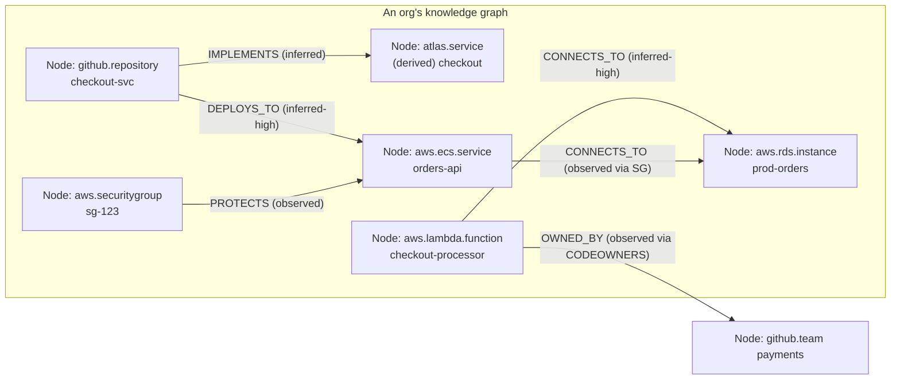
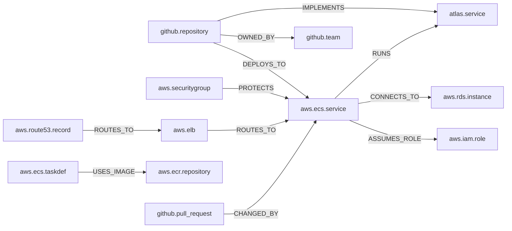
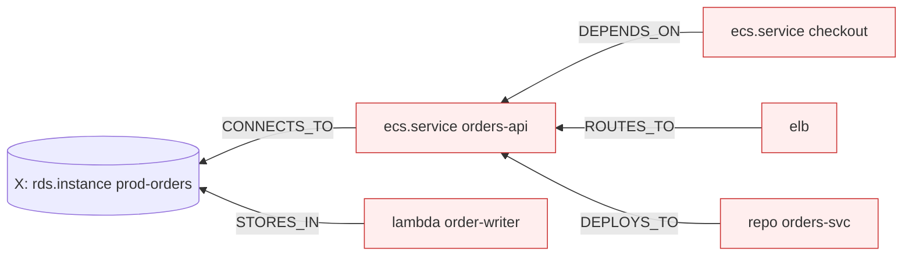
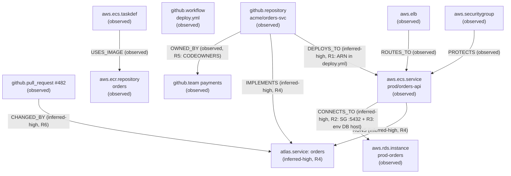

# 05 — Knowledge Graph

> **Document status:** Authoritative · **Version:** 1.0 · **Last updated:** 2026-06-30
> **Owner:** Founding Principal Architect · **Audience:** Engineers, AI coding agents, QA
> **Document type:** Knowledge Graph Design (semantics, inference, traversal)
> **Depends on:** `00` (P1/P3/P4/P9, G1/G2/G3), `01` (FR-4.x, US-4/7/8/9), `02` (Graph Core, Inference module, §5.2 pipeline), `03` (Node/Edge/Provenance/InferenceRule, URN §7, BR-x), `04` (`nodes`/`edges`/`provenance` tables, traversal §7, confidence field)
> **Consumed by:** `06`/`07` (emit nodes/signals/observed-edges), `10` (AI retrieval & citations over the graph), `11` (search projection), `14` (graph validation tests)

---

## Purpose

This is the document that defines **the product** (`00` P1: *the graph is the product*). Where `03` defined Node/Edge/Provenance as *entities* and `04` defined their *storage*, this document defines their **meaning and behavior**:

- The **complete catalog of edge types** (the relationship vocabulary) and node kinds.
- The **URN grammar** that gives every node a deterministic, cross-provider identity.
- The **inference engine**: how Atlas derives relationships that exist in *no single API* — with deterministic, explainable, confidence-scored rules (P3/P9).
- The **traversal patterns** that answer the canonical questions (blast radius, dependents, repo→service).
- The **query strategy** on PostgreSQL today and the **migration design** to a property-graph DB tomorrow.

If `04` is "the graph can be stored," this is "the graph means something and can be reasoned over." Everything an engineer or the AI Engine (`10`) asks ultimately resolves to a traversal defined here.

## Scope

**In scope:** Node-kind taxonomy, edge-type catalog with directionality/semantics, URN grammar & rules, observed-vs-inferred model, inference rule specification + worked examples, confidence model, reconciliation/convergence semantics, traversal patterns & query templates, performance strategy, graph-DB migration design, validation.

**Out of scope (pointers):** Physical DDL/indexes → `04`; how connectors *produce* signals → `06`/`07`; how the AI *uses* traversals & renders citations → `10`; search ranking → `11`; rule unit-testing harness → `14`.

## Assumptions

Inherits `00`–`04`. Graph-specific:
- **A19.** Inference is **deterministic and pure** w.r.t. its inputs (`03` BR-RULE-1): re-running rules on the same node/signal set yields the identical active-edge set (enables convergent reconciliation, FR-4.6).
- **A20.** Confidence is expressed as **discrete tiers** (`observed` > `inferred-high` > `inferred-low`), not an opaque numeric score (decision DD-3 below; resolves `04` OQ-DB-1 / `03` OQ-DOM-2).
- **A21.** Traversals are **bounded-depth** by default (`04` §7.1) — unbounded graph walks are never issued against a tenant graph (perf + cycle safety, NFR-1).

---

## 1. The Graph Model (recap & framing)



**Three structural facts (from `03`/`04`):**
1. A graph is **per-org** (tenant-isolated, A13 / `04` composite FKs). There is no global graph.
2. Every node has a **deterministic URN** (§2) and a **controlled `kind`** (§3); every edge a **controlled `type`** (§4).
3. Every edge is either **`observed`** (read directly from a source API) or **`inferred`** (derived by a rule), and **always carries provenance** (P4, BR-EDGE-2).

> **The core value proposition lives in inference.** Observed edges alone (what one API directly tells us) are table-stakes. The questions in `00` ("what breaks if…", "which repo deploys to…", "what depends on this RDS") require relationships that **span sources and exist in no single API response**. Inference (§6) is where Atlas earns its keep — and why P3 (prefer a missing edge to a wrong edge) and P9 (explainable) are non-negotiable.

---

## 2. URN Grammar (deterministic identity)

> Realizes `03` §7 / DD-3. The URN is the cross-provider, recomputable identity that makes upsert idempotent (`04` `uq_node_urn`) and provenance human-readable (P4).

### 2.1 Grammar
```
urn            := provider ":" scope ":" type ":" natural-key
provider       := "aws" | "github" | "atlas"
scope          := provider-defined location (region/account, owner, or org-derived)
type           := short kind discriminator (lambda, rds, repository, service, ...)
natural-key    := stable identifier within scope+type
```
All segments are lowercased except case-significant natural keys (e.g. GitHub repo names); `:` separates segments, `/` allowed inside a segment (e.g. `owner/repo`).

### 2.2 Per-provider URN schemes (owned by connectors `06`/`07`, grammar owned here)

| Resource | URN pattern | Example |
|---|---|---|
| AWS Lambda | `aws:<region>:<account>:lambda:<name>` | `aws:us-east-1:123456789012:lambda:checkout-processor` |
| AWS RDS instance | `aws:<region>:<account>:rds:<db-identifier>` | `aws:us-east-1:123456789012:rds:prod-orders` |
| AWS ECS service | `aws:<region>:<account>:ecs-service:<cluster>/<service>` | `aws:us-east-1:123456789012:ecs-service:prod/orders-api` |
| AWS Security Group | `aws:<region>:<account>:sg:<sg-id>` | `aws:us-east-1:123456789012:sg:sg-0abc123` |
| AWS S3 bucket | `aws:global:<account>:s3:<bucket>` | `aws:global:123456789012:s3:acme-prod-assets` |
| GitHub repo | `github:<owner>/<repo>` | `github:acme/checkout-svc` |
| GitHub PR | `github:<owner>/<repo>:pr:<number>` | `github:acme/checkout-svc:pr:482` |
| GitHub team | `github:<owner>:team:<slug>` | `github:acme:team:payments` |
| Derived logical Service | `atlas:<org-slug>:service:<derived-key>` | `atlas:acme:service:checkout` |

### 2.3 URN rules
- **Deterministic & recomputable** every sync from source identifiers (A14) — never random, never time-dependent.
- **Stable across attribute changes:** renaming a tag, changing memory size, etc. does **not** change the URN (same resource). A different *natural key* (e.g. renamed Lambda) is a *different* resource — old goes `stale`/`deleted`, new appears (`03` §5.3). This is correct: AWS treats a renamed function as a new function.
- **Account/region in scope** so Phase-1 multi-account doesn't collide identities (`03` EC-12 edge case).
- **Fallback:** if a resource lacks a stable natural key, use its provider ARN/global id as `natural-key` (DR-1 mitigation). Connectors document any fallback.

---

## 3. Node Kind Taxonomy

> `kind` values are rows in `node_kinds` (`04` §5.3), namespaced by provider (`03` DD-2 / P5). This is the MVP catalog; adding kinds is additive (a data insert, `04` DD-1).

### 3.1 AWS node kinds (MVP — aligned to `00` §5.1 / `06`)
| Category | `kind` |
|---|---|
| Compute | `aws.ec2.instance`, `aws.lambda.function`, `aws.ecs.cluster`, `aws.ecs.service`, `aws.ecs.taskdef`, `aws.ecr.repository` |
| Networking | `aws.vpc`, `aws.subnet`, `aws.securitygroup`, `aws.elb` (alb/nlb), `aws.route53.record`, `aws.apigateway` |
| Data | `aws.rds.instance`, `aws.dynamodb.table`, `aws.s3.bucket`, `aws.elasticache.cluster` |
| Identity (edges only) | `aws.iam.role`, `aws.iam.policy` |

### 3.2 GitHub node kinds (MVP — `07`)
`github.repository`, `github.pull_request`, `github.workflow`, `github.team`, `github.user` (author/owner refs).

### 3.3 Derived (Atlas-synthesized) node kinds
`atlas.service` — a **logical service** abstraction that unifies "the repo that builds it" + "the runtime that runs it" (resolves `03` OQ-DOM-1).

> **DD-1 — `atlas.service` is a first-class but minimal derived node in MVP.** **Why:** US-7 ("explain our architecture") and US-8 ("which repo deploys to this service") read naturally only if "service" is a real node that a repo *implements* and an ECS service/Lambda *runs*. Without it, "service" is ambiguous (is it the repo? the ECS service? the Lambda?). **Minimal** means: MVP derives `atlas.service` only from **high-confidence** repo↔runtime links (a CI workflow that deploys repo X to ECS service Y ⇒ a service node linking them); we do **not** speculatively cluster resources into services. Low-confidence clustering is Phase 1. **Alternative — no service node (use ECS-service resource as "the service"):** rejected; breaks for Lambda/serverless and multi-runtime services. **Alternative — aggressive auto-clustering in MVP:** rejected (violates P3; would manufacture wrong service boundaries).

---

## 4. Edge Type Catalog (the relationship vocabulary)

> The authoritative, controlled edge vocabulary (`03` DD-2; stored as `edges.type`). Each edge is **directed** (`from → to`). Adding a type is additive (`04` DD-1). This catalog is the contract that connectors (observed) and the inference engine (inferred) both target, and that the AI (`10`) cites.

### 4.1 Catalog

| `type` | Direction (from → to) | Meaning | Typical origin |
|---|---|---|---|
| `CONTAINS` | parent → child | Structural containment (VPC→subnet, cluster→service, account→resource) | observed |
| `CONNECTS_TO` | client → dependency | Runtime network/data dependency (service→RDS, Lambda→DynamoDB) | observed (SG/ENI) or inferred |
| `DEPENDS_ON` | dependent → dependency | Logical dependency (broader than network; service→service) | inferred |
| `DEPLOYS_TO` | repo/workflow → runtime | A repo's CI deploys to this runtime (repo→ECS service/Lambda) | inferred |
| `IMPLEMENTS` | repo → atlas.service | Repo is the source of a logical service | inferred |
| `RUNS` | runtime → atlas.service | Runtime (ECS svc/Lambda) executes a logical service | inferred |
| `ROUTES_TO` | ingress → target | Traffic routing (ALB→target group→service, Route53→ALB, APIGW→Lambda) | observed |
| `PROTECTS` | securitygroup → resource | SG governs a resource's network access | observed |
| `USES_IMAGE` | ecs.taskdef → ecr.repository | Task definition references a container image | observed |
| `OWNED_BY` | resource/repo → team/user | Ownership (from CODEOWNERS, AWS tags) | observed |
| `DEPENDS_ON_PKG` | repo → external package | Dependency manifest edge (repo→library) | observed |
| `STORES_IN` | service/runtime → datastore | Persists data in (service→S3/RDS/DynamoDB) | inferred |
| `TRIGGERS` | source → target | Event source triggers compute (S3→Lambda, EventBridge→Lambda) | observed |
| `CHANGED_BY` | resource → pull_request | A resource was likely affected by a PR (for "what changed"/culprit) | inferred |
| `ASSUMES_ROLE` | runtime → iam.role | Compute assumes an IAM role (used to infer data access) | observed |

### 4.2 Edge semantics rules
- **Directionality is meaningful and fixed per type** (a `DEPLOYS_TO` always points repo→runtime). Traversals rely on this (§7).
- **Blast-radius** ("what breaks if X is deleted") traverses **inbound** along dependency-bearing edges (`CONNECTS_TO`, `DEPENDS_ON`, `ROUTES_TO`, `STORES_IN`, `DEPLOYS_TO`) — *who points at X*. **Dependencies of X** traverse **outbound**. (§7.2)
- **An edge type maps to allowed endpoint kinds** (e.g. `USES_IMAGE` is only `taskdef → ecr.repository`). These constraints are validated by the inference engine and `14` (a `DEPLOYS_TO` from an RDS to a repo is a bug).
- **Observed vs inferred** is recorded in `edges.origin`; `observed` edges always carry `confidence='observed'` (`04` CHECK `observed_is_observed_conf`).



---

## 5. Observed vs. Inferred (the trust boundary)

| | **Observed** | **Inferred** |
|---|---|---|
| Source | Direct from a source API (`describe`, file contents, webhook) | Derived by an inference rule from nodes + signals |
| Confidence | always `observed` (highest) | `inferred-high` or `inferred-low` |
| Provenance | the API call + raw snapshot (`04` `raw_snapshots`) | rule id + version + evidence signals (`04` `provenance.evidence`) |
| Examples | SG→resource (`PROTECTS`), ALB→target (`ROUTES_TO`), taskdef→ECR (`USES_IMAGE`), CODEOWNERS (`OWNED_BY`) | repo→ECS (`DEPLOYS_TO`), service→RDS (`CONNECTS_TO` via env/SG correlation), PR→service (`CHANGED_BY`) |
| Mutability on reconcile | retired if the API no longer returns it | retired if evidence vanishes (deterministic re-derivation, A19) |

This boundary is **surfaced to the user and the AI** (`10`): an observed edge is stated as fact with a click-through to the API source; an inferred edge is presented with its confidence tier and the evidence, and the AI caveats accordingly (P3, US-13).

---

## 6. Inference Engine

> Realizes `02` Inference module / §5.2 stage 3 and `03` InferenceRule. Runs as the **infer** stage of the crawl pipeline, after nodes are persisted, before indexing.

### 6.1 Design principles
| # | Principle | Trace |
|---|---|---|
| IE-1 | **Deterministic & pure** — same inputs ⇒ same edges, every run (A19) | FR-4.6, BR-RULE-1 |
| IE-2 | **Explainable** — each rule has a human-readable description; each edge records the rule + evidence | P9, FR-4.3 |
| IE-3 | **Precision over recall** — emit `inferred-low` rather than a confident wrong edge; emit nothing rather than guess wildly | P3, BR-EDGE-5 |
| IE-4 | **Idempotent & convergent** — re-running reconciles (retire/recreate), never duplicates | FR-4.6, `04` `uq_edge` |
| IE-5 | **Versioned** — rules carry `(key, version)`; changing a rule's logic bumps the version, enabling reproducibility & safe rollout | `03` BR-RULE-2, `04` `inference_rules` |
| IE-6 | **Bounded & local** — a rule consumes a defined set of node kinds/signals; no rule does an unbounded graph walk | NFR-1 |

> **DD-2 — Rule-based (deterministic) inference for MVP, not ML.** **Why:** P9 (explainable over clever) and P3 (precision) demand that every edge be justifiable to a skeptical senior engineer; a learned model that emits a probability without a traceable reason fails G2 (trust). Rules are auditable, testable (`14`), and debuggable. **Alternative — ML/embedding similarity for relationship inference:** rejected for *structural* edges (unexplainable, lower precision); embeddings are used only for **search/retrieval** (`11`), never to assert a graph edge. ML-assisted inference is a Phase-2 *augmentation* that, if added, must still attach explainable evidence.

### 6.2 Rule anatomy
Each rule is a registered, versioned function with this contract (conceptual):

```
Rule {
  key, version, description
  inputs:    which node kinds + signals it reads
  produces:  edge type + confidence tier
  match():   given the org's relevant nodes/signals, yield candidate (from, to, evidence)
  guard():   reject candidates that don't meet endpoint-kind & evidence-strength constraints (IE-3)
}
```
The engine runs `match()` over the affected node set, applies `guard()`, then **upserts** surviving edges (with provenance/evidence) and **retires** previously-inferred edges of that rule whose evidence is gone (IE-4). Because rules are pure (IE-1), this converges.

### 6.3 Signal sources
Rules consume **signals** — structured facts emitted by connectors alongside nodes (`02` §5.2 stage 1, `06`/`07`):
- **AWS signals:** SG ingress/egress rules, ENI attachments, Lambda env vars & VPC config, ECS task-def env & image refs, Route53/ALB target mappings, IAM role policy statements, resource tags.
- **GitHub signals:** workflow YAML (deploy steps, AWS actions, target names/ARNs), IaC references in repo (Terraform/CloudFormation resource names), CODEOWNERS, dependency manifests, PR file paths + merge metadata.

### 6.4 MVP inference rule catalog (worked)

Each rule below shows: trigger, evidence, output edge, confidence, and *why that confidence*.

**R1 — `repo_deploys_to_runtime` → `DEPLOYS_TO` (inferred-high / inferred-low)**
- **Inputs:** `github.workflow` signals + AWS runtime nodes (`ecs.service`, `lambda.function`).
- **Match:** workflow contains a deploy step naming an AWS service/function whose name/ARN resolves to an existing AWS node in the org.
- **Confidence:** `inferred-high` when the workflow references the **exact ARN or cluster/service name** that resolves to one node; `inferred-low` when matched by **name heuristic only** (e.g. repo name ≈ service name) or multiple candidates.
- **Why:** an explicit ARN in CI is near-certain; a name-similarity guess is plausible-but-fallible → must be tiered, never asserted as fact (P3). On ambiguity (workflow could target 2 services), emit **two** `inferred-low` edges, not one wrong `inferred-high` (BR-EDGE-4/5).
- **Evidence stored:** workflow file path + the matched step + the resolved target URN.

**R2 — `sg_correlation_connects` → `CONNECTS_TO` (inferred-high)**
- **Inputs:** SG ingress rules + ENI/SG attachments of two resources.
- **Match:** resource A's SG egress / B's SG ingress permit a port pair that matches B's engine (e.g. A's tasks can reach B:5432 and B is an `rds.instance` Postgres), and they share VPC/subnet reachability.
- **Confidence:** `inferred-high` (network reachability is strong structural evidence) — but still not `observed` (SG *allows* ≠ *uses*).
- **Why:** SGs prove *possibility* of connection, not *actuality*; high but not certain (P3).

**R3 — `lambda_env_connects` → `CONNECTS_TO` / `STORES_IN` (inferred-high)**
- **Inputs:** Lambda/ECS env vars + data resource nodes.
- **Match:** an env var value contains a DynamoDB table name, RDS endpoint host, or S3 bucket that resolves to an existing node.
- **Confidence:** `inferred-high` (an endpoint in config is strong intent).
- **Why:** config references are deliberate; near-observed but technically inferred (could be unused).

**R4 — `taskdef_runs_service` + `repo_implements_service` → `atlas.service` node + `RUNS`/`IMPLEMENTS` (inferred-high)**
- **Inputs:** a high-confidence `DEPLOYS_TO` (R1) linking repo→runtime.
- **Match:** when repo R `DEPLOYS_TO` runtime T with `inferred-high`, derive/get an `atlas.service` node S; emit `R IMPLEMENTS S` and `T RUNS S`.
- **Confidence:** inherits R1 (`inferred-high` only). **Minimal** per DD-1 — no service node from `inferred-low` deploys.
- **Why:** the logical service is only as trustworthy as the deploy link it's built on.

**R5 — `codeowners_owns` → `OWNED_BY` (observed)**
- **Inputs:** CODEOWNERS file (this is *parsed*, so the edge is **observed**, not inferred).
- **Match:** path→team mapping; repo (and, transitively via R4, its service) `OWNED_BY` team.
- **Note:** ownership *of the repo* is observed; propagating it to the *service* is a separate `inferred-high` edge (the propagation is the inference).

**R6 — `pr_changes_service` → `CHANGED_BY` (inferred-high / inferred-low)**
- **Inputs:** merged PR (files changed, repo, merge time) + repo→service link (R4).
- **Match:** PR merged in repo R that `IMPLEMENTS` service S ⇒ `S CHANGED_BY PR`.
- **Confidence:** `inferred-high` if R `IMPLEMENTS` exactly one service and changed files map to deployed code; `inferred-low` if monorepo / many services / config-only.
- **Why:** powers US-5 ("what changed this week") and US-6 ("likely culprit PR"); tiering is essential because culprit attribution under uncertainty must be honest (P3, US-6 acceptance: "if confidence is low, state uncertainty").

**R7 — `routing_chain` → `ROUTES_TO` (observed) + reachability**
- **Inputs:** Route53 records, ALB listeners/target groups, API Gateway integrations.
- **Match:** chain Route53→ALB→target group→ECS service / APIGW→Lambda — each link is observed from its API; the **chain** is assembled (assembly is mechanical, edges stay observed).

**R8 — `assumes_role_accesses` → `STORES_IN`/`CONNECTS_TO` (inferred-low)**
- **Inputs:** runtime `ASSUMES_ROLE` (observed) + IAM policy statements granting access to a specific resource ARN.
- **Match:** runtime assumes a role whose policy permits `dynamodb:*` on table T ⇒ candidate `runtime CONNECTS_TO T`.
- **Confidence:** `inferred-low` — IAM *permission* is weak evidence of *actual use* (roles are often over-permissioned). Explicitly low to avoid manufacturing dependencies from broad policies (P3).
- **Why:** valuable as a hint, dangerous as a fact — exactly the case P3 exists for.

**R11 — `tag_code_correlation` → `DEPLOYS_TO` (inferred-high / inferred-low)**
- **Inputs:** compute-runtime nodes (`aws.lambda.function`, `aws.ecs.service`, `aws.ec2.instance`) carrying resource `tags` + crawled `bitbucket.repository`/`github.repository` nodes.
- **Match:** a recognized code-identifying tag (`repository`, `repo`, `git_repository`, `service`, `application`, `app`, `project`, `component`, `aws:cloudformation:stack-name`, …) whose value — reduced to its repo segment and normalized (env-suffix + non-alphanum stripped, shared with R10) — is **exactly equal** to a repo slug.
- **Confidence:** `inferred-high` when the value matches exactly one repo (a tag is a deliberate human label — stronger than a name guess); `inferred-low` per repo when the same normalized value matches several (ambiguous → many low, never one wrong high, BR-EDGE-4/5). Generic or <4-char values are skipped (shared `GENERIC_TOKENS`).
- **Scope:** only compute runtimes are `DEPLOYS_TO` targets — a `service`/`team` tag on a *datastore* is ownership, not deployment (a future `OWNED_BY` extension), not a deploy edge.
- **Why:** teams already label what-belongs-to-what; reading that label is higher-precision than inferring from names (R1/R10). Exact-equality + non-generic is the precision guarantee (P3).
- **Evidence stored:** the tag key + value + matched repo slug + the tagged resource URN (P4). See `docs/plans/signal-enrichment.md`.

> **Confidence calibration table** (the contract `10` relies on to phrase answers):

| Tier | Meaning | Example rule | AI phrasing (10) |
|---|---|---|---|
| `observed` | Directly read from a source API | R5, R7, SG/ENI facts | stated as fact + source link |
| `inferred-high` | Strong structural/config evidence | R1(ARN), R2, R3, R4, R6(single-svc), R11(unique tag) | "Atlas infers (high confidence)… based on <evidence>" |
| `inferred-low` | Plausible but uncertain (heuristic/permission) | R1(name), R6(monorepo), R8, R10, R11(ambiguous tag) | "possibly… (low confidence); evidence is <X>; not certain" |

### 6.5 Reconciliation & convergence (FR-4.6)
After each sync's infer stage:
1. Re-run affected rules over the current node/signal set (IE-1).
2. **Upsert** surviving edges (`04` `uq_edge`): update `last_seen`, refresh confidence/evidence.
3. **Retire** edges produced by a rule that no longer match (set `status='retired'`, `retired_at`) — *not* delete (history/P4).
4. Edges whose endpoint node went `deleted` are retired (`04` cascade keeps referential integrity; logical retire keeps history).
Because rules are pure (IE-1/A19), this is **convergent**: the active edge set is a deterministic function of the current nodes+signals. Re-running changes nothing if inputs are unchanged (idempotent, IE-4).

---

## 7. Traversal Patterns & Query Strategy

> These are the operations the UI (`09`) and AI (`10`) invoke. All are **org-scoped** (`04` §10) and **bounded-depth** (A21). Query templates run on the `04` edge indexes (`ix_edges_from`/`ix_edges_to`).

### 7.1 The canonical questions → traversals

| Canonical question (`00`/`01`) | Traversal |
|---|---|
| "What breaks if this Lambda is deleted?" (US-4) | **Inbound blast-radius** from the Lambda node over dependency edges |
| "Which repositories deploy to this ECS service?" (US-8) | **Inbound** `DEPLOYS_TO` neighbors of the service node |
| "Which services depend on this RDS?" (US-9) | **Inbound** `CONNECTS_TO`/`STORES_IN`/`DEPENDS_ON` of the RDS node |
| "Explain our architecture" (US-7) | **Service-centric subgraph**: `atlas.service` nodes + their `IMPLEMENTS`/`RUNS`/`CONNECTS_TO` neighborhoods |
| "What changed this week" (US-5) | **Time-filtered** nodes (`last_seen`/`first_seen`) + PRs via `CHANGED_BY`, ordered |
| "Which PR caused this incident?" (US-6) | `CHANGED_BY` edges into the affected service around the incident window, ranked by confidence |

### 7.2 Blast-radius (the signature traversal)
"What breaks if X is deleted" = the set of nodes that **transitively depend on X** = inbound traversal over **impact-bearing** edge types.


*Reading inbound: deleting `prod-orders` impacts `orders-api` and `order-writer` (direct), and transitively `checkout`, its ALB route, and the deploying repo.*

```sql
-- Inbound blast-radius, bounded depth (template; org-scoped; impact edge types parameterized)
WITH RECURSIVE impact AS (
  SELECT e.from_node_id AS node_id, 1 AS depth, ARRAY[e.id] AS path
  FROM edges e
  WHERE e.org_id = $org AND e.to_node_id = $target
    AND e.status='active' AND e.type = ANY($impact_types)
  UNION ALL
  SELECT e.from_node_id, i.depth+1, i.path || e.id
  FROM edges e JOIN impact i ON e.to_node_id = i.node_id
  WHERE e.org_id = $org AND e.status='active'
    AND e.type = ANY($impact_types)
    AND i.depth < $max_depth
    AND e.id <> ALL(i.path)            -- cycle guard
)
SELECT node_id, min(depth) AS distance
FROM impact GROUP BY node_id;
```
**Notes:** `$impact_types = {CONNECTS_TO, DEPENDS_ON, STORES_IN, ROUTES_TO, DEPLOYS_TO}`; `path` array provides a **cycle guard** (graphs can have cycles) and yields the *why-chain* for citations (`10`). Confidence of the weakest edge in a path is reported so blast-radius via `inferred-low` edges is flagged (P3).

### 7.3 Dependencies (outbound), neighbors, service subgraph
- **Outbound dependencies** of X: identical CTE with `from_node_id=$target` and walking `to`.
- **Neighbor expansion** (graph viz, FR-5.1): depth-1 in+out from a focus node, both edge tables (`ix_edges_from`/`ix_edges_to`), capped by a node budget (NFR-24 — viz never loads the whole graph).
- **Service subgraph** (US-7): start from `atlas.service` nodes, expand `IMPLEMENTS`/`RUNS`/`CONNECTS_TO`/`OWNED_BY` to depth 1–2, producing a readable architecture map.

### 7.4 Performance strategy (NFR-1)
1. **Bounded depth** (default 5–6) + cycle guard → predictable cost (A21).
2. **Bidirectional partial indexes** (`04` §6) → each hop is an index range scan, not a table scan.
3. **Edge-type filtering** in the recursion → prunes irrelevant edges early.
4. **Confidence pruning option** → blast-radius can exclude `inferred-low` for a "high-confidence only" view (UI toggle, P3).
5. **Result node budget** → traversals cap returned nodes (viz/AI never need unbounded sets).
6. **Escape hatch** (`04` §7.3): if telemetry shows p95 breaching NFR-1, materialize `node_closure`.
7. **Read replicas** for traversal-heavy reads (`04` §14).

### 7.5 When PostgreSQL stops being enough → graph DB (the trigger)
> **DD-3 (and resolves `00` OQ4 / `04` DD-4):** migrate the graph to a property-graph engine when **measured** thresholds breach, tracked via graph telemetry (NFR-17):
> - p95 traversal latency > **NFR-1 (1.5s)** at the 95th-percentile org graph size *after* indexing **and** the `node_closure` escape hatch; **or**
> - common traversals routinely need **> 6 hops** (recursive CTEs degrade, queries become unreadable); **or**
> - per-org graphs exceed **~hundreds of thousands of nodes/edges** where CTE planning is no longer sub-second; **or**
> - we need **path-pattern queries** (variable-length, multi-type pattern matching) that are awkward in SQL but native in Cypher/Gremlin.
> The schema maps 1:1 to a labeled property graph (`04` §7.2), so migration is ETL + query rewrite, not redesign (NFR-20). Until a threshold is *measured* (not anticipated), PostgreSQL wins on one-store consistency, transactional reconciliation, and ops simplicity (P6/P10).

---

## 8. Confidence Model (consolidated)

> **DD-4 — Discrete confidence tiers, not a numeric score (MVP).** Resolves `00` OQ2 / `03` OQ-DOM-2 / `04` OQ-DB-1.

**Tiers:** `observed` > `inferred-high` > `inferred-low`.

**Why tiers over a 0.0–1.0 score:**
- **Explainable (P9):** "high confidence because the CI workflow names this exact ARN" is meaningful to a user; "0.83" is not.
- **Honest (P3):** three tiers force rule authors to justify *which* tier, preventing false precision (a fabricated 0.83 implies a calibration we don't have).
- **Actionable in UI/AI:** the UI renders three visual states; the AI has three phrasings (§6.4 table). A continuous score would need bucketing anyway.
- **Field reserved (`04` OQ-DB-1):** if usage shows we need finer ranking *within* `inferred-low` (e.g. to rank culprit PRs, US-6), we add a `confidence_score numeric` *alongside* tiers for ordering — tiers remain the user-facing contract. So we get ranking without exposing pseudo-precision.

**Propagation through traversals:** a path's confidence = the **weakest edge** on the path (a blast-radius reached only via an `inferred-low` edge is itself low). The AI reports this (US-13, P3).

---

## 9. Worked End-to-End Example

*Acme connects AWS + GitHub. Graph after sync:*



- **US-8 "which repo deploys to orders-api?"** → inbound `DEPLOYS_TO` → `acme/orders-svc`, cited to `deploy.yml` line + resolved ARN, `inferred-high`.
- **US-9 "what depends on prod-orders RDS?"** → inbound `CONNECTS_TO` → `orders-api` (high, evidence: SG :5432 + env host), and transitively the repo/service.
- **US-4 "what breaks if prod-orders is deleted?"** → inbound blast-radius → `orders-api`, `orders` service, ALB route, repo; each with its edge confidence; low-confidence paths flagged.
- **US-5/US-6 "what changed / culprit PR"** → `PR #482 CHANGED_BY orders` within the window.

Every answer is **cited** (provenance/raw snapshot) and **confidence-tiered** — exactly what `10` renders.

---

## 10. Validation (graph correctness — `14` asserts)

| Check | Rule |
|---|---|
| Endpoint-kind validity | each edge `type`'s endpoints match allowed kinds (§4.2) |
| No un-sourced edges | every edge has `provenance_id`; inferred edges have `inference_rule_id`+evidence (BR-EDGE-2/3) |
| Confidence integrity | `observed` origin ⇒ `observed` confidence; inferred ⇒ inferred-{high,low} (`04` CHECK) |
| Determinism | re-running inference on a fixture yields identical active-edge set (A19, IE-1) — golden-file test (`14`) |
| Convergence | sync→sync with no source change ⇒ zero edge churn (IE-4) |
| Precision sampling | sampled inferred edges audited vs. ground truth ≥ 95% precision (`00` §7.2) |
| Tenant isolation | no edge spans two orgs (`04` composite FK) — fuzz test (US-12) |
| Bounded traversal | every traversal API enforces depth + node budget (A21) |

---

## 11. Design Decisions Recap

| ID | Decision | Why |
|---|---|---|
| DD-1 | `atlas.service` first-class but minimal (high-confidence only) | US-7/8 readability without manufacturing wrong service boundaries (P3) |
| DD-2 | Rule-based deterministic inference, not ML, for structural edges | Explainability + precision (P9/P3); ML only for search (`11`) |
| DD-3 | Graph-DB migration on measured thresholds, schema maps 1:1 | Defer cost, keep door open (P6/P10, NFR-20) |
| DD-4 | Discrete confidence tiers (numeric score reserved) | Explainable + honest, no false precision (P9/P3) |
| (impl) | Inbound-vs-outbound semantics fixed per edge type | Makes blast-radius/dependents well-defined traversals |
| (impl) | Path confidence = weakest edge | Honest uncertainty propagation (P3/US-13) |

## 12. Risks

| ID | Risk | Mitigation |
|---|---|---|
| GR-1 | Inference precision below 95% erodes trust | P3 tiering, guard() endpoint constraints, `14` precision sampling, conservative rules; ambiguity ⇒ multiple low edges not one wrong high |
| GR-2 | `inferred-low` edges (esp. R8 IAM) create noise | UI/AI default to hide/caveat low tier; confidence pruning toggle (§7.4) |
| GR-3 | Cyclic graphs blow up traversals | Bounded depth + path cycle guard (§7.2) |
| GR-4 | `atlas.service` derivation creates duplicate/competing services | Deterministic derived URN (§2), high-confidence-only inputs (DD-1), convergent reconcile |
| GR-5 | Rule changes silently alter historical edges | Rule versioning (IE-5); edges record rule version; changes are reviewed (`16`) and re-run explicitly |
| GR-6 | Monorepo → over-broad `CHANGED_BY`/`DEPLOYS_TO` | Path-based file mapping; `inferred-low` for multi-service repos (R1/R6); documented limitation |
| GR-7 | PG traversal misses NFR-1 before graph-DB warranted | `node_closure` escape hatch (`04` §7.3); read replicas; depth/budget caps |

## 13. Edge Cases

- **Cycle (A→B→A dependency):** path cycle-guard prevents infinite recursion; both edges retained (real dependency cycles exist and are worth surfacing).
- **Orphan node (no edges):** valid (e.g. an unused S3 bucket); appears in graph, blast-radius empty — a meaningful answer, not an error.
- **Conflicting deploy evidence:** two workflows claim to deploy repo→different services → two `DEPLOYS_TO` edges with provenance (BR-EDGE-4); AI surfaces both.
- **Renamed resource:** old URN → `stale`/`deleted`, new URN appears; edges to old retire, re-inferred to new — visible in "what changed" (correct behavior).
- **Inferred edge to a `stale` endpoint:** edge retained, flagged stale via endpoint; AI caveats (US-13).
- **Over-permissioned IAM role (R8):** would generate many `inferred-low` `CONNECTS_TO` — deliberately low tier, hidden by default, available on "show low-confidence" (GR-2).
- **Resource of unknown `kind`:** generic node (BR-NODE-4); participates in observed structural edges (e.g. `CONTAINS`) even if no specialized rule applies.

## 14. Open Questions

- **OQ-KG-1** Default impact-edge-type set for blast-radius (§7.2) — needs validation against real graphs (`14`); current set listed.
- **OQ-KG-2** Whether `node_closure` ships in MVP (shared `04` OQ-DB-2) — gated on load tests.
- **OQ-KG-3** Numeric sub-scoring for culprit-PR ranking (US-6) within `inferred-low` (§8) — add `confidence_score` if US-6 promoted to Must (`01` OQ-PRD-2).
- **OQ-KG-4** Depth default (5 vs 6) and node budget per surface (viz vs AI) — tuned in `09`/`10` with real data.
- **OQ-KG-5** Phase-1 cross-account node merge rules (same logical resource in 2 accounts) — deferred (`03` EC multi-account).

## 15. References

- **Upstream:** `00` (P1/P3/P4/P9, G1/G2/G3, §7.2 precision target, OQ2/OQ4), `01` (FR-4.x, US-4/5/6/7/8/9/13), `02` (Inference module, §5.2 pipeline, DD-8), `03` (Node/Edge/Provenance/InferenceRule, URN §7, BR-EDGE/RULE/NODE, lifecycles), `04` (`nodes`/`edges`/`provenance`/`inference_rules` tables, indexes §6, traversal §7, confidence field, `node_closure` §7.3, graph-DB mapping §7.2).
- **Downstream:** `06`/`07` (emit nodes + signals + observed edges per this catalog & URN grammar), `10` (AI retrieval invokes §7 traversals, renders §6.4 confidence phrasing + provenance citations), `11` (search projects nodes; embeddings never assert edges — DD-2), `14` (validation §10, rule determinism/precision tests).

---

### Change log
| Version | Date | Author | Change |
|---|---|---|---|
| 1.0 | 2026-06-30 | Founding Principal Architect | Initial authoritative knowledge-graph design from `00`–`04` v1.0 |
