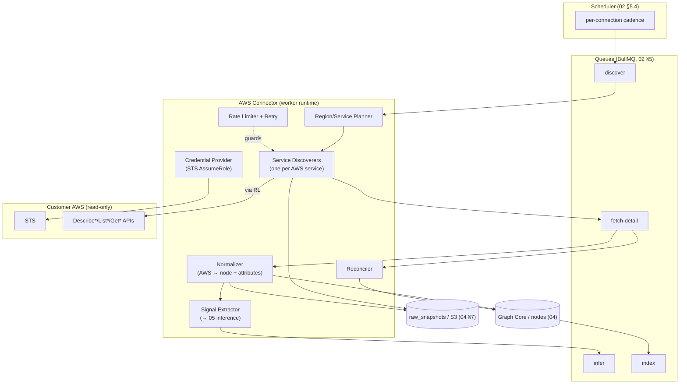
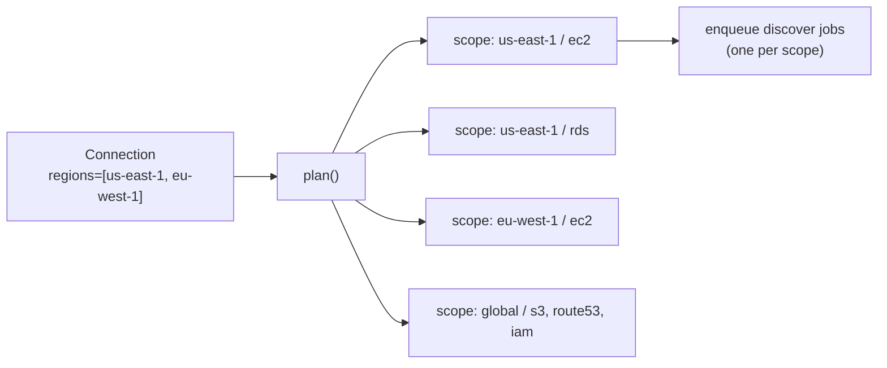
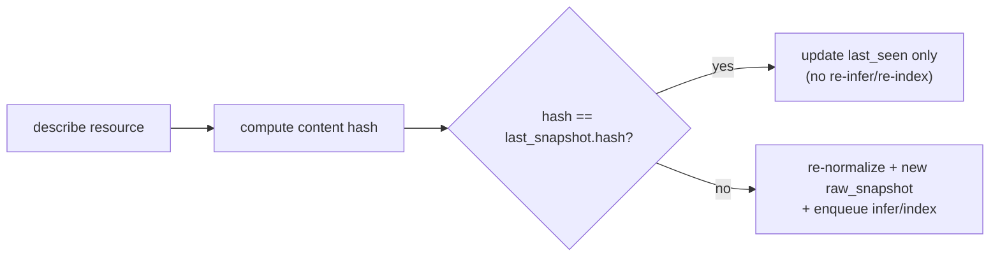
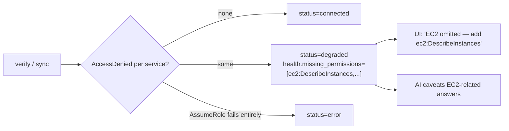
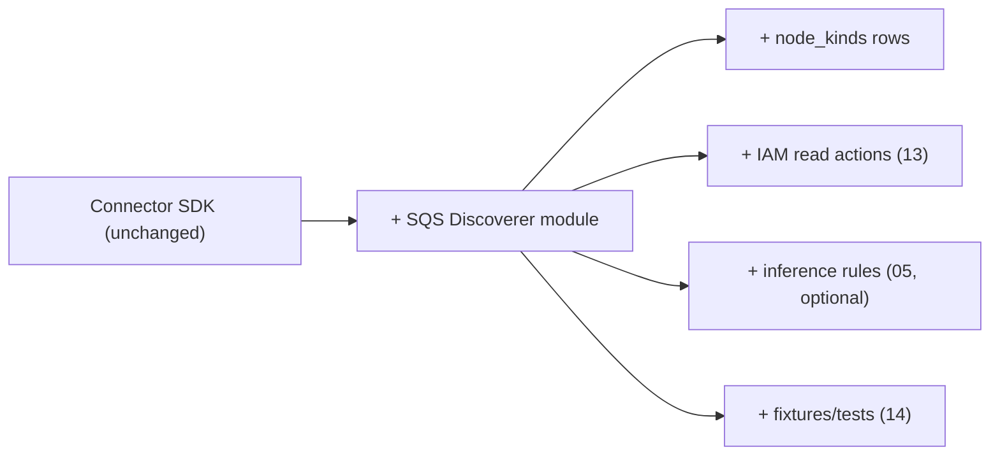

# 06 — AWS Crawler

> **Document status:** Authoritative · **Version:** 1.0 · **Last updated:** 2026-06-30
> **Owner:** Founding Principal Architect · **Audience:** Backend/worker engineers, AI coding agents, SRE
> **Document type:** Connector Implementation Spec (AWS)
> **Depends on:** `00` (G1/G4, P2/P5/P7/P8), `01` (FA-2/FR-2.x, US-1/13), `02` (§5 worker pipeline, §6.1 AWS integration, Connector SDK), `03` (Node/SyncRun/Provenance, lifecycles), `04` (`nodes`/`raw_snapshots` upsert), `05` (node kinds §3.1, URN §2, signals §6.3, observed edges)
> **Consumed by:** `05` inference (consumes signals), `07` (parallel connector contract), `13` (IAM/security), `14` (crawler testing), `17` (scaling/scheduling ops)

---

## Purpose

This document specifies the **AWS connector** — the worker subsystem that connects to a customer's AWS account via a read-only IAM role, discovers infrastructure, normalizes it into graph nodes, emits relationship **signals** for the inference engine (`05`), and keeps the graph continuously converged to AWS reality.

It is the concrete realization, for AWS, of the abstract **Connector SDK** (`02` §2.2) and the staged crawl pipeline (`02` §5.2). It must uphold every guarantee `01` FA-2 promises and every principle the platform requires: **read-only by construction (P2), idempotent/resumable/incremental (P7), least-privilege (P8), provider-pluggable (P5)**.

`07-github-crawler.md` is its sibling and follows the same Connector SDK contract defined here in §3.

## Scope

**In scope:** AWS connector architecture; the Connector SDK contract (shared with `07`); credential/AssumeRole flow; service discovery & the supported-service catalog; full vs incremental sync; pagination, retry, throttling/rate-limiting; signal & observed-edge emission; failure recovery & partial-sync semantics; metadata/provenance storage; permission detection; scheduling; extensibility to new AWS services.

**Out of scope (pointers):** IAM policy JSON & security threat model → `13`; inference *rules* that consume signals → `05`; queue/runtime infra → `02`/`17`; GitHub specifics → `07`; node/edge DDL → `04`.

## Assumptions

Inherits `00`–`05`. AWS-specific:
- **A22.** MVP is **single AWS account per connection** (`00` NG5 / `01` OOS-4); multi-account/AWS Organizations is Phase 1. The architecture is account-parameterized so multi-account is additive.
- **A23.** Customer provides a **ReadOnly IAM role** Atlas assumes via STS with an external ID (`02` §6.1, `13`). No long-lived customer keys are ever stored.
- **A24.** AWS SDK for JavaScript v3 (modular, TS-native, matches `02` stack).
- **A25.** Region set is customer-configured on the connection (`connections.config.regions`); "all enabled regions" is discoverable but defaults to an explicit allow-list to bound cost/scope.

---

## 1. Connector Architecture Overview



**Pipeline mapping to `02` §5.2 stages:** `discover` → enumerate resource ids per region/service; `fetch-detail` → full attributes → normalize → persist node + provenance + raw snapshot, extract signals; `infer` → `05` engine (separate module); `index` → `11`; reconcile closes the run (`03` §5.2).

---

## 2. Credential & AssumeRole Flow (read-only, P2/P8)

> Security detail (policy JSON, confused-deputy, rotation) in `13`; here is the operational flow the crawler uses.

```mermaid
sequenceDiagram
    participant W as AWS Connector Worker
    participant SB as Secrets Broker (02)
    participant STS as AWS STS
    participant API as AWS Service API
    W->>SB: get connection config (roleArn, externalId ref)
    SB-->>W: roleArn + externalId (brokered, 13)
    W->>STS: AssumeRole(roleArn, externalId, sessionName=atlas-sync-<runId>)
    STS-->>W: short-lived creds (≤1h)
    loop per service/region call
        W->>API: Describe*/List*/Get* (signed w/ temp creds)
        API-->>W: page of resources
    end
    Note over W,STS: creds cached per-run, refreshed before expiry; never persisted (A23)
```

**Rules:**
- One `AssumeRole` per sync run (or per region-batch), `sessionName` encodes the run id for CloudTrail traceability on the customer side (a trust signal — they can see exactly what Atlas did, `13`).
- **Read-only is enforced at IAM** — the role's policy contains only `Describe*/List*/Get*` (`13`); the crawler code physically never calls a mutating API (verified in CI, `14`, NFR-10). The session also carries no permission to mutate even if code tried.
- Temp creds live only in worker memory for the run (A23, P8). Expiry mid-run triggers a transparent refresh (handled by the AWS SDK credential provider, wrapped by our `CredentialProvider`).
- A failed AssumeRole → connection `error` with a human-readable reason (`03` §5.1, US-1 negative case).

---

## 3. The Connector SDK Contract (shared with `07`)

> **DD-1 — A single provider-agnostic interface both AWS and GitHub implement (P5/NFR-19).** Core graph/inference code calls this interface; it never imports `aws-sdk` or the GitHub SDK directly. This is what makes adding GCP/GitLab additive.

```typescript
// Conceptual contract (TypeScript-flavored; canonical in code per 16)
interface Connector {
  provider: 'aws' | 'github' | string;

  // Lifecycle / health
  verify(conn: Connection): Promise<VerifyResult>;        // FR-1.3: AssumeRole + probe + permission report
  health(conn: Connection): Promise<HealthResult>;        // FR-1.9: periodic re-check

  // Crawl stages (each idempotent & resumable — P7)
  plan(conn: Connection, run: SyncRun): Promise<WorkPlan>;          // enumerate scopes (regions×services)
  discover(scope: Scope, ctx: CrawlContext): AsyncIterable<ResourceRef>;   // ids, paginated
  fetchDetail(ref: ResourceRef, ctx: CrawlContext): Promise<RawResource>;  // full attributes + raw payload
  normalize(raw: RawResource): NodeUpsert;                 // → 04 node (kind, urn, attributes) (05)
  extractSignals(raw: RawResource): Signal[];              // → 05 inference inputs
  observedEdges(raw: RawResource): EdgeUpsert[];           // direct edges (e.g. PROTECTS, ROUTES_TO)
}
```

| Method | Maps to | Idempotency / resumability |
|---|---|---|
| `verify` | FR-1.3, US-1 | pure, repeatable |
| `plan` | `02` §5.2 stage 0 | deterministic scope list; cursor stored on `sync_runs.checkpoint` |
| `discover` | stage 1 | paginated; cursor per scope (resume mid-page, P7) |
| `fetchDetail` | stage 2 | upsert-keyed by URN (`04` `uq_node_urn`); re-runnable |
| `normalize`/`extractSignals`/`observedEdges` | stage 2/3 feed | pure functions of `raw` (testable, `14`) |

**Why pure normalize/extract:** they're deterministic functions of a captured raw payload, so they're unit-testable against fixtures (`14`) and re-runnable without hitting AWS (re-normalize from `raw_snapshots` if a rule changes — supports `05` rule versioning).

---

## 4. Supported AWS Services (MVP catalog — locks `00` OQ1)

> **DD-2 — MVP supports a curated, high-value service set, not "all of AWS."** **Why:** the value is in the *core architecture graph* (compute, what it connects to, what deploys it), not exhaustive coverage. Each service added is real engineering (discovery + normalize + signals + tests). We pick the services that (a) appear in the canonical questions (`00` §1) and (b) yield the richest inference edges (`05`). Coverage expands additively (§9) without schema change (`04` DD-1).

| Service | API surface (Describe/List/Get) | Node kind(s) `05` §3.1 | Signals emitted (`05` §6.3) | Observed edges |
|---|---|---|---|---|
| **EC2 instances** | `DescribeInstances` | `aws.ec2.instance` | ENI/SG attachments, subnet/VPC, tags, IAM instance profile | `CONTAINS`(subnet→), `PROTECTS`(sg→), `ASSUMES_ROLE` |
| **Lambda** | `ListFunctions`,`GetFunctionConfiguration` | `aws.lambda.function` | env vars, VPC config, role, layers, event source mappings | `ASSUMES_ROLE`, `TRIGGERS`(source→), env-ref signals |
| **ECS** | `ListClusters/Services/TaskDefinitions`,`Describe*` | `aws.ecs.cluster/service/taskdef` | task-def image, env, role, target-group link, desired count | `CONTAINS`, `USES_IMAGE`(taskdef→ECR), `ASSUMES_ROLE`, `ROUTES_TO` |
| **ECR** | `DescribeRepositories` | `aws.ecr.repository` | image URIs/tags | (target of `USES_IMAGE`) |
| **VPC/Subnet** | `DescribeVpcs/Subnets` | `aws.vpc`,`aws.subnet` | CIDR, AZ, route tables | `CONTAINS`(vpc→subnet) |
| **Security Groups** | `DescribeSecurityGroups` | `aws.securitygroup` | ingress/egress rules (port/proto/source) | `PROTECTS`(sg→resource) + SG-correlation signals (R2) |
| **ELB/ALB/NLB** | `DescribeLoadBalancers/TargetGroups/Listeners` | `aws.elb` | listeners, target groups, targets | `ROUTES_TO`(alb→target) |
| **Route53** | `ListHostedZones/ResourceRecordSets` | `aws.route53.record` | alias/target | `ROUTES_TO`(record→alb/resource) |
| **API Gateway** | `GetRestApis/GetResources` (+ v2) | `aws.apigateway` | integrations (→Lambda) | `ROUTES_TO`(apigw→lambda) |
| **RDS** | `DescribeDBInstances/Clusters` | `aws.rds.instance` | engine, endpoint host:port, SG, subnet group | (target of `CONNECTS_TO`) + endpoint signal (R3) |
| **DynamoDB** | `ListTables`,`DescribeTable` | `aws.dynamodb.table` | name, streams, GSIs | (target of `CONNECTS_TO`/`STORES_IN`) |
| **S3** | `ListBuckets`,`GetBucket*` (read config) | `aws.s3.bucket` | name, notifications (→Lambda), policy refs | `TRIGGERS`(s3→lambda) + bucket-ref signal |
| **ElastiCache** | `DescribeCacheClusters` | `aws.elasticache.cluster` | endpoint, engine, SG | (target of `CONNECTS_TO`) |
| **IAM (edges only)** | `GetRole/ListRolePolicies/GetPolicyVersion` | `aws.iam.role`,`aws.iam.policy` | policy statements (resource ARNs, actions) | `ASSUMES_ROLE` targets + R8 access signals |

**Explicitly deferred (Phase 1+, not MVP):** CloudFront, SQS/SNS, Step Functions, EKS/Kubernetes-internal, Kinesis, EventBridge rules (beyond basic), Secrets Manager/SSM, CloudWatch alarms (as nodes), WAF, Cognito. *(Note: CloudWatch/EventBridge for "what changed" real-time is the Phase-1 streaming item, `01` FR-2.9.)* Each is additive via §9.

> IAM is crawled **only to derive edges** (`ASSUMES_ROLE`, R8 access inference), never as a first-class browsable resource in MVP — consistent with `00` NG6 (we map structure, not security posture). Policy documents are sensitive; handling per `13`/NFR-15.

---

## 5. Discovery & Normalization

### 5.1 The Region × Service work plan (`plan`)

- A **scope** = (region, service) or (global, service) for global services (S3, Route53, IAM). Each scope is an independently-queued, independently-resumable unit — a throttled scope degrades only itself (FR-2.4, US-13, P7).
- Scopes are processed with **bounded concurrency per connection** (`02` §5.3 fairness) so one large account doesn't starve others or trip AWS account-wide throttling.

### 5.2 Discover → fetch-detail
- `discover(scope)` calls the `List*/Describe*` API, **streaming** paginated ids (AsyncIterable) so memory stays bounded on huge accounts (`02` AR / `01` EC-7).
- For each id, a `fetch-detail` job pulls full config. Where a `Describe*` already returns full objects (common in AWS), discover and detail collapse into one call and we skip a redundant round-trip (optimization, but the two-stage shape is preserved for services needing per-resource detail like Lambda config).

### 5.3 Normalization (`normalize`) — AWS → graph node
- Computes the **deterministic URN** (`05` §2.2) from region+account+type+natural-key.
- Maps AWS attributes → **normalized `attributes` JSONB** + **promoted hot columns** (`region`, `account_ref`, `tags`, `name`) per `04` DD-3.
- Writes the **raw payload to `raw_snapshots`/S3** with a content hash (`04`); if hash unchanged since last sync, skip rewrite (efficiency + accurate "what changed", `03` §4.4).
- **Upsert** keyed by `(org_id, urn)` (`04` `uq_node_urn`) — idempotent (P7): re-crawling the same instance updates `last_seen`/attributes, never duplicates (FR-2.3).
- Unknown/unclassifiable shapes → generic node (`03` BR-NODE-4) rather than dropped.

### 5.4 Signal & observed-edge emission
- `extractSignals` produces structured `Signal`s (SG rules, env vars, endpoint hosts, IAM statements, target-group links) consumed by `05` inference rules (R1–R8). Signals are stamped with provenance so the resulting inferred edges trace back (P4).
- `observedEdges` produces edges Atlas reads *directly* (`PROTECTS`, `ROUTES_TO`, `USES_IMAGE`, `CONTAINS`, `ASSUMES_ROLE`) — these are `origin='observed'`, `confidence='observed'` (`05` §5).

---

## 6. Full vs. Incremental Sync

> **DD-3 — Stateless full sync + change-detecting incremental sync; both reconcile.** AWS lacks a universal "list changes since T" API for control-plane describes (unlike GitHub webhooks). So:

| | **Full sync** (FR-2.1) | **Incremental sync** (FR-2.2) |
|---|---|---|
| Trigger | onboarding, nightly, manual | scheduled every N min (default targets NFR-3 <15 min convergence) |
| Method | scan all scopes, fetch all resources | re-scan scopes; **diff by content hash** vs last snapshot; only changed → re-normalize/re-snapshot |
| Cost control | full describe (bounded by pagination/rate-limit) | same describe calls, but **skip unchanged** persistence + downstream infer/index |
| Reconcile | mark not-seen resources `stale`/`deleted` for **scanned scopes only** (BR-SYNC-2) | same, scoped to re-scanned scopes |
| CloudTrail/EventBridge real-time | — | **Phase 1** (`01` FR-2.9): event-driven incremental replaces polling for change detection |

**Why polling for MVP (not CloudTrail now):** CloudTrail/EventBridge wiring adds customer setup friction (more IAM, an event bus) and engineering surface; periodic describe + content-hash diff achieves the freshness target (NFR-3) for MVP scale with far less onboarding cost (R7). The architecture treats incremental as an interface (`Connector.discover` + diff), so swapping the *change source* from polling to events in Phase 1 is internal (resolves `00` OQ5).

**Incremental change detection:**


---

## 7. Resilience: Pagination, Retry, Rate-Limiting, Failure Recovery

### 7.1 Pagination (FR-2.4)
- All `List*/Describe*` use the SDK's paginators; `discover` yields per-page and **checkpoints the page token** onto `sync_runs.checkpoint` so an interrupted scope resumes mid-pagination (P7), not from the first page.

### 7.2 Rate limiting & throttling (FR-2.4, R5)
> **DD-4 — Per-connection, per-service adaptive rate limiting with exponential backoff + jitter.**
- A **token-bucket limiter per (connection, service)** keeps Atlas under AWS API limits and isolates one customer's throttling from others (`02` §5.3).
- On `ThrottlingException`/`RequestLimitExceeded`/429/503: **exponential backoff with full jitter**, bounded retries (e.g. 5). AWS SDK v3 adaptive retry mode is enabled and wrapped by our limiter for cross-call coordination.
- If a scope exhausts its retry budget: **mark that scope stale** in `scope_result`, requeue with its checkpoint for the next cycle, and **continue other scopes** — never fail the whole run for one throttled service (FR-2.4, US-13).

### 7.3 Retry classification
| Error class | Examples | Action |
|---|---|---|
| Throttling | `ThrottlingException`, 429, 503 | backoff+jitter, bounded retry, then defer scope |
| Transient | timeouts, 5xx, connection reset | backoff retry |
| Auth/permission | `AccessDenied`, expired creds | refresh creds once; if persistent → permission report (§8) / connection `error` |
| Not-found / eventual consistency | resource vanished mid-scan | treat as deleted-candidate; reconcile decides (don't crash) |
| Fatal config | invalid region, malformed ARN | fail scope, log, surface to Admin |

### 7.4 Failure recovery (the partial-sync guarantee — `02` §8.4)
```mermaid
sequenceDiagram
    participant W as Worker
    participant AWS as AWS
    participant G as Graph Core
    W->>AWS: describe (scope=eu-west-1/rds, page 3)
    AWS-->>W: 429 (throttled past budget)
    W->>G: persist pages 1-2 (partial, labeled fresh)
    W->>W: checkpoint {scope, pageToken=p3}; mark scope stale in scope_result
    Note over W,G: reconcile DOES NOT delete-mark eu-west-1/rds (unscanned tail) — BR-SYNC-2
    W-->>W: SyncRun => 'partial'; other scopes already succeeded
    Note over W: next cycle resumes scope from p3
```
**Invariant (BR-SYNC-2 made concrete):** a resource is only `stale`/`deleted`-marked if its **entire scope completed successfully** in this run. Partial scans never cause false deletions — the worst case is *staleness*, never *wrong absence* (P3 applied to crawling).

---

## 8. Permission Detection & Degraded Connections (FR-1.6, US-1, P3)

A core trust feature: **never present an incomplete graph as complete** (`00` edge cases, US-13).

- During `verify` and every sync, `AccessDenied` on a service's describe is captured per-service into `connections.health.missing_permissions`.
- The connection becomes **`degraded`** (not `error`) when it can do *some* but not *all* of the supported describes; the UI shows exactly which resource types are omitted and the missing IAM actions (FR-1.6, US-1 degraded scenario).
- Affected node kinds are **not** silently empty — the graph/UI/AI know "EC2 not indexed (missing `ec2:DescribeInstances`)" and the AI caveats answers touching that scope (P3, US-13).



---

## 9. Extensibility: Adding an AWS Service

> Realizes P5/NFR-19 — adding coverage is additive, no core/schema change.

To add (e.g.) **SQS**:
1. Add node kind(s) to `node_kinds` (`04` data insert) — e.g. `aws.sqs.queue`.
2. Implement a **Service Discoverer** module: the `discover`/`fetchDetail` calls for SQS.
3. Implement `normalize` (SQS → node + URN) and `extractSignals`/`observedEdges` (e.g. queue→Lambda `TRIGGERS`).
4. Add IAM actions (`sqs:ListQueues`,`sqs:GetQueueAttributes`) to the read-only policy template (`13`).
5. Add inference rules if new edge semantics arise (`05`).
6. Add fixtures + tests (`14`).

No changes to Graph Core, the SDK contract, the pipeline, or other services. This is the payoff of DD-1/DD-2 and `04` DD-1.



---

## 10. Metadata & Provenance Storage (recap, P4)

Every crawled resource produces, per `04`:
- a **node** (`nodes`, upserted on URN) with normalized attributes + hot columns;
- a **provenance** record (source = AWS API call + ARN, `sync_run_id`, `observed_at`, confidence=`observed`);
- a **raw snapshot** (`raw_snapshots`/S3) of the verbatim describe payload, content-hashed;
- **stamps**: `last_seen`, `last_sync_run_id` (BR-SYNC-3) → powers "what changed" and freshness telemetry (NFR-17).

This is what lets the AI cite "EC2 instance i-0abc, as described at 14:32 UTC, source: `ec2:DescribeInstances`" with a click-through to the raw payload (P4, `10`).

---

## 11. Scheduling (recap, `02` §5.4)

- **Onboarding:** initial full sync enqueued on `connected`/`degraded` (FR-1.5).
- **Incremental:** per-connection cadence (default frequent enough for NFR-3 <15 min convergence; tunable per connector/account size).
- **Full:** nightly (off-peak) + on-demand.
- **Health re-check:** periodic `health()` to catch revoked roles / new permission gaps (FR-1.9).
- Schedules persisted in PostgreSQL (survive broker flush, `02` §5.4); Scheduler is leader-elected singleton; jobs idempotent so a double-fire is harmless (P7).

---

## 12. Design Decisions Recap

| ID | Decision | Why |
|---|---|---|
| DD-1 | Single provider-agnostic Connector SDK (AWS & GitHub implement) | P5/NFR-19 — additive providers |
| DD-2 | Curated MVP service catalog, not all-of-AWS | Value in core graph; coverage is additive (§9) |
| DD-3 | Polling + content-hash diff for incremental (events Phase 1) | Hits NFR-3 with low onboarding friction; event source is swappable (OQ5) |
| DD-4 | Per-(connection,service) token bucket + backoff+jitter | Rate-limit isolation & resilience (FR-2.4, R5) |
| (impl) | AssumeRole per run, sessionName=runId, creds in-memory only | Read-only, traceable, no stored keys (P2/P8) |
| (impl) | Partial scans never delete-mark (scope-complete gate) | False-absence is worse than staleness (P3, BR-SYNC-2) |

## 13. Risks

| ID | Risk | Mitigation |
|---|---|---|
| AWR-1 | AWS API throttling on large accounts slows convergence | Per-service token buckets, adaptive retry, scope-level resume; degrade freshness not correctness (DD-4) |
| AWR-2 | Missing permissions silently incomplete graph | Permission detection → `degraded` + explicit omissions (§8, P3) |
| AWR-3 | AWS API/SDK changes break a discoverer | Per-service modules isolate blast radius; pure normalize tested on fixtures (`14`); version-pinned SDK |
| AWR-4 | Huge accounts (10k+ resources) memory/cost | Streaming pagination, S3-offloaded raw, bounded concurrency, content-hash skip (DD-3) |
| AWR-5 | Eventual consistency / resources vanishing mid-scan | Treat as deleted-candidate, reconcile decides; never crash a scope |
| AWR-6 | Credential expiry mid-long-sync | SDK auto-refresh wrapped by CredentialProvider; per-region re-assume |
| AWR-7 | IAM policy crawl exposes sensitive data | IAM read-minimal, snapshots encrypted, retention-limited (`13`/NFR-15) |
| AWR-8 | Cross-account assumption mistakes (future multi-account) | externalId per connection, account in URN scope; Phase-1 design (A22) |

## 14. Edge Cases

- **Region disabled / opt-in region not enabled** → scope skipped with a noted reason, not an error.
- **Global vs regional services** (S3 buckets are global but have a region; Route53/IAM global) → URN `scope` handles (`aws:global:...`); avoid double-counting across regions.
- **Resource in a region the customer didn't list** → not crawled (scope-bounded, A25); if customer expects it, surface "region not in scan list."
- **Throttle storm account-wide** → per-service buckets + global per-connection cap prevent Atlas from worsening it; back off and resume.
- **Empty account / brand-new** → valid empty graph (US/EC-2), onboarding shows meaningful empty state.
- **Permission added later** → next sync picks up the now-allowed service; `degraded`→`connected` transition (§8, `03` §5.1).
- **Resource with no tags / no name** → node still created (URN from id), `name` from id; ownership inference just has less to work with.
- **Lambda with hundreds of versions / aliases** → MVP indexes the function (latest config); versions deferred (additive).

## 15. Open Questions

- **OQ-AWS-1** Default incremental cadence per account-size tier (balance NFR-3 vs AWS cost/throttle) — tuned with real accounts (`17`).
- **OQ-AWS-2** Whether to collapse discover+detail for services returning full objects (perf vs uniformity) — current lean: collapse where safe (§5.2).
- **OQ-AWS-3** MVP depth of IAM policy parsing for R8 (full statement eval vs. coarse ARN match) — start coarse (`05` R8 is `inferred-low` anyway).
- **OQ-AWS-4** Exact Phase-1 trigger to move incremental from polling → CloudTrail/EventBridge (`00` OQ5) — gated on freshness needs + customer multi-account demand.
- **OQ-AWS-5** Raw-snapshot retention window for AWS describes (`03` OQ-DOM-4) — set in `13`.

## 16. References

- **Upstream:** `00` (G1/G4, P2/P5/P7/P8, NG5/NG6, OQ1/OQ5), `01` (FA-2/FR-2.1–2.10, FR-1.x, US-1/13, EC-1/4/7), `02` (§5 pipeline, §5.3 idempotency/fairness, §5.4 scheduling, §6.1 AWS, Connector SDK §2.2), `03` (Node/SyncRun/Provenance/RawSnapshot, BR-SYNC/NODE, lifecycles §5), `04` (`nodes`/`raw_snapshots` upsert, `uq_node_urn`, JSONB+hot columns), `05` (node kinds §3.1, URN §2, signals §6.3, observed edges §4, inference R1–R8).
- **Downstream:** `05` (consumes emitted signals), `07` (implements same SDK contract §3), `13` (IAM policy/threat model/retention for §2/§8/AWR-7), `14` (crawler fixtures, determinism, partial-sync & permission tests), `17` (scheduling cadence, scaling worker pool, cost).

---

### Change log
| Version | Date | Author | Change |
|---|---|---|---|
| 1.0 | 2026-06-30 | Founding Principal Architect | Initial authoritative AWS crawler spec from `00`–`05` v1.0 |
