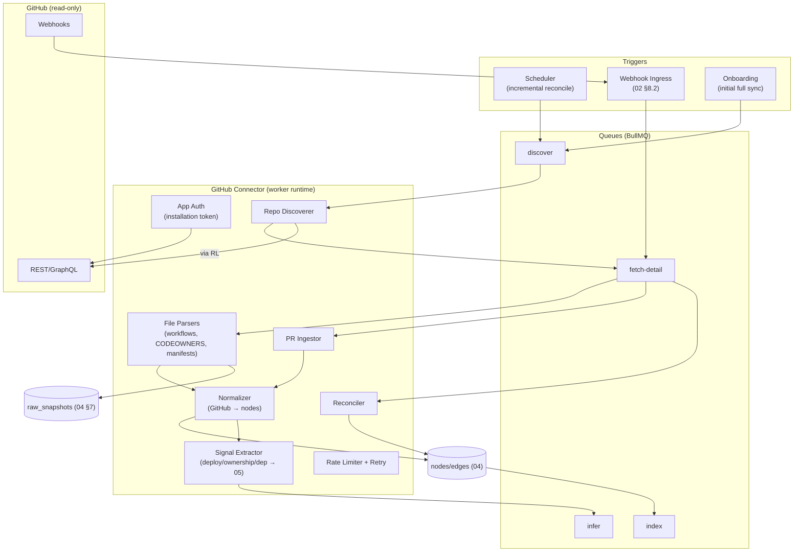
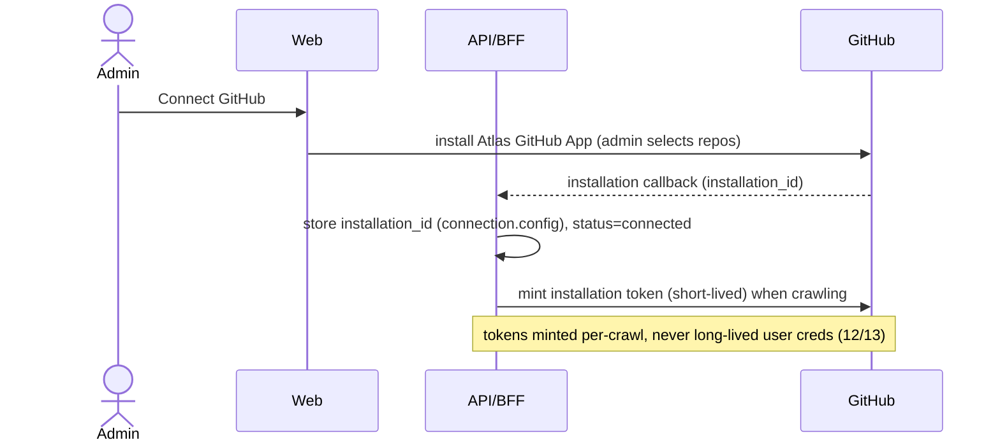

# 07 — GitHub Crawler

> **Document status:** Authoritative · **Version:** 1.0 · **Last updated:** 2026-06-30
> **Owner:** Founding Principal Architect · **Audience:** Backend/worker engineers, AI coding agents, SRE
> **Document type:** Connector Implementation Spec (GitHub) — MVP SCM connector
> **Depends on:** `00` (G1/G6, P5/P7), `01` (FA-3/FR-3.x, US-5/6/8/10), `02` (§5 pipeline, §6.2 GitHub integration, §8.2 webhook flow), `03` (Node/SyncRun/Provenance), `04` (`nodes`/`edges` upsert), `05` (node kinds §3.2, URN §2, signals §6.3, observed edges, rules R1/R4/R5/R6), `06` (**Connector SDK contract §3 — GitHub implements the same interface**)
> **Consumed by:** `05` (inference consumes signals), `07b` (Bitbucket — same contract), `12` (OAuth/GitHub App auth), `13` (webhook security), `14` (testing), `17` (webhook ingress ops)

---

## Purpose

This document specifies the **GitHub connector** — the MVP source-control connector. It discovers repositories, ingests pull requests, parses CI/CD workflows, CODEOWNERS, and dependency manifests, and emits the **signals and observed edges** that let `05` inference link **code → infrastructure** (the repo→service→runtime chain that answers "which repo deploys to this ECS service?" and "what changed this week?").

GitHub is the second implementation of the **Connector SDK contract defined in `06` §3** — it implements the *same* `verify/plan/discover/fetchDetail/normalize/extractSignals/observedEdges` interface as AWS. The Bitbucket connector (`07b`) is a Phase-2 implementation of the same contract; this consistency is the point of P5/NFR-19.

> **Why GitHub is the "other half" of the graph.** AWS (`06`) tells Atlas *what exists and how it connects at runtime*. GitHub tells Atlas *what builds it, who owns it, and what changed*. Neither alone answers the canonical questions; the **deploy-inference edges** built here (`05` R1/R4/R6) are what stitch the two source graphs into one engineering reality (G1).

## Scope

**In scope:** GitHub App vs OAuth choice; repository discovery & selection; webhook processing; PR parsing; GitHub Actions workflow parsing; CODEOWNERS; deployment inference signals (repo→AWS); dependency manifest analysis; branch strategy; full vs incremental/webhook sync; rate-limiting/retry; reconciliation; provenance.

**Out of scope (pointers):** OAuth/App auth & token storage → `12`; webhook signature security & secret handling → `13`; the inference *rules* (R1/R4/R5/R6) that consume signals → `05`; node/edge DDL → `04`; queue/runtime → `02`/`17`; Bitbucket → `07b`.

## Assumptions

Inherits `00`–`06`. GitHub-specific:
- **A26.** **GitHub SaaS** (github.com) for MVP (`00` NG5); GitHub Enterprise Server is a later additive target (same API surface, different base URL).
- **A27.** Connection authorized via a **GitHub App installation** (preferred over raw OAuth — DD-1) scoped to selected repos/org.
- **A28.** Octokit (official GitHub SDK, TS-native) for REST + GraphQL; matches `02` stack.
- **A29.** Default branch is the source of truth for structural files (workflows, CODEOWNERS, manifests) unless a repo declares otherwise (§7).

---

## 1. Connector Architecture Overview



Same five-stage pipeline as AWS (`06` §1); the differences are **what** is discovered (repos/PRs/files, not cloud resources) and that **incremental is webhook-driven** (GitHub *does* offer change events, unlike AWS describes — `06` DD-3).

---

## 2. Authentication: GitHub App vs OAuth

> Token storage, scopes, and security in `12`/`13`; here is the connector-facing rationale.

> **DD-1 — GitHub App (installation), not raw OAuth user tokens.** **Why:**
> - **Least-privilege & revocable (P8):** an App grants fine-grained, per-repo, read-only permissions the org admin controls and can revoke centrally — vs. an OAuth user token that inherits a *user's* broad access and breaks when that user leaves.
> - **Higher, dedicated rate limits:** App installations get their own rate budget (better than a single user token for crawling many repos).
> - **Org-controlled selection:** the admin picks which repos the App can see (FR-1.4, US-2) — matches the security-gatekeeper persona (E) requirements.
> - **Webhook-native:** Apps receive webhooks for installed repos without per-repo hook setup.
>
> **OAuth** is still used for **user login** ("Sign in with GitHub", `12`) — distinct concern. **Alternative — OAuth-only for both login and crawl:** rejected; couples data access to a person, broader scope, weaker for the security reviewer (E). The App's required read permissions: repo contents (read), metadata, pull requests (read), actions/workflows (read), members/teams (read for CODEOWNERS resolution). No write permissions — read-only by construction (P2, mirrors `06`).



---

## 3. Connector SDK Conformance (reuses `06` §3)

GitHub implements the exact contract from `06` §3. Mapping:

| SDK method (`06` §3) | GitHub implementation |
|---|---|
| `verify(conn)` | validate installation token, list accessible repos, report any missing permissions → `connected`/`degraded` (mirrors `06` §8) |
| `health(conn)` | re-check installation validity (catches uninstalled App / revoked access, FR-1.9) |
| `plan(conn, run)` | enumerate selected repos → one scope per repo (+ org-level scope for teams) |
| `discover(scope)` | list repo's structural files + open/recent PRs (paginated) |
| `fetchDetail(ref)` | fetch file contents / PR detail / workflow YAML |
| `normalize(raw)` | GitHub object → node (`github.repository/pull_request/workflow/team`) + URN (`05` §2) |
| `extractSignals(raw)` | deploy targets, CODEOWNERS mappings, dependency manifests, PR file paths → `05` |
| `observedEdges(raw)` | `OWNED_BY` (CODEOWNERS), `DEPENDS_ON_PKG`, repo `CONTAINS` workflow |

**Same idempotency guarantees** as AWS: URN-keyed upsert (`04` `uq_node_urn`), resumable pagination cursors on `sync_runs.checkpoint`, pure `normalize`/`extractSignals` (testable on fixtures, `14`).

---

## 4. Repository Discovery (FR-3.1)

- `plan` lists repos the App installation can access (REST `installation/repositories`, paginated), filtered to the admin's selection (`connections.config.repos`).
- Each repo → a `github.repository` node (URN `github:<owner>/<repo>`, `05` §2.2) with attributes: default branch, visibility, language, topics, archived flag, pushed_at.
- `archived`/empty repos are indexed but de-prioritized for parsing (low signal, §13 edge cases).
- **Scope per repo** = independently queued/resumable (a rate-limited or huge repo degrades only itself — `06` §5.1, US-13).

---

## 5. Webhook Processing (FR-3.6/3.7, `02` §8.2)

> **DD-2 — Webhooks for incremental + periodic reconciliation to heal gaps.** GitHub pushes events; we react in near-real-time, but **never trust webhooks as the only source** (deliveries can be missed). A scheduled reconcile re-derives from the API, healing any gap (FR-3.7, idempotent — P7).

| Event | Action |
|---|---|
| `push` (to default branch) | re-parse changed structural files (workflows, CODEOWNERS, manifests); update signals |
| `pull_request` (opened/merged/closed) | upsert `github.pull_request` node; on `merged` → feed R6 (`CHANGED_BY`) for "what changed"/culprit |
| `workflow_run` / `deployment` / `deployment_status` | strengthen deploy-inference signals (R1); record deploy events for the timeline |
| `repository` (created/deleted/renamed/archived) | upsert/retire repo node; rename → URN change handling (`05` §2.3) |
| `member`/`team` | refresh ownership resolution (CODEOWNERS → team) |
| `installation`/`installation_repositories` | repo added/removed from App → adjust scope; uninstall → connection degraded/error |

**Processing rules (`02` §8.2):**
- Webhook ingress **verifies HMAC signature** (`13`) before enqueuing — reject unsigned/forged.
- Idempotency key = GitHub **delivery id**; duplicate deliveries are deduped (at-least-once, P7).
- Webhook arriving **before initial sync completes** → enqueued; applied idempotently once nodes exist (no ordering assumption, `02` §14).
- The webhook handler is thin: verify → enqueue → ack fast (GitHub requires quick 2xx); all real work happens in the worker.

```mermaid
sequenceDiagram
    participant GH as GitHub
    participant WH as Webhook Ingress
    participant Q as Queue
    participant W as GitHub Worker
    participant G as Graph Core
    GH->>WH: event (X-GitHub-Delivery, HMAC sig)
    WH->>WH: verify HMAC (13); reject if invalid
    WH->>Q: enqueue {deliveryId, payload}; ack 2xx fast
    Q->>W: process (idempotent on deliveryId)
    W->>GH: fetch detail if needed (installation token)
    W->>G: upsert nodes + signals/observed edges
    W->>Q: enqueue infer (R1/R6 affected)
```

---

## 6. PR Parsing (FR-3.6/3.8, US-5/6)

- Each PR → `github.pull_request` node (URN `github:<owner>/<repo>:pr:<number>`) with: title, author, state, merged_at, base/head, **changed file paths**, additions/deletions, linked issues.
- **Backfill** on initial sync (recent N PRs / since a window) so the "what changed this week" timeline isn't empty on day one; then webhook-driven thereafter.
- **Signals for R6 (`CHANGED_BY`):** changed file paths + repo→service link (from R4) → which service(s) a merged PR likely affected, with confidence tiering:
  - single-service repo + paths map to deployed code → `inferred-high`;
  - monorepo / many services / config-only → `inferred-low` (honest uncertainty, US-6 acceptance, P3).
- PR nodes power both **US-5** (timeline) and **US-6** (culprit ranking — ranked by `CHANGED_BY` confidence + temporal proximity to the incident window; `05` OQ-KG-3 reserves a numeric sub-score if US-6 is promoted to Must).

---

## 7. File Parsing: Workflows, CODEOWNERS, Dependencies

> Files are fetched from the **default branch** (A29) via the contents API (or git tree for efficiency on large repos). Parsers are **pure functions** of file content (testable on fixtures, `14`).

### 7.1 GitHub Actions workflows → deploy signals (FR-3.2/3.4, feeds R1/R4)
- Parse `.github/workflows/*.yml`. Extract deploy steps that target AWS:
  - official AWS actions (`aws-actions/amazon-ecs-deploy-task-definition`, `configure-aws-credentials`, ECR login, `aws ecs update-service`, SAM/CDK/CloudFormation deploy steps);
  - **explicit ARNs / cluster/service names / function names** in `with:`/`run:` blocks → resolved against existing AWS nodes (`05` R1).
- **Signal strength → confidence (R1):** exact ARN or cluster/service name match → `inferred-high` `DEPLOYS_TO`; name-heuristic only (repo name ≈ service) → `inferred-low`; multiple candidates → multiple `inferred-low` edges (never one wrong high — P3).
- Workflow itself → `github.workflow` node, repo `CONTAINS` workflow (observed).

### 7.2 CODEOWNERS → ownership (FR-3.3, R5, observed)
- Parse `CODEOWNERS` (root/`.github`/`docs`). Map path patterns → owning teams/users.
- Emit **observed** `OWNED_BY` edges: repo (and via R4, the derived `atlas.service`) → `github.team`/`github.user`. (The repo→team mapping is *parsed* hence observed; propagating ownership to the service is the `inferred-high` step, `05` R5.)
- Resolve team membership (App members/teams read) so "who owns checkout?" (US-10) returns people, not just a team handle.

### 7.3 Dependency manifests → package edges (FR-3.5, `DEPENDS_ON_PKG`, observed)
- Parse ecosystem manifests/lockfiles on the default branch:
  - `package.json`/`package-lock.json`/`yarn.lock`/`pnpm-lock.yaml` (npm), `requirements.txt`/`poetry.lock`/`Pipfile.lock` (Python), `go.mod`/`go.sum` (Go), `pom.xml`/`build.gradle` (JVM), `Gemfile.lock` (Ruby), `Cargo.lock` (Rust).
- Emit `DEPENDS_ON_PKG` (observed) repo → external package node (a lightweight `external.package` kind; **dependency *edges*, not vulnerability scoring** — `00` NG6, `01` OOS-9).
- **MVP depth:** direct dependencies from manifests; transitive resolution and version-vulnerability mapping are deferred (additive). Lockfiles preferred over manifests for accuracy where present.
- **IaC references (Terraform/CloudFormation in-repo):** parsed as *deploy/ownership hints* feeding R1 (a TF `aws_ecs_service` resource named X reinforces a repo→X deploy edge) — IaC is a *signal*, not the source of truth (`00` NG2, `05`).

---

## 8. Branch Strategy

> **DD-3 — Index the default branch as the structural source of truth; track PRs across branches for change.** **Why:** workflows/CODEOWNERS/manifests on the **default branch** represent the repo's current intended structure; parsing every branch would explode cost with little graph value. **PRs** (which span feature branches → base) carry the *change* signal and are tracked regardless of branch. **Edge cases:** a repo whose deploy config lives on a release branch is handled by an optional per-repo override (`connections.config` repo override of the structural branch); GitOps repos where the default branch *is* the deploy state are naturally covered. Multi-branch structural parsing is a Phase-1 consideration if demand appears (§14 OQ).

---

## 9. Full vs. Incremental / Webhook Sync

| | **Full sync** (FR-3.1) | **Incremental** (FR-3.7) | **Webhook** (FR-3.6) |
|---|---|---|---|
| Trigger | onboarding, periodic deep reconcile | scheduled (heal webhook gaps) | real-time GitHub events |
| Scope | all selected repos: files + PR backfill | re-list repos, re-fetch structural files, recent PRs; diff by content hash (`06` DD-3) | only the changed entity in the event |
| Reconcile | retire repos/PRs no longer present (scanned scopes only — BR-SYNC-2) | same, scoped | n/a (single entity) |
| Cost | bounded by repo count + rate limit | cheap (hash-skip unchanged, `06` DD-3) | minimal |

> GitHub's webhook availability is why incremental here is **event-first** (unlike AWS polling, `06` DD-3) — but the **reconcile** safety net is identical: never trust events alone; periodic API reconciliation guarantees convergence (P7, DD-2).

---

## 10. Resilience: Rate Limiting, Retry, Recovery

- **Rate limits:** GitHub REST (5k/hr per installation) + **secondary rate limits** (abuse detection on bursts) + GraphQL point budget. The connector uses a **token-bucket per installation** (mirrors `06` DD-4), respects `Retry-After`/`X-RateLimit-Reset` headers, and **prefers GraphQL** for batch fetches (fewer calls, e.g. repo + PRs + files in one query) to stay under limits.
- **Backoff + jitter** on `403 rate limit`/`secondary limit`/`5xx`; bounded retries; on budget exhaustion → defer that repo scope, mark stale in `scope_result`, continue others, resume next cycle (identical partial-sync guarantee to `06` §7.4).
- **Retry classification** mirrors `06` §7.3 (throttle / transient / auth / not-found / fatal).
- **Failure recovery:** same checkpoint-and-resume + scope-complete-gate-before-delete-mark invariant as `06` (BR-SYNC-2) — a rate-limited repo never causes false PR/repo deletions.

---

## 11. Provenance & Metadata (recap, P4)

Every parsed artifact yields (per `04`):
- a **node** (repo/PR/workflow/team) upserted on URN;
- **provenance** (source = GitHub API call / file path + commit SHA, `sync_run_id`, confidence `observed`);
- a **raw snapshot** (workflow YAML, CODEOWNERS, manifest, PR payload) in `raw_snapshots`/S3, content-hashed;
- stamps `last_seen`/`last_sync_run_id` (BR-SYNC-3).

This lets the AI cite "deploy.yml @ commit `a1b2c3`, line 24: `aws ecs update-service --service orders-api`" with click-through (P4, `10`) — the evidence behind every `DEPLOYS_TO` edge.

---

## 12. Design Decisions Recap

| ID | Decision | Why |
|---|---|---|
| DD-1 | GitHub App (not OAuth tokens) for crawl; OAuth only for login | Least-privilege, revocable, org-controlled, higher limits, webhook-native (P8) |
| DD-2 | Webhooks + periodic reconcile | Real-time freshness with guaranteed convergence (P7) |
| DD-3 | Default branch = structural source of truth; PRs track change | Cost/value balance; PRs carry the change signal |
| (impl) | Same Connector SDK contract as AWS (`06` §3) | P5/NFR-19 — additive providers, shared pipeline |
| (impl) | Prefer GraphQL for batch; token bucket per installation | Rate-limit resilience |

## 13. Risks

| ID | Risk | Mitigation |
|---|---|---|
| GHR-1 | Secondary rate limits on large orgs | GraphQL batching, token bucket, backoff+jitter, per-repo scope resume |
| GHR-2 | Deploy inference wrong (workflow ≠ actual deploy) | R1 tiering (ARN=high, name=low, ambiguity=multiple-low), IaC reinforcement, `14` precision tests (P3) |
| GHR-3 | Monorepo over-broad CHANGED_BY/DEPLOYS_TO | path-based file mapping, `inferred-low` for multi-service repos (`05` R1/R6), documented limitation |
| GHR-4 | Missed webhooks → stale timeline | reconcile heals gaps (DD-2); idempotent replay |
| GHR-5 | App uninstalled / permission revoked | health() detects → connection degraded/error; existing graph marked stale (EC-6) |
| GHR-6 | Huge repos / many branches blow up parsing | default-branch-only structural parse (DD-3), git-tree fetch, pagination, S3 raw offload |
| GHR-7 | Manifest parsing breadth (many ecosystems) | start with top ecosystems; additive; lockfile-preferred; failures degrade that signal only |
| GHR-8 | Forged webhooks | HMAC verification before enqueue (`13`) |

## 14. Edge Cases

- **Empty / archived repo** → node created, structural parsing skipped (low signal), no false edges.
- **Renamed repo** → URN change; old retires, new appears; PRs re-associate (`05` §2.3, "what changed" shows it).
- **Repo with no workflows/CODEOWNERS** → no deploy/ownership edges (correct absence, not error); AI says ownership/deploy unknown for it (P3, US-11).
- **Workflow deploys to a resource Atlas hasn't crawled** (AWS not connected, or in an unscanned region) → signal retained but edge unresolved; surfaced as "deploys to <name> (not found in connected infrastructure)" rather than dropped.
- **Webhook before AWS connected** → repo/PR nodes exist; deploy edges resolve later when AWS appears (cross-source eventual consistency, `02` §14).
- **Fork / mirror repos** → indexed if selected; deploy inference only fires on real CI signals.
- **GitHub Actions using a matrix / reusable workflows** → parser resolves `uses:` references where possible; unresolved reusable workflows degrade to `inferred-low` (don't guess).
- **Multiple workflows deploying the same service** → multiple provenance entries on one `DEPLOYS_TO` (BR-EDGE-4), not duplicate edges.
- **Non-AWS deploy targets** (e.g. deploy to GCP) → recognized as a deploy event but no edge into the (AWS-only MVP) graph; recorded for future multi-cloud (`00` roadmap).

## 15. Open Questions

- **OQ-GH-1** PR backfill window on initial sync (last N PRs vs last 90 days) — balance timeline richness vs rate budget; tune in `17`.
- **OQ-GH-2** Manifest ecosystems in MVP (which subset of §7.3) — start npm/Python/Go; confirm with `15`.
- **OQ-GH-3** Multi-branch structural parsing (DD-3) — gated on customer demand (Phase 1).
- **OQ-GH-4** Depth of reusable/composite workflow resolution for R1 — start shallow, `inferred-low` on unresolved.
- **OQ-GH-5** GitHub Enterprise Server support timing (A26) — additive base-URL change; roadmap (`15`).

## 16. References

- **Upstream:** `00` (G1/G6, P5/P7, NG2/NG5/NG6), `01` (FA-3/FR-3.1–3.9, US-5/6/8/10/11/13, OOS-3/9), `02` (§5 pipeline, §6.2 GitHub, §8.2 webhook flow, §14 ordering), `03` (Node/PR/SyncRun/Provenance, BR-SYNC/EDGE), `04` (`nodes`/`edges`/`raw_snapshots` upsert), `05` (node kinds §3.2, URN §2.2, signals §6.3, observed edges §4, rules R1/R4/R5/R6, confidence tiers), `06` (**Connector SDK contract §3**, rate-limit/retry/partial-sync patterns §7, permission detection §8).
- **Downstream:** `05` (consumes signals), `07b` (Bitbucket — same SDK contract, contingency), `12` (GitHub App + OAuth login, token storage), `13` (webhook HMAC, App permission model, manifest/PII handling), `14` (parser fixtures, deploy-inference precision, webhook idempotency tests), `17` (webhook ingress scaling, backfill cadence).

---

### Change log
| Version | Date | Author | Change |
|---|---|---|---|
| 1.0 | 2026-06-30 | Founding Principal Architect | Initial authoritative GitHub crawler spec from `00`–`06` v1.0 |
