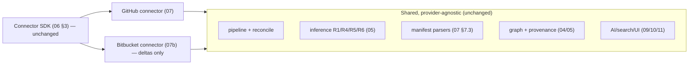

# 07b — Bitbucket Crawler (Phase-2 Contingency Connector)

> **Document status:** Conditional / Phase-2 design · **Version:** 1.0 · **Last updated:** 2026-06-30
> **Owner:** Founding Principal Architect · **Audience:** Backend/worker engineers, AI coding agents
> **Document type:** Connector Implementation Spec (Bitbucket) — **NOT MVP**
> **Depends on:** `06` (**Connector SDK contract §3 — Bitbucket implements the same interface**), `07` (GitHub connector — the reference SCM implementation this mirrors), `00` (NG5, P5), `01` (OOS-3), `05` (node kinds, URN grammar, signals, rules R1/R4/R5/R6)
> **Consumed by:** `05` (inference consumes signals), `15` (roadmap — Phase-2 scheduling), `18` (segment expansion)

---

## ⚠️ Scope Status (read first)

This connector is **explicitly NOT in the MVP.** It exists to (a) prove the Connector SDK abstraction (`06` §3, P5/NFR-19) generalizes beyond GitHub, and (b) give the team a **ready-to-build design** if a target customer turns out to be Bitbucket-based ("just in case").

- `00` **NG5** and `01` **OOS-3** defer GitLab/Bitbucket to **Phase 2**. This document **does not change that** — it is contingency design, not a commitment.
- **To promote Bitbucket into MVP** (co-equal with GitHub), the following must be updated *first*, in this order, or the doc tree becomes internally inconsistent: `00` NG5 → `01` OOS-3 + add FRs → `15` roadmap → `18` segment. Until then, treat this as Phase-2.
- Everything reusable lives in `06`/`07`; this document specifies **only the deltas** from the GitHub connector (`07`). If a behavior isn't mentioned here, **it is identical to `07`** by virtue of the shared SDK contract.

> **Architect's note (why this is the right shape):** The fact that a full Bitbucket connector can be specified as a *delta document* — not a parallel rewrite — is the validation of the `06` DD-1 decision. Code that touches the Connector SDK, the graph, inference, or the pipeline is **unchanged**; only the provider-specific discovery/parse/auth modules differ. That is exactly P5/NFR-19 working as designed.

## Purpose

Specify the **Bitbucket Cloud** connector as a Phase-2 implementation of the `06` §3 Connector SDK, mapping Bitbucket's API, auth model, CI system (Pipelines), and webhook model onto the **same node/edge/URN/signal model** (`05`) that AWS and GitHub already populate. The goal: a Bitbucket customer's graph is **indistinguishable in shape** from a GitHub customer's graph — same `atlas.service`, same `DEPLOYS_TO`/`OWNED_BY`/`CHANGED_BY` edges — so exploration, search, and AI (`09`/`10`/`11`) work without any provider-specific awareness.

## Scope

**In scope:** Bitbucket-vs-GitHub deltas across auth, repo discovery, webhooks, PR parsing, **Bitbucket Pipelines** parsing (the GitHub Actions analogue), CODEOWNERS-equivalent ownership, dependency manifests, branch strategy, URN scheme, and the conformance mapping to `06` §3.

**Out of scope:** Everything identical to `07` (re-stated only where it differs); Bitbucket Server/Data Center (self-hosted) — noted as a further-future additive target; auth-token security → `13`; inference rules → `05`.

## Assumptions

Inherits `00`–`07`. Bitbucket-specific:
- **A30.** **Bitbucket Cloud** (bitbucket.org) for this design; Bitbucket Server/DC (different REST API, on-prem) is a further additive target.
- **A31.** Bitbucket Cloud **REST API v2.0** + **Workspace/OAuth** model.
- **A32.** Auth via a **Bitbucket OAuth consumer** scoped read-only at the **workspace** level, or an **Access Token / App password** for service auth (DD-1 below) — Bitbucket has **no exact "GitHub App installation" equivalent**, which is the single biggest delta.

---

## 1. The Core Mapping (Bitbucket → Atlas model)

| Concept | GitHub (`07`) | Bitbucket Cloud | Atlas node/edge (`05`) — **unchanged** |
|---|---|---|---|
| Tenant container | org | **workspace** | (scopes the connection) |
| Repository | repo | repository (in a workspace/project) | `github.repository` → **generalize to `scm.repository`** (see DD-2) |
| Code review unit | pull request | **pull request** (same concept) | `*.pull_request` |
| CI/CD | GitHub Actions (`.github/workflows/*.yml`) | **Bitbucket Pipelines** (`bitbucket-pipelines.yml`) | `*.workflow` / `*.pipeline` |
| Ownership file | `CODEOWNERS` | **no native CODEOWNERS**; use **default reviewers** + Forge/CODEOWNERS app if present | `OWNED_BY` |
| Teams | GitHub teams | **groups** (workspace groups) | `*.team` |
| Deploy target signal | AWS actions/ARNs in workflow | **aws CLI / pipes** (`atlassian/aws-ecs-deploy`, OIDC) in pipeline | `DEPLOYS_TO` (R1) |
| Change event | webhook (delivery id) | webhook (no stable delivery-id header — DD-3) | `CHANGED_BY` (R6) |

**Result:** identical graph shape. The deploy-inference chain (repo→service→runtime, `05` R1/R4) fires from Bitbucket Pipelines exactly as it does from GitHub Actions; only the parser differs.

> **DD-2 — Generalize the SCM node kinds to `scm.*` (or keep provider-prefixed with a shared category).** When promoting Bitbucket, either (a) introduce provider-neutral kinds `scm.repository`/`scm.pull_request`/`scm.workflow`/`scm.team` that both GitHub and Bitbucket populate, **or** (b) keep `github.*`/`bitbucket.*` distinct kinds sharing a `category='scm'` in `node_kinds` (`04`). **Recommendation: (b)** — keep provider-prefixed kinds (preserves provenance clarity and avoids a GitHub data migration), and let inference/traversal/search key off `node_kinds.category='scm'`. This is a **data change (`node_kinds` rows), not a schema change** (`04` DD-1) — the payoff of controlled vocabularies. Either way, **AI/search/UI query by category, not provider**, so they need no Bitbucket-specific code.

---

## 2. Authentication (the biggest delta — DD-1)

> **DD-1 — Workspace-scoped OAuth (read-only) as primary; Repository/Workspace Access Token as the service-auth fallback.** Bitbucket Cloud has **no "GitHub App installation"** with per-repo fine-grained, centrally-revocable, webhook-bundled permissions. Closest options:
> - **OAuth 2.0 consumer** (workspace admin authorizes; read-only scopes: `repository`, `pullrequest`, `account`/`team` read, `pipeline` read, `webhook`) — chosen as primary because it's admin-authorized and revocable at the workspace (closest to `07` DD-1's security posture).
> - **Workspace/Repository Access Tokens** — scoped service tokens, good for headless crawl; used as fallback / for finer scoping.
> - **App passwords** — user-tied (like an OAuth user token); avoided as primary for the same reason `07` rejects OAuth-user-tokens (P8: don't couple data access to a person).
>
> **Security implications vs GitHub (for `13`/Persona E):** Bitbucket's read-only scopes are coarser than a GitHub App's per-repo permissions; the connection's `scope` (which repos) is enforced **app-side** by filtering to the admin-selected repo list, since the token may technically see the whole workspace. This is a **documented weaker isolation** than GitHub and must be disclosed to the security reviewer (E). Token storage, rotation, and the read-only guarantee follow `13` (same Secrets Broker, P2/P8).

```mermaid
sequenceDiagram
    actor Admin
    participant Web
    participant API
    participant BB as Bitbucket Cloud
    Admin->>Web: Connect Bitbucket (select workspace)
    Web->>BB: OAuth authorize (read-only scopes)
    BB-->>API: OAuth grant (refresh token)
    API->>API: store token (Secrets Broker, 13); status=connected
    Admin->>Web: select repositories to index
    API->>API: connection.scope = selected repos (app-enforced filter)
    Note over API,BB: tokens minted/refreshed per crawl; read-only; never long-lived user creds
```

---

## 3. Connector SDK Conformance (reuses `06` §3 — deltas only)

| SDK method | Bitbucket delta vs `07` |
|---|---|
| `verify` | validate OAuth/token; list workspace repos; report missing scopes → `connected`/`degraded` (identical pattern) |
| `health` | re-check token validity / revocation |
| `plan` | enumerate **selected workspace repos**; scope = per repo + workspace-level (groups) |
| `discover` | Bitbucket REST v2 paginated lists (`/repositories/{workspace}`, `/pullrequests`, source files) — **pagination uses `next` URL cursors** (delta: cursor format) |
| `fetchDetail` | fetch `bitbucket-pipelines.yml`, PR detail, source files via `/src/{commit}/{path}` |
| `normalize` | Bitbucket object → node + **Bitbucket URN** (§5); kind per DD-2 |
| `extractSignals` | parse **Bitbucket Pipelines** deploy steps, default-reviewers/ownership, manifests (same manifest parsers as `07` §7.3 — language ecosystems are provider-independent) |
| `observedEdges` | `OWNED_BY` (default reviewers/CODEOWNERS-app), `DEPENDS_ON_PKG`, repo `CONTAINS` pipeline |

**Unchanged:** idempotent URN-keyed upsert, resumable cursors, pure normalize/extract, the entire infer/index/reconcile downstream (`05`), partial-sync safety (BR-SYNC-2), permission-degradation UX (`06` §8). **The dependency-manifest parsers from `07` §7.3 are reused verbatim** — `package.json`/`go.mod`/etc. don't care which SCM hosts them.

---

## 4. Deltas by Concern

### 4.1 CI/CD parsing — Bitbucket Pipelines (vs GitHub Actions, `07` §7.1)
- Parse **`bitbucket-pipelines.yml`** (single file at repo root, vs GitHub's `.github/workflows/*.yml` directory).
- Deploy-signal extraction targets:
  - **Bitbucket Pipes** (reusable steps), esp. `atlassian/aws-ecs-deploy`, `atlassian/aws-lambda-deploy`, `atlassian/aws-cloudformation-deploy`, `atlassian/aws-s3-deploy`;
  - `aws` CLI invocations in `script:` blocks; OIDC role assumption (`aws-actions`-equivalent);
  - **deployment environments** (Bitbucket's first-class `deployment:` blocks — production/staging) → strong signal for which runtime + which environment a step targets.
- **Confidence (R1) identical contract:** exact ARN/service-name → `inferred-high`; name heuristic → `inferred-low`; ambiguity → multiple `inferred-low`. The `deployment:` environment label is a *bonus* signal Bitbucket has that GitHub lacks natively — use it to disambiguate (raise confidence when env + target both resolve).

### 4.2 Ownership (vs CODEOWNERS, `07` §7.2)
- Bitbucket Cloud has **no native CODEOWNERS**. Sources, in priority:
  1. a **CODEOWNERS file** if the workspace uses a marketplace app that adds it (parse identically to `07`);
  2. **default reviewers** configured per-repo (workspace API) → weaker ownership signal;
  3. **workspace groups** + repo permissions → coarse ownership.
- Emit `OWNED_BY` with appropriate confidence: CODEOWNERS-app file → observed (like `07`); default-reviewers/groups → `inferred-low` (it's a proxy, not a declaration — P3). **This is a genuine capability gap** vs GitHub; ownership answers (US-10) will be weaker/caveated for Bitbucket orgs, and the AI must say so.

### 4.3 Webhooks (vs `07` §5)
- Bitbucket webhooks exist per-repo (or workspace-level) for `repo:push`, `pullrequest:created/updated/fulfilled`, `repo:commit_status_*`, pipeline events.
- **DD-3 — Idempotency key delta:** Bitbucket lacks GitHub's stable `X-GitHub-Delivery` id. Use a **derived idempotency key** = hash of `(event type, repo, relevant entity id/PR id/commit hash, event timestamp)`. Combined with the reconcile safety net (`07` DD-2), missed/duplicate deliveries still converge (P7). Signature verification uses Bitbucket's webhook secret/UUID model (`13`).
- Webhook registration: since there's no App-bundled webhook, the connector **programmatically registers webhooks** on selected repos via the API at connect time (requires `webhook` write scope — the *one* non-read scope, justified and disclosed in `13`), or instructs the admin to add them. Document this extra onboarding step (more friction than GitHub App — a real UX delta, R7).

### 4.4 Branch strategy, PR parsing, dependencies
- **Identical to `07`** (DD-3 default-branch structural source; PR parsing for change/`CHANGED_BY`; manifest parsers reused). Bitbucket calls the default branch the "main branch"; the abstraction is the same.

---

## 5. URN Scheme (extends `05` §2 grammar)

| Resource | URN pattern | Example |
|---|---|---|
| Bitbucket repo | `bitbucket:<workspace>/<repo>` | `bitbucket:acme/checkout-svc` |
| Bitbucket PR | `bitbucket:<workspace>/<repo>:pr:<id>` | `bitbucket:acme/checkout-svc:pr:42` |
| Bitbucket pipeline | `bitbucket:<workspace>/<repo>:pipeline` | `bitbucket:acme/checkout-svc:pipeline` |
| Bitbucket group | `bitbucket:<workspace>:group:<slug>` | `bitbucket:acme:group:payments` |

Follows `05` §2.1 grammar (`provider:scope:type:natural-key`); `provider='bitbucket'` is added to the `node_kinds.provider` set (data change, `04` DD-1). Derived `atlas.service` URNs are **provider-neutral already** (`atlas:<org>:service:<key>`), so a service implemented by a Bitbucket repo gets the same service node shape as a GitHub one — cross-SCM consistency for free.

---

## 6. What Is Identical (do NOT re-implement)

To make the additive nature concrete — these are reused unchanged from `06`/`07`/`05`:

- The **staged pipeline** (discover→fetch→infer→index→reconcile) and queue infra (`02`/`06`).
- **Idempotent URN-keyed upsert**, resumable cursors, partial-sync `BR-SYNC-2` safety (`06` §7.4).
- **All inference rules** R1/R4/R5/R6 (`05`) — they consume *signals*, not provider APIs.
- **Dependency manifest parsers** (`07` §7.3) — language-ecosystem, not SCM-specific.
- **Permission-degradation UX** (`06` §8), provenance/raw-snapshot storage (`04`), confidence tiers (`05` §8).
- **Search/AI/UI** (`09`/`10`/`11`) — they query by `node_kinds.category='scm'` and edge types, never by provider.



## 7. Design Decisions Recap

| ID | Decision | Why |
|---|---|---|
| (status) | Phase-2 contingency, not MVP | Honors `00` NG5 / `01` OOS-3; promotion requires updating those first |
| DD-1 | Workspace OAuth (read-only) primary; access tokens fallback; no App equivalent | Closest to `07` least-privilege posture; documented weaker isolation (`13`) |
| DD-2 | Keep provider-prefixed kinds with shared `category='scm'`; query by category | Provider-neutral consumers, no GitHub data migration (`04` DD-1) |
| DD-3 | Derived idempotency key (no GitHub delivery-id); programmatic webhook registration | Convergence despite weaker event metadata (P7); discloses extra onboarding step |
| (impl) | Specify only deltas; reuse `06`/`07`/`05` wholesale | Validates P5/NFR-19 — additive provider |

## 8. Risks (deltas; base risks inherited from `07`)

| ID | Risk | Mitigation |
|---|---|---|
| BBR-1 | Coarser auth scopes → weaker repo isolation than GitHub App | App-side scope filtering; disclose to security reviewer (`13`/Persona E) |
| BBR-2 | No native CODEOWNERS → weaker ownership answers (US-10) | Tiered `OWNED_BY` from default-reviewers/groups; AI caveats; observed only if CODEOWNERS-app present |
| BBR-3 | No stable webhook delivery id → dup/missed risk | Derived idempotency key + reconcile safety net (DD-3) |
| BBR-4 | Programmatic webhook registration needs a write scope | Single, minimal `webhook` scope, disclosed; or manual admin setup (`13`) |
| BBR-5 | Bitbucket Pipelines syntax variety (pipes, OIDC, deployments) | Start with common Pipes + aws-cli; `deployment:` env as bonus signal; unresolved → `inferred-low` (P3) |
| BBR-6 | Scope creep: building this dilutes MVP focus | Gated behind explicit promotion (NG5/OOS-3); not built until a Bitbucket customer is real |

## 9. Edge Cases (deltas)

- **Workspace with projects** (Bitbucket groups repos into projects) → project is metadata on the repo node (attribute), not a new kind in MVP-of-this-connector.
- **Bitbucket Server/DC** (self-hosted) → different REST API + on-prem networking; **separate further-future connector** (A30), not covered here.
- **Repo with no `bitbucket-pipelines.yml`** → no deploy edges (correct absence, like `07` no-workflow case).
- **Mixed-SCM org** (some repos GitHub, some Bitbucket) → both connectors run; one graph; `atlas.service` nodes unify them — a *feature*, enabled for free by provider-neutral service URNs (§5).
- All other edge cases: **identical to `07` §14**.

## 10. Open Questions

- **OQ-BB-1** Promote to MVP or keep Phase-2? — **product/sales decision**; default Phase-2 (requires `00`/`01`/`15`/`18` updates to promote).
- **OQ-BB-2** Adopt provider-neutral `scm.*` kinds vs keep prefixed-with-category (DD-2) — recommend prefixed+category; revisit if a third SCM lands.
- **OQ-BB-3** Bitbucket Server/DC support — separate connector, demand-gated (A30).
- **OQ-BB-4** Webhook auto-registration vs admin-manual (DD-3) — UX/security tradeoff, decide with `13`.
- **OQ-BB-5** Ownership confidence policy for default-reviewers-as-ownership (BBR-2) — calibrate with `05`/`14`.

## 11. References

- **Upstream:** `00` (NG5, P5/P8), `01` (OOS-3, US-10), `05` (URN §2, node kinds, signals, rules R1/R4/R5/R6, confidence), `06` (**Connector SDK §3**, rate-limit/retry/partial-sync §7, permission-degradation §8), `07` (reference SCM implementation — webhooks §5, PR §6, file parsing §7, branch strategy §8 — all reused).
- **Downstream:** `13` (Bitbucket auth scopes, webhook secret, weaker-isolation disclosure), `14` (Pipelines parser fixtures, derived-idempotency tests), `15` (Phase-2 roadmap placement), `18` (Bitbucket-segment expansion).

---

### Change log
| Version | Date | Author | Change |
|---|---|---|---|
| 1.0 | 2026-06-30 | Founding Principal Architect | Initial Phase-2 contingency Bitbucket connector design (delta spec vs `07`) |
