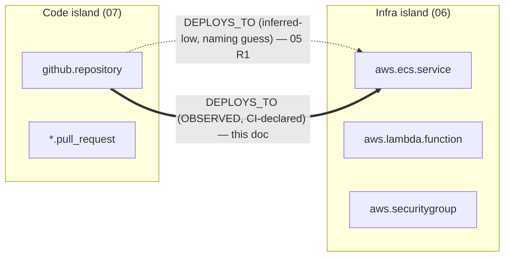

# 07c — CI/CD & Deployment Linking (Jenkins first; the code↔infra keystone connector)

> **Document status:** Phase-2 design (build-ready) · **Version:** 1.0 · **Last updated:** 2026-07-08
> **Owner:** Founding Principal Architect · **Audience:** Backend/worker engineers, AI coding agents
> **Document type:** Connector + Inference Spec (CI/CD deployment platforms) — **NOT MVP**
> **Depends on:** `06` (**Connector SDK contract §3** — Jenkins implements the same interface), `07` (GitHub connector — the deploy-inference reference this extends), `05` (node kinds, URN grammar, signals, **rules R1/R4/R6**, confidence model, `atlas.service` DD-1), `03` (domain model), `04` (`node_kinds.category`), `00` (P1, P3, P5, P9)
> **Consumed by:** `05` (new observed deploy edges + rule extensions), `10` (RCA-to-the-PR north star), `13` (read-only token security), `15` (roadmap), `18` (segment expansion)

---

## ⚠️ Scope Status (read first)

This connector is **not in the MVP**, but it is **not a mere contingency like Bitbucket (`07b`)** — it is the **keystone that connects the two halves of the graph**, and should be prioritized accordingly once the MVP cloud/code set is stable.

- `00` NG5 / `01` OOS defer non-MVP connectors to Phase 2. This doc **does not change that**; to promote CI/CD linking into MVP, update **first, in order:** `00` (add to scope) → `01` (FRs/US) → `15` (roadmap) → `18` (segment). Until then, Phase-2.
- Like `07b`, this specifies **only the deltas** from `06`/`07`. Anything not mentioned here is **identical to `07`** by virtue of the shared SDK contract (`06` §3, DD-1). That a full CI/CD connector is a *delta doc* — not a rewrite — is again the validation of `06` DD-1 (P5/NFR-19).
- **Strategic note (why this one matters more):** Bitbucket added *breadth* (another SCM). CI/CD adds *connectivity* — it turns two adjacent subgraphs (code, infra) into **one system graph**. Per **P1 (the graph is the product)**, the connector that most raises graph connectivity + trust is the highest-leverage connector, not just another logo.

## Purpose

Specify how Atlas ingests **CI/CD & deployment platforms** (Jenkins as the first target, generalized to GitHub Actions / GitLab CI / Argo CD / AWS CodePipeline) and, critically, how their data **upgrades the `DEPLOYS_TO` link between code and infrastructure from a low-confidence naming *inference* (`05` R1) to a high-confidence *observed* fact** — the edge that lets blast-radius and AI RCA (`10`) reach from a broken runtime resource **back to the PR that shipped it**.

## Scope

**In scope:** the deploy-edge model (observed vs inferred), the **three linking signals** (CI-declared target · artifact/image identity · resource deploy-tags) and their confidence, Jenkins-specific auth/discovery/parse deltas, new inference-rule extensions to `05`, the `deploy` timeline-event population, generalization to other CI/CD systems, and conformance to `06` §3.

**Out of scope:** everything identical to `07`; self-hosted networking specifics (VPC-peered Jenkins reachability) → `17`; token security → `13`; the RCA UX itself → `09`/`10` (this doc only *enables* it by providing the edges).

## Assumptions

Inherits `00`–`07`. CI/CD-specific:
- **A40.** Jenkins reachable over HTTP(S) with a **read-only API token** (a Jenkins user with `Overall/Read` + `Job/Read`, no build/configure). Self-hosted reachability is a deployment concern (`17`), not a model concern.
- **A41.** We read **jobs/pipelines, recent builds, and (where declared) deployment/stage targets + artifacts** — never trigger builds (P2, read-only by construction).
- **A42.** The *strength* of the code↔infra link is **data-dependent**: some pipelines name their target explicitly (→ observed), many are opaque shell scripts (→ inferred-low or nothing, **never a wrong edge**, P3).

---

## 1. The Core Thesis — closing the code↔infra loop

Today the graph has two well-connected **islands** and a weak bridge between them:

- **Before (`05` R1):** `DEPLOYS_TO` is *inferred* by matching a workflow's step text against AWS node names — a heuristic that is correctly kept low-confidence (P3). The bridge is thin.
- **After (this doc):** a CI/CD system that **declares** *"pipeline P deployed artifact A to service S"* yields an **observed** `DEPLOYS_TO`. Observed beats inferred; the bridge becomes load-bearing.

**What the closed loop unlocks (the north star, `10`):** one traversal now spans the whole chain —
`securitygroup → PROTECTS → elb → ROUTES_TO → ecs.service → RUNS → atlas.service ← DEPLOYS_TO ← jenkins.job ← (build of) commit ← PR`.
The *"…back to the PR"* tail is **impossible without this link.** RCA that stops at the infra boundary becomes RCA that reaches the code change.

---

## 2. The Core Mapping (Jenkins → Atlas model — `05` unchanged)

| Concept | Jenkins | Atlas node/edge/event (`05`) |
|---|---|---|
| Tenant container | Jenkins instance / folder | (scopes the connection) |
| Pipeline / job | Job / Pipeline (Multibranch, Declarative) | `jenkins.job` (**`category='cicd'`**, alongside `*.workflow`/`*.pipeline`) |
| Build run | Build #N | a **`deploy`/`build` timeline event** (`05` node events) — not a heavyweight node |
| Deployment target | `deployment` stage / plugin (e.g. `deployTo`, aws-ecs, kubectl) | **observed `DEPLOYS_TO`** job→runtime |
| Built artifact | archived artifact / pushed image | `PRODUCES_ARTIFACT` job→`ecr.repository` (or artifact ref); joins to runtime via `USES_IMAGE` |
| Source repo | SCM config (git URL/branch) | `BUILDS` job→`*.repository` (ties the pipeline to code) |
| Commit / PR | `GIT_COMMIT` on the build | feeds `CHANGED_BY` (`05` R6) with an **observed** deploy timestamp |

**Result:** identical graph *shape*; the deploy chain (`05` R1/R4) fires from Jenkins exactly as from GitHub Actions — only the parser + the *confidence upgrade* differ. Consumers (`09`/`10`/`11`) query `node_kinds.category='cicd'` + edge types, never "jenkins".

---

## 3. The three linking signals (and their confidence)

The code→runtime link is only as good as the evidence. We derive it from **three signals, strongest first**, and **never fabricate** (P3):

1. **CI-declared target → `observed`.** The pipeline explicitly names the deploy target (a `deployment:` env, an `aws ecs update-service --service S`, a `kubectl set image deploy/S`, a CodePipeline action). If the named target resolves to an existing infra node → **observed `DEPLOYS_TO`**.
2. **Artifact/image identity → `observed`.** The pipeline pushes image `repo@digest`; an `aws.ecs.taskdef` (or Lambda package) `USES_IMAGE` that same digest (already observed by `06`). Digest equality is *proof* the built artifact is what's running → **observed** deploy (new rule **R7**).
3. **Resource deploy-tags → `observed`/`inferred-high`.** Many teams tag resources with `git-sha` / `deployed-by` / `commit`. A resource whose tag matches a known build → link (new rule **R8**). Observed if the tag is unambiguous.

**Fallback:** an opaque script that clearly *deploys somewhere* but names nothing resolvable → **`inferred-low`** (a tentative edge the UI marks, `09` §7) or **no edge**. Under P3, a missing edge is always preferred to a wrong one.

---

## 4. Inference / ingest rule extensions (to `05` §6.4)

- **R1-obs — CI-declared deploy → `DEPLOYS_TO` (observed).** Supersedes `05` R1's inferred edge **when** the CI system declares a target that resolves to an infra node. Same edge type, higher confidence tier. R4 (`atlas.service` + `RUNS`/`IMPLEMENTS`) now fires from an **observed** base → the derived service node is trustworthy, not heuristic (strengthens `05` DD-1).
- **R7 — `artifact_runs_here` → `DEPLOYS_TO` (observed).** Inputs: pipeline `PRODUCES_ARTIFACT` image `X@digest`; existing `taskdef USES_IMAGE X@digest` (`05`). Match on **digest** (not tag — tags are mutable). Emit observed `job DEPLOYS_TO runtime`.
- **R8 — `resource_tagged_deploy` → `DEPLOYS_TO` + `CHANGED_BY` (observed/inferred-high).** Inputs: resource tag `git-sha=<sha>`; a build of that sha. Emit deploy + a `deploy` timeline event dated to the build.
- **R6-strengthen (`05` R6 `CHANGED_BY`).** With an **observed** deploy timestamp, "what changed this resource" gets a precise, dated culprit PR instead of a merge-time guess — the input the RCA agent (`10`) needs.

All new rules obey `05` §8 confidence and P9 (explainable): every edge carries its evidence (the pipeline step / digest / tag) for the "why?" accordion (`09`).

---

## 5. What's new vs reused

**New (provider-specific only):** `jenkins.job` node kind (category `cicd`), the Jenkins REST/`json` discovery + pipeline/Jenkinsfile/console-target parser, the `PRODUCES_ARTIFACT`/`BUILDS` observed edges, rules R7/R8, and read-only token auth.

**Reused wholesale (unchanged):** the Connector SDK (`06` §3), pipeline + reconcile, `atlas.service` derivation (`05` R4), `USES_IMAGE` (already observed by `06`), the `deploy` timeline-event kind (already in `05`), provenance/raw-snapshot (`04`), confidence tiers, and **all of `09`/`10`/`11`** (they query by category + edge type).

---

## 6. Authentication (delta)

- **Read-only Jenkins API token** on a dedicated user with `Overall/Read` + `Job/Read` only (P2). No `Build`, no `Configure`. Stored via the Secrets Broker (`06`/`13`), same as the AWS/Bitbucket credentials.
- No webhook requirement for v1 (poll recent builds on the sync schedule); an optional Jenkins **notification plugin → Atlas webhook** is an additive latency improvement (mirrors `07`/`07b` webhook handling), not a dependency.

---

## 7. Generalization (same connector shape, different parser)

The model is deliberately platform-neutral — each is a `06` §3 connector emitting the same edges:

| Platform | Pipeline node | Target signal → observed `DEPLOYS_TO` |
|---|---|---|
| **Jenkins** | `jenkins.job` | Jenkinsfile stages / aws-cli / kubectl / deploy plugins |
| **GitHub Actions** | `github.workflow` (exists) | already partially in `07`; upgrade via job env/targets |
| **GitLab CI** | `gitlab.pipeline` (GitLab connector "Soon") | `.gitlab-ci.yml` `environment:` + deploy jobs |
| **Argo CD** | `argocd.application` | Application → target cluster/namespace (declarative, strong signal) |
| **AWS CodePipeline** | `aws.codepipeline` | native deploy actions → ECS/Lambda (observed from AWS API — no extra connector) |

Argo CD and CodePipeline are the **highest-signal** (declarative targets) and worth prioritizing after Jenkins.

---

## 8. Design Decisions

| ID | Decision | Why |
|---|---|---|
| (status) | Phase-2, but the **keystone** connector (higher priority than `07b`) | It raises graph *connectivity*, not just breadth (P1) |
| DD-1 | Deploys are **edges + timeline events**, not heavyweight per-build nodes | Keeps the graph clean; the value is the link + the dated event, not build objects |
| DD-2 | **Digest**, not tag, for artifact identity (R7) | Tags are mutable/reused; digests are proof (P3 — no wrong edges) |
| DD-3 | CI-declared target upgrades `05` R1 to **observed**; opaque scripts stay **inferred-low/none** | Confidence must track evidence strength (`05` §8, P3) |
| DD-4 | `jenkins.job` = `category='cicd'`; consumers query by category | Provider-neutral AI/search/UI (mirrors `07b` DD-2) |
| DD-5 | Read-only token, no build permission; webhooks optional | Read-only by construction (P2); no onboarding blocker |

## 9. Risks

| ID | Risk | Mitigation |
|---|---|---|
| CICDR-1 | Opaque pipelines name no resolvable target → thin link | Multi-signal (target/artifact/tag); fall back to inferred-low or nothing (P3); disclose coverage |
| CICDR-2 | Self-hosted Jenkins not reachable from Atlas workers | Deployment concern (`17`): VPC peering / agent; not a model change |
| CICDR-3 | Mutable image tags cause wrong runtime match | Match on **digest** only (DD-2) |
| CICDR-4 | Jenkinsfile / plugin syntax variety | Start with common deploy shapes (aws-cli, kubectl, ecs/eks plugins); unknown → inferred-low |
| CICDR-5 | Stale deploy edges after a resource is replaced | Reconcile (`06`) marks edges stale like any observed edge; convergence (P7) |
| CICDR-6 | Scope creep dilutes MVP | Gated behind promotion (NG5/OOS); build after cloud/code MVP is stable |

## 10. Edge cases

- **Pipeline builds but never deploys** (lint/test only) → `BUILDS` edge, **no** `DEPLOYS_TO` (correct absence, like `07` no-deploy workflow).
- **Deploy to a target Atlas hasn't ingested** (e.g. an unconnected account) → hold as an inferred-low edge to a placeholder or drop; never invent the node (P3).
- **Blue/green & canary** → multiple concurrent `DEPLOYS_TO` from one job; all observed; the newest `deploy` event wins for "current".
- **Monorepo → many services** → one job `DEPLOYS_TO` several runtimes; each is its own observed edge with its own artifact evidence.
- **Rollback** → a `deploy` event with the prior artifact digest; the timeline tells the true story (P7/P9).

## 11. Open Questions

- **OQ-CICD-1** Promote to MVP or keep Phase-2? — product/sales; default Phase-2 (requires `00`/`01`/`15`/`18` first). *Recommend prioritizing above further SCMs.*
- **OQ-CICD-2** First platform after Jenkins — Argo CD vs CodePipeline (both declarative, high-signal)? Calibrate with target customers.
- **OQ-CICD-3** Webhook/notification-plugin for low-latency deploy events vs poll-only v1 — UX/onboarding tradeoff (`13`).
- **OQ-CICD-4** Confidence policy for tag-based linking (R8) when tags are non-standard — calibrate with `05`/`14`.
- **OQ-CICD-5** Should `atlas.service` derivation now *require* an observed deploy (tightening `05` DD-1's "minimal") once CI/CD is connected? Revisit R4 confidence.

## 12. References

- **Upstream:** `00` (P1/P3/P5/P9), `05` (URN §2, node kinds, signals, **rules R1/R4/R6**, confidence §8, `atlas.service` DD-1), `06` (**Connector SDK §3**, reconcile/partial-sync §7, permission-degradation §8, `USES_IMAGE`), `07` (deploy-inference reference — workflow parsing §7, webhooks §5), `03` (domain), `04` (`node_kinds.category`).
- **Downstream:** `09` (evidence/"why?" for deploy edges, timeline `deploy` events), `10` (**RCA-to-the-PR** — the payoff), `13` (read-only Jenkins token, optional webhook secret), `14` (Jenkinsfile/digest-join fixtures), `15` (Phase-2 placement — keystone priority), `18` (CI/CD-segment expansion).

---

### Change log
| Version | Date | Author | Change |
|---|---|---|---|
| 1.0 | 2026-07-08 | Founding Principal Architect | Initial CI/CD & deployment-linking design (Jenkins-first delta spec; observed deploy edges closing the code↔infra loop) |
