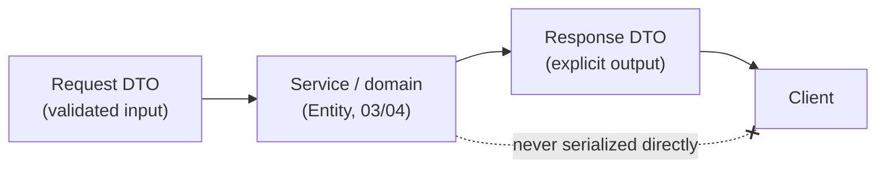
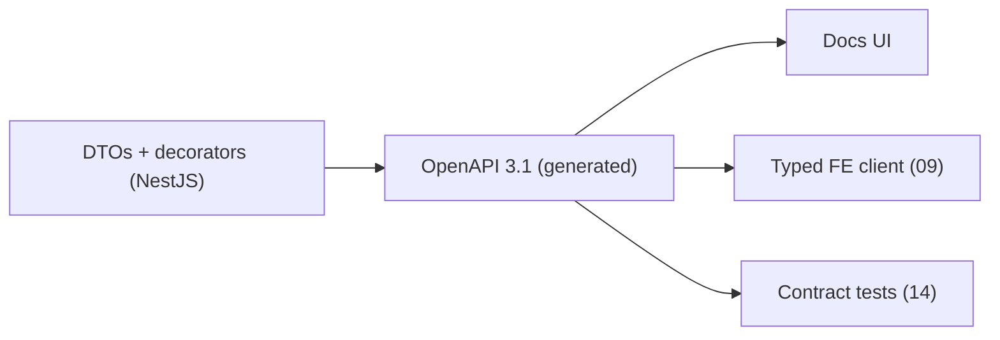

# 08 — API Specification

> **Document status:** Authoritative · **Version:** 1.0 · **Last updated:** 2026-06-30
> **Owner:** Founding Principal Architect · **Audience:** Backend + frontend engineers, AI coding agents, QA
> **Document type:** REST API Contract
> **Depends on:** `00` (P4/P5/P8), `01` (FA-1–7, FR/NFR, US-x), `02` (§3 API/BFF, §3.3 tenant scoping, SSE), `03` (entities, validation §8), `04` (tables), `05` (traversals), `12` (auth — referenced)
> **Consumed by:** `09` (frontend consumes these endpoints), `10` (AI endpoints), `11` (search endpoints), `12` (auth endpoints), `14` (contract tests), `16` (DTO/controller conventions)

---

## Purpose

This document is the **contract between the backend (NestJS API/BFF, `02` §3) and every client** — the Next.js web app (`09`), the AI surface (`10`), search (`11`), and any future programmatic consumer. It specifies endpoint design, request/response DTO schemas with concrete examples, validation, the uniform error model, authentication, versioning, pagination, filtering, and OpenAPI standards.

Every endpoint here realizes one or more functional requirements from `01` and exposes the domain (`03`) without leaking internal storage shape (`04`). The contract is **stable, versioned, and tenant-scoped by construction** (`02` §3.3) — a client cannot, by any request, reach another org's data (R8).

## Scope

**In scope:** REST conventions; resource model & URL design; auth & tenancy; DTO strategy; request/response schemas + examples for the MVP endpoint surface (auth, orgs, members, invitations, connections, sync, graph/nodes/edges, search, AI, timeline, audit); pagination/filtering/sorting; uniform errors; idempotency; rate limiting; versioning; OpenAPI/SDK generation; streaming (SSE).

**Out of scope (pointers):** Auth internals (JWT, sessions, OAuth flows) → `12`; AI prompt/retrieval internals → `10`; search ranking → `11`; webhook *ingress* endpoints (provider→Atlas) → `07`/`13`; field-level validation rules origin → `03` §8; security headers/threat model → `13`.

## Assumptions

Inherits `00`–`05`, `12`. API-specific:
- **A33.** JSON over HTTPS; `Content-Type: application/json` (except SSE streams and webhook ingress).
- **A34.** All business endpoints are under `/api/v1` and require an authenticated session + an org context (`02` §3.3).
- **A35.** The web app is first-party (BFF pattern, `02` §3.2); a public/partner API and API keys are Phase-1+ (`00` roadmap) — MVP auth is session/JWT for the first-party app.

---

## 1. API Design Principles

| # | Principle | Trace |
|---|---|---|
| AP-1 | **Resource-oriented REST**, nouns + HTTP verbs, predictable URLs | conventional, low-surprise (P10) |
| AP-2 | **Tenant-scoped by construction** — org resolved from auth context, never a trusted client-supplied `org_id` in the path for data reads | R8, `02` §3.3 |
| AP-3 | **DTOs at the boundary** — never serialize ORM entities directly; explicit response shape | `16`, avoids leaking `04` internals & secrets (P8) |
| AP-4 | **Provenance & confidence are first-class in responses** — graph/AI responses always carry source + confidence | P4, `05` §8 |
| AP-5 | **Uniform error envelope** + stable machine-readable `code`s | predictable client handling |
| AP-6 | **Versioned (`/v1`), additive-first** — breaking changes ⇒ new version | stability |
| AP-7 | **Cursor pagination** for large/graph collections; explicit filtering grammar | NFR-1/2 at scale |
| AP-8 | **OpenAPI 3.1 generated from code** — the spec is derived, never hand-drifted | single source of truth |
| AP-9 | **Idempotency keys** for unsafe, retry-prone POSTs (connections, invites) | P7, client retries |
| AP-10 | **Read-only safety surfaced** — no endpoint mutates customer cloud/repo; Atlas writes are metadata/jobs only | P2 |

> **DD-1 — REST + BFF for MVP, not GraphQL.** **Why:** the first-party Next.js app has well-known, page-shaped data needs that the BFF can serve as purpose-built DTOs (`02` §3.2); REST is simpler to cache, version, secure, and document, and avoids GraphQL's N+1/complexity-control overhead on graph traversals (which we already bound server-side, `05` §7). **Where GraphQL-like flexibility is needed** (graph exploration), we expose **purpose-built traversal endpoints** (§9) rather than a generic query language — keeping traversal cost server-controlled (NFR-1). **Alternative — GraphQL:** reconsidered when a public/partner API lands (Phase-1+); the BFF shape doesn't preclude it.

---

## 2. URL & Resource Conventions

```
https://api.atlas.example.com/api/v1/<resource>[/<id>][/<subresource>...]
```

- **Base:** `/api/v1`. Version in the path (AP-6).
- **Org scoping (AP-2):** the active org is resolved from the session/JWT (`12`); **data endpoints do not take `org_id` in the path.** A user with multiple orgs selects the active org via `X-Atlas-Org: <orgId>` header (validated against membership) or a session-stored default. Org-management endpoints that operate *on* an org (e.g. settings) use `/orgs/{orgId}/...` and authorize membership explicitly.
- **Resource naming:** plural nouns (`/connections`, `/nodes`, `/sync-runs`).
- **Sub-resources:** `/connections/{id}/sync-runs`.
- **Actions that aren't CRUD:** `POST /connections/{id}:verify` (colon-action suffix for non-CRUD operations — explicit, greppable).

| HTTP | Meaning | Body | Idempotent |
|---|---|---|---|
| `GET` | read | – | yes |
| `POST` | create / action | yes | only with `Idempotency-Key` (AP-9) |
| `PATCH` | partial update | yes | yes (by value) |
| `DELETE` | remove / disconnect | – | yes |

---

## 3. Authentication & Tenancy (contract view)

> Full mechanics in `12`. Contract-level rules here.

- **Session:** the web app authenticates and receives a session (httpOnly cookie + short-lived access JWT, `12`). All `/api/v1` calls require it.
- **Org context header:** `X-Atlas-Org: <orgUuid>` selects the active org; the API verifies the caller has an active `Membership` in that org (`03` BR-USER-1) — else `403 forbidden`. Omitted ⇒ session default org.
- **Authorization:** RBAC (`12` matrix) enforced per endpoint; insufficient role ⇒ `403 insufficient_role`.
- **Tenant isolation (AP-2/R8):** every data query is org-scoped server-side (`02` §3.3 + RLS `04` §10); a request referencing another org's resource id returns `404 not_found` (not `403` — we don't reveal existence across tenants, US-12).

```
Authorization: Bearer <access-jwt>        # or session cookie for browser
X-Atlas-Org: 6f9b...e3a1                   # active org (membership-checked)
Idempotency-Key: 0f1c...                   # on retry-prone POSTs
```

---

## 4. DTO Strategy

> **DD-2 — Three DTO layers: Request DTO, Response DTO, internal Entity — never cross them.** Realizes AP-3 / `16`.



- **Request DTOs:** validated at the controller via `class-validator`/`zod` against `03` §8 rules; reject extra fields (`forbidNonWhitelisted`) to avoid mass-assignment (P8).
- **Response DTOs:** explicit allow-list of fields; **secrets never present** (e.g. `connection.secret_ref` is internal-only; responses show `secretConfigured: true`). Snake_case DB columns → camelCase JSON.
- **Shared types:** Request/Response DTOs are TypeScript types shared with the Next.js client (`02` §4, monorepo, `16`) — compile-time contract safety.
- **Provenance/confidence DTOs** are reused across graph and AI responses (AP-4) so citations render identically everywhere (`10`).

**Canonical envelope shapes:**
```jsonc
// Single resource
{ "data": { /* Response DTO */ } }

// Collection (paginated)
{ "data": [ /* Response DTOs */ ],
  "page": { "cursor": "...", "nextCursor": "eyJ...", "hasMore": true, "limit": 50 } }

// Error (see §11)
{ "error": { "code": "...", "message": "...", "details": [], "requestId": "..." } }
```

---

## 5. Common: Pagination, Filtering, Sorting (AP-7)

> **DD-3 — Cursor (keyset) pagination, not offset.** **Why:** stable under concurrent writes (crawls constantly insert nodes), and O(1) for deep pages — offset pagination drifts and degrades (NFR-1). Cursors are opaque base64 of `(sort-key, id)`.

```
GET /api/v1/nodes?kind=aws.lambda.function&region=us-east-1&status=active
                  &limit=50&cursor=eyJ...&sort=-lastSeen
```

| Param | Meaning |
|---|---|
| `limit` | page size (default 50, max 200) |
| `cursor` | opaque keyset cursor from prior `nextCursor` |
| `sort` | field; `-` prefix = desc (whitelisted fields only) |
| `<field>=<value>` | equality filter (whitelisted per resource) |
| `<field>=in:a,b,c` | set filter |
| `q` | free-text (delegates to search, `11`) |
| `confidence` | `observed`\|`inferred-high`\|`inferred-low` (graph) |

- Filter fields are **whitelisted per endpoint** (no arbitrary column exposure); unknown filter ⇒ `400 invalid_filter`.
- Filtering maps to the org-prefixed indexes in `04` §6 (e.g. `kind`,`region`,`status`) — clients can't request unindexed scans.

---

## 6. Auth & Identity Endpoints (FA-7, `12`)

> Detailed flows in `12`; contract surface here.

> **Login is Google OAuth only for MVP** (`12` DD-1). GitHub is **connector** auth (`07`), not login. Email/password is reserved/deferred (`12` §13).

> **⚠️ UPDATE (F1.5, `12` v1.1): login is Supabase-managed.** The OAuth dance, session JWT, refresh, and logout are handled by **Supabase Auth** (Google provider) + `@supabase/ssr` on the client — Atlas exposes **no** `/auth/google/start`, `/auth/google/callback`, `/auth/refresh`, or `/auth/logout` endpoints. The API only **verifies** the Supabase access JWT (JWKS/ES256, `12` §2.1) on each call. The rows below are superseded; the live Atlas-owned endpoints are **`GET /me`** and **`POST /orgs`** (and §7). Sign-out is a client call to Supabase.

| Method | Path | Purpose | Role |
|---|---|---|---|
| ~~`GET`~~ | ~~`/auth/google/start`~~ | *(superseded — handled by Supabase + `@supabase/ssr`)* | — |
| ~~`GET`~~ | ~~`/auth/google/callback`~~ | *(superseded — web `/auth/callback` exchanges the code with Supabase)* | — |
| ~~`POST`~~ | ~~`/auth/logout`~~ | *(superseded — client calls `supabase.auth.signOut()`)* | — |
| ~~`POST`~~ | ~~`/auth/refresh`~~ | *(superseded — Supabase rotates refresh tokens)* | — |
| `GET` | `/me` | current user + memberships + default org (verifies Supabase JWT) | auth |
| `POST` | `/orgs` | create + name org (caller becomes Owner) — used on first login w/ no membership | auth |

**Phase-1 (`12` §7) — domain-based membership (designed, not MVP):**

| Method | Path | Purpose | Role |
|---|---|---|---|
| `GET` | `/orgs/joinable` | orgs the caller's verified `hd` domain can join/request | auth |
| `POST` | `/orgs/{orgId}:join` | auto-join (policy=auto) or create a join request (policy=request) | auth (verified `hd` match) |
| `GET` | `/orgs/{orgId}/join-requests` | pending join requests | Admin+ |
| `POST` | `/orgs/{orgId}/join-requests/{id}:approve` · `:deny` | decide a join request | Admin+ |
| `GET`/`PATCH` | `/orgs/{orgId}/domains` | view/configure claimed domains + `join_policy` | Admin+ |

**`GET /me` →**
```json
{ "data": {
  "id": "u_8f...","email":"ada@acme.com","name":"Ada L.",
  "memberships":[
    {"orgId":"6f9b...","orgName":"Acme","orgSlug":"acme","role":"Owner"}
  ],
  "defaultOrgId":"6f9b..."
}}
```

---

## 7. Organizations, Members, Invitations (FA-7 / FR-7.x)

| Method | Path | Purpose | Role |
|---|---|---|---|
| `POST` | `/orgs` | create org | auth |
| `GET` | `/orgs/{orgId}` | org detail | Member+ |
| `PATCH` | `/orgs/{orgId}` | rename/settings | Admin+ |
| `DELETE` | `/orgs/{orgId}` | delete (soft, grace) | Owner |
| `GET` | `/orgs/{orgId}/members` | list members | Member+ |
| `PATCH` | `/orgs/{orgId}/members/{userId}` | change role | Admin+ (not Owners — BR-MEM-3) |
| `DELETE` | `/orgs/{orgId}/members/{userId}` | remove member | Admin+ (not last Owner — BR-MEM-2) |
| `POST` | `/orgs/{orgId}/invitations` | invite | Admin+ |
| `GET` | `/orgs/{orgId}/invitations` | list pending | Admin+ |
| `POST` | `/invitations/{token}:accept` | accept invite | public(token) |
| `DELETE` | `/orgs/{orgId}/invitations/{id}` | revoke | Admin+ |

**`POST /orgs/{orgId}/invitations`** (US-3)
```jsonc
// Request
{ "email": "eng@acme.com", "role": "Member" }
// 201 Response
{ "data": { "id":"inv_1a...","email":"eng@acme.com","role":"Member",
            "status":"pending","expiresAt":"2026-07-07T00:00:00Z",
            "acceptUrl":"https://app/invite/<token>" } }
// note: token is emailed AND returned once here (acceptUrl) to the creating Admin only — a copyable
// fallback link when email is unavailable. Never surfaced to anyone else, never re-fetchable (13, BR-INV-1)
```

---

## 8. Connections & Sync (FA-1/FA-2/FA-3, FR-1.x/2.x/3.x)

The most security-sensitive surface (touches customer cloud/repo). Mirrors `06`/`07` lifecycles (`03` §5.1).

| Method | Path | Purpose | Role |
|---|---|---|---|
| `GET` | `/connections` | list connections + status/health | Member+ |
| `POST` | `/connections` | start a connection (returns provider setup info) | Admin+ |
| `GET` | `/connections/{id}` | detail (status, health, missing perms) | Member+ |
| `POST` | `/connections/{id}:verify` | verify (AssumeRole/OAuth) | Admin+ |
| `DELETE` | `/connections/{id}` | disconnect (retain\|purge) | Admin+ |
| `POST` | `/connections/{id}:sync` | trigger manual sync | Admin+ |
| `GET` | `/connections/{id}/sync-runs` | sync history | Member+ |
| `GET` | `/sync-runs/{id}` | run detail (stats, scope_result) | Member+ |

**`POST /connections` (AWS)** — returns the exact setup the customer must perform (US-1, FR-1.2):
```jsonc
// Request
{ "provider":"aws", "displayName":"Prod AWS",
  "config": { "regions":["us-east-1","eu-west-1"] } }

// 201 Response — Atlas-generated external id + the precise least-priv role to create (13)
{ "data": {
  "id":"conn_aws_9x...","provider":"aws","displayName":"Prod AWS","status":"pending",
  "setup": {
    "externalId":"atlas-6f9b-3e2a-...",                  // confused-deputy guard (13)
    "atlasPrincipalArn":"arn:aws:iam::ATLAS_ACCT:role/atlas-crawler",
    "policyDocumentUrl":"/api/v1/connections/conn_aws_9x.../policy.json",
    "instructions":"Create an IAM role trusting atlasPrincipalArn with this ExternalId, attach the read-only policy, then call :verify with the role ARN."
  }}}
```

**`POST /connections/{id}:verify` (AWS)** (US-1 happy + degraded + error):
```jsonc
// Request
{ "roleArn":"arn:aws:iam::123456789012:role/AtlasReadOnly" }

// 200 — connected
{ "data": { "id":"conn_aws_9x...","status":"connected",
            "health":{"missingPermissions":[]},
            "initialSync":{"syncRunId":"run_aa...","status":"queued"} } }

// 200 — degraded (FR-1.6, P3) — partial permissions, transparent
{ "data": { "id":"conn_aws_9x...","status":"degraded",
   "health":{"missingPermissions":[
     {"service":"ec2","action":"ec2:DescribeInstances","impact":"EC2 instances will not be indexed"}]},
   "initialSync":{"syncRunId":"run_aa...","status":"queued"} } }

// 422 — error (AssumeRole failed)
{ "error":{ "code":"connection_verification_failed",
   "message":"sts:AssumeRole failed: role cannot be assumed with the provided ExternalId",
   "requestId":"req_..." } }
```

**`POST /connections` (GitHub)** returns the App-install URL (US-2):
```jsonc
{ "data": { "id":"conn_gh_3a...","provider":"github","status":"pending",
   "setup": { "appInstallUrl":"https://github.com/apps/atlas/installations/new?state=conn_gh_3a..." } } }
```

**`DELETE /connections/{id}?mode=retain|purge`** (FR-1.7) — `retain` keeps nodes marked stale (default), `purge` removes the source's nodes (async job); response returns a job ref.

**`GET /sync-runs/{id}`** (US-13 freshness):
```jsonc
{ "data": {
  "id":"run_aa...","connectionId":"conn_aws_9x...","type":"full","trigger":"onboarding",
  "status":"partial",
  "stats":{"discovered":1842,"changed":1842,"deleted":0,"errors":3,"throttles":11,"durationMs":740000},
  "scopeResult":[
    {"scope":"us-east-1/ec2","status":"succeeded","freshAt":"2026-06-30T14:32Z"},
    {"scope":"eu-west-1/rds","status":"stale","reason":"throttled","resumeCursor":"present"}
  ],
  "startedAt":"2026-06-30T14:20Z","finishedAt":"2026-06-30T14:32Z" }}
```

---

## 9. Graph: Nodes, Edges, Traversals (FA-4/FA-5, `05`)

The heart of the read API. All responses carry **provenance + confidence** (AP-4, P4).

| Method | Path | Purpose | FR/US |
|---|---|---|---|
| `GET` | `/nodes` | list/filter nodes (kind, region, confidence, `q`; multi-value CSV facets `source`, `category`, `status`, `health` — OR within a facet, AND across); `page.total` = full match count for the result header | FR-5.3 |
| `GET` | `/nodes/{id}` | node detail (attributes + provenance) | FR-5.2 |
| `GET` | `/nodes/{id}/edges` | direct edges (in/out, filter by type/confidence) | FR-5.1 |
| `GET` | `/nodes/{id}/neighbors` | depth-1 subgraph for viz (node-budgeted) | FR-5.1 |
| `GET` | `/nodes/{id}/blast-radius` | inbound impact closure ("what breaks if…") | FR-4.4, US-4 |
| `GET` | `/nodes/{id}/dependencies` | outbound dependency closure | FR-4.5, US-9 |
| `GET` | `/graph/subgraph` | service-centric / filtered subgraph for the map | US-7 |
| `GET` | `/edges/{id}` | edge detail (evidence, rule, raw snapshot link) | FR-5.2 |

**Traversal query params (server-bounded, `05` §7.4):** `depth` (default 5, max 6), `edgeTypes=in:CONNECTS_TO,DEPENDS_ON,...`, `minConfidence=inferred-high`, `nodeBudget` (capped). Exceeding caps ⇒ values clamped + a `warnings` field (never an unbounded query, A21).

**`GET /nodes/{id}` →** (US-4 supporting detail, FR-5.2)
```jsonc
{ "data": {
  "id":"node_lam_77...","urn":"aws:us-east-1:123456789012:lambda:checkout-processor",
  "kind":"aws.lambda.function","name":"checkout-processor","provider":"aws",
  "region":"us-east-1","status":"active","confidence":"observed",
  "attributes":{"runtime":"nodejs20.x","memoryMb":512,"vpc":"vpc-0a1b"},
  "tags":{"team":"payments","env":"prod"},
  "firstSeen":"2026-06-12T...","lastSeen":"2026-06-30T14:32Z",
  "provenance":{
    "source":"lambda:GetFunctionConfiguration",
    "sourceRef":"aws:us-east-1:123456789012:lambda:checkout-processor",
    "syncRunId":"run_aa...","observedAt":"2026-06-30T14:32Z",
    "rawSnapshotUrl":"/api/v1/raw-snapshots/snap_91..." } }}
```

**`GET /nodes/{id}/blast-radius?depth=5&minConfidence=inferred-high`** (US-4) — *the signature endpoint*:
```jsonc
{ "data": {
  "root":{"id":"node_rds_12...","urn":"aws:us-east-1:123456789012:rds:prod-orders","name":"prod-orders"},
  "impacted":[
    { "node":{"id":"node_ecs_34...","kind":"aws.ecs.service","name":"orders-api"},
      "distance":1,
      "via":[{"edgeId":"edge_5a...","type":"CONNECTS_TO","confidence":"inferred-high",
              "evidence":{"rule":"sg_correlation_connects@1","detail":"SG allows :5432 + env DB host match"},
              "provenanceId":"prov_5a..."}],
      "pathConfidence":"inferred-high" },
    { "node":{"id":"node_repo_9...","kind":"github.repository","name":"acme/orders-svc"},
      "distance":2,
      "via":[ {"type":"DEPLOYS_TO","confidence":"inferred-high","evidence":{"rule":"repo_deploys_to_runtime@1","detail":"deploy.yml line 24, exact ARN"}} ],
      "pathConfidence":"inferred-high" }
  ],
  "warnings":[], "depthUsed":5, "nodeBudget":500, "truncated":false }}
```
> Note: every impacted node carries **`via` (the why-chain)** and **`pathConfidence` = weakest edge** (`05` §7.2/§8). `minConfidence=inferred-high` excludes low-confidence paths (the P3 "high-confidence only" view). This is the exact shape the AI (`10`) consumes to build cited answers.

**`GET /graph/subgraph?focus=service&serviceId=...&depth=2`** returns nodes+edges arrays for the viz canvas (`09`), node-budgeted, each edge with confidence/origin.

> **Estate-map budget is edge-aware.** The full-estate map (`limit`-budgeted, most-recently-seen first) selects the primary budget by `last_seen`, then **pulls the missing endpoint of any touching edge back into view** (bounded by the over-fetch cap). A repo and its runtime are therefore never split by the budget — otherwise the older node (e.g. a repo not re-synced this cycle) would drop past the cut, its `DEPLOYS_TO` edge would be dropped, and the repo would be *falsely* reported as having no infrastructure link. `truncated` still means "more nodes exist than the budget"; the returned node count may slightly exceed `limit` by this frontier. (P3/P4: never hide a real, observed link for a display budget.)

---

## 10. Search, AI, Timeline, Audit (FA-5/FA-6/FA-7)

### 10.1 Search (`11`)
| Method | Path | Purpose |
|---|---|---|
| `GET` | `/search?q=...&kind=...&type=hybrid` | hybrid keyword+semantic search (FR-5.3) |

```jsonc
// GET /search?q=orders database&type=hybrid&limit=10
{ "data":[
  {"node":{"id":"node_rds_12...","kind":"aws.rds.instance","name":"prod-orders"},
   "score":0.91,"match":{"keyword":0.7,"semantic":0.95},"highlights":["prod-<em>orders</em>"]}
 ],
 "page":{"nextCursor":null,"hasMore":false,"limit":10} }
```

### 10.2 AI (`10`) — streamed, cited
| Method | Path | Purpose |
|---|---|---|
| `POST` | `/ai/conversations` | start a conversation (returns id) |
| `POST` | `/ai/conversations/{id}/messages` | ask; **SSE stream** (FR-6.4) |
| `GET` | `/ai/conversations/{id}` | history (FR-6.5) |

**`POST /ai/conversations/{id}/messages`** — `Accept: text/event-stream` (SSE, `02` §4):
```jsonc
// Request
{ "message":"What breaks if the checkout-processor Lambda is deleted?" }
```
```
// SSE stream (event: retrieval_step | retrieval | token | citation | confidence | done | error)
event: retrieval_step
data: {"hop":1,"tool":"search","summary":"3 candidate(s): orders-db (aws.rds.instance) [n1]…"}

event: retrieval
data: {"nodesConsidered":12,"traversals":["blast-radius:node_lam_77"]}

event: token
data: {"text":"Deleting **checkout-processor** would impact "}

event: citation
data: {"marker":1,"nodeId":"node_ecs_34...","edgeId":"edge_5a...","confidence":"inferred-high",
       "source":"sg_correlation_connects@1","provenanceUrl":"/api/v1/edges/edge_5a..."}

event: token
data: {"text":"the orders-api service [1] ..."}

event: confidence
data: {"overall":"inferred-high","caveats":["eu-west-1/rds scope is stale since 13:10"]}

event: done
data: {"messageId":"msg_77...","citations":4}
```
> The AI response **must** carry `citation` + `confidence` events (FR-6.2/6.3, P4/P3); on insufficient grounding it streams an honest-absence message (US-11) and `confidence: insufficient`, never fabricates. Contract detail in `10`. `retrieval_step` events (the agentic loop's "show your work", FR-6.7) stream the tool calls the model made to gather context.
>
> **WebSocket transport (`GET /ai/ws`, DD-P1-5).** The same answer-event union is also served over a WebSocket — the live conversation channel (REST stays for CRUD). It adds **cancellation** (`{t:"cancel"}` aborts the tool-loop + LLM server-side, not just the client read) and smoother multi-event streaming for the agentic loop. Auth is a first frame `{t:"auth", token, orgId}` (never in the URL; verified by the same JWT verifier + membership check as the guards, R8); origin pinned to `WEB_ORIGIN`; ping/pong heartbeat. Client message: `{t:"ask", conversationId, message}`. The web client tries WS and falls back to this SSE endpoint if the socket can't connect. Design: `docs/plans/ai-knowledge-engine-p1-design.md` §9.1.

### 10.3 Timeline — "what changed" (US-5)
| Method | Path | Purpose |
|---|---|---|
| `GET` | `/timeline?since=...&service=...&kinds=...` | chronological changes + PRs/deploys |

```jsonc
{ "data":[
  {"at":"2026-06-30T13:05Z","type":"pr_merged",
   "ref":{"urn":"github:acme/orders-svc:pr:482","title":"bump pool size"},
   "affects":[{"serviceId":"svc_orders","confidence":"inferred-high"}],
   "sourceUrl":"https://github.com/acme/orders-svc/pull/482"},
  {"at":"2026-06-30T13:40Z","type":"resource_changed",
   "ref":{"urn":"aws:...:ecs-service:prod/orders-api"},"change":"desiredCount 3→5",
   "syncRunId":"run_bb..."}
 ], "page":{"nextCursor":"eyJ...","hasMore":true,"limit":50} }
```

### 10.4 Audit (FR-7.5, `13`)
| Method | Path | Purpose | Role |
|---|---|---|---|
| `GET` | `/orgs/{orgId}/audit-events?action=...&since=...` | query audit log | Admin+ |

---

## 11. Error Model (AP-5)

> **DD-4 — One error envelope, stable string `code`s, HTTP status aligned.** Clients branch on `code`, show `message`, log `requestId` (correlates to `02` §9.4 tracing).

```jsonc
{ "error": {
  "code": "insufficient_role",                 // stable, machine-readable
  "message": "Member role cannot manage connections.",  // human, may change
  "details": [ {"field":"role","issue":"requires Admin"} ],  // optional, for validation
  "requestId": "req_7f3a...",                  // trace correlation
  "docsUrl": "https://docs.atlas.example.com/errors/insufficient_role" } }
```

| HTTP | When | Example `code`s |
|---|---|---|
| 400 | malformed/invalid input | `validation_failed`, `invalid_filter`, `invalid_cursor` |
| 401 | unauthenticated | `unauthenticated`, `token_expired` |
| 403 | authenticated, not allowed | `insufficient_role`, `org_access_denied` |
| 404 | not found **or cross-tenant** (US-12) | `not_found` |
| 409 | conflict | `already_exists`, `sync_in_progress` (BR-SYNC-1) |
| 422 | semantically invalid op | `connection_verification_failed`, `invalid_state_transition` |
| 429 | rate limited | `rate_limited` (+ `Retry-After`) |
| 5xx | server/dependency | `internal_error`, `upstream_unavailable` |

**Validation errors (`400 validation_failed`)** enumerate field issues from the `03` §8 rules:
```jsonc
{ "error":{ "code":"validation_failed","message":"Invalid request.",
  "details":[
    {"field":"email","issue":"must be a valid email"},
    {"field":"role","issue":"must be one of Admin, Member"} ],
  "requestId":"req_..." }}
```

**Cross-tenant rule (R8/US-12):** referencing another org's resource id ⇒ `404 not_found`, identical to a non-existent id — existence is never leaked across tenants.

---

## 12. Idempotency, Concurrency, Rate Limiting

- **Idempotency (AP-9, P7):** unsafe POSTs prone to client retry (`/connections`, `:verify`, `/invitations`, `:sync`) accept an `Idempotency-Key` header; the server stores the first result keyed by `(org, key)` and replays it on retry (within a TTL), preventing duplicate connections/syncs (BR-SYNC-1 also guards server-side).
- **Optimistic concurrency:** mutable resources return an `ETag`/`version`; `PATCH` may send `If-Match` to avoid lost updates (used for org/connection settings).
- **Rate limiting:** per-user + per-org token buckets; `429` + `Retry-After` + `X-RateLimit-*` headers. AI endpoints have separate, tighter budgets (cost control, `10`/`18`).

---

## 13. Versioning & Compatibility (AP-6)

> **DD-5 — URI versioning (`/v1`), additive-within-version, deprecation policy.**
- **Additive changes** (new endpoints, new optional fields) ship within `v1` — clients must ignore unknown fields (tolerant reader).
- **Breaking changes** (removed/renamed fields, changed semantics) ⇒ `/v2`; `v1` supported through a published deprecation window with `Deprecation`/`Sunset` headers.
- **Enum growth** (`kind`, edge `type`, error `code`) is **additive and expected** (`04` DD-1, `05`) — clients treat unknown enum values gracefully (render generically), never crash.
- **Why URI over header versioning:** explicit, cacheable, trivially routable, obvious in logs/docs (P10). Header versioning reconsidered only for a public API.

---

## 14. OpenAPI & SDK Generation (AP-8)

- **OpenAPI 3.1 generated from NestJS decorators + DTO schemas** (`@nestjs/swagger`), served at `/api/v1/openapi.json` and a docs UI (gated by env in prod). The spec is **derived from code**, so it cannot drift (single source of truth).
- **Typed client generation:** the frontend SDK and the contract tests (`14`) are generated from the OpenAPI doc — request/response types match the server by construction (`02` §4 type-sharing reinforced).
- **Examples** in this document are kept in sync via OpenAPI `examples` annotations on DTOs (the examples here are illustrative; the spec is canonical).



---

## 15. Endpoint ↔ Requirement Traceability

| Endpoint group | FR / US |
|---|---|
| `/auth/*`, `/me` | FR-7.1, US-1..3 (auth) |
| `/orgs`,`/members`,`/invitations` | FR-7.2/7.3, US-3 |
| `/connections`,`:verify`,`:sync`,`/sync-runs` | FR-1.x/2.x/3.x, US-1/2/13 |
| `/nodes`,`/edges`,`/neighbors` | FR-4.5/5.1/5.2 |
| `/nodes/{id}/blast-radius` | FR-4.4, US-4 |
| `/nodes/{id}/dependencies` | FR-4.5, US-9 |
| `/graph/subgraph` | US-7/8 |
| `/search` | FR-5.3 |
| `/ai/conversations/*` | FR-6.x, US-4/6/7/10/11 |
| `/timeline` | FR-5.4, US-5 |
| `/audit-events` | FR-7.5 |

## 16. Design Decisions Recap

| ID | Decision | Why |
|---|---|---|
| DD-1 | REST + BFF, not GraphQL (MVP) | Simpler caching/versioning/security; server-bounded traversals (P10, NFR-1) |
| DD-2 | Three-layer DTOs, secrets never serialized | No entity leakage / mass-assignment (P8, AP-3) |
| DD-3 | Cursor (keyset) pagination | Stable under concurrent crawl writes, O(1) deep pages (NFR-1) |
| DD-4 | Uniform error envelope + stable codes + requestId | Predictable clients, traceable (AP-5) |
| DD-5 | URI versioning, additive-first, tolerant readers | Stability + expected enum growth (`04`/`05`) |
| (impl) | Cross-tenant ⇒ 404, never 403 | No existence leak (R8/US-12) |
| (impl) | OpenAPI generated from code | No spec drift; typed SDK + contract tests |

## 17. Risks

| ID | Risk | Mitigation |
|---|---|---|
| APR-1 | Traversal endpoints abused for expensive queries | Server-bounded depth/budget, clamp+warn, rate limits (§9/§12) |
| APR-2 | Secret/entity leakage via responses | Response DTO allow-lists, `secretConfigured` not secret, review (`16`), tests (`14`) |
| APR-3 | Cross-tenant id probing | 404-not-403, org-scoped repos + RLS, fuzz test US-12 |
| APR-4 | Breaking change slips into v1 | Contract tests on the OpenAPI diff in CI (`14`); additive-only lint |
| APR-5 | SSE proxy/buffering breaks streaming | SSE chosen for proxy-friendliness (`02` §4); heartbeat events; fallback to chunked |
| APR-6 | Idempotency-key misuse / replay window | TTL'd key store, scoped per org, documented semantics |
| APR-7 | Clients crash on new enum values | Tolerant-reader contract (DD-5), generic rendering of unknown kinds |

## 18. Edge Cases

- **User in multiple orgs, no `X-Atlas-Org`** → falls back to `defaultOrgId`; if none, `400 org_context_required`.
- **`:verify` while a sync is in progress** → `409 sync_in_progress` (BR-SYNC-1).
- **Blast-radius on an orphan node** → `impacted: []` (valid empty result, not error — `05` EC).
- **Search/AI before any sync** → empty results / honest-absence (US-11), `200` with `data:[]`, not error.
- **Pagination cursor from a since-deleted sort context** → `400 invalid_cursor`, client restarts pagination.
- **AI stream disconnect mid-answer** → client may resume via `GET /ai/conversations/{id}` (last persisted message); partial answers are not persisted as complete.
- **Disconnect `?mode=purge` on a large org** → `202 Accepted` + job ref (async), not synchronous.
- **Unknown `kind`/`type` in filter** → `400 invalid_filter` (whitelisted), but unknown values in *responses* render generically (DD-5).

## 19. Open Questions

- **OQ-API-1** Active-org via header (`X-Atlas-Org`) vs path (`/orgs/{id}/...`) for *data* endpoints — current: header for data, path for org-management. Revisit if public API lands.
- **OQ-API-2** Public/partner API + API keys + GraphQL — Phase-1+ (`00` roadmap, A35).
- **OQ-API-3** ~~SSE vs WebSocket for AI if bidirectional features arrive~~ — **RESOLVED (DD-P1-5):** both. SSE remains the simple/fallback path; a WebSocket (`/ai/ws`) is the live conversation channel once bidirectional needs arrived (cancel/interrupt for the agentic loop). See §10.2 + `docs/plans/ai-knowledge-engine-p1-design.md` §9.1.
- **OQ-API-4** Whether `/timeline` is a distinct endpoint or a view over `/nodes`+`/ai` retrieval — kept distinct for caching (revisit with `09`).
- **OQ-API-5** Rate-limit tiers per plan (`18`) — set with pricing.

## 20. References

- **Upstream:** `00` (P2/P4/P5/P8/P10, R8), `01` (FA-1–7, all FR/US, NFR-1/2), `02` (§3 API/BFF, §3.3 tenancy, §4 SSE, §9.4 requestId), `03` (entities, validation §8, BR-MEM/SYNC/INV), `04` (tables/indexes for filters), `05` (traversals §7, confidence §8), `12` (auth/RBAC).
- **Downstream:** `09` (consumes every endpoint; loading/empty/error states map to §11), `10` (AI SSE contract §10.2), `11` (search §10.1), `12` (auth §6), `13` (secrets-never-in-DTO, audit, cross-tenant), `14` (contract tests from OpenAPI, US-12 fuzz), `16` (DTO/controller conventions).

---

### Change log
| Version | Date | Author | Change |
|---|---|---|---|
| 1.0 | 2026-06-30 | Founding Principal Architect | Initial authoritative REST API contract from `00`–`05` v1.0 |
