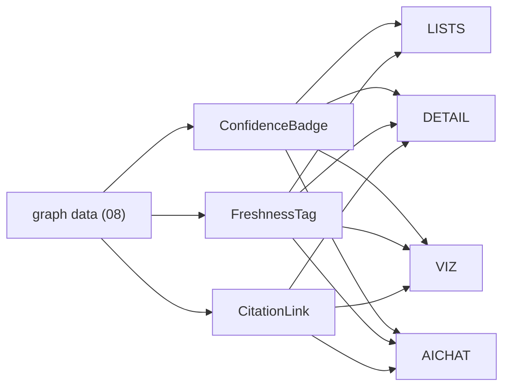
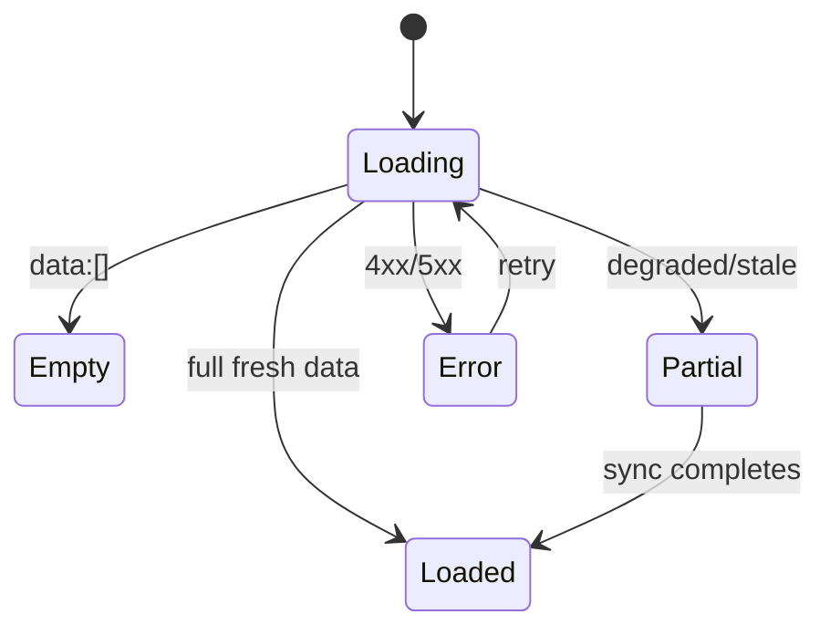
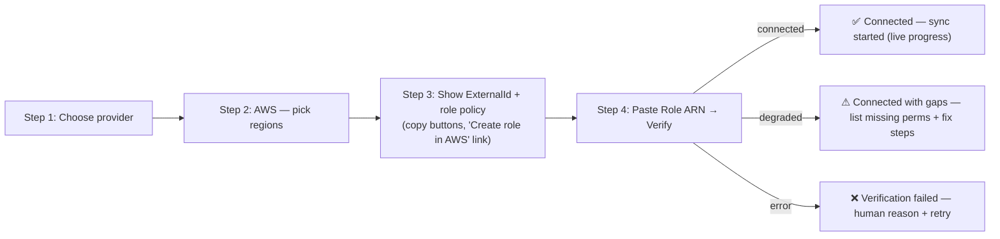

# 09 — Frontend Specification

> **Document status:** Authoritative · **Version:** 1.0 · **Last updated:** 2026-06-30
> **Owner:** Founding Principal Architect · **Audience:** Frontend engineers, designers, AI coding agents, QA
> **Document type:** Frontend Architecture & UX Spec
> **Depends on:** `00` (G3, P1/P3/P4/P9, personas A–E), `01` (FA-5/FR-5.x, US-x, NFR-22/23/24), `02` (§4 Next.js, SSE, TanStack/Zustand), `05` (graph/confidence to render), `08` (API contract this consumes, §11 errors)
> **Consumed by:** `10` (AI chat surface), `11` (search UX), `12` (auth UI), `14` (E2E/a11y tests), `16` (Next.js conventions)

---

## Purpose

This document specifies the **Atlas web application** — its structure, routing, pages, component hierarchy, state management, design system, accessibility, responsive behavior, the full set of UI states (loading/empty/partial/error), user flows, and wireframe descriptions. It realizes the Next.js architecture from `02` §4 and consumes the REST/SSE contract from `08`.

The frontend's job is to deliver **G3 (effortless exploration)** and to make **trust visible (G2)**: provenance, confidence tiers, and freshness/staleness are not afterthoughts — they are core UI primitives (P3/P4/P9). A confident-looking UI over an uncertain graph would betray the product's central promise; this spec makes uncertainty *legible*.

> **The single most important frontend principle:** *the UI never lies about certainty.* Inferred relationships look different from observed ones; stale data is labeled; "we don't know" is a designed state, not an error (US-11/US-13, P3). Everything else is in service of making a correct graph fast and pleasant to explore.

## Scope

**In scope:** App structure & routing; page inventory & layouts; component hierarchy & design system; state management; graph-visualization UX; the loading/empty/partial/error state system; accessibility (WCAG 2.1 AA); responsive behavior; core user flows + wireframe descriptions; performance budgets.

**Out of scope (pointers):** API contract → `08`; AI prompt/streaming internals → `10`; search ranking → `11`; auth/session mechanics → `12`; visual brand/marketing site → `18`; component test harness → `14`.

## Assumptions

Inherits `00`–`08`. Frontend-specific:
- **A36.** Next.js App Router + React + TypeScript; TanStack Query (server state) + Zustand (UI state) (`02` §4).
- **A37.** Desktop-first (engineers on laptops), responsive down to tablet; full mobile is Could-priority (NFR-24, FR-5 is desktop-centric).
- **A38.** Graph canvas rendered client-side from server-supplied, node-budgeted subgraphs (`08` §9, never the whole graph — NFR-24).
- **A39.** Design system built on **shadcn/ui** (Radix headless primitives + Tailwind, copy-into-repo components) + a thin token layer (DD-3) — not a heavy opinionated runtime kit.

---

## 1. Frontend Principles

| # | Principle | Trace |
|---|---|---|
| FE-1 | **Certainty is visible** — observed vs inferred vs stale are distinct visual languages | P3/P4/P9, US-13 |
| FE-2 | **Provenance is one click away** — every claim links to its source | P4, FR-5.2 |
| FE-3 | **Server state via TanStack Query; never hand-rolled fetch caches** | `02` §4, consistency |
| FE-4 | **Every async surface has 4 designed states**: loading, empty, partial/degraded, error | FR-5.5, NFR-22 |
| FE-5 | **Bounded rendering** — viz virtualizes/clusters; lists paginate; never render unbounded graphs | NFR-24, `08` §9 |
| FE-6 | **Accessible by default** — keyboard, ARIA, contrast; graph has a list fallback | NFR-23 |
| FE-7 | **RSC for data-heavy reads; Client Components for interactivity** | `02` §4, NFR-22 TTFI |
| FE-8 | **Deep-linkable state** — selection/filters in the URL for incident sharing | FR-5.6 |

---

## 2. Application Structure (Next.js App Router)

```
app/
  (marketing)/                 # public: landing, pricing (18) — minimal in MVP
  (auth)/
    login/  signup/  invite/[token]/   accept/
  (app)/                       # authenticated shell (requires session + org)
    layout.tsx                 # AppShell: nav, org switcher, command-k
    page.tsx                   # Dashboard / Home
    onboarding/                # connect AWS + GitHub flow
      page.tsx  aws/  github/
    explore/                   # graph visualization
      page.tsx
    nodes/[id]/                # resource detail
      page.tsx
    search/                    # search results
    timeline/                  # "what changed"
    ask/                       # AI conversation surface (10)
      [conversationId]/
    settings/
      members/  connections/  audit/  org/
  api/                         # Next route handlers ONLY for BFF passthrough/SSE proxy if needed
components/                    # design system + feature components
lib/                           # api client (generated from 08 OpenAPI), hooks, stores
```

> **DD-1 — Route groups separate three shells: marketing, auth, app.** **Why:** different layouts, auth requirements, and data needs; the `(app)` group enforces session + org context once at its layout (mirrors `08` §3 tenancy). Unauthenticated access to `(app)` redirects to login (`12`).

> **DD-2 — Server Components fetch initial page data; Client Components own interactivity.** Data-heavy reads (node detail, timeline, dashboard) render on the server (fast TTFI, secrets stay server-side, NFR-22); the graph canvas, AI chat, search-as-you-type, and filters are Client Components hydrated with TanStack Query (`02` §4, FE-7). The boundary is explicit per page in §5.

---

## 3. Design System

> **DD-3 — shadcn/ui (Radix headless primitives + Tailwind, copy-into-repo) + a thin token layer — not a heavyweight runtime component kit.** **Why:** Atlas needs a *specific, dense, technical* aesthetic (think Linear/Datadog) with full control over the graph/confidence visual language (FE-1); a heavy opinionated kit fights that. shadcn/ui gives us **Radix's accessibility (NFR-23) for free** *and* we **own the component source** (it's vendored into our repo, not an upgrade-locked dependency), so we can bend every primitive to the certainty-visual-language (§3.2) without fighting a vendor's theme. It also ships **Blocks** (composed dashboard/auth/settings layouts — accelerates the `09` page inventory) and **Charts** (Recharts-based — used for the Dashboard/Home metrics and connection-health/sync trends). **Alternatives:** **MUI/Chakra** rejected (runtime theme lock-in, bundle weight, harder to express confidence tiers consistently); **fully hand-rolled primitives** rejected (re-implements accessible dialog/combobox/menu that Radix already solves — wasted effort, P10). **Boundary:** shadcn components are the *primitive* layer; the **domain components** (§3.3: GraphCanvas, ConfidenceBadge, ProvenanceDrawer, etc.) are ours, composed *on top of* shadcn primitives. The graph canvas itself is **not** shadcn (it's the WebGL lib, DD-5) — shadcn provides its surrounding controls/panels/legend.

> **DD-3a — Acquire shadcn components via the shadcn MCP server + CLI registry workflow (dev/build-time standard).** Engineers and AI coding agents building Atlas use the **shadcn MCP server** to search the registry, inspect component/block/chart source + demos, and `shadcn add` them (vendored into the repo, then adapted to Atlas tokens). **Why:** it makes the "own-the-source" model (DD-3) fast and consistent — agents pull the canonical primitive/block instead of hand-rolling divergent ones, reducing drift and review load. **Boundary:** the MCP server is a *build-time developer tool*, **not** a runtime dependency or part of Atlas's deployed architecture (`02`) — vendored components ship as ordinary repo code with no MCP at runtime. Registry config, the MCP server setup, and the "adapt-to-tokens before commit" rule are specified in **`16` (coding standards / dev tooling)** and **`17` (local dev environment)**. Third-party/registry components are allowed only after the same a11y + token-adaptation review as first-party shadcn ones (`16`).

### 3.1 Design tokens (the visual language of certainty — FE-1)
| Token group | Purpose |
|---|---|
| **Color — base** | neutral grays, surface elevations (dark-mode-first, engineers' preference) |
| **Color — semantic** | success/warn/error/info |
| **Color — confidence** | `observed` (solid, full-opacity), `inferred-high` (solid, accent), `inferred-low` (dashed/muted) — used on **edges, badges, citations** consistently |
| **Color — freshness** | `fresh` (default), `stale` (amber tint + icon), `deleted/retired` (struck/ghost) |
| **Color — provider** | AWS / GitHub / Bitbucket / derived(`atlas.service`) accents for node legibility |
| **Typography** | mono for identifiers (URNs, ARNs), sans for prose; sizes/weights scale |
| **Spacing / radius / elevation** | dense, technical, consistent |
| **Motion** | subtle; respects `prefers-reduced-motion` (NFR-23) |

### 3.2 Confidence & freshness as reusable primitives
These appear *everywhere* graph data is shown (lists, detail, viz, AI citations) — one implementation, used consistently:
- `<ConfidenceBadge tier="inferred-high" />` → label + color + tooltip ("Inferred (high) — based on: SG allows :5432 + env DB host").
- `<EdgeStyle confidence>` → solid/accent/dashed line styling in the canvas.
- `<FreshnessTag status="stale" since="13:10" />` → amber "stale since 13:10" chip.
- `<CitationLink provenanceUrl marker={1} />` → numbered, clickable source (P4, opens provenance drawer).



### 3.3 Core component inventory
- **Primitives (from shadcn/ui — vendored, DD-3):** Button, Input, Select, Combobox/Command (⌘K palette), Dialog, Drawer/Sheet, Tooltip, Tabs, Toast/Sonner, Badge, Table, Skeleton, Card, Popover, DropdownMenu, Form (+ react-hook-form/zod), Pagination. Long lists/tables wrap shadcn Table with a **virtualizer** (FE-5) for 10k-row smoothness.
- **Blocks (shadcn) used as starting layouts:** Dashboard, Auth (login/signup), Settings — adapted to Atlas tokens; accelerate §5 pages without bespoke layout work.
- **Charts (shadcn Charts / Recharts):** Dashboard metrics (nodes-by-kind, edges-by-confidence), **connection-health & sync-trend** sparklines/area charts (`/settings/connections`), timeline-density chart on `/timeline`. Charts render **counts/trends only** — never used to assert relationships (that's the graph canvas, §6). All charts get an accessible data-table fallback (NFR-23).
- **Domain components (ours, composed on shadcn primitives):** NodeCard, NodeKindIcon, EdgeList, RelationshipRow (with confidence), ProvenanceDrawer, GraphCanvas (WebGL, **not** shadcn — DD-5), GraphControls (filters/legend), BlastRadiusPanel, TimelineItem, SearchResultRow, AiMessage (with citations), ConnectionStatusCard, SyncProgress, MemberRow, **ConfidenceBadge, FreshnessTag, CitationLink** (the certainty primitives §3.2 — built on shadcn Badge/Tooltip but with Atlas-specific semantics).

---

## 4. State Management (FE-3)

> **DD-4 — Server state in TanStack Query; ephemeral UI state in Zustand; URL as the source of truth for shareable view state.** Three clearly separated stores; no Redux (`02` §4).

| State kind | Where | Examples |
|---|---|---|
| **Server/cache state** | TanStack Query | nodes, edges, search results, sync status, members, AI history. Keyed by `(org, resource, params)`; invalidated on mutations & sync events. |
| **Ephemeral UI state** | Zustand | graph canvas selection/zoom/pan, open drawers, panel layout, in-progress filter edits |
| **Shareable view state** | URL search params | selected node, active filters, depth, confidence threshold, timeline window (FE-8, FR-5.6) |
| **Session/auth** | httpOnly cookie + `/me` query (`12`) | current user, memberships, active org |

**Query invalidation & freshness:**
- Mutations (verify connection, invite, disconnect) optimistically update + invalidate relevant queries.
- **Sync awareness:** while a sync runs, the relevant org's graph queries poll (or subscribe — `08` OQ-API-3) at a modest cadence so the graph "fills in" live during onboarding (FR-1.5); a global `SyncIndicator` reflects `sync-runs` status.
- Org switch resets all `(app)` queries (tenant boundary, FE/auth).

---

## 5. Pages & Layouts

### 5.1 AppShell layout (the `(app)` wrapper)
```
┌────────────────────────────────────────────────────────────┐
│ TopBar: [Atlas] [OrgSwitcher▾]   ⌘K Search   [SyncIndicator] [User▾] │
├──────────┬─────────────────────────────────────────────────┤
│ SideNav  │  <page content>                                  │
│  Home    │                                                  │
│  Explore │                                                  │
│  Ask AI  │                                                  │
│  Timeline│                                                  │
│  Search  │                                                  │
│  Settings│                                                  │
└──────────┴─────────────────────────────────────────────────┘
```
- **OrgSwitcher** (multi-org users); **SyncIndicator** (live crawl status + freshness summary — surfaces US-13 globally); **⌘K** command palette (jump to node/page/ask).

### 5.2 Page inventory

| Page | Route | Render | Primary FR/US | Key components |
|---|---|---|---|---|
| **Dashboard/Home** | `/` | RSC | overview, entry points | counts by kind, recent changes, connection health, suggested questions |
| **Onboarding** | `/onboarding` | mixed | FR-1.x, US-1/2 | AWS connect wizard, GitHub install, sync progress |
| **Explore (Graph)** | `/explore` | Client | FR-5.1, US-4/7/8 | GraphCanvas, GraphControls, NodePanel, BlastRadiusPanel |
| **Node detail** | `/nodes/[id]` | RSC + client islands | FR-5.2, US-4/9 | NodeCard, RelationshipRow list, ProvenanceDrawer, mini-graph |
| **Search** | `/search` | Client | FR-5.3 | SearchBar, SearchResultRow, filters |
| **Timeline** | `/timeline` | RSC + client filters | FR-5.4, US-5 | TimelineItem stream, service/kind filters |
| **Ask AI** | `/ask/[conversationId]` | Client (SSE) | FR-6.x, US-4/6/7/10/11 | AiMessage, CitationLink, ConfidenceBadge, retrieval trace |
| **Settings · Connections** | `/settings/connections` | RSC | FR-1.x | ConnectionStatusCard, SyncProgress, missing-perms panel |
| **Settings · Members** | `/settings/members` | RSC | FR-7.2/7.3 | MemberRow, InviteDialog |
| **Settings · Audit** | `/settings/audit` | RSC | FR-7.5 | audit table (Admin+) |
| **Auth** | `/login`,`/signup`,`/invite/[token]` | — | FR-7.1 | forms (`12`) |

---

## 6. The Graph Visualization (the centerpiece — FR-5.1)

> **DD-5 — Client-side canvas/WebGL rendering of server-bounded subgraphs; progressive expansion, never whole-graph load.** **Why:** NFR-24 + `08` §9 — graphs can be large; we fetch a focused, node-budgeted subgraph and let the user expand (`/nodes/{id}/neighbors`). Rendering tech: a Canvas/WebGL graph library (e.g. a force/DAG layout lib) chosen for performance at hundreds–thousands of visible nodes; final lib choice in `16` (constrained to "performant, accessible-fallback-able"). **Alternative — SVG/DOM nodes:** rejected beyond small graphs (DOM blows up; FE-5).

### 6.1 Interactions (FR-5.1)
- **Focus a node** → highlights its neighborhood, opens NodePanel (detail + relationships).
- **Expand neighbors** → fetches depth-1 from `/neighbors`, merges into canvas (progressive, budgeted).
- **Blast radius** → "What breaks if deleted?" button → calls `/blast-radius`, highlights impacted nodes with **per-path confidence coloring** (high = solid, low = dashed), opens BlastRadiusPanel listing impacted resources + why-chains.
- **Filters/legend** (GraphControls): by kind, region, source, status; **confidence threshold slider** (hide `inferred-low` — the P3 "high-confidence only" view); freshness toggle (show stale).
- **Search-to-focus** (⌘K) jumps the canvas to a node.

### 6.2 The confidence-visible canvas (FE-1 made concrete)
```
   ╔══════════════╗   ──solid──▶  ╔════════════╗     ← observed (solid)
   ║ orders-svc   ║  ═accent═▶    ║ orders-api ║     ← inferred-high (accent)
   ║ (repo, GH)   ║  ┄┄dashed┄▶   ║ prod-orders║     ← inferred-low (dashed, muted)
   ╚══════════════╝               ╚════════════╝
   legend:  ● observed  ◆ inferred-high  ◇ inferred-low   ⚠ stale
```
Edge styling encodes origin/confidence (`05` §8); stale nodes carry a ⚠ tint; node color encodes provider/kind. Hovering an edge shows its evidence tooltip; clicking opens the ProvenanceDrawer (FE-2).

### 6.3 Accessibility fallback (NFR-23, FE-6)
The canvas is inherently visual; per NFR-23 we provide an **equivalent list/tree view** of the same subgraph (nodes + typed relationships, keyboard-navigable, screen-reader-labeled). Blast-radius results are *primarily* a list (the canvas highlight is the enhancement), so the core answer is always accessible.

---

## 7. UI State System (FE-4, FR-5.5) — the four designed states

> Every data surface implements all four. This is a **Must** requirement (FR-5.5) and a frequent descope target, so it's specified explicitly. Maps to `08` §11 responses.

| State | Trigger (`08`) | Design |
|---|---|---|
| **Loading** | request in-flight | skeletons matching final layout (not spinners) — perceived speed (NFR-22) |
| **Empty** | `200` with `data:[]` | meaningful empty state with a next action ("No EC2 indexed yet — sync in progress" / "Connect AWS to begin") — never a blank screen (US/EC-2) |
| **Partial/Degraded** | `sync_runs.status=partial`, `connection.status=degraded`, stale scopes (US-13) | **inline banner**: "Some data is stale/incomplete: eu-west-1/rds (throttled), EC2 (missing permission)." Affected viz/list regions tagged with FreshnessTag; AI answers about those scopes get caveats. This is the trust-critical state (FE-1). |
| **Error** | `4xx/5xx` envelope (`08` §11) | ErrorState with `message`, retry, and `requestId` (support). Cross-tenant `404` → generic "not found." Auth `401` → redirect to login. |



> **Partial is not Error.** A degraded connection or throttled region renders *data + a truthful banner*, not an error screen — losing the (correct) partial graph would be worse than showing it with a caveat (P3, US-13). This distinction is the heart of FR-5.5.

---

## 8. Core User Flows (wireframe descriptions)

### 8.1 Onboarding: connect AWS (US-1, FR-1.x)

**Wireframe (Step 3):** left column = numbered instructions; right column = a code block with the **exact least-privilege policy JSON** (`08`/`13`) + the External ID, each with a copy button and a "why these permissions?" disclosure (trust, Persona E). Step 4 polls `:verify`; on success transitions to a **live sync progress** view (resources discovered counter, per-scope status from `sync_runs.scope_result`).

### 8.2 Blast radius (US-4) — the signature flow
```
NodePanel: checkout-processor (Lambda, observed) [What breaks if deleted? ▸]
  ↓ click
BlastRadiusPanel:
  "Deleting checkout-processor impacts 4 resources"   [● high-confidence only ⌄]
  ┌ orders-api (ECS service)          distance 1  ◆ high   via CONNECTS_TO  [source]
  ┌ checkout (service)                distance 2  ◆ high   via DEPENDS_ON   [source]
  ┌ ALB prod-alb                      distance 2  ● obs    via ROUTES_TO    [source]
  ┌ orders-svc (repo)                 distance 2  ◇ low    via DEPLOYS_TO(name match) [source]
  [Open in graph]  [Ask AI to explain]
```
Each row: impacted node, distance, **confidence badge**, the **via edge type**, and a `[source]` CitationLink (opens ProvenanceDrawer with the raw snapshot / workflow line). The confidence filter at top toggles `inferred-low` rows (P3). "Ask AI to explain" hands the same `/blast-radius` result to the AI surface (§8.4) for narration.

### 8.3 "What changed this week" (US-5)
Timeline stream, newest first; each `TimelineItem` = timestamp, change type (PR merged / resource changed / deploy), affected service (with confidence), and a source link. Filters: service, kind, time window (URL-encoded, FE-8). A throttled/stale window shows the partial banner (§7).

### 8.4 Ask AI (US-4/6/7/10/11) — streamed & cited
```
[ Ask: "What breaks if the checkout-processor Lambda is deleted?" ]
AiMessage (streaming):
  "Deleting checkout-processor would impact the orders-api service [1] and,
   transitively, the checkout service [2]. The deploying repo orders-svc [3]
   would also be affected."
  ⓘ Confidence: high  ·  ⚠ caveat: eu-west-1/rds is stale since 13:10
  Sources: [1] CONNECTS_TO (SG :5432 + env)  [2] DEPENDS_ON  [3] DEPLOYS_TO (deploy.yml:24)
  [Show retrieval: 12 nodes considered ⌄]
```
Renders the `08` §10.2 SSE stream: tokens append live; `citation` events become numbered `CitationLink`s; `confidence` event drives the badge + caveats; on insufficient grounding, an **honest-absence** message ("I don't have data on that — connect X / it isn't in the synced graph") with no fabricated content (US-11, FE-1). Full AI UX in `10`.

### 8.5 Resource detail (US-9, FR-5.2)
NodeCard (identity, kind icon, provider, region, freshness) → tabs: **Attributes** (normalized + "view raw" → ProvenanceDrawer), **Relationships** (in/out RelationshipRows with confidence + source), **Mini-graph** (depth-1, link to Explore), **Provenance** (source API, sync run, last seen). "Which services depend on this?" (US-9) is the inbound relationship list + a "dependencies" expansion.

---

## 9. Accessibility (NFR-23, FE-6)

> **Target: WCAG 2.1 AA for core flows** (onboarding, explore, node detail, ask, settings).
- **Keyboard:** all interactions reachable; ⌘K palette; focus management in dialogs/drawers; visible focus rings.
- **Screen readers:** semantic landmarks, ARIA labels on icon buttons, live regions for streaming AI and sync progress; the **graph list fallback** (§6.3) is the SR-accessible equivalent.
- **Color:** confidence/freshness encoded by **shape + label + icon**, not color alone (dashed vs solid, badges with text) — colorblind-safe (a confidence tier is never *only* a hue).
- **Contrast:** AA ratios in both themes; `prefers-reduced-motion` disables canvas animation.
- **Forms:** labeled inputs, inline validation messages mapped from `08` §11 `details[].field`.
- a11y is tested (axe + keyboard E2E) in `14`.

---

## 10. Responsive Behavior (NFR-24, A37)

| Breakpoint | Behavior |
|---|---|
| **Desktop (≥1280)** | full: side nav + canvas + panels side-by-side (primary target) |
| **Laptop (1024–1280)** | panels collapse to drawers; canvas full-width |
| **Tablet (768–1024)** | single-column; graph canvas with reduced controls; lists primary; nav becomes a drawer |
| **Mobile (<768)** | **read-focused** (Could-priority): node detail, timeline, AI, search work; full graph canvas degraded to the list view (§6.3). Onboarding & heavy exploration are desktop-recommended (engineers' context, A37). |

Bounded rendering (FE-5) and the list fallback (§6.3) make the read surfaces usable on small screens without shipping the full canvas.

---

## 11. Performance Budgets (NFR-22, FE-5/FE-7)

| Budget | Target | How |
|---|---|---|
| TTFI (signup→first cited answer) | < 30 min (NFR-22) | guided onboarding, live sync fill-in, suggested questions |
| First contentful paint (app pages) | < 1.5 s | RSC + streaming (DD-2) |
| Graph neighbor expansion | feels instant (<1.5 s, NFR-1) | server-bounded subgraph (`08`), canvas merge |
| AI first token | < 3 s (`08`/NFR-2) | SSE, retrieval shown immediately |
| Bundle | lean | shadcn vendored primitives = only the components we use ship (no kit runtime, DD-3); code-split per route; defer canvas lib to `/explore`, charts lib to Dashboard/settings |
| Virtualized tables/lists | smooth at 10k rows | windowing |

---

## 12. Design Decisions Recap

| ID | Decision | Why |
|---|---|---|
| DD-1 | Route groups: marketing/auth/app shells | Distinct layouts/auth/data; org context enforced once (`08` §3) |
| DD-2 | RSC for reads, Client for interactivity | TTFI + server-held secrets (NFR-22) |
| DD-3 | shadcn/ui (Radix+Tailwind, vendored) + Blocks + Charts | Own the source & dense/confidence aesthetic; Radix a11y for free; blocks/charts accelerate pages (FE-1/NFR-23, P10) |
| DD-3a | Acquire shadcn via its MCP server + CLI (build-time only) | Fast, consistent, low-drift component vendoring for engineers/AI agents; not a runtime dep (detail in `16`/`17`) |
| DD-4 | TanStack(server) + Zustand(UI) + URL(shareable); no Redux | Right tool per state kind (`02` §4, FE-8) |
| DD-5 | Client canvas of server-bounded subgraphs, progressive expand | Scale + perf (NFR-24, `08` §9) |
| (impl) | 4 designed states everywhere; Partial ≠ Error | Trust-critical (P3, FR-5.5, US-13) |
| (impl) | Confidence/freshness/citation as shared primitives | Consistency of the certainty language (FE-1) |

## 13. Risks

| ID | Risk | Mitigation |
|---|---|---|
| FER-1 | Graph canvas perf on large subgraphs | Node budget, WebGL, clustering, progressive expand (DD-5/FE-5) |
| FER-2 | Confidence/staleness ignored by users (over-trust) | Prominent, shape+label encoding, AI caveats, partial banners (FE-1) — usability-test |
| FER-3 | Partial state descoped under pressure | Marked Must (FR-5.5), specified explicitly (§7) |
| FER-4 | SSE rendering jank / disconnects | Token batching, heartbeat, resume via history (`08` §18) |
| FER-5 | a11y of a graph canvas | List fallback (§6.3), shape-not-color, axe tests (`14`) |
| FER-6 | Over-fetching / cache thrash during sync | Modest poll cadence, query-key discipline, invalidation only on relevant events (DD-4) |
| FER-7 | Bundle bloat from graph/AI libs | Route-level code-split, defer to `/explore` & `/ask` |

## 14. Edge Cases

- **Multi-org user** → OrgSwitcher; switching clears `(app)` queries (tenant boundary).
- **Zero connections** → Dashboard becomes an onboarding CTA, Explore shows connect-prompt empty state.
- **Sync in progress, graph partial** → canvas/lists fill in live; partial banner until complete (§7).
- **Node deleted/stale while viewing** → detail shows ghost/struck styling + "last seen" (FreshnessTag).
- **AI answer with zero citations** → only valid if it's an honest-absence; a *factual* answer with no citations is a bug surfaced as a warning (FE-1, P4).
- **Deep-linked node not accessible** (wrong org) → generic not-found (no existence leak, `08`/US-12).
- **Very wide blast radius** (hundreds impacted) → list virtualizes, canvas clusters, "high-confidence only" default suggested.
- **Reduced motion / SR user** → canvas animations off, list view primary, live regions announce streaming.

## 15. Open Questions

- **OQ-FE-1** Graph rendering library choice (perf vs a11y-fallback ergonomics) — decided in `16`; constrained to WebGL-capable + list-fallback.
- **OQ-FE-2** Live sync updates: polling vs subscription/SSE for graph fill-in (`08` OQ-API-3) — start polling.
- **OQ-FE-3** Mobile scope: read-only confirmed Could; revisit if buyer demos demand it (A37).
- **OQ-FE-4** Default confidence filter on blast-radius: hide `inferred-low` by default or show-with-toggle — lean show-with-toggle + clear styling; usability-test (FER-2).
- **OQ-FE-5** Dashboard composition (what's most valuable on Home) — validate with personas A/B.

## 16. References

- **Upstream:** `00` (G3, P1/P3/P4/P9, personas), `01` (FA-5/FR-5.x, US-1/2/4/5/7/9/10/11/13, NFR-22/23/24), `02` (§4 Next.js/SSE/state), `05` (confidence tiers §8, traversal results to render), `08` (every endpoint consumed, §10.2 SSE, §11 error states).
- **Downstream:** `10` (AI chat surface §8.4 detail, citation rendering), `11` (search UX §5/§8), `12` (auth pages §5, session), `14` (E2E flows §8, a11y §9, state tests §7), `16` (Next.js/component conventions, graph lib choice).

---

### Change log
| Version | Date | Author | Change |
|---|---|---|---|
| 1.0 | 2026-06-30 | Founding Principal Architect | Initial authoritative frontend spec from `00`–`08` v1.0 |
