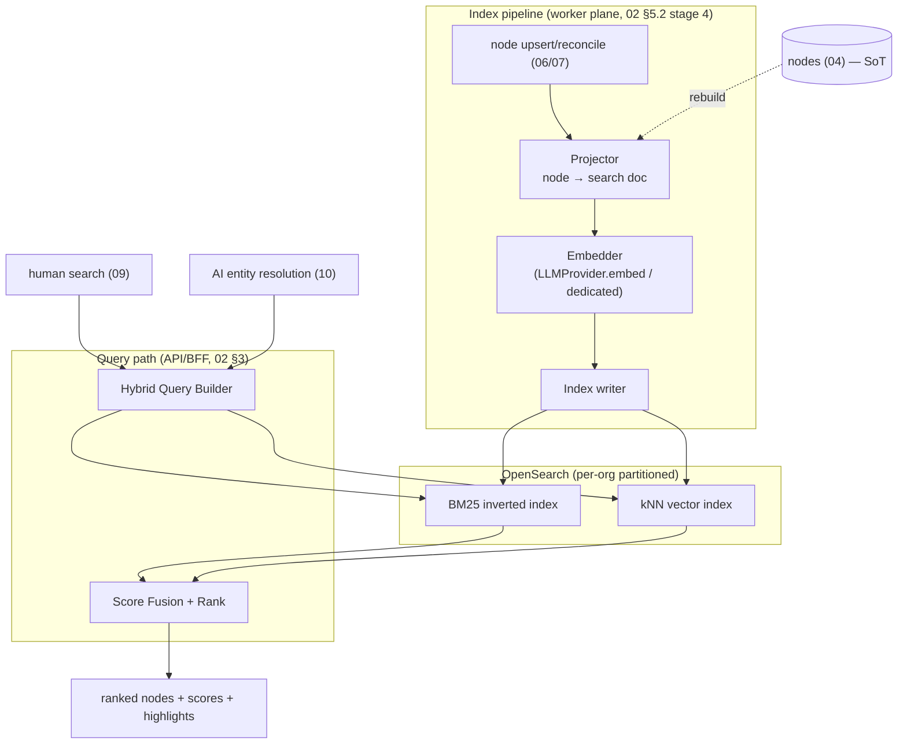
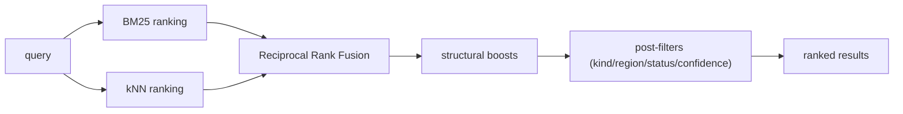
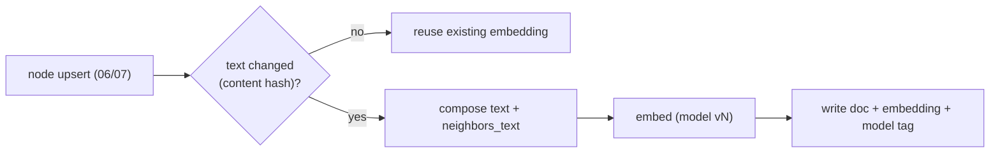

# 11 — Search Engine

> **Document status:** Authoritative · **Version:** 1.0 · **Last updated:** 2026-06-30
> **Owner:** Founding Principal Architect · **Audience:** Backend/search engineers, AI coding agents, QA
> **Document type:** Search & Retrieval Spec
> **Depends on:** `00` (G3, P1/P4/P10), `01` (FR-5.3, NFR-2), `02` (§7 data plane, OpenSearch, "rebuildable from PG" invariant, OQ-ARCH-2), `03` (Node, Embedding §4.7, BR-EMB-1), `04` (`nodes` projection, indexes), `05` (graph is truth; embeddings never assert edges, DD-2), `08` (§10.1 search API), `09` (search UX), `10` (§4.2 entity resolution consumes search)
> **Consumed by:** `09` (search page + ⌘K), `10` (AI entity resolution & retrieval), `14` (search relevance tests), `17` (OpenSearch ops)

---

## Purpose

This document specifies the **Search Engine** — the retrieval substrate that lets users *find* resources fast (FR-5.3, the Explore/⌘K experience in `09`) and lets the **AI Engine resolve entities** ("the orders database" → `node_rds_12`, `10` §4.2). It defines the search architecture, **hybrid keyword + semantic search**, filtering, ranking, the indexing/embedding pipeline, and the consistency model.

Search is, explicitly, a **projection of the graph, not a source of truth** (`02` §7, BR-EMB-1, P1). If the search index is wiped, it is fully rebuildable from PostgreSQL `nodes` (`04`). Embeddings power *finding and ranking* — they **never assert a graph edge** (that's deterministic inference, `05` DD-2). Keeping this boundary crisp is what stops "semantic similarity" from quietly contaminating the trustworthy graph.

> **Search's two consumers, one engine:** the **human** (typing in ⌘K / the search page) and the **AI** (resolving a mention to a node). Both need the same thing — *map fuzzy text to the right resource(s)* — so one hybrid engine serves both. The difference is only in presentation: humans get ranked results; the AI gets resolved node ids + candidates for disambiguation.

## Scope

**In scope:** Search architecture & engine choice; the projection/indexing pipeline; document model; keyword search; semantic (vector) search; **hybrid fusion & ranking**; filtering; the embedding pipeline; consistency/freshness with the graph; tenant isolation in search; performance; AI-vs-human retrieval modes.

**Out of scope (pointers):** Graph traversal (not search — `05` §7); inference (`05`); AI narration (`10`); the search *API contract* → `08` §10.1; search *UX* → `09`; OpenSearch cluster ops/scaling → `17`.

## Assumptions

Inherits `00`–`10`. Search-specific:
- **A44.** **OpenSearch** is the search engine: BM25 keyword + kNN vector in one system (`02` §7, resolves OQ-ARCH-2 — DD-1).
- **A45.** Embeddings generated via the `LLMProvider.embed` or a dedicated embedding model (`10` DD-1), per-node, on the index pipeline.
- **A46.** Search documents are **org-partitioned**; every query is org-filtered (R8, AE-7).
- **A47.** MVP search targets `nodes` (resources/repos/services/PRs). Free-text over raw snapshots/PR bodies is a Could (additive).

---

## 1. Search Principles

| # | Principle | Trace |
|---|---|---|
| SE-1 | **Projection, never truth** — index is derived from `nodes`; rebuildable from PG | `02` §7, BR-EMB-1, P1 |
| SE-2 | **Embeddings find & rank; they never assert edges** | `05` DD-2 (ML only for search) |
| SE-3 | **Hybrid by default** — keyword precision + semantic recall, fused | FR-5.3, G3 |
| SE-4 | **Tenant-isolated** — org filter on every query, non-bypassable | R8, AE-7 |
| SE-5 | **Provenance-preserving** — results carry node id + enough to cite/click through | P4 |
| SE-6 | **Bounded & fast** — p95 < 800 ms (NFR-2); paginated | NFR-2 |
| SE-7 | **Consistent-enough** — index converges with the graph after each sync; staleness is bounded & visible | freshness (US-13) |

---

## 2. Why a Dedicated Search Engine (DD-1)

> **DD-1 — OpenSearch (BM25 + kNN in one engine), not pgvector-only or a separate vector DB.** Resolves `02` OQ-ARCH-2 / `04` OQ-DB-3.

> **Implementation note (G2.4, added 2026-07-01): search is behind a `SearchProvider` interface (like the Connector/JobQueue/SnapshotStore abstractions), with a Postgres-backed impl shipping first and the OpenSearch driver as the deploy target.** Because search is a *projection, rebuildable from `nodes`* (SE-1), the MVP `PostgresSearchProvider` queries `nodes` directly via `pg_trgm` (identifier/keyword match over name/urn/attributes) — no separate index, no new infra, fully testable in CI. It returns the same `{node,score,match,highlights}` shape (`08` §10.1) with `match.semantic = null` until vectors exist. The **OpenSearch driver (BM25 + kNN hybrid + the index/embedding pipeline of §3–§8) is deferred to deploy** — swapping it in is a provider change, no API/consumer change. Tracked in the board's deferral ledger.

| Option | Verdict | Reasoning |
|---|---|---|
| **PostgreSQL `pg_trgm`/`tsvector` only** | insufficient | good keyword/trigram, but no first-class vector kNN at quality/scale; would bolt on `pgvector` and still lack BM25 tuning, analyzers, highlighting |
| **`pgvector` (PG) for vectors + PG FTS** | rejected for MVP | one fewer system, but couples search load to the OLTP DB (contends with crawl writes), weaker hybrid fusion, harder relevance tuning; revisitable if we want to drop a system |
| **OpenSearch (BM25 + kNN)** | **chosen** | **hybrid in one engine**: mature BM25 + analyzers + highlighting *and* native kNN vector search + score fusion; self-hostable/managed; isolates search load from OLTP; rebuildable from PG (SE-1) | 
| **Dedicated vector DB (Pinecone/etc.) + separate keyword** | rejected | two systems to fuse, vendor lock, and we'd *still* need keyword search; OpenSearch does both |

**Why hybrid (not pick one):** keyword (BM25) nails **exact/identifier** matches (ARNs, names, `prod-orders`) — critical for an engineering tool where users type precise tokens; semantic (vector) nails **intent/synonymy** ("the orders database", "the checkout queue") where the user doesn't know the exact name. Engineering search needs both; fusing them (§6) beats either alone (SE-3). This is also exactly what the AI's entity resolution needs (`10` §4.2).

> **The cost we accept:** OpenSearch is a second datastore to operate (`17`). Justified because search quality is core to G3 and to AI grounding (`10`), and OpenSearch isolates that load from the graph OLTP. The "rebuildable from PG" invariant (SE-1) caps the blast radius of any search-store failure — exploration of the graph still works without it (`02` NFR-7).

---

## 3. Architecture



- **Write path:** part of the crawl pipeline's **index stage** (`02` §5.2) — when a node is upserted/reconciled (`06`/`07`), it is projected to a search doc, embedded, and indexed. Idempotent (re-indexing a node overwrites its doc, keyed by node id — mirrors `04` upsert semantics, P7).
- **Read path:** the API/BFF builds a hybrid query, runs keyword + vector, fuses scores, returns ranked nodes (`08` §10.1).
- **Rebuild path:** a full reindex job reads `nodes` from PG and repopulates OpenSearch (SE-1) — used for recovery, mapping changes, or embedding-model upgrades (§8).

---

## 4. The Search Document Model

> A search doc is a **flattened projection** of a `node` (+ light graph context), optimized for matching. It is NOT the node — the node (PG) remains truth (SE-1).

```jsonc
// OpenSearch document (index: search-nodes; routing/filter: orgId)
{
  "docId": "node_rds_12",          // == node id (idempotent key)
  "orgId": "6f9b...",              // SE-4 tenant filter (also index routing)
  "kind": "aws.rds.instance",
  "category": "data",             // node_kinds.category — enables provider-neutral search (07b DD-2)
  "provider": "aws",
  "name": "prod-orders",
  "urn": "aws:us-east-1:123456789012:rds:prod-orders",
  "region": "us-east-1",
  "status": "active",
  "tags": {"team":"payments","env":"prod"},
  "text": "prod-orders RDS instance postgres payments prod orders-api database", // composed searchable text
  "neighbors_text": "orders-api checkout orders-svc",   // light 1-hop context for recall (composed, bounded)
  "embedding": [0.0123, -0.044, ...],                   // vector of `text`(+neighbors_text)
  "embedding_model": "embed-v1",
  "lastSeen": "2026-06-30T14:32Z",
  "freshness": "fresh"            // fresh|stale (mirrors scope_result, US-13)
}
```

**Composing the searchable `text` (DD-2):**
> **DD-2 — Index a composed text field (identity + attributes + light 1-hop neighbor names), not just the name.** **Why:** an engineer searching "orders database" should find `prod-orders` even though the word "database" isn't in its name, and "checkout dependencies" should surface `prod-orders` because `orders-api` (a neighbor) connects to it. Including **bounded** neighbor names (not the whole subgraph — SE-6) improves semantic recall without turning search into traversal (that stays in `05`). Neighbor text is capped and refreshed on reconcile.

---

## 5. Keyword & Semantic Search

### 5.1 Keyword (BM25)
- Analyzers tuned for **engineering identifiers**: a custom analyzer that handles `kebab-case`, `snake_case`, `camelCase`, dots, and ARNs (so `prod-orders`, `prod_orders`, `prodOrders`, and `aws:...:rds:prod-orders` all match sensibly). This is non-trivial and *the* reason BM25 alone needs tuning (DD-1).
- Fields weighted: `name`^3, `urn`^2, `tags`^2, `text`^1, `neighbors_text`^0.5 (exact-name matches dominate).
- **Highlighting** for result snippets (`09` shows matched terms).

### 5.2 Semantic (vector kNN)
- Query embedded with the same model as docs (A45); kNN over the `embedding` field returns semantically near nodes.
- Captures synonymy/intent: "datastore", "db", "where orders are persisted" → the RDS node.
- **Bounded:** top-k (e.g. 50) candidates before fusion (SE-6).

### 5.3 Why both, with a concrete failure of each alone
| Query | Keyword-only | Semantic-only | Hybrid (us) |
|---|---|---|---|
| `prod-orders` (exact) | ✅ perfect | ⚠ may rank fuzzy matches above exact | ✅ exact wins |
| "the orders database" | ⚠ "database" not in name → miss | ✅ finds RDS | ✅ finds + ranks |
| `aws:...:rds:prod-orders` (URN) | ✅ exact | ⚠ noisy | ✅ exact |
| "checkout queue" (user guessed wrong term) | ❌ miss | ✅ finds nearest | ✅ finds, low-but-present |

---

## 6. Hybrid Fusion & Ranking (DD-3, SE-3)

> **DD-3 — Fuse keyword + semantic scores (Reciprocal Rank Fusion as the baseline), then apply structural boosts.** **Why RRF:** it's robust without per-query score-scale calibration (BM25 and cosine scores aren't directly comparable); it combines two *rankings* rather than two *scores*, which is stable across heterogeneous queries. OpenSearch supports hybrid/normalized fusion natively. **Alternative — weighted linear score blend:** brittle (needs score normalization per query); used only if RRF under-performs on the eval set (`14`).

**Ranking pipeline:**


**Structural boosts (engineering-aware ranking):**
- **Exact name/URN match** → strong boost (an exact identifier match should top everything).
- **Freshness** → `stale`/`deleted` nodes demoted (don't surface ghosts above live resources; US-13).
- **Status** → `active` > `stale` > `deleted`.
- **Kind/category relevance** → if the query or context implies a kind (e.g. "database"), boost `category=data`.
- **Connectivity (light)** → highly-connected nodes (services, key datastores) get a mild boost — they're more often what users mean. *Bounded and optional;* not a PageRank, just a tiebreaker.

Result = `08` §10.1 shape: `{ node, score, match:{keyword,semantic}, highlights }`.

---

## 7. Filtering (FR-5.3, `08` §5)

- Filters are **OpenSearch filter clauses** (not scoring) — `kind`, `category`, `region`, `provider`, `status`, `confidence`, `tags.*`, `freshness`.
- The **`orgId` filter is mandatory and injected server-side** (SE-4) — never client-supplied trust; combined with index routing by org for both isolation and performance.
- Whitelisted filter fields mirror `08` §5 (no arbitrary field exposure).
- Filters compose with hybrid scoring: filter narrows the candidate set, hybrid ranks within it.

---

## 8. The Embedding Pipeline (SE-1, BR-EMB-1)

> Embeddings are **disposable projections** (`03` §4.7) — truth is always the node.



- **Incremental:** only re-embed when the composed `text` changes (content-hashed) — avoids re-embedding unchanged nodes every sync (cost, `17`). Mirrors the crawler's hash-skip (`06` DD-3).
- **Model versioning:** each doc records `embedding_model`. An **embedding-model upgrade** triggers a background reindex (read PG → re-embed → swap index via alias) with **zero-downtime alias switch** (DD-4) — queries never see a half-migrated index.
- **Batching:** embeddings generated in batches in the index-stage worker (throughput/cost).
- **No training on customer data** (`13`) — embedding is inference-only.

> **DD-4 — Index via aliases; reindex into a new index, then atomically swap the alias.** **Why:** mapping changes, analyzer changes, and embedding-model upgrades all require a rebuild; an alias swap makes that **atomic and reversible** (point `search-nodes` alias at `search-nodes-v2` once built; roll back instantly). Standard OpenSearch zero-downtime reindex (P10).

---

## 9. Consistency & Freshness with the Graph (SE-7, US-13)

- **Eventual, bounded consistency:** search is updated in the **index stage** *after* node persistence (`02` §5.2). A node is queryable-by-graph slightly before it's searchable; the gap is bounded by index-stage latency (seconds), well within the freshness model.
- **Reconciliation parity:** when reconcile marks a node `stale`/`deleted` (`06`/`07`), the index doc's `freshness`/`status` updates too (demoted/removed from default results) — search never surfaces a deleted resource as live (US-13).
- **Rebuild guarantee (SE-1):** if OpenSearch and PG ever diverge (bug, outage), a full reindex from `nodes` restores parity. A periodic **consistency check** (sampled count/checksum PG vs OS per org) detects drift (`02` AR-3, `17`).
- **Degradation:** if OpenSearch is down, search & AI-entity-resolution degrade (visibly — `09` error state); **graph exploration via PG still works** (`02` NFR-7). The AI falls back to exact name/URN match on PG for entity resolution when search is unavailable (graceful degradation).

---

## 10. Two Retrieval Modes: Human vs AI

One engine, two callers (`10` §4.2):

| | **Human search** (`09`) | **AI entity resolution** (`10`) |
|---|---|---|
| Input | free text in ⌘K / search page | a mention extracted from a question ("the orders database") |
| Output | ranked, paginated, highlighted results | top candidates as **resolved node ids** |
| Ambiguity | user picks from the list | engine disambiguates or passes top-N candidates to the AI (which narrates over them with citations, never silent-picks — `10` AIR-5) |
| Filters | user-driven facets | context-driven (e.g. restrict to `kind=*.rds*` when the mention says "database") |
| Tuning | recall + readable ranking | precision@1–3 (resolving to the *right* node matters most) |

Both hit the same hybrid query (§6); the AI mode adds a **confidence-on-resolution** signal (how clearly did one node win?) — a weak top-1 margin tells the AI to disambiguate rather than assume (feeds `10` §4.2).

---

## 11. Performance (NFR-2, SE-6)

| Budget | Target | How |
|---|---|---|
| Search p95 | < 800 ms (NFR-2) | org-routed index, bounded top-k, filter-then-rank, warm caches |
| Index lag (node→searchable) | seconds | index stage runs right after persistence (`02` §5.2) |
| Reindex (full org) | background, non-blocking | alias swap (DD-4), batched |
| Embedding cost | minimized | hash-skip unchanged (§8), batching |

- **Pagination:** cursor-based (`08` §5), stable under concurrent re-indexing.
- **Scaling:** OpenSearch shards by org/routing; large orgs get more shards; scaling ops in `17`.

---

## 12. Tenant Isolation in Search (SE-4, R8)

- **Mandatory `orgId` filter** injected by the query builder server-side — no code path issues an unfiltered search (mirrors `04` §10 / `08` AP-2).
- **Index routing by `orgId`** so an org's docs colocate (perf) and queries hit only that routing (isolation defense-in-depth).
- **Verified** by a cross-tenant search test (`14`/US-12): a query crafted to leak another org's docs returns nothing.
- Embeddings/docs for an org are **purged on org deletion / connection purge** (`03` §5.3, `08` disconnect `mode=purge`).

---

## 13. Design Decisions Recap

| ID | Decision | Why |
|---|---|---|
| DD-1 | OpenSearch (BM25+kNN), not pgvector-only/separate vector DB | Hybrid in one engine, isolates search load, rebuildable (resolves OQ-ARCH-2) |
| DD-2 | Index composed text incl. bounded 1-hop neighbor names | Recall for intent/relationship queries without doing traversal in search |
| DD-3 | RRF hybrid fusion + structural boosts | Robust scale-free fusion; engineering-aware ranking (SE-3) |
| DD-4 | Alias-based zero-downtime reindex | Safe mapping/embedding-model upgrades (P10) |
| (impl) | Search is a projection; embeddings never assert edges | Protects the graph as truth (SE-1/SE-2, P1, `05` DD-2) |
| (impl) | One engine, two modes (human + AI) | DRY; AI resolution = same hybrid query (`10` §4.2) |

## 14. Risks

| ID | Risk | Mitigation |
|---|---|---|
| SR-1 | Index drifts from graph | Reconciliation parity (§9), consistency check + rebuild from PG (SE-1) |
| SR-2 | Identifier tokenization misses (ARN/case styles) | Custom analyzer (§5.1); relevance tests (`14`) |
| SR-3 | Semantic recall pollutes results (irrelevant near-matches) | RRF + exact-match/structural boosts (§6); filters; eval tuning |
| SR-4 | Embedding cost at scale | Hash-skip + batching (§8); model routing (`17`) |
| SR-5 | OpenSearch outage breaks search & AI resolution | Graceful degrade: graph explore works; AI falls back to PG exact match (§9, NFR-7) |
| SR-6 | Cross-tenant leak via search | Mandatory orgId filter + routing + test (SE-4, US-12) |
| SR-7 | Embedding-model upgrade regresses relevance | Alias reindex (DD-4) + eval gate before swap; rollback by alias |
| SR-8 | Search tempts use as a graph substitute | Hard boundary: search finds nodes; relationships only via graph (SE-2, `05`) |

## 15. Edge Cases

- **Empty index (pre-sync)** → search returns `data:[]` (empty state, `09` §7), not error.
- **Query matches deleted/stale node** → returned demoted + flagged `freshness:stale`; AI caveats (US-13).
- **Ambiguous query (two `prod-orders` across regions)** → both returned; human picks, AI disambiguates (§10).
- **Very short/identifier query** → keyword dominates (exact boost); semantic contributes little (correct).
- **Very vague query ("the thing that's slow")** → low scores across the board; results shown with low confidence; AI may ask to clarify (`10`).
- **Node with no embedding yet** (mid-index) → still keyword-searchable; semantic adds once embedded (graceful).
- **Org with huge node count** → sharded routing, bounded top-k, pagination (§11).
- **Mixed-SCM org (GitHub+Bitbucket, 07b)** → search by `category='scm'` returns both providers' repos uniformly (provider-neutral, `07b` DD-2).

## 16. Open Questions

- **OQ-SE-1** Embedding model choice (Claude embed vs dedicated) & dimension (`10` DD-1) — pick on quality/cost; abstraction allows swap (DD-4).
- **OQ-SE-2** RRF vs normalized linear fusion final choice — RRF baseline; decide on eval set (`14`).
- **OQ-SE-3** Whether to index raw snapshots / PR bodies for full-text (A47, Could) — additive; gated on demand.
- **OQ-SE-4** Neighbor-text depth/size budget in the doc (§4 DD-2) — tune for recall vs index size.
- **OQ-SE-5** Connectivity boost weighting (§6) — start mild; tune to avoid over-favoring hubs.

## 17. References

- **Upstream:** `00` (G3, P1/P4/P10), `01` (FR-5.3, NFR-2), `02` (§7 data plane, OpenSearch, rebuildable invariant, OQ-ARCH-2), `03` (Node, Embedding §4.7, BR-EMB-1), `04` (`nodes` projection, indexes, upsert), `05` (graph-is-truth, DD-2 ML-only-for-search, node kinds/category), `08` (§10.1 search API, §5 filtering/pagination), `09` (search UX, ⌘K, empty/error states), `10` (§4.2 entity resolution, AIR-5 disambiguation), `07b` (category-based provider-neutral search).
- **Downstream:** `09` (renders results), `10` (consumes resolution + retrieval), `14` (relevance/precision tests, cross-tenant search test), `17` (OpenSearch cluster ops, sharding, reindex, embedding cost).

---

### Change log
| Version | Date | Author | Change |
|---|---|---|---|
| 1.0 | 2026-06-30 | Founding Principal Architect | Initial authoritative search spec from `00`–`10` v1.0 |
