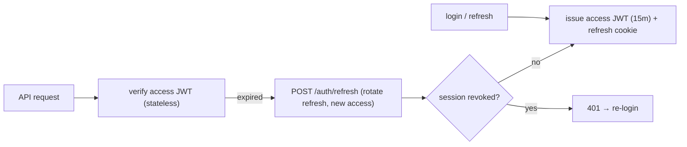
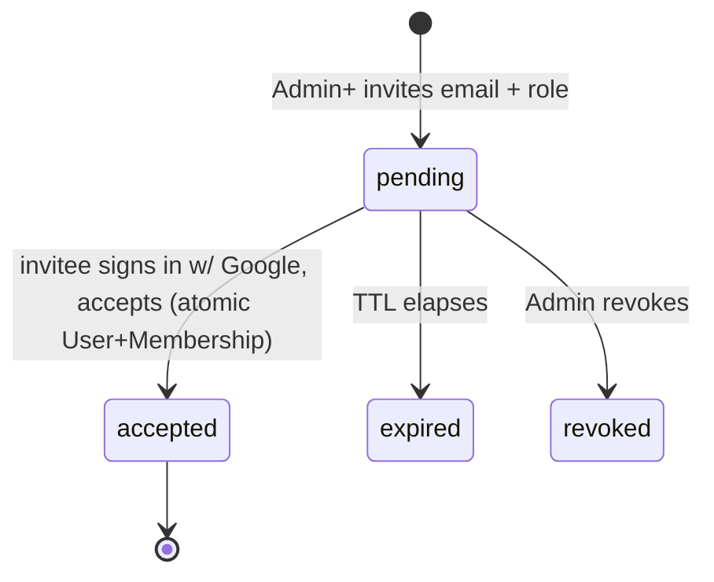
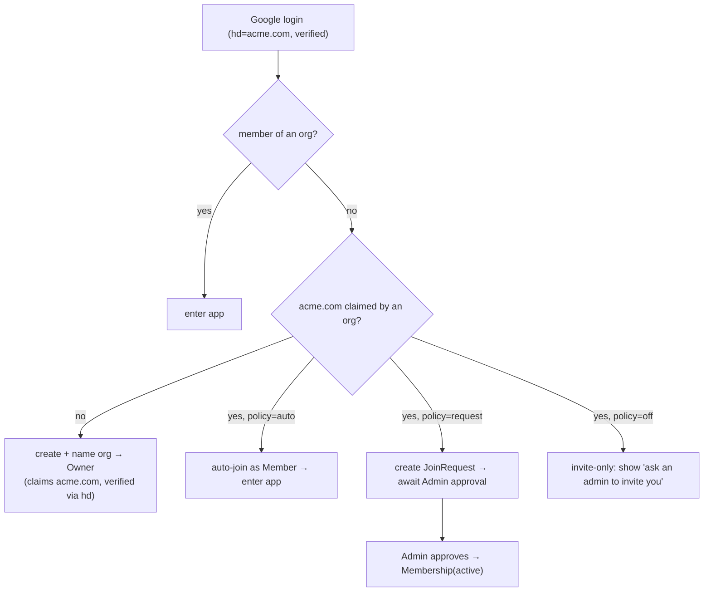

# 12 — Authentication & Authorization

> **Document status:** Authoritative · **Version:** 1.0 · **Last updated:** 2026-06-30
> **Owner:** Founding Principal Architect · **Audience:** Backend engineers, AI coding agents, security/QA
> **Document type:** AuthN / AuthZ / Identity Spec
> **Depends on:** `00` (G4, P2/P6/P8, personas D/E), `01` (FA-7/FR-7.x, US-1/2/3/12, NFR-10/12), `02` (§3.3 tenant scoping, §9.1 multi-tenancy), `03` (User/Org/Membership/Invitation/Connection, BR-x), `04` (auth tables, RLS GUC), `08` (§3/§6 auth contract), `07` (GitHub App — connector auth, distinct from login)
> **Consumed by:** `08` (auth endpoints), `13` (security threat model, secrets), `14` (auth/isolation tests), `09` (auth UI)

---

> **⚠️ DECISION UPDATE (2026-06-30): Supabase Auth adopted as the Google IdP.** Login/identity is now handled by **Supabase Auth (Google provider, free tier)** instead of a hand-rolled Google OIDC + JWT/session stack. **What changes:** §2 (the login flow becomes Supabase-hosted OAuth → Supabase issues the session JWT) and §3 (sessions/refresh are Supabase-managed; NestJS *verifies* the Supabase JWT via JWKS rather than minting its own). **What stays:** the RBAC model (§5), org/membership/invitations (§6), the **`hd`-claim domain-join** design (§7, the `hd` flows through Supabase's Google identity), and — critically — **our GUC-based tenant isolation** (`atlas.current_org` + RLS, §4): NestJS connects to Supabase Postgres as a restricted role and sets the org GUC per request/job. We do **not** use Supabase's `auth.uid()`-in-RLS pattern. A local `public.users` row mirrors Supabase `auth.users` (id = auth uid) so `docs/03`/`docs/04` identity model is preserved. This banner records the decision; §2–§3 are rewritten in full when F1.4 is built (docs-before-code).

## Purpose

This document specifies **how users prove who they are (authentication)** and **what they're allowed to do (authorization)** in Atlas: the Google-OAuth login flow, session/JWT strategy, RBAC, organization membership, invitations, and — designed now, built Phase 1 — **domain-based organization membership** ("company-email auto-join"). It also fixes the boundary between **login identity** (how a human signs in) and **connector identity** (how Atlas reaches a customer's AWS/GitHub — `06`/`07`), which are deliberately separate.

It realizes `02` §3.3 tenant scoping at the identity layer and supplies the guarantees the security reviewer (Persona E) needs: least-privilege, verified identity, strict isolation, full auditability (G4/P8).

> **The identity/connector split (state it once, applies everywhere):**
> - **Login identity** = a *human* signing into Atlas → **Google OAuth only** (MVP, DD-1).
> - **Connector identity** = Atlas reaching a *customer's cloud/repo* → AWS IAM AssumeRole (`06`) / GitHub App (`07`).
> These never mix. Logging in with Google grants no cloud access; connecting AWS grants no login. This separation is a security property, not an accident (P2/P8).

## Scope

**In scope:** Authentication (Google OAuth/OIDC); session & JWT strategy; org/membership/role model & RBAC matrix; invitations (MVP); **domain-based membership & auto-join via the Google Workspace `hd` claim (Phase 1)**; join requests; session lifecycle & revocation; tenant-context propagation to the data layer; security considerations.

**Out of scope (pointers):** Connector auth (AWS AssumeRole → `06`; GitHub App → `07`); secrets storage internals, threat model, prompt-injection → `13`; the auth API wire contract → `08` §6; auth UI → `09`; SSO/SAML/SCIM (deferred, `00`/`01` OOS-6).

## Assumptions

Inherits `00`–`08`. Auth-specific:
- **A48.** **Google OAuth 2.0 / OpenID Connect is the sole login method for MVP** (DD-1). Email/password and other IdPs are deferred (§13 / `01` OOS-6).
- **A49.** Atlas reads the OIDC ID token's standard claims: `sub`, `email`, `email_verified`, `name`, `picture`, and — when present — **`hd` (hosted domain)** for Google Workspace accounts.
- **A50.** Domain-based membership (auto-join) is **Phase 1**; its **data is captured from MVP** (we record `hd`/domain at login because it's free and useful) but the **auto-join/discovery behavior ships Phase 1** (DD-4). MVP onboarding is **Google-login + invite-only**.
- **A51.** A public/free-email-domain **blocklist** (gmail.com, outlook.com, yahoo.com, …) is maintained; such domains never anchor domain-based membership (security floor, non-negotiable).

---

## 1. Auth Principles

| # | Principle | Trace |
|---|---|---|
| AU-1 | **Login identity ≠ connector identity** — humans (Google) vs cloud access (AssumeRole/App) are separate | P2/P8, `06`/`07` |
| AU-2 | **Verified identity only** — `email_verified=true` required; identity trust comes from Google's signed token | G4 |
| AU-3 | **Org access only via Membership** — no implicit access; tenancy resolved from membership | `03` BR-USER-1, R8 |
| AU-4 | **Least-privilege RBAC** — Owner/Admin/Member; connection management gated to Admin+ | `01` FR-7.2 |
| AU-5 | **Tenant context flows to the data layer** — every request sets the org GUC for RLS | `04` §10, `02` §3.3 |
| AU-6 | **Sessions are revocable & short-lived** — short access tokens + rotating refresh | `13` |
| AU-7 | **Domain trust from the `hd` claim, not self-assertion** — a user can't claim a domain they don't verifiably belong to | Phase-1, DD-3 |
| AU-8 | **Everything auditable** — logins, role changes, joins, invites recorded | `01` FR-7.5, `13` |

---

## 2. Authentication: Google OAuth (DD-1)

> **DD-1 — Google OAuth/OIDC as the sole login method for MVP.** **Why:**
> - **Target segment fit (A6):** Atlas's buyers are engineering orgs; the overwhelming majority run **Google Workspace** or have Google identities. One-click "Sign in with Google" is the lowest-friction path to the < 30-min TTFI (NFR-22).
> - **Verified identity for free:** Google returns a **signed, email-verified** identity — we never store passwords, never run a password-reset flow, and inherit Google's MFA/security posture (reduces our attack surface and the security-reviewer's concerns, Persona E, P8).
> - **The `hd` claim is a domain-verification primitive (the key insight):** for Google Workspace accounts, the ID token carries `hd=<workspace-domain>`. This is a **cryptographically-backed proof of domain membership** — it makes domain-based auto-join (§7) safe *without* a DNS-TXT verification step. We get enterprise domain trust as a byproduct of login.
> - **Boring & proven (P10):** OIDC with Google is a well-trodden, well-tooled path.
>
> **Alternatives:** *Email/password* — rejected for MVP (password storage/reset/breach surface, friction; deferred — §13). *GitHub OAuth login* — rejected as the *primary* (not every engineer's GitHub identity maps to their company; no domain claim like `hd`); GitHub remains **connector** auth (`07`). *SSO/SAML* — Phase-1 enterprise (`01` OOS-6); the `hd`-based domain model is the lighter MVP/Phase-1 on-ramp that doesn't need an IdP integration.

### 2.1 Login flow (OIDC Authorization Code + PKCE)
```mermaid
sequenceDiagram
    actor User
    participant Web as Web App (09)
    participant API as API/BFF (08)
    participant G as Google OIDC
    User->>Web: "Sign in with Google"
    Web->>API: GET /auth/google/start
    API-->>Web: redirect to Google (state, PKCE, nonce, scope=openid email profile)
    User->>G: authenticate + consent
    G-->>API: GET /auth/google/callback?code&state
    API->>G: exchange code → ID token + access token
    G-->>API: ID token (sub, email, email_verified, name, picture, hd?)
    API->>API: verify token (sig, aud, iss, nonce, exp); require email_verified
    API->>API: upsert User (by google sub); record domain = hd (if present & not blocklisted)
    API->>API: resolve memberships → issue session (access JWT + refresh cookie)
    API-->>Web: set httpOnly session; redirect to app (or org-picker / onboarding)
```

**Token validation (AU-2, security-critical — `13`):** verify signature against Google's JWKS, `iss`, `aud` (our client id), `exp`, and the **`nonce`** (replay protection); reject if `email_verified` is false. Persist `sub` as the stable Google identity (emails can change; `sub` does not).

### 2.2 Identity model
- A **User** (`03` §3.2) is keyed by Google `sub` via `auth_identities` (`04`): `provider='google'`, `provider_subject=sub`.
- `email` is captured/normalized; **`hd`** (or, defensively, the email domain) is recorded for the domain model (§7) — **captured from MVP, acted on in Phase 1** (A50).
- One human = one User across all their orgs (`03` BR-USER-1); memberships grant org access.

---

## 3. Sessions & JWT Strategy (AU-6)

> **DD-2 — Short-lived access JWT + rotating refresh token in an httpOnly cookie; server-side refresh-session store for revocation.**

| Token | Lifetime | Storage | Contents |
|---|---|---|---|
| **Access JWT** | short (e.g. 15 min) | in-memory / Authorization header (or httpOnly for the BFF) | `sub` (userId), active `orgId`, `role` in that org, `sessionId`, `exp` |
| **Refresh token** | longer (e.g. 30 days, sliding) | **httpOnly, Secure, SameSite cookie** | opaque; maps to a server-side session row |

**Why this split:** access JWTs are stateless and fast to verify on every request (no DB hit per call — NFR-2); the refresh token is **opaque and server-tracked** so sessions are **revocable** (logout, role change, security event) — pure stateless JWT can't be revoked, pure session adds a DB hit per request; this hybrid gets both (DD-2, AU-6).



**Revocation triggers (AU-6):** logout, role change/removal (re-issue with new claims), org deletion/suspension, suspected compromise. Refresh rotation detects token reuse (a replayed old refresh token invalidates the session — theft detection, `13`).

**Org switching:** a multi-org user selects an active org; the API verifies membership and issues an access JWT scoped to that `orgId`+`role`. The `X-Atlas-Org` header (`08` §3) must match the JWT's org or trigger a re-scope — the JWT's org claim is the trusted source, not the header alone.

---

## 4. Tenant Context Propagation (AU-5, `04` §10, `02` §3.3)

The bridge from identity to data isolation (defense-in-depth for R8):
1. **Guard** resolves `(userId, orgId, role)` from the verified access JWT.
2. **Membership check:** confirms an `active` Membership for `(userId, orgId)` (cached; `03` BR-USER-1) — else `403`/`404`.
3. **Org GUC set:** the request handler executes `SET LOCAL atlas.current_org = '<orgId>'` so **PostgreSQL RLS** (`04` §10) backstops every query.
4. **Repository scoping:** the app-layer base repository injects `org_id` (`02` §3.3) — primary mechanism.

So a single request is org-scoped at **three** layers (JWT claim → app repository → RLS GUC). A leak requires all three to fail (R8 is existential — this redundancy is the point).

---

## 5. Authorization: RBAC (AU-4, FR-7.2)

> **DD-3 (RBAC) — Three fixed roles for MVP; custom/granular roles deferred (Phase-1, OOS-6).** Simple, auditable, sufficient for the target segment; complexity added only when demanded (P10).

### 5.1 Role matrix (authoritative — `03` §3.3 summarized this; here is canonical)

| Capability | Owner | Admin | Member |
|---|---|---|---|
| View graph / search / ask AI / explore | ✓ | ✓ | ✓ |
| View connections & sync status | ✓ | ✓ | ✓ |
| **Create/verify/disconnect connections** | ✓ | ✓ | – |
| **Trigger manual sync** | ✓ | ✓ | – |
| Invite members / set Member|Admin role | ✓ | ✓ | – |
| Modify/remove **Owners** | ✓ | – (BR-MEM-3) | – |
| View audit log | ✓ | ✓ | – |
| **Approve domain join requests** (Phase 1) | ✓ | ✓ | – |
| **Configure domain auto-join policy** (Phase 1) | ✓ | ✓ | – |
| Manage billing | ✓ | – | – |
| Rename / delete org | ✓ | – | – |
| Transfer ownership | ✓ | – | – |

### 5.2 Enforcement
- **NestJS guards** (`02` §3.1, `08` §3) evaluate role from the JWT per endpoint; insufficient role → `403 insufficient_role` (`08` §11).
- **Invariants** (service-enforced, tested `14`): ≥1 Owner always (BR-ORG-1), no last-Owner removal/demotion (BR-MEM-2), Admin can't modify Owners (BR-MEM-3).
- Role is part of the access JWT; a role change **revokes/reissues** the session (§3) so stale elevated tokens can't linger.

---

## 6. Organizations & Invitations (MVP, FR-7.3, US-3)

### 6.1 Org creation
- First-time Google login with no membership → user is prompted to **create an org** (name it) and becomes **Owner** (`03` BR-ORG-1, A8). If their `hd` domain already maps to an org (Phase 1, §7), they're offered to **join** instead.
- MVP: org creation is self-serve; one user → Owner.

### 6.2 Invitations (the MVP path to a team)

- Invite by email + role (Admin/Member — never Owner via invite). A **single-use, expiring, hashed token** (`04` `invitations.token_hash`, BR-INV-1) is emailed; the **token is never returned by the API** (`08` §7, `13`).
- Accept: invitee authenticates with Google; if the invited email matches their verified Google email, accepting **atomically creates the User (if new) + Membership** (BR-INV-2). Mismatch → must accept with the invited address.
- Only Admin+ invite (FR-7.3); enforced by guard.

---

## 7. Domain-Based Membership / Auto-Join (PHASE 1 — designed now, built later)

> **⚠️ Phase-1 feature (A50, DD-4).** Fully specified here; **not in MVP**. MVP captures the `hd`/domain *data* at login but does **not** perform discovery/auto-join. Promotion to build = implement §7 behavior + the Phase-1 tables (`04`) + endpoints (`08`). This is the "company email → same team" flow.

### 7.1 The trust model — Google `hd` claim (DD-4, the core idea)
> **DD-4 — Domain ownership/trust is anchored on the Google Workspace `hd` claim, not DNS verification or email-string matching.** **Why:** when `ada@acme.com` signs in and Google returns `hd=acme.com`, Google has **already verified** that Ada is a member of the acme.com Workspace. That is a *stronger* signal than email-string matching (which a squatter could fake on a non-Workspace domain) and requires **no DNS-TXT step** (the friction the user explicitly wanted to avoid). Personal `@gmail.com` accounts have **no `hd` claim** → they cannot domain-join (only invite-join). This elegantly closes the squatter hole that pure email-matching opens (the risk we flagged for Persona E).

| Signal | Meaning | Domain-join eligibility |
|---|---|---|
| `hd` present, not blocklisted (e.g. `acme.com`) | verified Workspace member | **eligible** (auto-join verified domain) |
| `hd` present but blocklisted (shouldn't occur for Workspace) | — | not eligible (A51) |
| no `hd` (personal Gmail) | individual, no verified org | **not eligible** — invite-only |

### 7.2 Domain → Org association
- The **first user with `hd=acme.com`** who creates an org **claims `acme.com`** for that org (recorded in `org_domains`, `04`, `verified=true` *because* the `hd` claim proved it — no DNS needed).
- Subsequent `hd=acme.com` users → eligible for **auto-join** to that org per its policy (§7.3).
- **Multiple orgs on one domain** (big company, separate teams): the domain has a **primary org** for auto-join; additional same-domain orgs are **discoverable** and **request-to-join**, or invite-only (admin policy). Default: auto-join the primary; show others as "request to join."

### 7.3 Join policy (per org, Admin-configurable — DD-3 join model = "auto-join verified")
| Policy | Behavior for a verified same-domain (`hd`-matched) user |
|---|---|
| **`auto`** (default for verified domain) | **joins automatically as Member** on first login (the chosen model) |
| **`request`** | sees the org, **requests to join**; Admin+ approves (`join_requests`, `04`) |
| **`off`** | no discovery/auto-join; invite-only |

> Unverified/non-`hd` users can **never** auto-join (DD-4) — they fall to invite-only. So "auto-join verified only" is enforced *by the absence of a DNS step but presence of the `hd` proof*: verification is intrinsic to login, not a separate gate.

### 7.4 Flows


### 7.5 Membership lifecycle additions (Phase 1)
`03` Membership gains a **`requested`** state (alongside `active`/`invited`/`revoked`): a JoinRequest creates a `requested` membership; approval → `active`; denial → removed. (`04` `memberships.status` already lists these; `join_requests` table is Phase-1, `04`.)

### 7.6 Why this is safe (Persona E summary, for `13`)
- **No domain claim without proof:** the `hd` claim is signed by Google; we can't be spoofed into associating a user with a domain they don't belong to (DD-4, AU-7).
- **Free domains blocklisted** (A51) — gmail users can't mass-join.
- **Email must be verified** (AU-2).
- **Auto-join grants Member only** — never Admin/Owner; elevation requires explicit action (least-privilege, P8).
- **Admins control policy** (auto/request/off) and can disable domain join per org.
- **Audited:** every auto-join/request/approval is an `audit_event` (`04`, `13`).
- **Multi-org-same-domain** handled (primary + request), so a large enterprise isn't forced into one org.

---

## 8. Connector Identity (boundary recap — AU-1)

Restated so it's unmistakable: **connecting a source is not logging in.**
- **AWS:** customer creates a ReadOnly IAM role; Atlas assumes it via STS (`06` §2) — gated to **Admin+** (FR-1.2). No human's Google identity is involved in crawling.
- **GitHub:** GitHub **App installation** (`07` DD-1) for repo access — also Admin+; OAuth-with-GitHub is **not** used for Atlas login (DD-1). (If GitHub login were ever added, it'd be a *login* identity, still separate from the connector App.)
- Connector credentials live in the Secrets Broker (`13`), never in `auth_identities`/sessions.

---

## 9. Security Considerations (→ `13` for full threat model)

| Concern | Handling |
|---|---|
| Token validation | full OIDC validation (sig/iss/aud/nonce/exp), `email_verified` required (§2.1) |
| Session theft | short access JWT, rotating refresh w/ reuse-detection, httpOnly/Secure/SameSite cookies (§3) |
| CSRF | SameSite cookies + state/PKCE on OAuth; CSRF tokens for cookie-auth mutations (`13`) |
| Privilege escalation | role in signed JWT; role change revokes session; guards on every endpoint (§5) |
| Cross-tenant access | three-layer scoping (§4); cross-tenant → 404 (`08`); tested US-12 |
| Domain spoofing (Phase 1) | `hd`-claim trust, free-domain blocklist, no DNS-self-assertion (DD-4, AU-7) |
| Invitation abuse | hashed single-use expiring tokens, never returned by API (§6.2) |
| Auditability | logins, role/membership changes, joins, invites, connection actions → `audit_events` (AU-8) |
| No password surface | Google-only login eliminates password storage/reset/breach risk (DD-1) |

---

## 10. Design Decisions Recap

| ID | Decision | Why |
|---|---|---|
| DD-1 | Google OAuth/OIDC as sole MVP login | Segment fit, verified identity, the `hd` domain primitive, no password surface (P10/P8/NFR-22) |
| DD-2 | Short access JWT + rotating server-tracked refresh | Stateless fast verify + revocability (AU-6) |
| DD-3 | Three fixed RBAC roles (MVP); custom roles Phase-1 | Simple/auditable/sufficient (P10) |
| DD-4 | Domain trust via Google `hd` claim, not DNS; auto-join verified, request-to-join fallback | Verified domain membership for free; closes squatter hole; no DNS friction (Persona E) |
| (scope) | Domain-join designed now, built Phase 1; `hd` data captured from MVP | Tighter MVP, schema/flow ready (A50) |
| (impl) | Login identity strictly separate from connector identity | Security property (P2/P8, AU-1) |

## 11. Risks

| ID | Risk | Mitigation |
|---|---|---|
| AUR-1 | Google outage blocks all login | Documented dependency; Phase-1 add a second IdP/email-fallback via the same OIDC abstraction (§13) |
| AUR-2 | `hd` claim misunderstood/misused (Phase 1) | Trust only Google-signed `hd`; blocklist; Member-only auto-join; tests (`14`) |
| AUR-3 | Multi-org-same-domain confusion | Primary-org + request-to-join model (§7.2); admin policy |
| AUR-4 | Refresh-token theft | Rotation + reuse-detection + httpOnly/Secure (§3, `13`) |
| AUR-5 | Stale elevated session after demotion | Role change revokes/reissues session (§5.2) |
| AUR-6 | Org with no Owner (e.g. sole Owner leaves) | BR-ORG-1 + no-last-Owner-removal (BR-MEM-2); ownership-transfer flow |
| AUR-7 | Email change at Google vs recorded email | Key on `sub` (stable), refresh email on login (§2.2) |
| AUR-8 | Personal Gmail tries to domain-join | No `hd` ⇒ ineligible (DD-4); invite-only |

## 12. Edge Cases

- **User in multiple orgs** → org picker post-login; active org in JWT; switch re-scopes (§3).
- **Invited email ≠ Google email** → must accept with the invited address, or Admin re-invites the correct one (§6.2).
- **First Workspace user creates org, second expects to join (Phase 1)** → §7.4 auto-join (policy=auto).
- **Workspace user, but org policy=off** → invite-only message (§7.3).
- **`hd` present but org claims domain under a different org** → join the primary; others request (§7.2).
- **Sole Owner leaves** → blocked until ownership transferred (AUR-6).
- **Suspended org** → login succeeds but app access blocked with a clear state; no crawls (`03` org status).
- **Token replay** (old refresh reused) → session invalidated, re-login (reuse-detection).
- **Personal Gmail invited explicitly** → fine; invite-join doesn't need `hd` (only domain *auto*-join does).

## 13. Future Considerations

- **Email/password or magic-link** as a secondary login (the OIDC/session layer is method-agnostic; add a provider).
- **Second IdP / SSO-SAML & SCIM** (enterprise, `01` OOS-6) — the session/JWT/RBAC core is reused; SAML maps to the same Membership model; `hd`-domain model is the stepping stone.
- **Custom/granular roles & per-resource permissions** (Phase-1, OOS-6) — role becomes a richer policy object; guards already centralize enforcement.
- **Domain-join build-out** (Phase 1, §7) — `org_domains`/`join_requests` tables + endpoints + admin policy UI.
- **MFA policy enforcement** (delegate to Google now; org-level requirement later).

## 14. References

- **Upstream:** `00` (G4, P2/P6/P8, personas D/E, A6/A8), `01` (FA-7/FR-7.1–7.7, US-1/2/3/12, NFR-10/12, OOS-6), `02` (§3.1 guards, §3.3 tenancy, §9.1 multi-tenancy), `03` (User/Org/Membership/Invitation, BR-USER/MEM/ORG/INV, lifecycles), `04` (`auth_identities`/`memberships`/`invitations`, RLS GUC §10; Phase-1 `org_domains`/`join_requests`), `08` (§3 auth/tenancy, §6 auth endpoints), `06`/`07` (connector identity — distinct from login).
- **Downstream:** `08` (Google + Phase-1 domain endpoints), `13` (OIDC validation, session/cookie security, `hd`-trust threat model, secrets, audit), `14` (auth flow, RBAC, US-12 isolation, Phase-1 domain-join tests), `09` (login/onboarding/org-picker/join UI).

---

### Change log
| Version | Date | Author | Change |
|---|---|---|---|
| 1.0 | 2026-06-30 | Founding Principal Architect | Initial auth spec: Google-only login, JWT/session, RBAC, invitations (MVP); Google-`hd` domain-based auto-join (Phase 1) |
