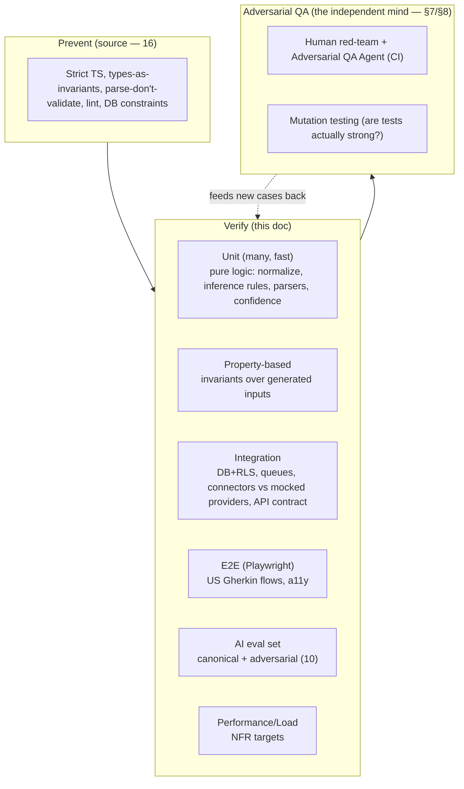
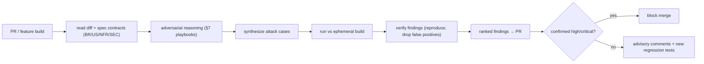
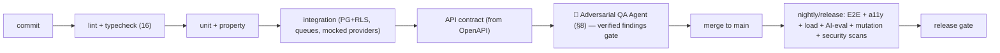

# 14 — Testing & Quality Strategy

> **Document status:** Authoritative · **Version:** 1.0 · **Last updated:** 2026-06-30
> **Owner:** Founding Principal Architect · **Audience:** All engineers, QA, AI coding agents, SRE
> **Document type:** Testing, Verification & Quality-Gate Strategy
> **Depends on:** `00` (G1/G2, P1/P3/P4/P9), `01` (FR/NFR/US acceptance criteria), `02`–`13` (everything under test: BR-x invariants, US Gherkin, NFR targets, SEC controls, DD-x)
> **Consumed by:** `15` (Definition of Done references these gates), `16` (coding standards = the source-level half), `17` (CI/CD pipeline runs these gates)

---

## Purpose

This document defines **how Atlas proves it works and stays working** — the test strategy, the quality gates, and (centerpiece) an **independent, adversarial QA layer** whose explicit job is to *break* the system and find logic loopholes the author didn't consider. It exists because Atlas's value is **correctness and trust** (G1/G2): a wrong graph or a fabricated answer destroys the product, so verification is not an afterthought — it is a first-class subsystem.

Critically, the prior documents make this tractable: every spec emitted **machine-checkable contracts** — business rules (`BR-x`), Gherkin acceptance criteria (`US-x`), NFR targets, and security controls (`SEC-x`). This document turns those contracts into **executable, enforced gates**, and adds an **adversarial QA agent** that attacks those same contracts from a perspective independent of the implementer.

> **The two-mind model (the core philosophy):**
> - The **developer's mind** writes code and tests to *demonstrate the feature works* (confirmation-oriented — necessary but biased).
> - The **QA mind** exists to *demonstrate it breaks* — different incentive, different perspective, deliberately not the author's. It assumes the code is guilty until proven innocent.
> Atlas institutionalizes the QA mind both as a **human discipline** (§7 adversarial testing) and as an **automated adversarial QA agent** (§8) that runs on every change. The dev proves presence of correctness; QA hunts for absence of it.

## Scope

**In scope:** Test philosophy & the quality pyramid; unit/integration/E2E/contract testing; **adversarial QA (human + agent)**; crawler testing; graph & inference validation; AI evaluation; performance/load testing; security testing; property-based & mutation testing; fixtures/test data; coverage expectations; the CI gate sequence; flakiness policy.

**Out of scope (pointers):** Source-level coding standards that *prevent* bugs (strict TS, parse-don't-validate, invariants-in-types) → `16`; CI/CD *pipeline mechanics & infra* → `17`; the AI prompt/retrieval internals being evaluated → `10`; the security controls being tested → `13`.

## Assumptions

Inherits `00`–`13`. Testing-specific:
- **A55.** TypeScript end-to-end (`02`) → one test toolchain (Vitest/Jest-class runner, Playwright for E2E, k6/Artillery-class for load).
- **A56.** The **specs are the oracle**: BR-x/US-x/NFR/SEC IDs are the assertions tests and the QA agent check against — keeping tests traceable to intent.
- **A57.** The adversarial QA agent is an **AI agent in CI** (it can read diffs + spec docs and synthesize tests/findings); its findings are **verified before gating** to avoid flaky/noisy blocks (DD-3).

---

## 1. Quality Principles

| # | Principle | Trace |
|---|---|---|
| QA-1 | **Correctness is the product** — test the graph/AI/isolation hardest | G1/G2, P1 |
| QA-2 | **Two minds**: dev proves it works; QA proves it breaks (independent POV) | §7/§8 |
| QA-3 | **Tests assert documented contracts** (BR-x/US-x/NFR/SEC), not implementation details | A56 |
| QA-4 | **Prevent at the source, catch in CI, verify in prod** — layered (with `16`/`17`) | SEC-4-style depth |
| QA-5 | **Determinism is testable** — pure functions, deterministic inference/retrieval are unit-testable on fixtures | P9, `05`/`06`/`10` |
| QA-6 | **Existential invariants get continuous, adversarial tests** — tenant isolation, read-only, no-hallucination | R2/R8/R3 |
| QA-7 | **No flaky gates** — a gate that cries wolf gets ignored; findings are verified (DD-3) | A57 |
| QA-8 | **Fast feedback** — fast tests on every commit, heavy suites staged | dev velocity |

---

## 2. The Quality Pyramid (and where the QA mind sits)

- **Prevent (`16`):** the cheapest bug is the one the type system / DB constraint makes impossible. Many `BR-x` are already enforced structurally (composite FKs, CHECKs — `04`). *The first line of QA is the compiler.*
- **Verify (this doc):** the standard pyramid, weighted toward Atlas's risk areas (graph, crawler, AI, isolation).
- **Adversarial (this doc):** the independent QA mind — humans and an agent trying to falsify, plus **mutation testing** that tests *the tests*.

---

## 3. Unit Testing

> Most numerous, fastest, run on every commit. Target the **pure, deterministic** core (QA-5).

| Area | What's unit-tested | Oracle |
|---|---|---|
| AWS/GitHub `normalize` | raw payload → node + URN + attributes | fixtures (`06`/`07`), URN grammar (`05` §2) |
| `extractSignals`/`observedEdges` | payload → signals/edges | `05` §6.3 |
| **Inference rules R1–R8** | nodes+signals → edges + confidence tier | `05` §6.4 — **golden files** |
| Confidence propagation | weakest-link path confidence | `05` §7.2/§8 |
| Parsers | workflows, CODEOWNERS, manifests, Pipelines (`07b`) | fixture files |
| DTO validation | `03` §8 rules | per-field table |
| RBAC logic | role matrix | `12` §5.1 |
| AI context builder / grounding gate | context assembly, sufficiency decision | `10` §4.4/§4.5 |

**Determinism tests (QA-5, critical for the graph):** inference rules and `normalize` are **pure** → run them twice on the same fixture, assert identical output (`05` A19/IE-1). This guarantees convergent reconciliation (FR-4.6).

---

## 4. Property-Based Testing (gold-standard bug reduction)

> **DD-1 — Use property-based testing for invariants over generated inputs, not just example cases.** **Why:** example-based tests check the inputs the author *thought of* — exactly the blind spot QA-2 targets. Property tests generate thousands of inputs and assert an **invariant holds for all**, surfacing edge cases humans miss (the cheap, automated half of "the QA mind").

| Invariant (property) | Generator | Trace |
|---|---|---|
| `normalize` is idempotent: `normalize(x) == normalize(normalize-roundtrip(x))` | random AWS/GitHub payloads | P7, `06` |
| Inference is deterministic & convergent: re-running yields identical active edges | random node/signal sets | `05` IE-1/IE-4 |
| Blast-radius terminates & respects depth bound on **any** graph incl. cycles | random graphs w/ cycles | `05` §7.2, A21 |
| Path confidence = min edge confidence on the path | random labeled paths | `05` §8 |
| Edge endpoints always same-org (never constructible cross-org) | random node/edge sets | BR-EDGE-1, R8 |
| URN round-trips: parse(format(x)) == x | random resource identities | `05` §2 |
| Pagination cursors: no item skipped/duplicated under concurrent insert | random insert/paginate interleavings | `08` DD-3 |

---

## 5. Integration Testing

> Real PostgreSQL (+ RLS), real Redis/queues, **mocked external providers** (AWS/GitHub/Google/LLM via the abstractions — `06` DD-1, `10` DD-1, `12`). Verifies components wired together honor contracts.

| Suite | Verifies | Oracle |
|---|---|---|
| **Tenant isolation (RLS)** | queries leak nothing cross-org; RLS denies without the org GUC | `04` §10, SEC-2, `13` §6 |
| **Repository scoping** | no read path returns other-org rows | `02` §3.3 |
| Crawl pipeline | discover→fetch→persist→infer→index idempotent & resumable; partial-sync never false-deletes | `06`/`07` §7, BR-SYNC-2 |
| Webhook ingress | HMAC verify, dedupe by delivery id, heals gaps | `07` §5, `13` §5 |
| Connection lifecycle | state machine transitions (connected/degraded/error) | `03` §5.1, `06` §8 |
| API contract | request/response match OpenAPI; error envelope; cursor pagination | `08` (generated contract tests) |
| Auth/session | Google OIDC (mocked), JWT issue/refresh/revoke, role-change revocation | `12` §2/§3/§5 |
| Search consistency | index converges with graph; rebuild-from-PG parity | `11` §9 |

> **API contract tests are generated from the OpenAPI spec (`08` §14)** → server can't drift from contract; a breaking change to `v1` fails CI (`08` APR-4).

---

## 6. End-to-End Testing (US Gherkin → executable)

> **The US-x Gherkin acceptance criteria in `01` §4 compile directly into Playwright E2E tests** (QA-3). Each scenario is a test; the FR↔endpoint↔UI chain is exercised against a seeded environment.

| US | E2E flow |
|---|---|
| US-1 | AWS connect: success / **degraded (missing perms)** / error (`01` §4, `06` §8) |
| US-2 | GitHub App connect + repo selection |
| US-3 | Invite member; Member cannot manage connections |
| US-4 | Blast radius answer cited + confidence-tiered (`09` §8.2) |
| US-5 | "What changed this week" timeline |
| US-7/8/9 | architecture / repo→service / RDS dependents |
| US-11 | **honest absence** on zero grounding |
| US-12 | **cross-tenant access impossible** (see §9 — also adversarial) |
| US-13 | degraded-sync visibility (partial banner, AI caveats) |
| a11y | keyboard + axe pass on core flows (`09` §9, NFR-23) |

---

## 7. Adversarial / Red-Team QA — the Human Discipline (QA-2, your ask)

> This is the **independent QA mind**: testing designed *not* to confirm the feature, but to **falsify invariants and find loopholes**, from a perspective deliberately separate from the implementer.

**Operating rules:**
- **Different author than the implementer** (independence): the person/agent attacking a feature is not the one who built it — removes the author's blind spots and incentive to confirm.
- **Goal = a counterexample**, not a green check. Success is *finding* a break.
- **Attack the contracts** (A56): take each `BR-x`/`NFR`/`SEC`/state-machine and ask "how do I violate this?"

**Standard adversarial playbooks (applied to each feature):**
| Playbook | Probes |
|---|---|
| **Boundary & malformed** | empty/huge/null/unicode/overlong inputs; off-by-one; max depth/budget; 10k-node graphs |
| **State-machine abuse** | illegal transitions (verify while syncing → 409; accept expired invite; re-use one-time token) |
| **Concurrency/races** | two syncs same connection; webhook before initial sync; role change mid-request; double-fire scheduler |
| **Partial failure** | throttle mid-scope, kill worker mid-stage, revoke creds mid-sync → assert no false deletes / no corruption (BR-SYNC-2) |
| **Tenant isolation** | craft other-org ids in path/filter/search/AI prompt → must 404/empty/refuse (US-12, R8) |
| **Read-only** | attempt/scan for any code path or IAM action that could mutate customer cloud (SEC-1) |
| **AI breaking** | prompt injection via crawled content; coax ungrounded claims; ambiguous entity; stale-scope over-confidence (`10` §7) |
| **Inference loopholes** | construct signals that should *not* yield an edge; ambiguity → must produce multiple-low not one-wrong-high (P3) |
| **Authz** | Member attempts Admin actions; Admin modifies Owner; horizontal/vertical escalation |

Findings become **permanent regression tests** (a break found once is a test forever) — the adversarial layer continuously enriches the verify layer (QA-2 feedback loop).

---

## 8. The Adversarial QA Agent in CI (your "agent after every feature" — DD-2)

> **DD-2 — An automated, independent Adversarial QA Agent runs on every PR/feature, reads the diff + the relevant spec docs, and actively tries to break the change before it merges.** This operationalizes §7 continuously and at scale.

### 8.1 What it is
An **AI agent** (distinct role from the implementer — QA-2) that, on each PR:
1. **Reads** the diff, the touched modules, and the **relevant spec sections** (the BR-x/US-x/NFR/SEC contracts those modules must honor — A56). *It knows the intended invariants because we wrote them down.*
2. **Reasons adversarially** ("how could this change violate BR-SYNC-2 / leak across tenants / let the AI hallucinate / break the connection state machine?") — applying the §7 playbooks.
3. **Synthesizes** concrete attack tests / inputs / sequences targeting those weaknesses.
4. **Executes** them against the PR build in an ephemeral environment.
5. **Reports findings** like a code-review: each a concrete failure scenario (inputs → wrong output/leak/crash) ranked by severity, mapped to the violated contract id.

### 8.2 Why an agent (not only static tools/human red-team)
- **Scales the QA mind to every PR** — humans red-team selectively; the agent does it on all changes, every time (your ask).
- **Spec-grounded** — unlike a generic fuzzer, it targets *our documented invariants*, so findings are meaningful, not noise.
- **Complements, never replaces** the deterministic suites (§3–6), human red-team (§7), and security tooling (§9). It's the **catch-what-humans-miss** layer.

### 8.3 Guardrails (so the gate is trusted, not ignored — QA-7/DD-3)
> **DD-3 — Every agent finding is auto-verified (reproduced) before it can block; unverified/low findings are advisory, not gates.** **Why:** a flaky or false-positive gate trains the team to bypass it (QA-7). Only a **reproduced** failure with a concrete repro blocks merge; everything else is a comment + a suggested test. The agent's confirmed findings become permanent regression tests (feedback loop). The agent runs read-only against ephemeral envs (never prod, never customer data — `13`).

### 8.4 Where it runs (and its siblings)
CI stage order (detail in `17`): **lint/typecheck (16) → unit/property → integration → contract → adversarial QA agent → (on main, nightly) E2E + load + AI-eval + mutation**. The agent gates PRs; the heavy nightly suites gate releases.

---

## 9. Security Testing (realizes `13`, R2/R3/R8)

| Test | Asserts |
|---|---|
| **Cross-tenant fuzz (US-12)** | no path (API/search/AI/graph) leaks another org's data; 404-not-403 | continuous |
| **RLS backstop** | queries without the org GUC return nothing (`04` SR-4) |
| **Read-only enforcement** | CI check: the AWS policy template contains **no mutating actions**; no worker code calls a mutating API (`13` §4, SCR-4) |
| **Webhook HMAC** | forged/unsigned webhooks rejected (`13` §5) |
| **Prompt injection** | crawled-content injection attempts don't alter AI behavior or leak (`13` §9) |
| **Secret hygiene** | no secret in logs/DTOs/responses (`13` §7); secret-scanning in CI (`16`) |
| **Authz matrix** | every endpoint enforces its role (`12` §5) |
| **Dependency/SAST** | vuln & static-analysis scans (OWASP, `13` §12) |

---

## 10. Crawler & Graph Validation (G1 — the product correctness gate)

**Crawler (`06`/`07`):**
- Golden fixtures of real-shaped AWS describes / GitHub payloads → assert exact nodes/signals/edges.
- Idempotency & resumability: interrupt at each stage, resume, assert convergence (no dupes, no loss — P7).
- Partial-sync: simulate throttle/permission-gap → assert `degraded`/`partial` + **no false deletions** (BR-SYNC-2) + accurate `scope_result` (US-13).
- Rate-limit/backoff behavior under simulated 429 storms.

**Graph & inference (`05`):**
- **Inference precision sampling:** against a labeled ground-truth fixture graph, sampled inferred edges must hit **≥95% precision** (`00` §7.2, P3) — gates releases.
- **Endpoint-kind validity, no un-sourced edges, confidence integrity** (`05` §10).
- **Convergence:** sync→sync with no source change ⇒ zero edge churn.
- Determinism golden files (§3).

---

## 11. AI Evaluation (realizes `10` §11, G2)

> AI quality is the headline metric (`00` §7.1 "answer trust rate" >90%) — **measured, gated, not assumed**.
- **Canonical question set** (US-4..10) on fixture graphs, human-rated rubric: correct? well-cited? confidence appropriate? (`01` PR-R1/OQ-PRD-1).
- **Adversarial set** (tempt hallucination, out-of-scope, ambiguous, stale-scope) → must produce honest-absence/caveats (US-11/13).
- **Gating metrics (CI on the "answer recipe", `10` DD-6):** hallucination rate **< 1%** (trending ~0), **citation coverage** (every factual claim cited), refusal-appropriateness. A prompt/model/retrieval change re-runs the eval set and must not regress these.

---

## 12. Performance & Load Testing (NFR targets)

| Target | Test |
|---|---|
| Graph traversal p95 < 1.5s (NFR-1) | load test on synthetic graphs at p95 org size; gates the graph-DB-migration decision (`05` DD-3) |
| Search p95 < 800ms, AI first-token < 3s (NFR-2) | load harness |
| Incremental sync < 15min / full < 60min (NFR-3) | synthetic large-account fixtures |
| Worker scaling on queue depth (NFR-4) | burst-load soak test |
| Multi-tenant fairness | one large org doesn't starve others (`02` §5.3) |

Synthetic **graph fixtures at varied scales** (1k / 10k / 50k nodes) are a shared asset for perf + graph + AI tests.

---

## 13. Mutation Testing (testing the tests — QA-2)

> **DD-4 — Mutation testing on the critical core (inference, isolation, crawler, confidence) to measure whether tests actually catch bugs.** **Why:** high coverage can still be weak (tests that execute code without asserting). Mutation testing injects faults (flip a `<`, drop a guard) and checks tests fail — a direct measure of test *strength*, aligned with the QA-mind goal. Run nightly on critical modules (not every PR — it's expensive). Low mutation scores on critical code flag weak tests for the adversarial agent/humans to strengthen.

---

## 14. Test Data & Fixtures

- **Provider fixtures:** anonymized real-shaped AWS describes, GitHub payloads, workflows, manifests (`06`/`07`) — the unit/crawler oracle.
- **Graph fixtures:** seeded multi-tenant graphs (incl. a labeled ground-truth for precision; multi-org for isolation; cyclic for traversal; scaled for perf).
- **No customer data in tests** (`13` SEC-10) — synthetic/anonymized only; fixtures version-controlled.
- **Deterministic seeds** so property/agent tests are reproducible from a seed (debuggability).

---

## 15. Coverage Expectations (QA-3 — outcome over vanity)

> **DD-5 — Risk-weighted coverage, not a single blanket %.** **Why:** 100% everywhere wastes effort on trivial code and gives false comfort (P10); we concentrate on what breaks the product.

| Area | Expectation |
|---|---|
| Inference rules, confidence, tenant isolation, crawler reconcile, auth/RBAC | **very high (~95%+) + mutation-tested + property-tested** (existential/critical) |
| API controllers/services, parsers | high (~85%+) |
| UI components | core flows E2E + key unit; pragmatic % |
| Trivial glue/DTOs | type-checked; low ceremony |
| Overall gate | meaningful threshold + **no regression**; critical-path coverage cannot drop |

---

## 16. CI Gate Sequence (summary; mechanics in `17`)

- **PR gates (fast):** lint/type → unit/property → integration → contract → adversarial agent (verified-findings only, DD-3).
- **Release gates (heavy):** E2E, load (NFR), AI-eval (hallucination<1%, trust), mutation, security/dependency scans.
- **Definition of Done (`15`)** requires the relevant gates green + new adversarial findings converted to regression tests.

---

## 17. Design Decisions Recap

| ID | Decision | Why |
|---|---|---|
| DD-1 | Property-based testing for invariants | Finds edge cases examples miss (QA-2) |
| DD-2 | Adversarial QA Agent on every PR, spec-grounded | Scales the independent QA mind continuously (your ask) |
| DD-3 | Agent findings auto-verified before gating; else advisory | A trusted gate, not a flaky one (QA-7) |
| DD-4 | Mutation testing on critical core | Measures test *strength*, not just coverage |
| DD-5 | Risk-weighted coverage, not blanket % | Effort where breakage hurts (P10) |
| (impl) | Tests assert documented contracts (BR/US/NFR/SEC ids) | Traceable, meaningful, agent-targetable (A56) |
| (impl) | Found-break → permanent regression test | Adversarial layer enriches verify layer |

## 18. Risks

| ID | Risk | Mitigation |
|---|---|---|
| TR-1 | Adversarial agent is noisy/flaky → ignored | Verify-before-gate (DD-3); advisory for low/unconfirmed; tune precision |
| TR-2 | Agent gives false confidence (misses things) | It *complements* deterministic suites + human red-team + mutation; never the sole gate |
| TR-3 | Slow CI kills velocity | Fast PR gates vs heavy nightly split (§16); parallelize; ephemeral envs |
| TR-4 | Inference precision unmeasurable w/o ground truth | Labeled fixture graph (§10/§14); sampled audits |
| TR-5 | Flaky E2E erodes trust | Stable selectors, retries-with-quarantine, flaky-test policy (zero-tolerance triage) |
| TR-6 | AI eval set too narrow | Continuously expand from prod misses + agent findings (`10` AIR-10) |
| TR-7 | Coverage gaming (cover w/o assert) | Mutation testing (DD-4) detects it |
| TR-8 | Agent could touch real data/prod | Read-only ephemeral envs, synthetic data only (DD-3, `13`) |

## 19. Edge Cases

- **Agent flags a finding that's actually intended behavior** → human triage; if intended, the agent's understanding/spec is corrected (the *doc* may be ambiguous — a useful signal).
- **Non-deterministic test (LLM/time/random)** → seeded mocks; AI-eval uses rubric thresholds not exact-match; `Date.now`/random injected.
- **A break found in prod (escaped all gates)** → root-cause → add the regression test + a corresponding adversarial playbook entry (escaped-bug retro).
- **Spec and code disagree** → test asserts the **spec** (A56); if the spec is wrong, fix the doc first (docs are authoritative), then code.
- **Flaky external mock** → hermetic fixtures, no live external calls in CI.

## 20. Open Questions

- **OQ-T-1** Adversarial QA Agent model/runtime & per-PR cost budget — tune in `17` (gate cost vs coverage).
- **OQ-T-2** Exact PR-blocking severity threshold for agent findings (high vs critical) — start critical-only blocks, high = advisory; tighten with data (DD-3).
- **OQ-T-3** Canonical+adversarial AI eval-set membership (shared `01` OQ-PRD-1 / `10` OQ-AI-1) — finalize with `10`.
- **OQ-T-4** Mutation-testing scope/runtime budget (which modules nightly) — start inference+isolation+crawler.
- **OQ-T-5** Coverage gate exact numbers (§15) — set per-area with the team.

## 21. References

- **Upstream:** `00` (G1/G2, P1/P3/P4/P9, §7.2 precision / §7.1 trust targets), `01` (FR/NFR, US-x Gherkin §4, PR-R1), `03` (BR-x invariants, lifecycles), `04` (RLS, constraints, composite FKs), `05` (inference determinism/precision, traversal, confidence §10), `06`/`07` (crawler contracts, partial-sync, fixtures), `08` (OpenAPI contract, error model), `09` (E2E flows, a11y), `10` (AI eval §11, hallucination metric, DD-6 recipe), `11` (search consistency), `12` (auth/RBAC, US-12), `13` (security tests: isolation/read-only/HMAC/injection/secret hygiene).
- **Downstream:** `15` (Definition of Done = these gates green + findings→regression), `16` (source-level prevention: strict TS, parse-don't-validate, invariants-in-types, secret/dep scanning), `17` (CI/CD pipeline, ephemeral envs, the gate sequence, agent runtime).

---

### Change log
| Version | Date | Author | Change |
|---|---|---|---|
| 1.0 | 2026-06-30 | Founding Principal Architect | Initial testing & quality strategy incl. adversarial QA agent, from `00`–`13` v1.0 |
