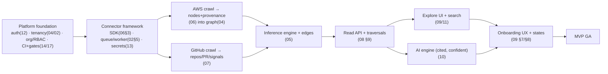
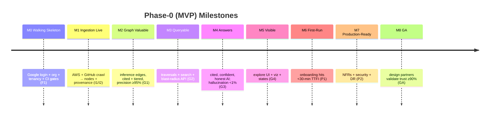

# 15 — Development Roadmap

> **Document status:** Authoritative · **Version:** 1.0 · **Last updated:** 2026-06-30
> **Owner:** Founding Principal Architect · **Audience:** Founders, engineers, AI coding agents, future hires
> **Document type:** Delivery Plan / Roadmap
> **Depends on:** `00` (MVP §5, roadmap §6), `01` (MoSCoW priorities, FR/NFR/US), `02`–`14` (the build surface), `14` (Definition of Done = quality gates)
> **Consumed by:** the whole team (execution order), `17` (release/CI), `18` (GTM timing)

---

## Purpose

This document sequences everything specified in `00`–`14` into a **buildable order**: sprint-by-sprint plan, milestones, inter-document dependencies, the **Definition of Done**, the release plan, an MVP exit checklist, and the post-MVP versions. It converts the *what* (`01` requirements) and the *how* (`02`–`14`) into a *when and in what order*.

It is deliberately **dependency-driven, not date-driven**: the order is fixed by what must exist before what (a graph can't be queried before it's crawled; the AI can't cite before provenance exists). Calendar dates are intentionally omitted (team size unknown); sprints are units of scope with clear entry/exit criteria, so the plan holds whether the team is 3 or 8 engineers.

## Scope

**In scope:** Build-order principles; the critical dependency chain; phased sprint plan (Foundation → Ingest → Graph/AI → Polish → GA) with goals/scope/exit criteria; milestones; Definition of Done; release/branching plan; the MVP exit checklist (traced to `01`); post-MVP version themes.

**Out of scope (pointers):** Detailed requirements → `01`; the quality gates referenced by DoD → `14`; CI/CD & release mechanics → `17`; GTM/pricing → `18`.

## Assumptions

Inherits `00`–`14`. Roadmap-specific:
- **A58.** A small senior team (≈3–6 eng) + AI coding agents; the plan parallelizes where dependencies allow but assumes modest concurrency.
- **A59.** "Sprint" = a scope unit with entry/exit criteria, not a fixed calendar box; teams map to their cadence.
- **A60.** **Dependency order is binding; sprint *grouping* is advisory** — work may be re-packed, but a downstream item can't start before its upstream exit criteria are met.

---

## 1. Roadmap Principles

| # | Principle | Trace |
|---|---|---|
| RM-1 | **Dependency-driven order** — build what unblocks the most next | A60 |
| RM-2 | **Vertical slices that reach the graph early** — connect→crawl→see *something* ASAP (de-risks the core loop) | `00` §5.3, P1 |
| RM-3 | **Trust features are not "later"** — provenance, confidence, isolation, honest-absence ship *with* the features they qualify | G2/P3/P4, `01` DD-3 |
| RM-4 | **Security & tenancy from sprint 0**, never retrofitted | R8/G4 |
| RM-5 | **Each sprint exits behind its `14` quality gates** (DoD) | `14` |
| RM-6 | **Depth before breadth** (`00` §6) — AWS+GitHub excellent before more providers | `00` roadmap |
| RM-7 | **Walking skeleton first** — thin end-to-end path before deep features | RM-2 |

---

## 2. The Critical Dependency Chain

What-must-exist-before-what. This chain dictates the sprint order (RM-1).

**Reading the chain:**
- **Nothing works without the foundation** (A) — auth, tenancy, org model, and the CI/quality gates are sprint-0, because every later thing is org-scoped and gated (RM-4/RM-5).
- **The connector framework (B) is the fork** — once the SDK + queue + secrets exist, AWS (C) and GitHub (D) crawl **in parallel**.
- **Inference (E) needs both crawlers** producing nodes+signals; it's the join point that makes the graph valuable (P1).
- **The read API (F)** unblocks **both** the UI (G/I) and the AI (H) — they then proceed in parallel.
- **Onboarding + states (I)** is last-ish because it stitches the real flows together for the < 30-min TTFI bar (NFR-22) — but its *components* (the connection flow) are built with C/D.

---

## 3. Phased Sprint Plan

> Five phases mapping to `00` §6 Phase-0 (MVP). Each sprint: **Goal · Scope (doc refs) · Exit criteria (DoD-gated)**. Sprints within a phase may overlap per dependencies (A60).

### Phase F — Foundation (the walking skeleton + safety rails)

**Sprint F1 — Repo, platform, identity, tenancy**
- **Goal:** a deployable skeleton with auth and tenant isolation proven *before any feature*.
- **Scope:** monorepo + `16` standards + CI with the **`14` gate sequence wired (incl. the adversarial QA agent harness)**; NestJS API + Next.js app shell (`02`/`09`); PostgreSQL + migrations (`04`); **Google OAuth login, sessions/JWT, org creation, RBAC, memberships, invitations** (`12`); **3-layer tenant isolation incl. RLS** (`04`/`13`); audit log skeleton; observability baseline (`02` §9.4).
- **Exit:** a user signs in with Google, creates/names an org (Owner), invites a Member; **US-12 cross-tenant test passes**; RLS-denies-without-GUC passes; CI gates green; deploys to a staging env (`17`).

**Sprint F2 — Connector framework + secrets + queue**
- **Goal:** the pluggable ingestion substrate (no provider yet).
- **Scope:** **Connector SDK** interface (`06` §3); BullMQ queue + worker runtime + scheduler (`02` §5); **Secrets Broker + Secrets Manager** (`13` §7); `connections`/`sync_runs` model + lifecycle state machine (`03`/`04`); connection API skeleton (`08` §8); raw-snapshot/S3 store (`04` §7).
- **Exit:** a mock connector runs a staged sync end-to-end (discover→fetch→persist) idempotently/resumably against a fake provider; partial-failure leaves no false deletes (BR-SYNC-2); gates green.

### Phase I — Ingest (fill the graph)

**Sprint I1 — AWS crawler (core services)** *(parallel with I2)*
- **Goal:** real AWS infra → nodes + provenance.
- **Scope:** AWS connector implementing the SDK (`06`): AssumeRole + External ID + read-only probe + **permission detection → degraded** (`06` §2/§8, `13` §4); the MVP service catalog (`06` §4 — EC2/Lambda/ECS/ECR/VPC/SG/ELB/Route53/APIGW/RDS/DynamoDB/S3/ElastiCache/IAM-edges); full + incremental (hash-diff) sync; pagination/retry/rate-limit (`06` §7); signals + observed edges (`05`); golden-fixture + partial-sync tests (`14` §10).
- **Exit:** connect a real AWS account → populated nodes with provenance + raw snapshots; `degraded` correctly reports missing perms; freshness/`scope_result` accurate; precision of observed edges 100%; gates green.

**Sprint I2 — GitHub crawler** *(parallel with I1)*
- **Goal:** repos/PRs/workflows/CODEOWNERS/deps → nodes + deploy signals.
- **Scope:** GitHub App connector (`07`): install flow, repo selection, **webhook ingress + HMAC** (`07` §5, `13` §5); repo/PR/workflow/team nodes; CODEOWNERS, manifest, **workflow deploy-signal** parsing (`07` §7); PR backfill for timeline; reconcile-heals-gaps; parser fixture tests (`14`).
- **Exit:** connect a GitHub org → repos/PRs/workflows indexed; deploy signals emitted; webhooks update the graph idempotently; gates green.

### Phase G — Graph & Intelligence (make it valuable)

**Sprint G1 — Inference engine + edges**
- **Goal:** cross-source relationships — the actual product (P1).
- **Scope:** inference engine + **rules R1–R8** (`05` §6); confidence tiers + evidence + provenance on every edge (`05` §5/§8); `atlas.service` derivation (R4); convergent reconciliation (FR-4.6); **determinism golden files + precision-sampling ≥95%** (`14` §10).
- **Exit:** the worked example (`05` §9) reproduces — repo `DEPLOYS_TO` service, service `CONNECTS_TO` RDS, etc. — each cited + tiered; inference precision ≥95% on the labeled fixture; convergence (zero churn on no-change); gates green.

**Sprint G2 — Read API + traversals + search** *(unblocks G3/G4)*
- **Goal:** the graph is queryable.
- **Scope:** read API: nodes/edges/detail/neighbors, **blast-radius/dependencies traversals** with why-chains + pathConfidence (`08` §9); `/timeline`; cursor pagination/filtering (`08` §5); **OpenSearch projection + hybrid search** (`11`); index stage in the pipeline; traversal perf to NFR-1.
- **Exit:** blast-radius/dependents/repo→service queries return correct, cited, confidence-tiered results within NFR-1; hybrid search works; contract tests from OpenAPI pass; gates green.

**Sprint G3 — AI engine (cited, confident, honest)** *(parallel with G4)*
- **Goal:** natural-language answers grounded in the graph.
- **Scope:** `LLMProvider` abstraction (Claude) (`10` DD-1); query planner → deterministic retrieval plan; context builder + **grounding gate**; narrator (SSE streaming); **deterministic citation engine + confidence scorer** (`10`); conversation memory; **7-layer hallucination prevention** (`10` §7); **AI eval set (canonical + adversarial) wired into CI** (`14` §11).
- **Exit:** the canonical questions (US-4/7/8/9) answered correctly with citations + appropriate confidence; **honest-absence on zero grounding** (US-11); hallucination rate <1% on the eval set; gates green.

**Sprint G4 — Explore UI + detail + viz** *(parallel with G3)*
- **Goal:** see and navigate the graph.
- **Scope:** shadcn design system + certainty primitives (ConfidenceBadge/FreshnessTag/CitationLink) (`09` §3); **graph canvas** (WebGL, server-bounded subgraphs, progressive expand) (`09` §6); node detail + provenance drawer; **blast-radius panel**; search UI/⌘K; the **4 UI states incl. Partial≠Error** (`09` §7); a11y baseline (`09` §9).
- **Exit:** US-4 blast-radius flow works visually with confidence styling + click-through provenance; partial/degraded banners render; axe/keyboard pass on core flows; gates green.

### Phase P — Polish (the < 30-min TTFI)

**Sprint P1 — Onboarding & connections UX + AI chat surface**
- **Goal:** the end-to-end first-run that hits the MVP success bar.
- **Scope:** guided **onboarding wizard** (AWS role+ExternalId+policy copy, GitHub install, **live sync progress**) (`09` §8.1); connection/sync settings + missing-perms panel; **AI chat surface** with streamed citations/confidence/caveats + "show retrieval" (`09` §8.4); timeline UI (US-5); members/audit settings UI.
- **Exit:** a brand-new user completes signup → connect AWS+GitHub → populated graph → a correctly-cited blast-radius answer; degraded/stale states visible throughout; gates green.

**Sprint P2 — Hardening, performance, observability**
- **Goal:** production-ready.
- **Scope:** load/perf to NFR-1/2/3 (`14` §12); soak/burst worker scaling; **security pass** (cross-tenant fuzz, read-only CI check, webhook HMAC, prompt-injection, secret hygiene — `14` §9/`13`); dashboards/alerts + graph-quality telemetry (NFR-17, `17`); DR/backup verification (RPO/RTO, `17`); mutation testing on critical core (`14` §13); empty/error-state polish.
- **Exit:** all NFR targets met under load; security suite green; DR drill passes; **MVP exit checklist (§6) complete**.

### Phase GA — Launch

**Sprint GA — Beta → GA**
- **Goal:** real customers.
- **Scope:** closed beta with design partners (Persona A/B/D); fix activation friction; security package for Persona E (`13`/`18`); billing skeleton if needed (`18`); finalize runbooks (`17`); GA release.
- **Exit:** design partners hit TTFI <30 min and validate answer trust ≥90% (`00` §7.1); GA.

---

## 4. Milestones

| Milestone | Proves | Gate (`14`) |
|---|---|---|
| **M0** | safety rails real before features | US-12, RLS, CI green |
| **M1** | the graph fills from real sources | crawler fixtures, partial-sync, degraded |
| **M2** | cross-source value (the product) | inference precision ≥95%, determinism |
| **M3** | the canonical questions are answerable | traversal correctness + NFR-1 |
| **M4** | trust: cited + honest | AI eval, hallucination <1% |
| **M5** | effortless exploration | E2E US-4, a11y |
| **M6** | the success bar (`00` §5.3) | TTFI E2E |
| **M7** | won't fall over / leak | load + security + DR |
| **M8** | customers trust it | answer-trust ≥90% |

---

## 5. Definition of Done (DoD)

> **Binding for every unit of work** (RM-5). A feature is "done" only when **all** apply:

1. **Meets its requirement(s)** — traced to the FR/US/NFR id(s) it implements (`01`).
2. **Honors its contracts** — relevant `BR-x` invariants upheld; state transitions valid.
3. **Trust qualities included, not deferred** (RM-3) — provenance/confidence on any graph data; honest-absence where the AI could lack grounding; degraded/stale states surfaced; **never ship a feature that presents incomplete data as complete** (P3, `01` DD-3).
4. **Tenant-isolated** — org-scoped; cross-tenant test extended if new data paths added (US-12).
5. **Tested per `14`** — unit + property where applicable; integration; E2E if a user flow; **the relevant CI gates green incl. the adversarial QA agent** (verified findings resolved); new adversarial findings converted to regression tests.
6. **Observable & secure** — logs/metrics/traces with correlation id; no secrets in logs/DTOs; security checks pass (`13`).
7. **Documented** — if it changes a contract, **the relevant doc (`00`–`14`) is updated first** (docs are authoritative; code follows — `14` §19).
8. **Reviewed** — code review per `16`; migrations reviewed; OpenAPI/contract updated.

---

## 6. MVP Exit Checklist (traced to `01`)

> The MVP ships when every **Must** is checked. Maps to `00` §5.3 success bar and `01` §5.

**Onboarding & connections (FA-1)**
- ☐ Google login, org create/name, invite members, RBAC (FR-7.1/7.2/7.3, US-3)
- ☐ Connect AWS (role+ExternalId, verify, **degraded on missing perms**) (FR-1.2/1.3/1.6, US-1)
- ☐ Connect GitHub (App install, repo select) (FR-1.4, US-2)
- ☐ Initial sync auto-enqueued + live progress (FR-1.5)

**Ingestion (FA-2/3)**
- ☐ AWS full+incremental, idempotent/resumable, MVP service catalog (FR-2.1–2.7, `06` §4)
- ☐ GitHub repos/PRs/workflows/CODEOWNERS/deps + webhooks (FR-3.1–3.7)
- ☐ Partial-sync never false-deletes; freshness accurate (BR-SYNC-2, US-13)

**Graph & inference (FA-4)**
- ☐ Typed graph + provenance + confidence on every node/edge (FR-4.1/4.2)
- ☐ Inference R1–R8, **precision ≥95%**, convergent (FR-4.3/4.6, `00` §7.2)
- ☐ Blast-radius + dependency traversals (FR-4.4/4.5, US-4/9)

**Exploration (FA-5)**
- ☐ Graph viz, node detail+provenance, hybrid search, timeline (FR-5.1–5.4)
- ☐ 4 UI states incl. Partial≠Error (FR-5.5, US-13)

**AI (FA-6)**
- ☐ Cited, confidence-scored, streaming answers to the canonical questions (FR-6.1–6.5, US-4/7/8/9)
- ☐ **Honest-absence**; hallucination <1% on eval set (FR-6.3, US-11)

**Platform (FA-7)**
- ☐ Tenant isolation proven (US-12); audit log (FR-7.5); sessions/RBAC (`12`)

**Non-functional**
- ☐ NFR-1 (<1.5s traversal), NFR-2 (search/AI latency), NFR-3 (sync convergence)
- ☐ Security suite green (`13`/`14`); DR drill (NFR-9); a11y AA core flows (NFR-23)
- ☐ **TTFI < 30 min** end-to-end (NFR-22, `00` §5.3)

**The bar (`00` §5.3):** a new customer connects AWS+GitHub and gets a **senior-engineer-validated, correctly-cited** answer to "what breaks if this Lambda is deleted?" and "which repo deploys to this ECS service?" within 30 minutes.

---

## 7. Release & Branching Plan (summary; mechanics in `17`)

- **Trunk-based** with short-lived feature branches; PRs gated by the `14` PR gates (incl. adversarial agent); merge to `main` keeps it releasable (RM-5).
- **Environments:** ephemeral PR previews → staging (auto-deploy from `main`) → production (promoted) (`17`).
- **Release cadence:** continuous to staging; promoted releases gated by the heavy nightly suites (E2E/load/AI-eval/mutation/security) + the MVP checklist for GA.
- **Feature flags** for incomplete or risky features (e.g. AI surface) so trunk stays releasable; flags retired post-launch.
- **Migrations:** expand/contract, backward-compatible (`04` DD-6); never block a deploy.

---

## 8. Post-MVP Versions (Phase 1+ themes — `00` §6)

> Sequenced by value × dependency; each is a doc-update-then-build (RM-3, DoD #7).

| Version | Theme | Headline scope | Promotes |
|---|---|---|---|
| **v1.1 — Trust & Depth** | make AWS+GitHub *excellent* (RM-6) | richer inference rules; confidence/freshness UX depth; **culprit-PR ranking** (US-6 → Must if validated, `01` OQ-PRD-2); saved views/deep-links (FR-5.6/5.7) | — |
| **v1.2 — Enterprise on-ramp** | bigger customers | **multi-account AWS / Organizations** (FR-2.10); **domain-based org auto-join (Google `hd`)** (`12` §7); **real-time ingestion (CloudTrail/EventBridge)** (FR-2.9) | OOS-4/5, `12` Phase-1 |
| **v1.3 — Enterprise security** | clear Persona E at scale | **SSO/SAML + SCIM**, advanced/custom RBAC (OOS-6); SOC 2 Type II; data residency (NFR-26) | OOS-6 |
| **v2.0 — Breadth** | more sources | **GCP + Azure** connectors; **Bitbucket (`07b`) + GitLab** (promote `07b` per its scope-gate); Datadog/PagerDuty correlation | OOS-3, `07b` |
| **v2.x — Graph at scale** | if telemetry demands | **dedicated graph DB** migration (`05` DD-3 trigger met); `node_closure`; partitioning (`04`) | OQ4 |
| **v3.0 — Intelligence & platform** | proactive + open | drift/risk/blast-radius **alerts**; incident root-cause assistant; **MCP server / public API** (FR-6.9, `10` §12); marketplace of connectors | NG3-adjacent, Phase-3 |

---

## 9. Design Decisions Recap

| ID | Decision | Why |
|---|---|---|
| DD-1 | Dependency-driven, date-free sprint plan | Holds across team sizes; order is the real constraint (RM-1, A59) |
| DD-2 | Walking skeleton + foundation (auth/tenancy/gates) in sprint 0 | Security/tenancy can't be retrofit (RM-4/R8) |
| DD-3 | AWS & GitHub crawlers in parallel after the SDK | The connector framework is the fork point (§2) |
| DD-4 | Trust qualities ship *with* features (DoD #3) | Provenance/confidence/honest-absence aren't a later phase (RM-3, P3/P4) |
| DD-5 | DoD includes the `14` gates + adversarial agent | "Done" means verified, not just written (RM-5) |
| DD-6 | Depth (AWS+GitHub) before breadth (more providers) | `00` §6 strategic arc (RM-6) |

## 10. Risks

| ID | Risk | Mitigation |
|---|---|---|
| RMR-1 | Inference precision <95% blocks M2 | Conservative rules + tiering (P3); precision sampling early; ambiguity→multiple-low (`05`) |
| RMR-2 | AI quality/hallucination blocks M4 | 7-layer defense + eval gate from G3 start (`10`/`14`); honest-absence is a *valid* answer |
| RMR-3 | Graph perf misses NFR-1 at scale | Indexing (`04`), `node_closure` escape hatch, load tests in P2; graph-DB trigger is *measured* |
| RMR-4 | Onboarding friction (IAM/OAuth) tanks TTFI | Guided wizard + live progress + degraded transparency (P1); TTFI tested |
| RMR-5 | Scope creep (Bitbucket/multi-cloud pulled into MVP) | Hard MoSCoW/OOS gates (`01`); contingency docs (`07b`) explicitly Phase-2 |
| RMR-6 | Parallel crawler work diverges from SDK | Connector SDK contract frozen in F2; conformance tests (`06`/`07`/`14`) |
| RMR-7 | Adversarial QA agent slows velocity early | Verified-findings-only gate (`14` DD-3); advisory mode while tuning |
| RMR-8 | Small team over-committed | Dependency order lets work re-pack; flags keep trunk releasable; cut Should before Must |

## 11. Edge Cases

- **Foundation slips** → everything slips; protect F1/F2 ruthlessly (they unblock all).
- **One crawler ready before the other** → inference (G1) can start on the ready source's intra-source edges; cross-source edges wait for both (graceful partial value).
- **AI not ready at GA** → flag it off; MVP graph+search+viz still delivers value (NFR-7 degradation); ship AI fast-follow. *(But US-4/AI is a Must for the `00` §5.3 bar — only an emergency cut.)*
- **A Must can't make MVP** → re-scope MVP explicitly (update `00`/`01`), don't silently ship without it.
- **Design partner needs a Should** → pull a specific Should forward via flag; don't expand the whole scope.

## 12. Open Questions

- **OQ-RM-1** Team size/cadence → maps sprints to calendar (A58) — set by founders.
- **OQ-RM-2** US-6 culprit-PR: v1.1 or pulled into MVP (`01` OQ-PRD-2) — default v1.1.
- **OQ-RM-3** Whether billing ships at GA or post-GA (`18`) — default minimal/post-GA for design partners.
- **OQ-RM-4** Beta partner count/profile for M8 validation (`18`).
- **OQ-RM-5** Exact graph-DB migration trigger timing (`05` DD-3 / OQ4) — telemetry-driven, likely v2.x.

## 13. References

- **Upstream:** `00` (MVP §5, roadmap §6, success bar §5.3, metrics §7), `01` (MoSCoW, FR/NFR/US, OOS), `02`–`13` (the build surface, all DDs), `14` (DoD gates, adversarial agent, eval, precision/perf/security tests).
- **Downstream:** `16` (coding standards enforced by DoD #8), `17` (CI/CD, environments, release mechanics, DR drills), `18` (GTM timing, beta, billing, compliance package).

---

### Change log
| Version | Date | Author | Change |
|---|---|---|---|
| 1.0 | 2026-06-30 | Founding Principal Architect | Initial dependency-driven roadmap from `00`–`14` v1.0 |
