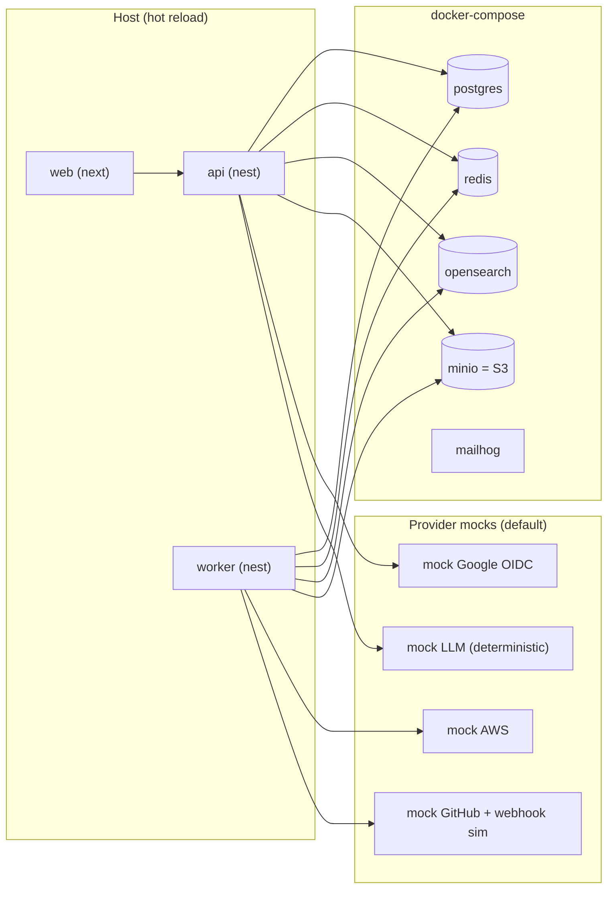
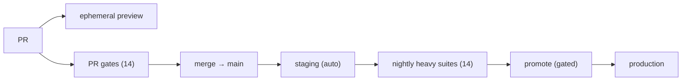
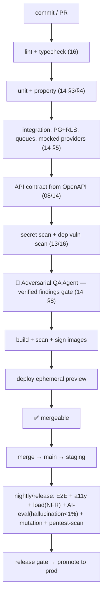
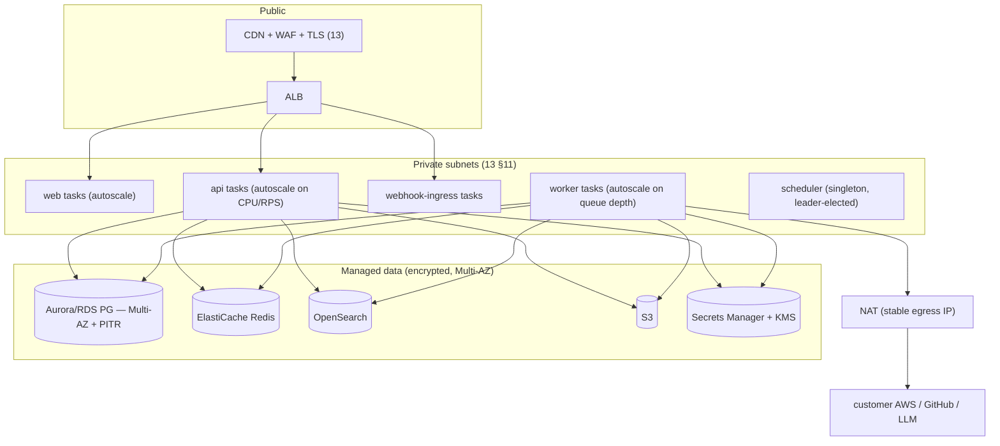

# 17 — Deployment, Infrastructure & Operations

> **Document status:** Authoritative · **Version:** 1.0 · **Last updated:** 2026-06-30
> **Owner:** Founding Principal Architect · **Audience:** SRE/platform engineers, all engineers, AI coding agents
> **Document type:** Deployment / Infra / Ops Spec
> **Depends on:** `02` (§10 deployment topology, planes, DD-9), `04` (PG/migrations/backups), `06`/`07` (workers/webhooks), `11` (OpenSearch), `13` (security/secrets/network/DR), `14` (CI gates), `16` (tooling, build)
> **Consumed by:** the team (local dev → prod), `15` (release plan), `18` (cost/compliance)

---

## Purpose

This document specifies **how Atlas runs** — from an engineer's laptop to production: local development, containerization, the CI/CD pipeline (which executes the `14` quality gates), environment configuration, infrastructure, scaling, observability, and disaster recovery. It realizes the deployment topology sketched in `02` §10 and operationalizes the security/network requirements of `13`.

It is the bridge between "the code is correct" (`14`/`16`) and "the system is reliably serving customers" — the operational half of the trust promise (a graph that's down isn't trusted either; G1/NFR-7).

## Scope

**In scope:** Local dev (Docker Compose, seed data, the shadcn registry/MCP setup); container strategy; the CI/CD pipeline & gate sequence; environments (preview/staging/prod); environment-variable & config strategy; infrastructure requirements per component; scaling (API/worker/data); observability (logs/metrics/traces/alerts); disaster recovery (backup/restore, RPO/RTO); operational runbooks index; cost levers.

**Out of scope (pointers):** Architecture decisions → `02`; security controls/threat model → `13`; quality-gate *content* → `14`; coding/tooling conventions → `16`; pricing/unit-economics → `18`; IaC code itself (this specifies *what*, the repo's `infra/` implements it).

## Assumptions

Inherits `00`–`16`. Ops-specific:
- **A64.** Atlas runs on **AWS** as a **managed container platform** (`02` DD-9: ECS Fargate or managed K8s — resolved §3.1), single region for MVP (A10), region-portable.
- **A65.** Managed data services: **RDS/Aurora PostgreSQL (Multi-AZ, PITR)**, **ElastiCache Redis**, **managed OpenSearch**, **S3**, **Secrets Manager (KMS)** (`02` §10, `13`).
- **A66.** IaC-managed infrastructure (Terraform-class); nothing clicked-by-hand in prod (`13` A05 misconfig defense).

---

## 1. Operations Principles

| # | Principle | Trace |
|---|---|---|
| OP-1 | **Dev/prod parity** — same containers/config shape everywhere; only values differ | 12-factor, fewer "works on my machine" bugs |
| OP-2 | **Everything reproducible (IaC)** — no manual prod changes | A66, `13` A05 |
| OP-3 | **Stateless compute, managed state** — scale/replace containers freely; data in managed services | `02` §10, NFR-4 |
| OP-4 | **Gated, automated releases** — `14` gates block bad code from prod | `14`, `15` |
| OP-5 | **Observable by default** — logs/metrics/traces + correlation id from day one | NFR-16, `02` §9.4 |
| OP-6 | **Graceful degradation** — a down worker/search degrades freshness, not the graph | NFR-7, `02` §9.5 |
| OP-7 | **Secure by default** — private subnets, least-priv, no standing access, encrypted | `13` §11 |
| OP-8 | **Recoverable** — tested backups, defined RPO/RTO | NFR-9, `13` §13 |

---

## 2. Local Development

> **DD-1 — One-command local stack via Docker Compose; app code runs on the host (fast reload), infra in containers.** **Why:** dev/prod parity for *infra* (same Postgres/Redis/OpenSearch versions, OP-1) while keeping the **fast TS reload loop** on the host for productivity. External providers (AWS/GitHub/Google/LLM) are **mocked locally** by default (the abstractions, `06`/`10`/`12`) so no real credentials are needed to develop.

### 2.1 Stack

- `docker compose up` brings up Postgres, Redis, OpenSearch, **MinIO** (S3-compatible), **Mailhog** (email), and provider mocks.
- `pnpm dev` runs api/worker/web on the host with watch mode.
- **Seed script** loads a synthetic multi-tenant graph (the `14` fixtures) so a fresh clone has explorable data + a demo org in minutes.

### 2.2 shadcn registry / MCP setup (realizes `16` §6.1, `09` DD-3a)
- `tooling/` holds the shadcn `components.json` + registry config; `pnpm ui:add <component>` wraps the shadcn CLI.
- The **shadcn MCP server** is configured in the repo's recommended MCP client config (e.g. `.mcp.json` / editor settings) so engineers and AI agents can browse the registry and `shadcn add` (build-time only, never shipped — `16` DD-3).
- New components land in `apps/web/components/ui/`, adapted to tokens before commit (`16` §6.1 rule).

### 2.3 Connecting real providers locally (optional)
- A documented opt-in to point at a *real* sandbox AWS account / test GitHub org / real Google client for integration work — credentials via local `.env` (gitignored) → never committed (`13` SEC-6). Default stays mocked.

### 2.4 Migrations & DB locally
- `pnpm db:migrate` runs the forward-only migrations (`04` DD-6); `pnpm db:reset` rebuilds + reseeds. Same migration runner as prod (OP-1).

---

## 3. Containerization & Build

- **Multistage Docker builds** per app (`api`, `worker`, `web`): build stage compiles TS; runtime stage = **minimal/distroless, non-root, read-only fs where feasible** (`13` §11). Same image base across apps.
- **`worker` and `api` share the build** (`02` DD-2, one codebase two runtimes) — same image, different entry command.
- **Image provenance:** images built in CI, scanned (§6), signed, pushed to a private registry; **immutable tags** (git SHA), never `latest` in prod.
- **SBOM** generated per image (`13` §11, Phase-1).

### 3.1 Compute platform (resolves `02` OQ-ARCH-1)
> **DD-2 — ECS Fargate for MVP.** **Why:** removes node/cluster management entirely (no K8s control plane to operate) for a small team (P10, `02` DD-9); native autoscaling, IAM task roles, and tight AWS integration (we already run on AWS, A64). **Alternative — managed K8s (EKS):** more portable/powerful but more operational surface than an early team should carry; **revisit at scale** if multi-region/complex scheduling demands it — the stateless-container design ports cleanly (OP-3). Decision is reversible (containers are platform-agnostic).

---

## 4. Environments

| Env | Purpose | Data | Deploy trigger |
|---|---|---|---|
| **Local** | dev | synthetic seed | `docker compose` + `pnpm dev` |
| **Preview (per-PR, ephemeral)** | review a PR live; adversarial QA agent target (`14` §8) | synthetic, isolated | auto on PR open/update; torn down on merge/close |
| **Staging** | pre-prod, prod-shaped | synthetic + opt-in test connections | auto-deploy on merge to `main` |
| **Production** | customers | real (encrypted, isolated) | **promoted** from a green staging build (gated) |

- **Preview envs** are ephemeral, isolated, synthetic-data-only (`13`/`14` DD-3 — agent never touches prod/customer data), torn down automatically (cost + hygiene).
- **Prod parity:** staging mirrors prod infra shape (same managed services, smaller sizes) — perf/security tests run here (`14`).

---

## 5. CI/CD Pipeline (executes the `14` gates)

> Realizes `14` §16. **The pipeline is the enforcement of `14`/`16`** — bad code cannot reach prod (OP-4).

- **PR gates (fast, block merge):** lint/type → unit/property → integration → contract → secret/dep scan → **adversarial QA agent (verified-findings-only, `14` DD-3)**.
- **Release gates (heavy, block promotion):** E2E, a11y, load (NFR-1/2/3), AI-eval (trust/hallucination), mutation, security scans + **MVP checklist for GA** (`15` §6).
- **Migrations in CD:** run **expand** migrations *before* the new app version, **contract** in a later release (`04` DD-6) — zero-downtime, never a breaking step.
- **Deploy strategy:** rolling/blue-green with health-check gating; **automatic rollback** on failed health checks or error-rate spike.
- **Feature flags** decouple deploy from release (`15` §7) — risky features ship dark.

---

## 6. Configuration & Secrets (12-factor, realizes `13` §7)

> **DD-3 — All config via environment, parsed/validated by a typed config module (Zod) at boot; secrets only from Secrets Manager via the Broker.**

- **Config (non-secret):** env vars, parsed by `packages/config` (Zod) — **app fails fast at boot on missing/invalid config** (`16` CS-2), never a half-configured runtime.
- **Secrets (C1):** never in env-baked images or `.env` in prod; injected from **Secrets Manager** (KMS) at runtime, accessed via the **Secrets Broker** (`13` §7, BR-CONN-1). Rotation supported (key-id rollover for JWT signing, App keys).
- **No secret in logs/DTOs** (`13` SEC-6); log-scrubbing middleware (`16` §8).

### 6.1 Key environment variables (illustrative; full set in `packages/config`)
| Var | Purpose |
|---|---|
| `DATABASE_URL` | Postgres (prod via secret) |
| `REDIS_URL` | cache + queue |
| `OPENSEARCH_URL` | search |
| `S3_BUCKET` / `S3_ENDPOINT` | raw snapshots (MinIO local) |
| `GOOGLE_OAUTH_CLIENT_ID` / `…_SECRET(ref)` | login (`12`) |
| `GITHUB_APP_ID` / `…_PRIVATE_KEY(ref)` / `…_WEBHOOK_SECRET(ref)` | connector (`07`) |
| `AWS_ATLAS_PRINCIPAL_ARN` | the principal customers trust (`06`/`13`) |
| `LLM_PROVIDER` / `LLM_API_KEY(ref)` / `LLM_MODEL` | AI (`10`) |
| `JWT_SIGNING_KEY(ref)` / `kid` | sessions (`12`) |
| `ENV` / `REGION` / `LOG_LEVEL` | runtime |
| feature flags | dark-launch toggles |

`(ref)` = a Secrets Manager reference, never a literal in prod.

---

## 7. Infrastructure Requirements (per component, realizes `02` §10)

| Component | Sizing posture (MVP) | Scales by |
|---|---|---|
| **api** | small, ≥2 replicas (HA) | CPU/RPS autoscale (NFR-4) |
| **worker** | ≥2, bursty | **queue depth** autoscale (`02` §10) |
| **webhook-ingress** | small, ≥2 | RPS (thin: verify+enqueue, `07`) |
| **scheduler** | singleton, leader-elected | n/a (idempotent jobs tolerate double-fire, P7) |
| **web** | small, ≥2 | RPS |
| **PostgreSQL** | Aurora/RDS Multi-AZ, read replica for read-heavy traversals (`04` §14) | vertical + replicas; partitioning later (`04` §14) |
| **Redis** | ElastiCache, HA | memory; cluster mode if queues grow |
| **OpenSearch** | managed, sharded by org routing (`11`) | shards/nodes per data volume |
| **S3** | standard | usage |

- **Network:** only CDN/ALB public; everything else private; **stable NAT egress IP** customers can allowlist (`13` §11, a Persona-E nicety).
- **Single region MVP** (A64); topology is region-portable for Phase-1 multi-region (`02` §15, NFR-26).

---

## 8. Scaling (realizes NFR-4/5)

| Layer | Strategy |
|---|---|
| **API/web** | stateless → horizontal autoscale; no sticky sessions (JWT, `12`) |
| **Workers** | autoscale on **queue depth**; per-org queue fairness + concurrency caps (`02` §5.3) so one big org can't starve others (NFR-5) |
| **Postgres** | reads → replicas (traversal/search/AI reads route to replica, `04` §14); writes → primary; partition `nodes`/`edges`/`audit` by org/time *when volume warrants* (`04` §14, not premature) |
| **OpenSearch** | org-routed shards; add nodes/shards with data growth (`11` §11) |
| **Graph scale** | bounded traversals (`05` §7.4) + `node_closure` escape hatch + **measured** graph-DB migration trigger (`05` DD-3) — scale is a *measured* decision, not premature |
| **Tenancy at thousands of orgs** | shared-schema pool (`04`); promote large tenants to dedicated DB without app change (`02` §9.1) |

> Scaling philosophy (P6): **designed for thousands of orgs, provisioned for the early dozens.** Each scale step (replicas → partitioning → graph DB → multi-region) is a *pre-planned, telemetry-triggered* migration, not a rewrite.

---

## 9. Observability & Monitoring (realizes NFR-16/17, `02` §9.4)

> **DD-4 — Three pillars (logs/metrics/traces) + graph-quality telemetry as first-class, all stitched by correlation id.**

- **Logs:** structured JSON, centralized, correlation-id-stitched (`16` §8); scrubbed of secrets (`13`).
- **Traces:** distributed (OpenTelemetry) request→job→worker→inference (`02` §9.4) — a user action or sync is one trace.
- **Metrics:**
  - **RED** for API (rate/errors/duration), per endpoint.
  - **Worker:** queue depth, job latency, throttle counts, DLQ size.
  - **Graph-quality (NFR-17, the product KPIs):** freshness (stalest-node age), **inference-precision sampling**, provenance coverage (100% target), edge churn.
  - **AI:** hallucination rate, citation coverage, refusal rate, answer-trust (thumbs), token cost (`10`/`18`).
- **Dashboards:** per-org crawl health; system RED; graph-quality; AI-quality; cost.
- **Alerting:** SLO-burn (API availability 99.5%, NFR-7), sync error-budget breaches (NFR-8), security anomalies (auth failures, **RLS denials**, secret access — `13`), DLQ growth, OpenSearch/PG saturation, LLM error/latency/cost spikes. Alerts route to on-call with runbook links (§11).

---

## 10. Disaster Recovery (realizes NFR-9, `13` §13)

> **DD-5 — Postgres is the only system of record to protect for RPO; everything else is rebuildable.** **Why:** OpenSearch (rebuild from PG, `11` SE-1), Redis (ephemeral, `02` §7), and S3 raw snapshots (provenance evidence, separately durable) mean DR centers on PostgreSQL. This **shrinks the DR problem** to one store.

| Target | Value (MVP) | How |
|---|---|---|
| **RPO** | ≤ 1h | Aurora/RDS **PITR** + automated snapshots; continuous backup |
| **RTO** | ≤ 4h | restore PG from PITR → rebuild OpenSearch from PG (`11`) → redeploy stateless apps (IaC) → re-enable schedulers |
| **S3 raw snapshots** | durable | S3 cross-region replication (Phase-1); versioning |
| **Secrets** | recoverable | Secrets Manager managed durability + documented re-issue for any that must rotate |

- **DR drill** is part of MVP exit (`15` P2): actually restore PG to a scratch env, rebuild search, verify graph parity (`11` §9 consistency check). **Untested backups don't count** (OP-8).
- **Backups encrypted** (KMS); access audited (`13`).
- **Graceful degradation (OP-6):** during a partial outage, **graph exploration from PG still serves** even if workers/search/AI are down (NFR-7) — and degrades *visibly* (`09` partial states).

---

## 11. Operational Runbooks (index; details live in the repo's runbooks)

| Runbook | Trigger |
|---|---|
| Crawl backlog / DLQ growth | worker alert |
| Connection mass-failure (provider outage / revoked creds) | connection-health alert (`06`/`07`) |
| RLS-denial / cross-tenant anomaly | security alert (`13`) — treat as potential incident |
| OpenSearch/PG saturation | saturation alert → scale/replica |
| LLM provider outage/cost spike | AI alert → failover model / throttle (`10`) |
| Restore from backup (DR) | data-loss incident (§10) |
| Secret rotation / suspected leak | security (`13` §13) |
| Customer revoked IAM role / uninstalled App | connection→error (`06` EC-6 / `07` GHR-5) |

- **No standing prod access (`13` §11):** access is **break-glass, MFA-required, time-boxed, fully audited**; secrets accessed via Broker, never handed to humans.
- **Incident response** follows `13` §13 (detect→contain→eradicate→notify→post-mortem); the customer's IAM/App is their own kill-switch (`13` §13).

---

## 12. Cost Levers (feeds `18`)

| Cost | Lever |
|---|---|
| LLM tokens | model routing (small planner / top narrator), retrieval budgets, caching, per-plan AI rate limits (`10`/`18`) |
| Crawl/compute | incremental hash-skip (`06` DD-3), worker autoscale-to-zero off-peak, embedding hash-skip (`11` §8) |
| Storage | raw-snapshot retention windows (`13` §10), content-hash dedupe, soft-delete purge (`04` §11) |
| OpenSearch | right-sized shards; rebuildable so it can run leaner | 
| Egress | NAT/egress to customer clouds — batch & rate-limited (`06`) |

Cost is **observable** (per-org token/crawl/storage metrics, §9) → unit economics feed pricing (`18`).

---

## 13. Design Decisions Recap

| ID | Decision | Why |
|---|---|---|
| DD-1 | Docker Compose infra + host app reload; mocked providers | Dev/prod parity + fast loop + no creds needed (OP-1) |
| DD-2 | ECS Fargate for MVP (resolves OQ-ARCH-1) | No cluster ops for a small team; reversible (P10, `02` DD-9) |
| DD-3 | Env config parsed at boot (Zod); secrets via Broker only | Fail-fast config, no plaintext secrets (`13`/`16`) |
| DD-4 | 3 pillars + graph/AI-quality telemetry, correlation-id-stitched | Product KPIs are operational metrics (NFR-17) |
| DD-5 | DR centers on PostgreSQL; rest rebuildable | Shrinks DR to one store (SE-1/`11`) |
| (impl) | CI/CD = enforcement of `14`/`16` gates | Bad code can't reach prod (OP-4) |
| (impl) | Ephemeral synthetic-data preview envs | Safe agent/E2E target, no customer data (`13`/`14`) |

## 14. Risks

| ID | Risk | Mitigation |
|---|---|---|
| OPR-1 | Manual prod change causes drift/outage | IaC-only, no standing access (OP-2/`13`); change review |
| OPR-2 | Migration breaks deploy | expand/contract, backward-compatible, CI-tested on prod-shaped data (`04`/`14`) |
| OPR-3 | Worker backlog under load spike | queue-depth autoscale + fairness caps; DLQ + alerts (§8/§11) |
| OPR-4 | Untested backup fails in a real incident | mandatory DR drill at MVP exit (§10, OP-8) |
| OPR-5 | Secret leak via misconfig/log | Broker + KMS + scrub + scan + no-`.env`-in-prod (`13`/§6) |
| OPR-6 | Single-region outage | MVP accepts; Multi-AZ within region; region-portable for Phase-1 multi-region |
| OPR-7 | LLM cost/latency spikes hurt UX & margin | routing, budgets, caching, failover model; cost alerts (§12) |
| OPR-8 | Observability gaps hide incidents | 3 pillars + graph/AI KPIs from day one (OP-5/§9) |
| OPR-9 | Fargate limits hit at scale | reversible to EKS (DD-2, stateless design ports) |

## 15. Edge Cases

- **Preview env needs a real provider** → opt-in sandbox creds, isolated, torn down; default mocked (§2.3).
- **Scheduler double-fires during a deploy** → idempotent jobs make it harmless (P7, `02` DD-9).
- **OpenSearch lost entirely** → rebuild from PG (`11` SE-1); search/AI degrade meanwhile, graph explore works (OP-6).
- **PG failover mid-sync** → in-flight jobs retry (P7); no false deletes (BR-SYNC-2); reconcile converges.
- **Region-wide AWS event** → accept downtime for MVP (single region); DR restore if data-affecting (§10); communicate via status page.
- **Customer allowlists our egress IP, then we scale NAT** → stable egress IP/range documented; changes are announced (§7).
- **Cost runaway from one heavy org** → per-org metrics + rate limits + plan caps surface and bound it (§12, `18`).

## 16. Open Questions

- **OQ-OPS-1** Fargate vs EKS revisit threshold (DD-2) — scale/complexity-triggered; reassess at multi-region.
- **OQ-OPS-2** Multi-region timing (NFR-26) — Phase-1, data-residency-driven (`18`).
- **OQ-OPS-3** Exact SLOs/error budgets (API 99.5% start) — refine with real traffic (`01` OQ-PRD-4).
- **OQ-OPS-4** Adversarial-QA-agent CI runtime/cost budget (`14` OQ-T-1) — tune per-PR cost vs coverage.
- **OQ-OPS-5** Observability vendor vs self-hosted (OTel-compatible either way) — team choice; OTel keeps it portable.

## 17. References

- **Upstream:** `02` (§10 topology, DD-9, planes, §9 cross-cutting), `04` (migrations DD-6, PITR, partitioning, replicas), `06`/`07` (workers, scheduler, webhooks, partial-sync), `10` (LLM provider/cost), `11` (OpenSearch, rebuildable invariant), `13` (secrets, network, no-standing-access, DR, IR), `14` (CI gates, adversarial agent, eval/load/security suites), `16` (tooling, build, config-as-code, shadcn registry).
- **Downstream:** `15` (release plan/DoD/DR drill at P2), `18` (cost levers → unit economics/pricing, compliance hosting).

---

### Change log
| Version | Date | Author | Change |
|---|---|---|---|
| 1.0 | 2026-06-30 | Founding Principal Architect | Initial deployment/infra/ops spec from `00`–`16` v1.0 |
