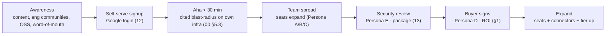

# 18 — Business Model & Go-To-Market

> **Document status:** Authoritative · **Version:** 1.0 · **Last updated:** 2026-06-30
> **Owner:** Founding Principal Architect (with founders) · **Audience:** Founders, GTM/sales, engineers, investors
> **Document type:** Commercial Strategy
> **Depends on:** `00` (vision, personas A–E, goals, success metrics §7), `01` (NFR-25 compliance), `13` (security package for Persona E), `17` (cost levers → unit economics)
> **Consumed by:** founders/GTM (strategy), `15` (GA/beta/billing timing), product (packaging informs roadmap)

---

## Purpose

This document defines **how Atlas creates, delivers, and captures value** — target customers, packaging & pricing, go-to-market motion, competitive positioning, differentiators, monetization mechanics, and expansion strategy. It closes the loop opened in `00`: the personas (A–E), the success metrics (§7), and the vision ("the graph is the product") become a commercial plan.

It is deliberately **engineering-grounded**: pricing references the real cost levers from `17` §12, the security-gated sales motion references `13`, and the value narrative references the actual product capabilities (`05`/`09`/`10`), not aspiration. It resolves the pricing open question `00` OQ3.

## Scope

**In scope:** Market & ICP; the value/ROI thesis; pricing model & packaging (resolving `00` OQ3); the cost-to-value (unit economics) link; GTM motion (PLG + sales-assist); the security-gated sales reality; competitive landscape & differentiation; monetization & expansion; key business metrics & risks.

**Out of scope (pointers):** Detailed financial model/cap table (separate founder doc); exact list prices (set via experiments — §4); legal/contract templates; the product roadmap that enables expansion → `15`.

## Assumptions

Inherits `00`–`17`. Business-specific:
- **A67.** Self-serve **PLG-first** is viable because onboarding is self-serve (Google login + IAM role + GitHub App) and TTFI < 30 min (`00` §5.3, NFR-22) — the product can sell itself into a team before sales touches it.
- **A68.** But **adoption is security-gated** (Persona E can veto) — so a sales-assist motion for the security review is required above a threshold (DD-2).
- **A69.** Primary go-to-market segment = `00` A6: **mid-size engineering orgs (~20–500 engineers)** on AWS + GitHub.

---

## 1. The Value Thesis (why anyone pays)

Atlas converts **tribal knowledge into an always-correct, queryable model** of a company's engineering reality (`00` vision). The economic value is the cost of *not* having that model:

| Pain (`00` §2.2) | Cost today | Atlas value |
|---|---|---|
| Slow incident response (MTTR) | engineer-hours/incident, revenue impact, on-call burnout | blast-radius + "what changed" + culprit-PR → faster, calmer MTTR (Persona A) |
| Risky changes (unknown blast radius) | outages from "I didn't know that depended on it" | "what breaks if…" before the change (Persona A/B) |
| Slow onboarding | weeks of senior-engineer time per hire | self-serve architecture explanation (Persona C) |
| Key-person risk | the system lives in few heads | externalized, always-current model (Persona D) |
| Stale documentation | never trusted, constantly rotting | a model that *can't* be stale — it's rebuilt from truth (P1) |

> **The ROI sentence (for the buyer, Persona D):** *Atlas pays for itself if it prevents one outage, shaves an hour off a handful of incidents, or saves a few days of onboarding per hire.* For a 100-engineer org, those are continuous, recurring costs — Atlas is cheap against them.

**Why it's a budget line, not a nice-to-have:** the value compounds with complexity (more services → more tribal knowledge lost), and the *trust* differentiator (cited, confidence-tiered, never-fabricating — G2/`10`) is what makes engineers actually rely on it, which is what makes it sticky (§7 retention).

---

## 2. Ideal Customer Profile (ICP)

> Grounds the `00` personas in a buyable segment (A69).

**Primary ICP (MVP / early):**
- **Size:** ~20–500 engineers (the complexity pain is acute; AWS surface is tractable; not yet hyperscale where bespoke tools exist).
- **Stack:** **AWS + GitHub** (MVP fit, `00` NG5); ideally Google Workspace (frictionless login, `12`).
- **Shape:** microservices / multi-service architecture, frequent deploys, on-call rotation — i.e. they *feel* the `00` §2.2 pains weekly.
- **Trigger events:** a painful incident; a key engineer leaving; rapid headcount growth; a reliability/architecture initiative; a new platform/SRE team chartered to "understand our systems."

**Champion & buyer (`00` personas):**
- **Champion:** Staff/Platform engineer or SRE lead (Persona B/A) — feels the pain, adopts bottom-up.
- **Economic buyer:** VP Eng / Head of Platform / CTO (Persona D) — owns reliability & onboarding budgets.
- **Gatekeeper:** Security/compliance (Persona E) — can veto; cleared by `13`.

**Anti-ICP (not now):** non-AWS / non-GitHub shops (Phase-2, `07b`/multi-cloud); <10-eng startups (pain too mild, willingness-to-pay low); regulated enterprises needing SSO/SAML/SOC2-Type-II on day one (Phase-1, `12`/`13`).

---

## 3. Cost-to-Value: Unit Economics Link (realizes `17` §12)

> Pricing must reflect what drives *our* cost so margins hold (and so heavy users pay proportionally).

| Cost driver (`17` §12) | Scales with | Pricing implication |
|---|---|---|
| **LLM tokens** (AI) | AI usage (queries × context) | the most variable/risky cost → AI usage is a **metered/limited** dimension per tier (DD-3) |
| **Crawl/compute** | # resources + repos + sync frequency | infra footprint roughly tracks org **size** → a size proxy is a fair value metric |
| **Storage** | resources × snapshot retention | bounded by retention (`13` §10); modest |
| **OpenSearch** | indexed nodes | tracks size |

**Insight:** the dominant *value* metric (how much engineering reality Atlas models) and the dominant *cost* metric (resources/repos crawled + AI usage) **both scale with org size and engineering footprint**. So a **seat-based core with usage guardrails on AI** aligns price, value, and cost (DD-3). Per-org cost is **observable** (`17` §9) so we can price with real margins, not guesses.

---

## 4. Pricing & Packaging (resolves `00` OQ3)

> **DD-1 — Per-seat core pricing + a footprint/connector envelope per tier + metered AI guardrails. Tiered: Free → Team → Business → Enterprise.** **Why this hybrid:**
> - **Per-seat is the value metric engineers understand** and that expands naturally as a team adopts (land-and-expand) — the primary axis.
> - **Pure per-resource pricing** (à la some infra tools) is rejected as the *primary* axis: it punishes exactly the complex orgs we serve best and is unpredictable for the buyer (Persona D hates surprise bills). It appears only as a **fair-use envelope** per tier (very large footprints move up a tier), aligning with the cost driver without making it the headline.
> - **AI is metered/capped per tier** because it's the variable cost (DD-3, `17` §12) — prevents a heavy-AI user from destroying margin while keeping the core predictable.

### 4.1 Tiers

| Tier | Who | Core | Includes | AI |
|---|---|---|---|---|
| **Free / Trial** | individuals, evaluation, small teams | $0 | 1 AWS + 1 GitHub connection, single org, capped resources/repos, full graph+search+viz | limited AI queries/mo (taste of the trust differentiator) |
| **Team** | the primary ICP (early) | per-seat/mo | multi-connection, full crawl cadence, blast-radius/timeline, RBAC (Owner/Admin/Member), audit | generous AI quota |
| **Business** | larger ICP / platform teams | higher per-seat | + higher footprint envelope, saved views/deep-links, faster sync, priority support, SSO when shipped | high AI quota |
| **Enterprise** | security-gated, larger orgs | custom (annual) | + multi-account AWS, SSO/SAML+SCIM, domain auto-join, advanced RBAC, data residency, SLAs, the full security/compliance package (`13`), DPA | custom AI; option for dedicated/region LLM (`13` DD-2) |

> Exact prices are set by **experiment** (early design partners → willingness-to-pay), not asserted here. The *structure* (seat-core + footprint-envelope + AI-meter, 4 tiers) is the decision.

### 4.2 Why Free matters (PLG fuel)
The Free tier exists to **prove TTFI < 30 min and the trust differentiator** to a champion (Persona B/A) before any spend or sales contact (A67). It's gated to keep cost bounded (capped resources + limited AI, `17` §12) but must deliver a real "aha" — a correctly-cited blast-radius answer on their *own* infra. **The product is the top of the funnel.**

### 4.3 Mapping tiers to roadmap (consistency with `15`)
Enterprise-tier features (multi-account, SSO/SAML, domain auto-join, residency) are **Phase-1+** (`15` v1.2/v1.3) — so Enterprise is *sold* as those ship; MVP launches **Free + Team** (and an early **Business**), which is exactly what Phase-0 delivers.

---

## 5. Go-To-Market Motion

> **DD-2 — Product-led growth (PLG) bottom-up, with sales-assist triggered by the security review and Enterprise needs.** **Why:** the product self-onboards (A67) and the champion is a hands-on engineer (Persona B/A) who adopts bottom-up; but adoption is **security-gated** (A68, Persona E can veto) and Enterprise needs human-led deals — so pure PLG is insufficient, pure top-down sales is too slow/expensive for the ICP. The hybrid matches the buying reality.

**Motion details:**
- **Top of funnel:** developer-credible content (architecture-understanding, incident-response, "map your AWS+GitHub"), engineering communities, conference/OSS presence, and **word-of-mouth from the trust experience** (an engineer who got a correct cited answer tells peers).
- **Activation:** the < 30-min TTFI is the growth engine — instrumented as the **north-star activation metric** (§7).
- **Security review as a GTM stage (DD-2/A68):** Persona E's review is a *named funnel stage*; the security package (`13` externalized: whitepaper, the IAM policy, data-handling, sub-processors) is a **sales asset** that must be ready, because the **read-only-via-customer-created-role** model (`13` §4) is a *selling point* (the customer holds the kill-switch). Clearing E is often the gate between trial and paid.
- **Expansion:** seats grow as more engineers use it; connectors/footprint grow as the org connects more accounts; tier-up as Enterprise features land.

---

## 6. Competitive Landscape & Differentiation

> Atlas sits at an intersection no incumbent fully owns — and the non-goals (`00` NG1/NG2) are *positioning*, not just scope.

| Category | Examples | What they do | Why Atlas is different |
|---|---|---|---|
| **Observability / APM** | Datadog, New Relic, Honeycomb | metrics/traces/logs at scale; runtime *behavior* | Atlas models *structure & change & dependencies*, not metrics (NG1). We answer "what depends on this / what breaks / what changed," not "what's the p99." **Complementary, not competing** — we correlate change to symptoms they surface. |
| **Cloud security posture (CSPM)** | Wiz, Orca, Prisma | security risk/misconfig over cloud graph | similar *connect-read-only* motion (validates A1), but their lens is **security risk**; ours is **engineering understanding & dependencies for all engineers** (NG6). Different buyer (security vs platform/eng), different questions. |
| **Service catalogs / IDPs** | Backstage, Cortex, OpsLevel | a catalog engineers *maintain* | the catalog is **manually curated → rots** (the staleness problem we exist to kill). Atlas is **automatically reconstructed from truth** (P1) — no one maintains it. We can *feed* an IDP. |
| **Cloud-native maps** | AWS-native (Config, app composer), Cloudcraft | provider-locked diagrams/inventory | single-provider, static, no **code↔infra** join, no inference, no cited AI. Atlas unifies **AWS + GitHub** and infers cross-source edges (`05`). |
| **AI "chat with your infra" tools** | various LLM wrappers | chat over docs/cloud | most are **ungrounded chatbots** (the NG3 anti-pattern). Atlas's moat is the **correct, cited, confidence-tiered graph underneath** — the AI is honest because the graph is real (P1/G2). |

### Differentiators (the durable moat)
1. **The graph is the product (P1):** a continuously-correct, cross-source (code↔infra) model — not a chatbot, not a manual catalog, not metrics. Hard to replicate because it's *inference quality over real data*, not a UI.
2. **Trust by construction (G2):** every answer cited + confidence-tiered + honest about uncertainty (`10`). This is the wedge against "AI infra tools" that hallucinate — and it's a *cultural/architecture* choice competitors can't bolt on (P3/P4/P9).
3. **Read-only, customer-controlled connection (`13` §4):** low-friction *and* a security selling point (kill-switch in the customer's hands) — clears Persona E faster than agent-based tools.
4. **Multi-source extensibility (P5):** the connector SDK means breadth (GCP/Azure/GitLab/Bitbucket, Datadog/PagerDuty) is additive — the platform compounds.

---

## 7. Business Metrics (extends `00` §7.4)

> Product/graph/AI metrics live in `00` §7.1–7.3; here are the **commercial** metrics. Note how they *depend on* the product metrics — trust drives retention.

| Metric | Why it matters | Target posture (early) |
|---|---|---|
| **Activation rate** (signup → TTFI <30min with a cited answer) | the PLG engine; north-star (A67) | maximize; instrumented (`17` §9) |
| **Connection-completion rate** (started → AWS+GitHub connected) | onboarding friction is the #1 growth risk (R7) | high; degraded-transparency helps (`06` §8) |
| **Weekly active exploration** (`00` §7.1) | usage = value realized → retention leading indicator | >50% of activated orgs |
| **Answer-trust rate** (`00` §7.1, >90%) | **the retention driver** — trust = stickiness | the product KPI that *is* a business KPI |
| **Trial → paid conversion** | PLG efficiency | benchmark, improve |
| **Net revenue retention (NRR)** | seat + connector + tier expansion (land-and-expand) | >100% (expansion engine, §8) |
| **Logo retention** | does the model stay trusted? | high; churn = trust loss (investigate as a product bug) |
| **Security-review pass rate / time** (Persona E) | the paid-conversion gate (DD-2) | track; the `13` package shortens it |
| **Gross margin** (after LLM + infra, `17` §12) | AI cost must not eat margin | healthy via AI metering (DD-3) + model routing |

> **The flywheel:** correct graph → trusted answers (>90%) → engineers rely on it → weekly active → seats expand → NRR >100% → fund deeper graph/coverage → more correct graph. Trust is the hub (G2). A churned logo is treated as a **product trust failure to root-cause**, not just a sales miss.

---

## 8. Monetization & Expansion

**Land:** a champion self-serves Free → activates a team on Team tier (low-friction, seat-based).
**Expand (NRR engine):**
1. **Seats** — more engineers use it (onboarding, on-call, platform) → natural seat growth.
2. **Connectors/footprint** — more AWS accounts (multi-account, v1.2), more repos, then **more providers** (GCP/Azure/GitLab/Bitbucket, v2.0) → footprint envelope + value grow together.
3. **Tier-up** — Enterprise features (SSO/SAML, domain auto-join, residency, SLAs) pull Business→Enterprise as the org matures and security demands rise (`15` v1.2/v1.3).
4. **New surfaces** (v3.0) — proactive alerts, incident root-cause assistant, **MCP/public API** for agents (`10` §12) → new monetizable value on the same graph.

> **Expansion is architecture-aligned:** every expansion lever (more connectors, more providers, the API surface) is something the platform was *designed* to add additively (P5/P6) — GTM expansion and engineering roadmap (`15`) are the same arc.

---

## 9. Future Expansion (commercial view of `00` §6 / `15` §8)

| Horizon | Commercial move | Enabled by |
|---|---|---|
| **Near (v1.1–1.3)** | nail AWS+GitHub trust; open Enterprise (multi-account, SSO, residency, SOC2-T2) | `15` v1.1–1.3, `13` |
| **Mid (v2.0)** | **multi-cloud + multi-SCM** unlocks GCP/Azure/GitLab/Bitbucket shops → TAM expansion beyond A69 | connector SDK (P5), `07b` |
| **Mid (v2.0)** | correlation connectors (Datadog/PagerDuty) → deepen incident value, partner ecosystem | P5 |
| **Long (v3.0)** | **platform play**: proactive intelligence + MCP/public API + connector marketplace → Atlas as the engineering-context layer other tools build on | `10` §12, P5/P6 |

The end-state vision (commercial): **Atlas becomes the system-of-record for engineering context** that humans *and* AI agents query — a horizontal layer, monetized by seats + connectors + API/agent usage. The `00` "graph is the product" thesis is also the long-term moat: whoever has the most-correct, most-connected engineering graph wins.

---

## 10. Design Decisions Recap

| ID | Decision | Why |
|---|---|---|
| DD-1 | Per-seat core + footprint envelope + AI meter; 4 tiers (resolves `00` OQ3) | Aligns value (seats), cost (footprint+AI), and predictability (buyer) |
| DD-2 | PLG bottom-up + sales-assist gated on security/Enterprise | Self-serve product + security-veto reality (A67/A68) |
| DD-3 | AI usage metered/capped per tier | LLM is the variable cost; protect margin (`17` §12) |
| (impl) | Free tier as funnel (capped but real "aha") | TTFI<30min + trust is the top of funnel (A67) |
| (impl) | Security package (`13`) is a sales asset & funnel stage | Persona E gates paid conversion (DD-2) |
| (impl) | Non-goals (NG1/NG2/NG3) are positioning | Differentiates vs APM/IDP/chatbots (§6) |

## 11. Risks

| ID | Risk | Mitigation |
|---|---|---|
| BR-1 | Incumbent (Datadog/Wiz/Backstage) adds "dependency graph + AI" | Moat = inference quality + trust-by-construction + cross-source join; move fast on depth (RM-6); we're not their core focus (different buyer) |
| BR-2 | LLM cost erodes margin | AI metering (DD-3), model routing, caching, budgets (`17` §12); usage-visible pricing |
| BR-3 | Security review stalls deals (Persona E veto) | `13` package ready as a sales asset; read-only/kill-switch as a selling point; SOC2 roadmap |
| BR-4 | Onboarding friction kills activation (R7) | guided onboarding + TTFI north-star + degraded transparency (`09`/`06`) |
| BR-5 | "Nice-to-have" perception (not budget) | ROI framing (§1) tied to MTTR/onboarding/outage costs; land via acute trigger events (§2) |
| BR-6 | Trust failure (a wrong/hallucinated answer in a demo) | the entire `05`/`10`/`14` trust stack exists for this; precision ≥95%, hallucination <1% gated (`14`) — *this risk is why the product is built the way it is* |
| BR-7 | TAM limited by AWS+GitHub-only (MVP) | Phase-2 multi-cloud/SCM expands TAM (§9); MVP segment (A69) is large enough to start |
| BR-8 | PLG without sales leaves Enterprise money on the table | sales-assist motion (DD-2) layered as deals grow |

## 12. Edge Cases (commercial)

- **A huge org self-serves Free and strains cost** → footprint caps + AI limits bound Free cost (`17` §12); a real such org is a *sales lead*, not a loss.
- **Champion loves it, security vetoes** → the `13` package + read-only/kill-switch narrative is purpose-built for this; if still blocked, capture the objection to drive `13`/SOC2 roadmap.
- **Customer is AWS+GitLab (not GitHub)** → anti-ICP today; `07b`-style connector (GitLab) is the Phase-2 unlock; log as demand signal to prioritize.
- **Buyer wants per-resource pricing** (familiar from infra tools) → offer the footprint-envelope framing; keep seats as the predictable headline (DD-1).
- **Heavy-AI user on a flat tier** → metering/caps + upgrade path (DD-3) protect margin without surprise bills.

## 13. Open Questions

- **OQ-BIZ-1** Exact list prices per tier — set via design-partner willingness-to-pay experiments (§4), not asserted.
- **OQ-BIZ-2** Billing at GA vs post-GA (`15` OQ-RM-3) — default minimal at GA, design partners may be comped.
- **OQ-BIZ-3** AI quota units (queries vs tokens vs "credits") — pick the most understandable; meter is the principle (DD-3).
- **OQ-BIZ-4** Whether to promote Bitbucket/GitLab earlier if beta demand appears (`07b` OQ-BB-1) — demand-gated.
- **OQ-BIZ-5** Free-tier caps exact values (resources/repos/AI) — balance "aha" vs cost (§4.2, `17` §12).
- **OQ-BIZ-6** Partner/marketplace strategy timing (v3.0) — post product-market fit.

## 14. References

- **Upstream:** `00` (vision, personas A–E, goals G1–G6, success metrics §7, OQ3 pricing), `01` (NFR-25 compliance posture), `05`/`09`/`10` (the product capabilities being sold: graph, exploration, cited AI), `13` (security package = sales asset & Persona-E gate; read-only/kill-switch), `15` (roadmap → which tiers/features ship when), `17` (§12 cost levers → unit economics, §9 per-org cost observability).
- **Downstream:** founders' financial model & GTM execution; `15` (beta/GA/billing timing); product prioritization (packaging informs roadmap).

---

### Change log
| Version | Date | Author | Change |
|---|---|---|---|
| 1.0 | 2026-06-30 | Founding Principal Architect | Initial business model & GTM, closing the doc set `00`–`18` |
